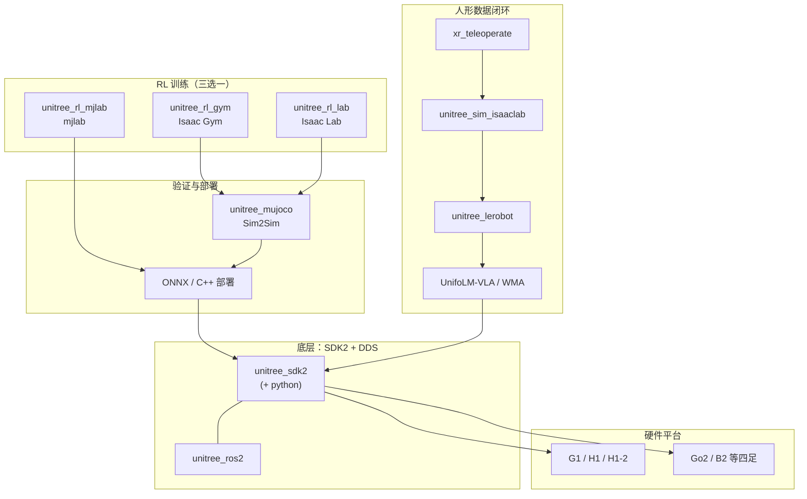

# Unitree

**Unitree Robotics（宇树科技）** 是当前腿式机器人和人形机器人领域最有影响力的公司之一。

## 一句话定义

如果说很多论文和算法都在讲“机器人应该怎么走、怎么跑、怎么控制”，那 **Unitree** 的重要性在于：

> 它把高性能腿式平台和人形平台真正做成了更多团队能买到、能部署、能调算法的实际硬件入口。

一句话说白了：

> `Unitree` 在当前机器人圈的意义，不只是一个公司，而是把腿式机器人和人形机器人的真实研究门槛大幅拉低的一条关键硬件主线。

## 英文缩写速查

| 缩写 | 英文全称 | 简要说明 |
|------|----------|----------|
| RL | Reinforcement Learning | 通过与环境交互最大化长期回报来学习策略的范式 |
| Sim2Real | Simulation to Real | 把仿真中学到的策略迁移落地真机的工程主线 |
| MuJoCo | Multi-Joint dynamics with Contact | 接触丰富的刚体物理仿真引擎 |
| Isaac Gym | NVIDIA Isaac Gym | GPU 并行刚体仿真训练环境 |
| MPC | Model Predictive Control | 滚动时域内优化控制序列的预测控制 |
| WBC | Whole-Body Control | 协调全身关节满足多任务/约束的控制基础设施 |
| LiDAR | Light Detection and Ranging | 激光雷达，地形感知与建图主传感器 |
| G1 | Unitree G1 Humanoid | 宇树入门级教育科研人形平台 |
| Isaac Lab | NVIDIA Isaac Lab | 基于 Omniverse 的机器人学习训练框架 |
| Locomotion | Robot Locomotion | 足式/人形等无轮移动能力的总称 |
| TSID | Task-Space Inverse Dynamics | 任务空间逆动力学求解关节力矩的 WBC 实现 |
| URDF | Unified Robot Description Format | 统一机器人描述格式 |
| RMA | Rapid Motor Adaptation | 从历史轨迹隐式估计环境参数的快速运动自适应 |
| legged_gym | Legged Gym | 足式机器人 RL 训练的常用开源框架 |
| SDK | Software Development Kit | 软件开发工具包；宇树当前主推 SDK2 |
| DDS | Data Distribution Service | 分布式实时通信中间件；SDK2 / ROS 2 底层常用 CycloneDDS |
| ONNX | Open Neural Network Exchange | 跨框架神经网络模型交换格式；官方 RL→真机常用导出格式 |
| ROS 2 | Robot Operating System 2 | 机器人系统集成与通信的常用中间件 |
| XR | Extended Reality | 扩展现实（含 VR/AR）；官方 `xr_teleoperate` 遥操作入口 |
| VLA | Vision-Language-Action | 视觉–语言–动作模型；UnifoLM-VLA-0 属此类 |
| WMA | World-Model-Action | 世界模型–动作架构；UnifoLM-WMA-0 属此类 |
| IL | Imitation Learning | 模仿学习；官方 `unitree_lerobot` 对接 LeRobot 训练 |

## 为什么重要

以前很多机器人研究会卡在一个很现实的问题上：

- 仿真里能做
- 论文里能讲
- 但真机平台买不到、太贵、维护成本太高

Unitree 重要的地方就在于：

- 它把四足和人形平台做成了更可获得的硬件入口
- 它让更多高校、实验室、创业团队能真正接触到动态腿式机器人
- 它在 RL、locomotion、sim2real 这些方向里，实际成为了大量实验落地的硬件载体
- 它的影响力已经不只是产品，而是“研究平台普及化”

## 它到底是什么

### 1. 不是算法框架
Unitree 不是 MuJoCo、Isaac Gym、Pinocchio、Crocoddyl 这种软件工具链。

它不是：
- 仿真器
- 优化库
- 控制框架

它更像：
- 机器人硬件平台提供者
- 四足 / 人形产品生态节点
- 真实部署和 sim2real 的主要落点之一
- **官方开源软件组织**（[github.com/unitreerobotics](https://github.com/unitreerobotics)）：SDK、仿真、RL、遥操作与基础模型仓的统一入口

### 2. 它是“算法真正落地的那层硬件”
很多技术栈页面都在讲：
- trajectory optimization
- MPC
- WBC
- RL
- sim2real

但这些东西最终都要落在具体机器人平台上。

Unitree 的价值就在于：

> 它是这些方法最常见的真实硬件承载体之一。

## Unitree 当前最值得关注的产品语境

### 1. 四足线
Unitree 最早广泛出圈的是四足机器人。

这一条线的重要性在于：
- 为 locomotion、强化学习、扰动恢复、sim2real 提供了稳定研究平台
- 让很多本来只能在论文里看的东西，变成可真实验证的实验系统
- **延伸形态**：腿末集成驱动轮的 **轮足四足（四轮足）**（如 Go2W / B2W），兼顾平地滚动效率与崎岖越障；专题综述见 [轮足四足机器人](../concepts/wheel-legged-quadruped.md)。
- **感知 loco 代表**：**Go1** 上 [DreamWaQ++](./dreamwaq-plus.md)（T-RO 2026）用深度/LiDAR 点云 + 本体多模态 RL 实现楼梯与陡坡障碍感知行走（[arXiv:2409.19709](https://arxiv.org/abs/2409.19709)）。

### 2. 人形线
Unitree 现在已经明显不只是四足公司。

当前在人形机器人语境里，最常被讨论的是：
- **[G1](./unitree-g1.md)**：入门级教育科研人形机器人。
- **H1 / H1-2**：全尺寸通用人形机器人。

这一点非常关键，因为它说明：

> Unitree 已经从“腿式机器人硬件公司”进一步变成“人形机器人研究与应用平台的重要提供者”。

### 3. 软件生态：GitHub 研发栈 + UniStore 应用平台

#### 3.1 官方 GitHub 组织（unitreerobotics）

组织级归档见 [sources/repos/unitree.md](../../sources/repos/unitree.md)。截至 **2026-07-20** 约 **49** 个公开仓，按研究用途可压缩为五条主线：

| 主线 | 代表仓库 | 何时用 |
|------|----------|--------|
| **底层通信** | `unitree_sdk2` / `unitree_sdk2_python` / `unitree_ros2` | 新机型真机控制、自定义部署、ROS 2 集成 |
| **经典仿真 / URDF** | `unitree_ros`、`unitree_mujoco`、`unitree_guide` | URDF 资产、Gazebo 关节实验、MuJoCo Sim2Sim；详见 [unitree_ros](./unitree-ros.md) |
| **RL 训练** | `unitree_rl_gym`（Isaac Gym）、`unitree_rl_lab`（Isaac Lab）、`unitree_rl_mjlab`（mjlab） | 速度跟踪 / 模仿 → Sim2Sim → Sim2Real；mjlab 线见 [unitree_rl_mjlab](./unitree-rl-mjlab.md) |
| **遥操作与 IL** | `xr_teleoperate`、`unitree_sim_isaaclab`、`unitree_lerobot` | XR 采数、Isaac Lab 仿真采数、对接 [LeRobot](./lerobot.md) |
| **基础模型** | `unifolm-vla`、`unifolm-world-model-action` | 官方 UnifoLM VLA / WMA；权重与数据多在 Hugging Face |



**选型提示（官方三仓对照，避免混用代际）：**

- 只想快速跑通 **Isaac Gym / legged_gym 风格** locomotion：优先 `unitree_rl_gym`（组织内星标最高）。
- 已在 **Isaac Lab 2.x** 生态：用 `unitree_rl_lab`（资产可从 HF `unitree_model` 或 `unitree_ros` URDF 引入）。
- 要 **MuJoCo Warp + 官方 ONNX→C++** 闭环：用 `unitree_rl_mjlab`。
- **ROS1 + Gazebo** 只做 URDF / 关节级实验：用 [unitree_ros](./unitree-ros.md)；高层行走不要指望 Gazebo 包。
- 做人形 **遥操作 → IL / VLA**：`xr_teleoperate` →（可选）`unitree_sim_isaaclab` → `unitree_lerobot` / UnifoLM。

模型资产注意：GitHub `unitree_model` 已标注 **deprecated**，后续 USD 更新以 Hugging Face [`unitreerobotics/unitree_model`](https://huggingface.co/datasets/unitreerobotics/unitree_model) 为准。

#### 3.2 UniStore 应用平台
2025-12 内测、**2026-05-07 全面开放** 的 **[UniStore](./unitree-unistore.md)** 是宇树官方 **机器人动作与应用商店**：用户通过 **Unitree Explore** 手机 App，像安装手机应用一样向 **G1 / H1 / B2 / Go2** 一键下发舞蹈、武术与任务类技能包；平台含 **用户广场、动作库、数据集、开发者中心**，并开放 SDK 上架与收益分成。它与 GitHub 研发栈互补——前者面向 **成品技能分发**，后者面向 **自研训练与部署管线**。

第三方 **ROS-optional 集成栈** 如 **[DimOS（Dimensional）](./dimensionalos-dimos.md)** 亦提供 Go2（stable）/ G1（beta）的 Python Blueprint + MCP agent 导航演示，与官方 SDK2 / [unitree_ros](./unitree-ros.md) 形成并行路线。

## Unitree 为什么对当前项目主线很重要

当前 `Robotics_Notebooks` 的主线是：

```text
LIP / ZMP
  ↓
Centroidal Dynamics
  ↓
Trajectory Optimization / MPC
  ↓
TSID / WBC
  ↓
State Estimation / System Identification / Sim2Real
```

这条主线最终必须落到真实平台。

Unitree 在这里的重要性是：
- 它给了真实的四足 / 人形平台
- 它让 sim2real 不再只是概念
- 它让“控制 / 学习 / 优化”这些方法真正有了硬件落点

一句话：

> 在这条技术链里，Unitree 不负责“怎么想”，它负责“最终在哪台真实机器上验证”。

## Unitree 和 RL / locomotion 的关系

### 1. RL 的真实平台
如果你做人形 / 四足 RL，最终很常见的目标就是：
- 先在 MuJoCo / Isaac Gym / Isaac Lab 里训练
- 再迁移到 Unitree 这类平台

所以 Unitree 在很多研究链路里就是 sim2real 的终点之一。

### 2. Locomotion 的真实平台
很多 locomotion 研究，如果只停在仿真，很难说明方法真正靠谱。

而 Unitree 平台之所以重要，是因为：
- 动态腿式动作可以真实验证
- 扰动恢复、地形适应可以做真实实验
- 能让你看见“仿真策略落到硬件后还剩下多少问题”

## Unitree 和 WBC / MPC / TSID 的关系

如果你做传统控制路线：
- Unitree 平台经常是 WBC / MPC / locomotion controller 的真实验证平台

如果你做 learning-based 路线：
- 它又是 sim2real / RL policy 部署的硬件落点

所以它不是绑定某一种方法，而是方法最终汇合的地方。

见：[Whole-Body Control](../concepts/whole-body-control.md)

见：[Model Predictive Control (MPC)](../methods/model-predictive-control.md)

见：[Reinforcement Learning](../methods/reinforcement-learning.md)

## 为什么它在当前行业里影响这么大

### 1. 低门槛硬件普及
过去很多高动态平台只有顶级实验室能碰。

Unitree 的意义之一就是：
- 更可买
- 更可部署
- 更容易形成社区与复现生态

### 2. 把“研究平台”变成“更大众可获得平台”
这对整个机器人研究生态影响很大。

因为它改变的不是某篇论文，而是：
- 谁能做实验
- 谁能做真实机器人验证
- 谁能把算法从仿真带到硬件

### 3. 人形线把影响力继续往上推
从四足扩到人形之后，Unitree 的影响已经不只是“狗机器人平台”，而是当前人形研究生态的重要参与者。

## 常见误区

### 1. 以为 Unitree 只是做四足的
这已经过时了。现在它在人形语境里的影响也很强。

### 2. 以为有了 Unitree 平台，sim2real 就简单了
错。平台解决的是“有真机可上”，不等于状态估计、系统辨识、控制延迟、观测噪声这些问题自然消失。

### 3. 以为 Unitree 是算法主线
不是。它是硬件平台主线。真正的算法主线还是控制、优化、学习和 sim2real。

### 4. 以为硬件平台和软件工具链是替代关系
不是。更准确地说：
- MuJoCo / Isaac Lab / Pinocchio / Crocoddyl 是通用工具链
- Unitree 硬件是落地平台
- `unitreerobotics` 上的官方仓是 **针对该硬件的胶水与参考实现**（SDK、任务环境、部署示例），不能替代对控制 / 学习方法本身的理解

### 5. 以为三条官方 RL 仓可以随便拼装
`unitree_rl_gym` / `unitree_rl_lab` / `unitree_rl_mjlab` 分别绑定 Isaac Gym、Isaac Lab、mjlab；观测定义、导出格式与依赖栈不同。选型后应沿 **同一条官方叙述** 做到 Sim2Sim / 真机，而不是混拷配置。

## 推荐使用建议

### 如果你做仿真研究
也值得关注 Unitree，因为你设计任务和 observation / action space 时，最好提前想清楚未来是不是可能迁到这类真实平台。

若你需要 **经典 ROS1 + Gazebo** 下的 URDF 与关节级仿真入口（与 MuJoCo/Isaac 管线对照），见官方栈归纳页 [unitree_ros](./unitree-ros.md)。

### 如果你做 sim2real
Unitree 是非常重要的目标平台语境：先选定官方 RL 仓之一，再沿其文档走完 **Play → Sim2Sim（常经 `unitree_mujoco`）→ SDK2 真机**；尽早理解以太网调试模式、DDS 与安全开关等部署现实。

### 如果你做人形控制 / 遥操作 / IL
优先从 `xr_teleoperate` 与 [Unitree G1](./unitree-g1.md) 文档入手；需要 LeRobot 格式训练时接 `unitree_lerobot`，需要官方 VLA/WMA 时再进 UnifoLM 仓与 Hugging Face 权重。

## 推荐继续阅读

- 官方网站：<https://www.unitree.com/>
- 官方 GitHub 组织：<https://github.com/unitreerobotics>
- 开发者文档（SDK2 入口）：<https://support.unitree.com/home/zh/developer>
- Hugging Face 组织：<https://huggingface.co/unitreerobotics>
- UniStore 应用平台：<https://unistore.unitree.com/>
- G1 页面：<https://www.unitree.com/g1/>
- H1 页面：<https://www.unitree.com/h1/>
- UnifoLM-WMA 项目页：<https://unigen-x.github.io/unifolm-world-model-action.github.io>
- UnifoLM-VLA 项目页：<https://unigen-x.github.io/unifolm-vla.github.io>

## 参考来源

- [unitreerobotics 组织归档](../../sources/repos/unitree.md) — 本次 ingest 主来源（组织级仓库地图与开源状态）
- [UniStore 官方门户归档](../../sources/sites/unitree-unistore.md)
- [unitree_ros / unitree_ros_to_real 归档](../../sources/repos/unitree_ros.md)
- [unitree_rl_mjlab 归档](../../sources/repos/unitree_rl_mjlab.md)
- 官方网站：<https://www.unitree.com/>
- Kumar et al., *RMA: Rapid Motor Adaptation for Legged Robots* (2021) — 基于 Unitree 的 sim2real 代表工作

## 关联页面

- [Unitree G1](./unitree-g1.md)
- [UniStore（宇树应用平台）](./unitree-unistore.md)
- [unitree_ros（ROS1 / Gazebo）](./unitree-ros.md)
- [unitree_rl_mjlab](./unitree-rl-mjlab.md)
- [四足机器人](./quadruped-robot.md)
- [人形机器人](./humanoid-robot.md)
- [legged_gym](./legged-gym.md)
- [LeRobot](./lerobot.md)
- [Teleoperation](../tasks/teleoperation.md)
- [Sim2Real](../concepts/sim2real.md)
- [轮足四足机器人（四轮足）](../concepts/wheel-legged-quadruped.md)
- [Locomotion](../tasks/locomotion.md)
- [Humanoid Hardware](../../references/papers/humanoid-hardware.md)

## 一句话记忆

> Unitree 的核心意义，不只是做出四足和人形机器人，而是把真实腿式 / 人形平台——以及配套的官方 SDK、RL、遥操作与基础模型开源栈——变成更多团队能真正拿来做控制、RL、locomotion 和 sim2real 研究的硬件入口。
