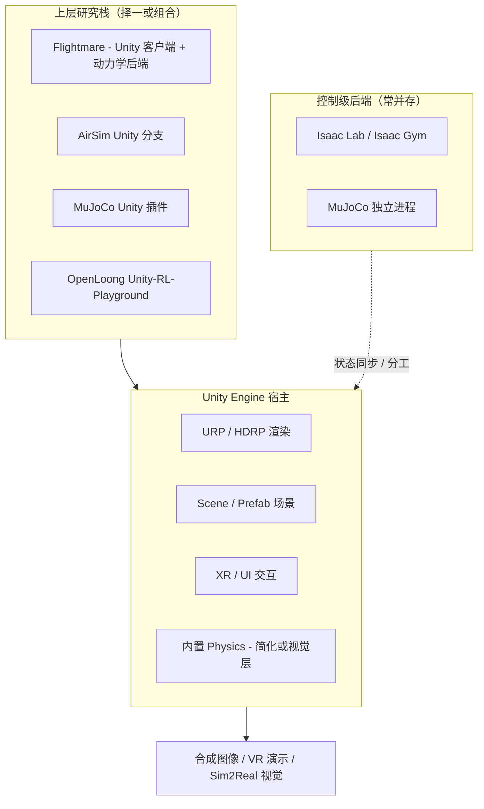

# Unity Engine（Unity Technologies 实时 3D 引擎）

**Unity** 是 **Unity Technologies** 的 **实时 3D 创作与运行时平台**，以 **Unity Editor**、**C# / .NET 脚本** 与 **Package Manager** 生态支撑游戏、XR 与 **Unity Industry**（汽车、制造、零售、医疗等）应用。在机器人研究与工程中，Unity 更常作为 **高保真视觉、交互演示与仿真客户端** 的 **宿主引擎**，由 [Flightmare](./flightmare.md)、[AirSim](./airsim.md)（Unity 分支）、[MuJoCo](./mujoco.md) 官方 Unity 插件、[OpenLoong](./openloong.md) Unity-RL-Playground 等上层栈挂载具体 API，而非默认替代 [Isaac Lab](./isaac-gym-isaac-lab.md) / MuJoCo 的 **控制级、万并行 RL 物理后端**。

## 英文缩写速查

| 缩写 | 英文全称 | 简要说明 |
|------|----------|----------|
| URP | Universal Render Pipeline | Unity 可编程轻量渲染管线，移动与 XR 常用 |
| HDRP | High Definition Render Pipeline | 高保真渲染管线，面向 PC/主机级画质 |
| UGS | Unity Gaming Services | 增长、多人、云存档、LiveOps 等后端服务套件 |
| MCP | Model Context Protocol | Unity 6 AI Beta 中连接外部 LLM agent 的协议 |
| Sentis | Unity Sentis | 引擎内 ONNX 运行时推理，用于部署 ML 模型 |
| XR | Extended Reality | AR/MR/VR 统称；Unity 提供跨头显构建链 |
| GT | Ground Truth | 仿真标注真值；视觉 Sim2Real 合成数据管线 |

## 为什么对机器人栈重要

1. **研究型视觉仿真客户端**：[Flightmare](./flightmare.md) 以 **Unity 渲染 + 独立动力学后端** 实现高并行四旋翼 RL；比纯 PyBullet 视觉更丰富，构建链通常轻于完整 UE 项目。
2. **经典 UAV 视觉栈**：[AirSim](./airsim.md) 除 Unreal 主线外提供 **Unity 分支**，仍是 SLAM / 避障 / 视觉 Sim2Real 文献常见基线。
3. **物理引擎互操作**：[MuJoCo](./mujoco.md) 提供 **官方 Unity 插件**（C# 绑定），适合在 Unity 场景内嵌入高精度接触仿真片段。
4. **人形与具身 RL 演示**：[OpenLoong](./openloong.md) 生态含 **Unity-RL-Playground**；部分工作流用 Unity 做 **策略可视化或 embodied 交互**（常与 Isaac Gym 等后端分工，见 [乒乓球分层技能学习](../queries/table-tennis-hierarchical-skill-learning-guide.md)）。
5. **跨平台 XR 与行业数字孪生**：Quest、Vision Pro、WebGL 等 **25+ 构建目标** 与 **Unity Industry** 线，适合遥操作界面、培训仿真与展示级数字孪生——与 [Unreal Engine 5](./unreal-engine-5.md) 形成 **双主流宿主** 选型。

## 核心结构/机制

### 产品代际（2026-07-14）

| 层级 | 说明 |
|------|------|
| **当前 Manual** | **Unity 6.5（6000.5）** User Manual |
| **产品叙事** | 官网与 Engine 页以 **Unity 6** 为主线；6.5 为 6 家族功能与稳定性迭代 |
| **获取** | [Unity Hub](https://unity.com/download) 安装 Editor；Personal / Pro / Industry 等许可方案 |

### 编辑器子系统（与仿真相关）

| 子系统 | 机制 | 机器人注记 |
|--------|------|------------|
| **Scripting** | C# / .NET；VS / Rider | 研究栈 Python 常经 socket/ROS/自定义 bridge 与 Unity 通信 |
| **Physics** | 内置 3D Physics（PhysX 系） | 游戏级刚体/关节；**足式精细接触** 仍常用外环 MuJoCo/Isaac |
| **Rendering** | Built-in / **URP** / **HDRP** | 传感器仿真、域随机化、Shader Graph |
| **Animation** | Mecanim、Timeline | 人体参考动作可视化上游 |
| **XR** | XR Plug-in Management | VR 遥操作、沉浸式数据采集 |
| **Packages** | Package Manager 扩展 | 多人、AI、第三方仿真桥接 |
| **Sentis** | 运行时 ONNX 推理 | 策略或感知模型嵌入 Player 构建 |
| **Unity AI** | Assistant、Generators、MCP、AI Gateway | 编辑器内 agent 辅助场景与脚本（Beta） |

### 文档双入口

| 入口 | 用途 |
|------|------|
| [docs.unity3d.com/Manual](https://docs.unity3d.com/Manual/index.html) | **引擎** Manual + Scripting API（物理、渲染、XR） |
| [docs.unity.com](https://docs.unity.com/zh-cn) | **UGS / AI / Hub** 等产品线；支持 **中文** locale |

## 流程总览（机器人研究中的典型分工）

## 与 Unreal Engine 5 的简要对照

| 维度 | Unity | UE5 |
|------|-------|-----|
| **主语言** | C# / .NET | C++ / Blueprint |
| **机器人视觉栈** | Flightmare、AirSim Unity | AirSim UE、CARLA、SPEAR |
| **渲染叙事** | URP/HDRP 双管线 | Nanite / Lumen |
| **研究构建重量** | 常更轻（Flightmare 类） | 常更重，画质上限高 |
| **行业数字孪生** | Unity Industry | 建筑/汽车/影视 UE 案例多 |

详见 [Unreal Engine 5](./unreal-engine-5.md) 与 [多旋翼栈总览](../overview/multirotor-simulation-planning-control-stack.md)。

## 常见误区或局限

- **误区：Unity = 机器人仿真器** — 原生强项是 **实时 3D 内容与跨平台发布**；万并行 locomotion RL 默认仍看 Isaac Lab / MuJoCo；Unity 系工具需通过 Flightmare/AirSim 等 **暴露研究 API**。
- **误区：内置 Physics = MuJoCo 精度** — Unity Physics 适合游戏级交互；人形/足式 **Sim2Real** 常外接 MuJoCo 或独立动力学后端。
- **局限：文档分裂** — 引擎 Manual（unity3d.com）与 UGS（docs.unity.com）并存，维护时需锁定 **Editor 版本** 与对应文档。
- **局限：许可与商业化** — 收入与部署规模触发不同订阅 tier；行业项目需核对 [Unity 许可方案](https://unity.com/products)。
- **局限：AirSim 维护** — Unity 分支与 UE 主线均受 AirSim 整体维护模式影响，长期项目应评估 fork 与替代仿真器。

## 关联页面

- [Unreal Engine 5](./unreal-engine-5.md) — 另一主流实时 3D 宿主
- [Flightmare](./flightmare.md) — Unity 渲染四旋翼研究仿真
- [AirSim](./airsim.md) — UE/Unity 视觉 UAV 仿真
- [MuJoCo](./mujoco.md) — 含 Unity 插件的官方物理引擎
- [OpenLoong](./openloong.md) — Unity-RL-Playground
- [多旋翼栈总览](../overview/multirotor-simulation-planning-control-stack.md)
- [Sim2Real](../concepts/sim2real.md)

## 参考来源

- [sources/sites/unity-com.md](../../sources/sites/unity-com.md)
- [sources/sites/unity-manual-6-5.md](../../sources/sites/unity-manual-6-5.md)

## 推荐继续阅读

- [Unity Engine 产品页](https://unity.com/products/unity-engine)
- [Unity 6.5 User Manual](https://docs.unity3d.com/Manual/index.html)
- [Unity Docs 中文门户](https://docs.unity.com/zh-cn)
- [Unity Learn](https://learn.unity.com/)
- [MuJoCo Unity 插件文档](https://mujoco.readthedocs.io/en/stable/unity.html)
