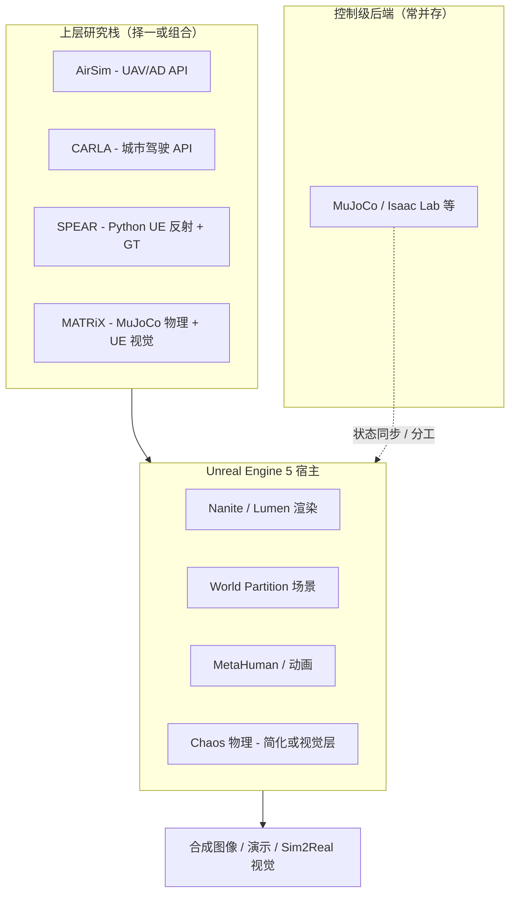

# Unreal Engine 5（Epic 实时 3D 引擎）

**Unreal Engine 5（UE5）** 是 **Epic Games** 的 **下一代实时 3D 创作与运行时平台**，面向游戏、影视、建筑、汽车与 **仿真 / 数字孪生** 等行业。在机器人研究与工程中，UE5 更常作为 **高保真视觉、场景编辑与数字人表演** 的 **宿主引擎**，由 [AirSim](./airsim.md)、[CARLA](./carla.md)、[SPEAR](./spear-sim.md)、[MetaHuman](./metahuman.md)、[MATRiX](./matrix-simulation-platform.md) 等上层栈挂载具体机器人 API 或训练闭环，而非默认替代 [MuJoCo](./mujoco.md) / [Isaac Lab](./isaac-gym-isaac-lab.md) 的 **控制级、万并行 RL 物理后端**。

## 英文缩写速查

| 缩写 | 英文全称 | 简要说明 |
|------|----------|----------|
| UE / UE5 | Unreal Engine 5 | Epic 第五代实时 3D 引擎主线 |
| GI | Global Illumination | 全局光照；Lumen 提供动态 GI |
| TSR | Temporal Super Resolution | 时域超分辨率升采样，平衡画质与帧率 |
| PCG | Procedural Content Generation | 程序化内容生成，可脚本化场景布局 |
| MCP | Model Context Protocol | 5.8 Experimental 插件，连接 LLM agent 与编辑器 |
| Chaos | Chaos Physics | UE 内置物理求解器（刚体、布料、破坏等） |
| GT | Ground Truth | 仿真标注真值；SPEAR 等库在 UE 上导出深度/语义等 |

## 为什么对机器人栈重要

1. **光真实感仿真宿主**：大量 **视觉 Sim2Real**、合成数据与 SLAM 工作流选择 UE 作渲染后端——[AirSim](./airsim.md)（UAV/AD）、[CARLA](./carla.md)（城市驾驶）、[SPEAR](./spear-sim.md)（通用 UE 反射 + 高速 GT）均建立在此之上。
2. **人类参考与数字孪生可视化**：[MetaHuman](./metahuman.md) 提供写实数字人；[MATRiX](./matrix-simulation-platform.md) 将 **MuJoCo 物理** 与 **UE5 渲染** 联合，体现「控制物理 vs 视觉」分工。
3. **大世界与传感器丰富度**：**World Partition** 流式加载、**Lumen/Nanite** 动态光照与几何细节、**Niagara/Sequencer** 与 **Mass** 框架，支撑户外场景、人群与多相机采集——适合 **域随机化** 与演示级数字孪生。
4. **工程可扩展性**：C++ 模块、Blueprint、Python 脚本（项目/插件级）与 **Chaos Dataflow** 使研究者能定制传感器插件、物理与场景；**5.8 MCP 插件** 开始把 **agentic 场景编辑** 引入编辑器工作流。
5. **获取形态清晰**：日常研发可用 **Launcher 二进制**（当前公开里程碑 **5.8**）；深度定制需 Epic 账号关联 GitHub 访问私有 [UnrealEngine 源码](https://github.com/EpicGames/UnrealEngine/tree/ue5-main)（见 [sources](../../sources/repos/unrealengine-github.md)）。

## 核心结构/机制

### UE5 代际特性（产品层）

| 子系统 | 机制 | 机器人相关注记 |
|--------|------|----------------|
| **Nanite** | 虚拟化微多边形几何 + Virtual Shadow Maps | 高密度网格实时渲染；城市场景、扫描资产、数字孪生可视化 |
| **Lumen** | 全动态 GI 与反射 | 光照/几何变化无需重烘焙；5.8 **Lumen Lite** 面向 60 fps 掌机与低端 PC |
| **World Partition + OFPA** | 网格流式 + 每 Actor 一文件 | 大场景协作与版本管理；Open World 仿真地图 |
| **TSR** | 时域升采样 | 高分辨率传感器仿真时控制 GPU 负载 |
| **Control Rig / IK Retargeter** | 引擎内绑定与重定向 | 人体表演 → 机器人重定向链路的 **视觉上游**（非关节空间直接输出） |
| **MetaSounds** | 程序化音频图 | 仿真中事件驱动音效与多模态数据采集（次要） |

### UE 5.8 里程碑（2026，文档 + State of Unreal）

| 领域 | Production Ready / 重点 | 仿真/机器人注记 |
|------|-------------------------|-----------------|
| 渲染 | **MegaLights**、Lumen Lite (Beta) | 多动态光源场景；掌机/低端 PC 60 fps GI |
| 世界 | **Mesh Terrain** (Experimental)、PVE 植被 | 非 heightfield 地形；户外 locomotion 视觉域 |
| 物理 | **Dataflow**（Cloth 等）、Chaos Destruction/CVD | 可编程破坏与布料；非足式接触金标准 |
| 角色 | MetaHuman Crowds、Animator 全身无标记 (Exp.) | 人群视觉层、表演捕捉上游 |
| 框架 | **Iris** 复制、Mass、Mover/ChaosMover | 多智能体/大规模实体模拟（偏视觉/NPC） |
| 工具 | **MCP Server** (Experimental)、Movie Render Graph | LLM 驱动编辑器；离线高质量数据集渲染 |

Epic 称 **5.8 为计划内最后一个 UE5 主版本**（保留 5.9 选项），并推进 **UE6**（目标 2027 年底 Early Access；Gameplay 向 **Verse** 演进）。

### 源码与开源生态边界

| 层级 | 说明 |
|------|------|
| **引擎本体** | 私有 GitHub `EpicGames/UnrealEngine`（`ue5-main`），需 Epic 源码许可 |
| **公开配套** | [Epic Games GitHub 组织](https://github.com/epicgames)：`lore` VCS、`PixelStreamingInfrastructure`、MetaHuman DNA、BlenderTools 等 |
| **研究栈** | AirSim / CARLA / SPEAR 等独立仓库，以 **UE 插件或自定义 Game Module** 形式运行 |

## 流程总览（机器人研究中的典型分工）

## 常见误区或局限

- **误区：UE5 = 机器人仿真器** — 原生强项是 **实时 3D 内容与渲染**；足式/操作 **RL 训练** 默认仍看 [Isaac Lab](./isaac-gym-isaac-lab.md)、[MuJoCo](./mujoco.md) 等；UE 系工具需通过 AirSim/CARLA/SPEAR 等 **暴露机器人 API**。
- **误区：Chaos = MuJoCo 精度** — Chaos 适合游戏级刚体、破坏、布料与载具；**接触丰富的人形控制** 仍常用外环物理（SPEAR co-sim、MATRiX 分工）。
- **局限：栈重量** — 编辑器、着色器编译与 GPU 显存要求高；CI 与 headless 批量训练成本高于轻量 Python 仿真。
- **局限：许可与源码** — 商业发行需遵守 Epic [EULA](https://www.unrealengine.com/eula)；修改引擎核心需源码授权流程。
- **局限：版本节奏** — 5.8 后主线向 UE6 过渡；长期项目应锁定 **引擎小版本** 并跟踪上层栈（SPEAR、MetaHuman 插件）兼容性。

## 关联页面

- [MetaHuman](./metahuman.md) — UE 生态内数字人创作与表演捕捉
- [SPEAR](./spear-sim.md) — 任意 UE 项目的 Python 可编程仿真与 GT
- [AirSim](./airsim.md) — 经典 UE 无人机/AD 视觉仿真
- [CARLA](./carla.md) — UE 城市自动驾驶仿真
- [MATRiX](./matrix-simulation-platform.md) — MuJoCo + UE5 联合仿真
- [仿真器选型指南](../queries/simulator-selection-guide.md) — locomotion RL 与 UE 视觉栈的分支对照
- [Sim2Real](../concepts/sim2real.md) — 视觉域随机化与迁移
- [程序化地形生成](../concepts/procedural-terrain-generation.md) — 与 Mesh Terrain / PCG 邻接

## 参考来源

- [sources/sites/unreal-engine-5-com.md](../../sources/sites/unreal-engine-5-com.md)
- [sources/sites/unreal-engine-5-8-docs.md](../../sources/sites/unreal-engine-5-8-docs.md)
- [sources/repos/epicgames-github-org.md](../../sources/repos/epicgames-github-org.md)
- [sources/repos/unrealengine-github.md](../../sources/repos/unrealengine-github.md)

## 推荐继续阅读

- [Unreal Engine 5 产品页](https://www.unrealengine.com/unreal-engine-5)
- [UE 5.8 文档总索引](https://dev.epicgames.com/documentation/unreal-engine/unreal-engine-5-8-documentation)
- [UE 5.8 Release Notes](https://dev.epicgames.com/documentation/unreal-engine/unreal-engine-5-8-release-notes)
- [State of Unreal 2026 新闻稿](https://www.unrealengine.com/news/state-of-unreal-2026-top-news-from-the-show)
- [Epic Games GitHub](https://github.com/epicgames)
