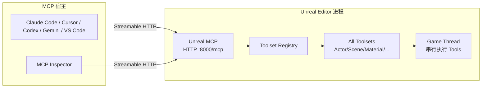

# Unreal MCP（Unreal Editor 内嵌 MCP Server）

**Unreal MCP** 是 Epic 在 **Unreal Engine 5.8** 引入的 **Experimental** 编辑器能力：以插件标识 **`ModelContextProtocol`**（Plugin Browser 友好名 **Unreal MCP**）在 **编辑器进程内** 托管 MCP server，使 Claude Code、Cursor、MCP Inspector 等兼容客户端经本机 **Streamable HTTP**（默认 `http://127.0.0.1:8000/mcp`）调用引擎 Tools——生成 Actor、配置光照、创建材质实例、检查 Slate、跑 automation tests，并可用 Python/C++ **自写 Toolset** 扩展。业务 Tools **不由 MCP 插件实现**，须启用 **All Toolsets**（或按需单个 toolset）与 **Toolset Registry**。

## 英文缩写速查

| 缩写 | 英文全称 | 简要说明 |
|------|----------|----------|
| MCP | Model Context Protocol | 代理与工具/数据源的开放互操作协议；见 [MCP 概念页](../concepts/model-context-protocol.md) |
| UE / UE5 | Unreal Engine 5 | Epic 实时 3D 引擎；本插件随 5.8 编辑器分发 |
| SSE | Server-Sent Events | MCP 传输侧与 HTTP 搭配；本插件不支持 stdio/WebSocket |
| UHT | Unreal Header Tool | C++ 反射生成；`AICallable` UFUNCTION 依赖反射 |
| GAS | Gameplay Ability System | 官方示例 toolset（`GASToolsets`）所覆盖的玩法属性系统 |
| LLM | Large Language Model | 经 MCP 宿主驱动编辑器的自然语言接口 |

## 为什么对机器人栈重要

1. **Agentic 场景与合成数据准备：** 以 UE 作视觉宿主时（[AirSim](./airsim.md)、[CARLA](./carla.md)、[SPEAR](./spear-sim.md)、[MetaHuman](./metahuman.md)），可用代理在编辑器内批量摆放 Actor、调光、检视资产——缩短「手写 Editor Utility / 临时 Python」的往返。
2. **与引擎内 Python 反射互补：** SPEAR 等栈偏 **运行时/仿真 API**；Unreal MCP 偏 **编辑器侧 Tools + Tool Search**，适合关卡搭建与内容巡检，而非替代控制级物理后端。
3. **官方宿主集成样本：** 相对 [FreeCAD MCP](./freecad-mcp.md) / [Draw.io Scientific Illustrator](./drawio-scientific-illustrator.md) 的第三方桥，Epic 把 server **嵌进编辑器进程**，并提供 **GenerateClientConfig** 与 Claude Code 官方 Skill。
4. **可扩展 Toolset：** 机器人项目可把「导出 GT 相机位姿」「批量随机化材质」「跑 automation」做成 `ToolsetDefinition`，供多代理共享同一发现路径。
5. **安全边界清晰：** 默认 loopback、无认证——适合本机研究工作站；**不可**当远程仿真编排入口。

## 核心结构/机制

| 组件 | 角色 |
|------|------|
| **Unreal MCP 插件**（`ModelContextProtocol*`） | 进程内 HTTP MCP server；`serverInfo.name = unreal-mcp`；控制台 `StartServer` / `StopServer` / `RefreshTools` / `GenerateClientConfig` |
| **Toolset Registry + All Toolsets** | 发现并加载 `UToolsetDefinition` / `unreal.ToolsetDefinition`；包装为 MCP Tools |
| **Tool Search（默认开）** | `tools/list` → `list_toolsets` / `describe_toolset` / `call_tool`，按需拉取 schema，避免数百 Tools 撑爆初始上下文 |
| **Claude Code 技能插件**（MIT） | [`unreal-engine-skills-for-claude-code-plugin`](https://github.com/EpicGames/unreal-engine-skills-for-claude-code-plugin)：`unreal-mcp` Skill + SessionStart Hook；Marketplace 安装 |

### 模块边界

| 模块 | 可用性 |
|------|--------|
| `ModelContextProtocol` / `ModelContextProtocolEngine` | **Runtime**（协议、设置、命令）；Cooked 构建也可 `IModelContextProtocolModule::StartServer()` |
| `ModelContextProtocolEditor` | **Editor-only**（auto-start + Registry→MCP 适配） |

### 开源状态（项目页 / 仓库核查，2026-08-03）

| 层级 | 状态 |
|------|------|
| 引擎插件本体 | 随 **UE 安装包 / 私有 UnrealEngine 源码**；需 Epic EULA / 源码许可，**非**独立公开 MCP 仓 |
| Claude Code Skills 插件 | **已开源（MIT）** — 见 [sources/repos](../../sources/repos/unreal-engine-skills-for-claude-code-plugin.md) |
| 协议规范本身 | 开放规范 [modelcontextprotocol.io](https://modelcontextprotocol.io) |

## 流程总览

## 工程实践

| 步骤 | 做法 |
|------|------|
| 启用 | `Edit > Plugins` → **Unreal MCP** + **All Toolsets** → 重启 |
| 自启 / 端口 | Editor Preferences → **Model Context Protocol**：Auto Start、Port（默认 8000）、Path（`/mcp`）、Enable Tool Search |
| 手动启动 | 控制台 `ModelContextProtocol.StartServer [port]`；CLI `-ModelContextProtocolStartServer` |
| 客户端配置 | `ModelContextProtocol.GenerateClientConfig ClaudeCode\|Cursor\|VSCode\|Gemini\|Codex\|All` → 项目根 `.mcp.json`（Codex TOML 为 write-once） |
| 连接 | 从配置所在 **项目/workspace 根** 启动 agent；先开编辑器再连 MCP |
| 扩展 | Python：`Content/Python/` 下 `@toolset_registry.tool_call`；C++：`UFUNCTION(meta = (AICallable))`；后跑 `RefreshTools` |
| 调试 | Output Log / `LogModelContextProtocol Verbose`；`npx @modelcontextprotocol/inspector` 指向 `http://127.0.0.1:8000/mcp` |
| Claude 技能 | `/plugin install unreal-engine-skills-for-claude-code@claude-plugins-official`；文档中的 `create-toolset` skill 可脚手架新 toolset |

### 与相近方案对照

| 方案 | 宿主 | 传输 / 桥 | 强项 |
|------|------|-----------|------|
| **Unreal MCP** | UE Editor（官方内嵌） | HTTP+SSE loopback | 引擎原生 Tools、Tool Search、GenerateClientConfig |
| [FreeCAD MCP](./freecad-mcp.md) | 桌面 FreeCAD | PyPI MCP + Addon RPC | 参数化机械 CAD、FEM、标准件 |
| [Draw.io Scientific Illustrator](./drawio-scientific-illustrator.md) | 桌面 draw.io | Codex Skill + MCP | 可见步进科研插图 |
| [Unity AI / MCP](./unity-engine.md) | Unity 6 AI Beta | 厂商 AI Gateway / MCP | C# 生态编辑器 agent（另一主流引擎） |
| [SPEAR](./spear-sim.md) | 任意 UE 项目 | Python 反射 + GT | 仿真可编程与真值导出，非 MCP 编辑器协议 |

## 局限与风险

- **Experimental：** 功能不全；API / 数据格式可能变更；勿默认绑进发行流水线。
- **非远程编排：** 无认证、默认本机；同用户进程可连——共享机器与暴露端口均为风险（Claude 插件 README 亦强调 localhost ≠ 信任边界）。
- **传输受限：** 无 stdio / WebSocket；部分 MCP 宿主若只支持 stdio 需额外桥接。
- **Registry 仅编辑器：** Cooked/Shipping 可起 server，但须 `AddTool()` 显式注册，不能指望 AllToolsets 自动发现。
- **不是控制级仿真器：** 不能替代 MuJoCo / Isaac Lab 的接触丰富 RL；Tools 偏向内容与编辑器自动化。
- **Live Coding 缺口：** 新增 C++ Tool 的 `UFUNCTION` 需重启编辑器。
- **Resources / Prompts：** 官方 shipping toolset 暂不广告这两类 primitive。

## 关联页面

- [Unreal Engine 5](./unreal-engine-5.md) — 引擎宿主与 5.8 里程碑总览
- [Model Context Protocol（MCP）](../concepts/model-context-protocol.md) — Host/Client/Server 与传输协议层
- [FreeCAD MCP](./freecad-mcp.md) — 第三方桌面 CAD MCP 对照
- [Draw.io Scientific Illustrator](./drawio-scientific-illustrator.md) — 桌面矢量图 MCP 对照
- [Unity Engine](./unity-engine.md) — 另一主流引擎的 AI/MCP 方向
- [SPEAR](./spear-sim.md) — UE 项目 Python 可编程仿真与 GT
- [AirSim](./airsim.md) · [CARLA](./carla.md) · [MetaHuman](./metahuman.md) — 常见 UE 上层研究栈
- [仿真器选型指南](../queries/simulator-selection-guide.md)
- [远程过程调用（RPC）](../concepts/remote-procedure-call.md) — 协议层对照概念

## 参考来源

- [Unreal MCP in Unreal Editor（官方文档归档）](../../sources/sites/unreal-mcp-in-unreal-editor.md)
- [unreal-engine-skills-for-claude-code-plugin（仓库归档）](../../sources/repos/unreal-engine-skills-for-claude-code-plugin.md)
- [UE 5.8 官方文档索引归档](../../sources/sites/unreal-engine-5-8-docs.md)
- [MCP 官方文档归档](../../sources/sites/modelcontextprotocol-io.md)
- [Epic Games GitHub 组织归档](../../sources/repos/epicgames-github-org.md)

## 推荐继续阅读

- [Unreal MCP in Unreal Editor](https://dev.epicgames.com/documentation/unreal-engine/unreal-mcp-in-unreal-editor) — 一手 Setup / Authoring / Limitations
- [EpicGames/unreal-engine-skills-for-claude-code-plugin](https://github.com/EpicGames/unreal-engine-skills-for-claude-code-plugin) — Claude Code 安装与安全说明
- [Model Context Protocol 规范](https://modelcontextprotocol.io)
- [UE 5.8 Release Notes](https://dev.epicgames.com/documentation/unreal-engine/unreal-engine-5-8-release-notes) — MCP Server Experimental 条目上下文
