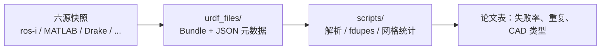

# URDF Files Dataset

[URDF Files Dataset](https://github.com/Daniella1/urdf_files_dataset) 配套 Tola & Corke 的 RA-L 论文 *Understanding URDF: A Dataset and Analysis*（[arXiv:2308.00514](https://arxiv.org/abs/2308.00514)）。它把野外 URDF **连同 mesh 的 Bundle** 冻成可分析快照，并附带复现论文图表的 Python 脚本。

## 一句话定义

**研究用 URDF 语料库：** 322 个 Bundle、195 个独特机型，用来量「人们怎么写 URDF、解析器怎么打架」，不是给 Pinocchio/MuJoCo 当实时模型源。

## 英文缩写速查

| 缩写 | 英文全称 | 简要说明 |
|------|----------|----------|
| URDF | Unified Robot Description Format | 本集研究对象；论文指出实现层并不统一 |
| Bundle | URDF Bundle | XML + 被引用的视觉/碰撞网格等附属文件 |
| STL | Stereolithography | 集中最常见的网格类型 |
| DAE | COLLADA | 带颜色/纹理的常见视觉网格 |
| RA-L | IEEE Robotics and Automation Letters | 论文发表期刊 |

## 核心信息

| 字段 | 内容 |
|------|------|
| 机构 | 奥尔胡斯大学（Daniella Tola）；**昆士兰科技大学（QUT）**（Peter Corke） |
| 许可 | 仓库 **MIT**；各 Bundle 仍受原源许可证约束 |
| 开源 | **已开源**（数据 + `scripts/`）；仓最近推送 2024-04-06 |
| 论文 | RA-L 2024, 9(5):4479–4486 |

## 为什么重要

- **把「URDF 质量」从轶事变成可引用统计：** 例如 ~95% 经 xacro、官方 `urdfdom` 下 11/322 失败、视觉网格数多于碰撞网格。
- **跨源同机不等于同一文件：** 60 个机型出现在多个源（130 Bundle）。写转换器或 loader 时，「Panda URDF」必须钉来源。
- **给工具回归提供固定夹具：** 与 [robot_descriptions.py](./robot-descriptions-py.md) 的活目录相反，本集 **故意冻结**，适合 parser / 网格管线 benchmark。

## 数据集速查

| 维度 | 内容 |
|------|------|
| **规模** | **322** Bundle；**195** 独特机型；75 个「变体」计数（论文表 II） |
| **模态** | URDF XML + STL / COLLADA / OBJ 等 CAD 网格；JSON 元数据（名、类型、厂商、源 URL、是否手工 xacro） |
| **许可证** | 集合 **MIT**；成员以 BSD-3-Clause 等宽松协议为主（论文表 XIV），仍须看原包 |
| **适配形态** | 工业臂、末端、移动底盘、少量人形/四足；**不是**按 Unitree G1 训练接口切的 |
| **重定向就绪度** | **不适用人体→机器人重定向**；用途是 **URDF 工具链回归**，不能当策略训练输入 |

来源构成（论文表 II）：ros-industrial 108、random 67、matlab 52、robotics-toolbox 44、oems 35、drake 16。ros-industrial 约占 **34%**，文件夹结构与网格统计会偏向该生态。

## 核心原理

论文把「同一物理机器人、不同碰撞/接触近似」叫 **URDF variant**（如 iiwa 多种 collision、Atlas convex hull vs minimal contact）；把「不同源都提供该机」叫 **multiply defined robot**（文件不必相同）。

分析脚本在 `scripts/`，按 README 可复现表 II–XV、图 4/6/8。验证用 ROS `urdfdom` 3.1.0，并与其他 parser 对照。

## 工程实践

1. **做仿真请换活目录：** 本仓 2024-04 后再未跟上游；G1、SO-ARM101 等新机不在此集。
2. **复现分析：** 按 README 的 script ↔ 表对照跑；不要手工改 `urdf_files/` 后再与论文数字比。
3. **11 个失败样本是回归金矿：** 写自己的 URDF parser 时，先过这 11 个再谈「支持 URDF」。
4. **多重定义：** 比较 FK 或惯量前，先确认比的是同一 variant（碰撞凸包 vs 原始网格会改几何，不一定改运动学树）。

源码运行时序图：**不适用**（无训练/推理入口；可运行的是分析脚本而非策略栈）。

## 局限与风险

- **来源偏差：** 制造业 ROS-I 臂偏多，当代学习向人形偏少。
- **「Unified」名不副实：** 多 parser 接受度不一致（论文结论）；[URDD](./paper-urdd-universal-robot-description-directory.md) 从另一方向（派生产物标准化）回应同一摩擦。
- **许可证双层：** clone 仓库容易，再分发某个 Bundle 仍要遵守原厂商/ROS-I 条款。

## 关联页面

- [URDF](../concepts/urdf-robot-description.md)
- [机器人描述目录选型](../comparisons/robot-description-catalogs.md)
- [robot_descriptions.py](./robot-descriptions-py.md)
- [Awesome Robot Descriptions](./awesome-robot-descriptions.md)
- [URDD](./paper-urdd-universal-robot-description-directory.md)
- [URDF-Studio](./urdf-studio.md)

## 参考来源

- [URDF Files Dataset 仓库归档](../../sources/repos/urdf_files_dataset.md)
- [论文摘录 arXiv:2308.00514](../../sources/papers/understanding_urdf_dataset_arxiv_2308_00514.md)

## 推荐继续阅读

- 仓库：<https://github.com/Daniella1/urdf_files_dataset>
- 预印本：<https://arxiv.org/abs/2308.00514>
- IEEE 正式版：<https://ieeexplore.ieee.org/abstract/document/10478618>
