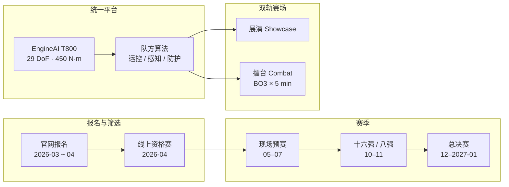

# URKL（Ultimate Robot Knock-out Legend · EngineAI 人形格斗联赛）

**URKL** 是深圳 **众擎机器人（ENGINEAI）** 发起的 **全尺寸人形机器人格斗联赛**：全球队伍在 **同一 T800 硬件平台** 上比拼 **运控、平衡、感知与战术算法**，赛制为 **展演（Exhibition Showcases）+ 擂台竞技（Combat Competition）** 双轨；2026 年 7 月于深圳南山文体中心完成开幕战，冠军奖励约 **1000 万元** 纯金腰带。

## 一句话定义

**以标准化 T800 人形为「F1 式」统一底盘，把高冲击格斗做成全球算法联赛与产品耐久极限测试场。**

## 英文缩写速查

| 缩写 | 英文全称 | 简要说明 |
|------|----------|----------|
| URKL | Ultimate Robot Knock-out Legend | 联赛品牌与赛事简称 |
| BO3 | Best of Three | 三局两胜制 |
| DoF | Degrees of Freedom | T800 竞技平台标称 29 关节自由度（不含灵巧手） |
| WBC | Whole-Body Control | 格斗场景对全身平衡与抗冲击运控的极端考验 |
| SDK | Software Development Kit | T800 Open Source Edition 支持二次开发，供参赛队调算法 |
| CES | Consumer Electronics Show | T800 于 CES 2026 正式亮相的公开时间节点 |

## 为什么重要

- **标准化硬件联赛范式：** 与轮式「BattleBots」式破坏性改装不同，URKL 强制 **同一 T800 平台**，胜负取决于 **算法与调参**——类似 Formula 1 对汽车产业的拉动逻辑。
- **自主格斗 vs 人类 pilot 对照轴：** 西方 [REK](./rek.md) 走 **VR 真人遥操作 + Unitree G1**；URKL 走 **机器人自主（或队方自研控制栈）对打**——与学术侧 [RoboStriker](./paper-notebook-robostriker.md) 的 **双智能体 RL 自主拳击** 同属「策略在机内」路线，但面向 **商业化联赛与硬件出货**。
- **极限耐久与工程数据：** 开幕战出现 **头部击飞后躯干仍可出拳** 等场景，把 **冲击吸收、倒地起身、局内续航（禁止换电）** 推成可量化竞技指标，反哺 [人形拳击纵深路线](../../roadmap/depth-humanoid-boxing.md) 的 Stage 4–5。
- **众擎产品化叙事锚点：** 与 [LHBS](./paper-notebook-learning-human-like-badminton-skills-for-humanoi.md) 在 **PM01** 上的学术合作并列，T800 + URKL 是 EngineAI **全尺寸、高动态** 产品线的 **赛事营销 + 开发者生态** 入口。

## 流程总览

## 核心结构

### 赛制与规则（公开信息归纳）

| 维度 | 内容 |
|------|------|
| **平台** | 全员 **EngineAI T800**（约 173 cm；29 DoF；峰值力矩 450 N·m） |
| **创新边界** | **禁止暴力硬件改装**；鼓励运控平衡、感知决策、非破坏性结构防护 |
| **单局** | **BO3**；每局净时 **5 min**；倒地 **10 s** 内自主起身；否则 **manual reset**（每场 ≤ **2 次**） |
| **能源** | 第三方报道：**局内禁止换电**，考验功率与热管理 |
| **评分** | 除击倒外，强调 **击打精度、闪避、平衡维持、倒地恢复速度、整机耐久** |

### 赛季里程碑（2026 赛季）

| 阶段 | 时间（公开报道） |
|------|------------------|
| 线上报名 | 2026-03-01 — 04-30 |
| 线上资格赛 | 2026-04 |
| 现场预赛 | 2026-05 — 07 |
| 淘汰赛 | 2026-10 — 11 |
| 总决赛 | 2026-12 — 2027-01 |
| **开幕战** | **2026-07-16** 深圳南山文体中心（32 队 / 全球选拔报道） |

### 激励与生态

| 奖项 | 要点 |
|------|------|
| 冠军 | 约 **10 kg 纯金腰带**（估值约 **1000 万元 RMB**） |
| 前 16 | 获赠 **T800 整机**（硬件作研发激励） |
| 前 8 队员 | EngineAI **招聘 fast-track** 终面通道 |

## 工程实践

- **选型时先分清三条「格斗」路线：** [REK](./rek.md) = 人类 VR pilot；URKL = **队方自控算法 + 统一硬件**；RoboStriker = **学术双智能体 RL**。评测指标与安全责任主体完全不同。
- **参赛工程重心：** 在 **固定动力学与力矩上限** 下优化 **抗冲击 WBC、跌倒恢复状态机、有限 manual reset 策略**；勿假设可换更大电机或破坏性装甲。
- **开源状态：** 截至入库日，**赛事页未列公开代码仓库**；T800 **Open Source Edition**（约 **$54k**）提供 **SDK 二次开发**，属商业授权而非 GitHub 一键复现。详见 [engineai-urkl.md](../../sources/sites/engineai-urkl.md) 步骤 2.5 核查。

## 局限与风险

- **宣传与规则透明度：** 官网以品牌与报名为主，**完整评分细则与资格赛接口** 需持续跟进官方发布。
- **「自主」程度待核实：** 开幕战观感接近实时格斗，但是否允许操作员场边干预、遥操作比例，应以官方规则文本为准。
- **耐久 vs 科研可复现：** 联赛为 ** spectacle + 商业出货**，不等同于可发表的对抗 RL 基准；与 RoboStriker 的仿真–真机对照应分开讨论。
- **安全与合规：** T800 产品页明确 **民用、禁止危险改装**；高冲击赛事对观众距离、应急停机与机体维修成本有现实约束。

## 与其他页面的关系

- [REK](./rek.md) — 西方 VR 遥操作格斗联赛对照样本
- [RoboStriker](./paper-notebook-robostriker.md) — 自主人形拳击学术研究锚点
- [Teleoperation](../tasks/teleoperation.md) — 竞技向全身控制谱系（URKL 不在此列）
- [人形拳击纵深路线](../../roadmap/depth-humanoid-boxing.md) — Stage 0 自主 vs 遥操作；Stage 5 赛事产业
- [LHBS](./paper-notebook-learning-human-like-badminton-skills-for-humanoi.md) — 同机构 EngineAI 在 PM01 上的 loco-manip 学术样本

## 参考来源

- [engineai-urkl.md](../../sources/sites/engineai-urkl.md) — 官网与第三方交叉归档
- 官网：<https://en.engineai.com.cn/robot-fighting-competition.html>
- T800 产品页：<https://en.engineai.com.cn/product-t800.html>

## 推荐继续阅读

- [Humanoids Daily：URKL 全球报名与赛制](https://www.humanoidsdaily.com/news/engineai-opens-global-registration-for-urkl-the-1-4-million-race-for-humanoid-supremacy)
- [Global Times：深圳 URKL 开幕战报道](https://www.globaltimes.cn/page/202607/1366175.shtml)
- [REK 实体页](./rek.md) — VR pilot 路线的产业对照
