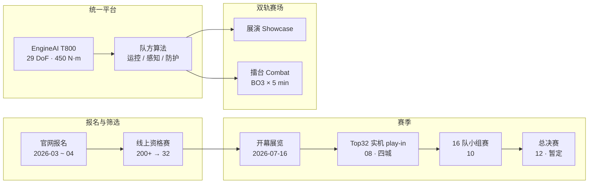

# URKL（Ultimate Robot Knock-out Legend · EngineAI 人形格斗联赛）

**URKL** 是深圳 **众擎机器人（ENGINEAI）** 发起并主办的 **全尺寸人形机器人格斗联赛**：全球队伍在 **同一 T800 硬件平台** 上比拼 **运控、平衡、感知与战术算法**，赛制为 **展演（Exhibition Showcases）+ 擂台竞技（Combat Competition）** 双轨；2026 年 7 月于深圳南山文体中心完成开幕展览赛，冠军奖励约 **1000 万元** 纯金腰带。

## 一句话定义

**以标准化 T800 人形为「F1 式」统一底盘，把高冲击格斗做成全球算法联赛、产品耐久极限测试场与「体能 × 智能」工程叙事舞台。**

## 英文缩写速查

| 缩写 | 英文全称 | 简要说明 |
|------|----------|----------|
| URKL | Ultimate Robot Knock-out Legend | 联赛品牌与赛事简称 |
| BO3 | Best of Three | 正赛常见三局两胜制（开幕展览报道另有五局记分） |
| DoF | Degrees of Freedom | T800 竞技平台标称 29 关节自由度（不含灵巧手） |
| WBC | Whole-Body Control | 格斗场景对全身平衡与抗冲击运控的极端考验 |
| SDK | Software Development Kit | T800 Open Source Edition 支持二次开发，供参赛队调算法 |
| CES | Consumer Electronics Show | T800 于 CES 2026 正式亮相的公开时间节点 |

## 为什么重要

- **标准化硬件联赛范式：** 与轮式「BattleBots」式破坏性改装不同，URKL 强制 **同一 T800 平台**，胜负取决于 **算法与调参**——类似 Formula 1 对汽车产业的拉动逻辑。
- **自主格斗 vs 人类 pilot 对照轴：** 西方 [REK](./rek.md) 走 **VR 真人遥操作 + Unitree G1**；URKL 走 **机器人自主（或队方自研控制栈）对打**——与学术侧 [RoboStriker](./paper-notebook-robostriker.md) 的 **双智能体 RL 自主拳击** 同属「策略在机内」路线，但面向 **商业化联赛与硬件出货**。
- **极限耐久与工程数据：** 开幕战出现 **头部击飞后躯干仍可出拳** 等场景，把 **冲击吸收、倒地起身、局内续航（禁止换电）** 推成可量化竞技指标，反哺 [人形拳击纵深路线](../../roadmap/depth-humanoid-boxing.md) 的 Stage 4–5。
- **众擎产品化叙事锚点：** 与 [LHBS](./paper-notebook-learning-human-like-badminton-skills-for-humanoi.md) 在 **PM01** 上的学术合作并列，T800 + URKL 是 EngineAI **全尺寸、高动态** 产品线的 **赛事营销 + 开发者生态** 入口。
- **官方开源承诺升档：** 2026-07-24 官方 FAQ 宣称将 **开源本届赛事相关代码**（仓库 URL 仍待落地），使 URKL 从纯 spectacle 叙事向「以赛促研 / 公共算法资产」靠拢。

## 流程总览

## 核心结构

### 赛制与规则（公开信息归纳）

| 维度 | 内容 |
|------|------|
| **主办** | **众擎机器人（ENGINEAI）** 发起并主办；面向高校、企业与科研机构 |
| **平台** | 全员 **EngineAI T800**（约 173 cm；体重约 **75–85 kg** 视 SKU；29 DoF；峰值力矩 450 N·m） |
| **创新边界** | **禁止暴力硬件改装**；鼓励运控平衡、感知决策、非破坏性结构防护 |
| **单局（正赛报道）** | **BO3**；每局净时 **5 min**；倒地 **10 s** 内自主起身；否则 **manual reset**（每场 ≤ **2 次**） |
| **能源** | 第三方报道：**局内禁止换电**，考验功率与热管理 |
| **四项评分信号（开幕报道）** | **有效击打、身体稳定性、防守/闪避能力、整体耐久**（权重细则待官方规则 PDF） |

### 赛季里程碑（2026 赛季 · 交叉核对）

| 阶段 | 时间（公开报道） | 备注 |
|------|------------------|------|
| 线上报名 | 2026-03-01 — 04-30 | Humanoids Daily |
| 线上资格赛 | 2026-04 | **200+** 报名 → **32** 队（urkl.org / 媒体汇总） |
| **开幕展览** | **2026-07-16** 深圳南山文体中心 | **White Eagle** vs **Bullfighter**；报道五局 **Bullfighter 3–2**；真机现场，非赛季决赛 |
| Top 32 实机 play-in | **2026-08** | 四城部署评分 → 选出 **16** 队（广州日报等；精确日待官宣） |
| 16 队小组赛 | **2026-10** | 赛程/转播日历未公布 |
| 总决赛 | **2026-12**（provisional） | 与早期「12–2027-01」报道并存，以最新官方日历为准 |

### 「体能 × 智能」工程读法（官方 FAQ）

| 层 | 要点 |
|----|------|
| **体能** | 高速移动/转身/出拳与外力干扰下仍保持稳定；硬件强度与冲击能力支撑接触对打 |
| **智能** | 高动态下持续感知、锁定、瞄准与预判；攻击/躲闪/防御/反制与战术规划——依赖反应快的 **具身 AI** |
| **闭环难点** | 不在单次挥拳动作，而在真实接触环境下的 **感知 → 决策 → 执行 → 恢复** 整套对抗 |

### 激励与生态

| 奖项 / 商业 | 要点 |
|-------------|------|
| 冠军 | 约 **10 kg 纯金腰带**（估值约 **1000 万元 RMB**） |
| 前 16 | 获赠 **T800 整机**（硬件作研发激励） |
| 前 8 队员 | EngineAI **招聘 fast-track** 终面通道 |
| 商业模型（官方 FAQ） | 赛事 IP + 城市合作 + 品牌赞助 + 机甲商用 + 技术转化 |
| 已披露赞助线索 | 工商银行深圳分行；百度智能云、拓竹、飞亚达、天虹、铜师傅、C 引力等 |
| 招商 | `sponsor@engineai.com.cn` |

## 工程实践

- **选型时先分清三条「格斗」路线：** [REK](./rek.md) = 人类 VR pilot；URKL = **队方自控算法 + 统一硬件**；RoboStriker = **学术双智能体 RL**。评测指标与安全责任主体完全不同。
- **参赛工程重心：** 在 **固定动力学与力矩上限** 下优化 **抗冲击 WBC、跌倒恢复状态机、有限 manual reset 策略**；勿假设可换更大电机或破坏性装甲。
- **开源状态（2026-07-24）：**
  - **赛事相关代码：** 官方 FAQ **宣称将开源本届赛事相关代码**，但 **截至入库日无 GitHub URL** → **宣称将开源 / 待发布**。
  - **T800 Open Source Edition**（约 **$54k**）：**SDK 二次开发** 的商业授权，≠ 公开训练仓库。
  - 详见 [engineai-urkl.md](../../sources/sites/engineai-urkl.md) 与 [wechat_urkl_faq_01.md](../../sources/blogs/wechat_urkl_faq_01.md)。

## 局限与风险

- **宣传与规则透明度：** 官网英文页曾长期 **Coming Soon**；完整评分权重与资格赛接口需持续跟进官方 PDF。
- **「自主」程度待核实：** 独立导读 [urkl.org](https://urkl.org/) 与开幕观感均指出——第一方材料 **尚未清楚说明** 7/16 场次的自主 vs 场边干预比例；在规则落地前勿把宣传愿景写成已验证控制模式。
- **开幕战 ≠ 赛季完结：** 7/16 为 **展览赛**；病毒短视频不能证明「总决赛已打完」或「剪辑未经处理」。
- **耐久 vs 科研可复现：** 联赛为 **spectacle + 商业出货**，不等同于可发表的对抗 RL 基准；与 RoboStriker 的仿真–真机对照应分开讨论。
- **安全与合规：** T800 产品页明确 **民用、禁止危险改装**；高冲击赛事对观众距离、应急停机与机体维修成本有现实约束。
- **第三方导读边界：** [urkl.org](../../sources/sites/urkl-org.md) 为 **Independent fan guide**，适合证据索引与时间线核对，**不是** EngineAI 官网镜像。

## 与其他页面的关系

- [REK](./rek.md) — 西方 VR 遥操作格斗联赛对照样本
- [RoboStriker](./paper-notebook-robostriker.md) — 自主人形拳击学术研究锚点
- [Teleoperation](../tasks/teleoperation.md) — 竞技向全身控制谱系（URKL 不在此列）
- [人形拳击纵深路线](../../roadmap/depth-humanoid-boxing.md) — Stage 0 自主 vs 遥操作；Stage 5 赛事产业
- [LHBS](./paper-notebook-learning-human-like-badminton-skills-for-humanoi.md) — 同机构 EngineAI 在 PM01 上的 loco-manip 学术样本

## 参考来源

- [engineai-urkl.md](../../sources/sites/engineai-urkl.md) — 官网赛事门户与第三方交叉归档
- [urkl-org.md](../../sources/sites/urkl-org.md) — 独立导读站（证据链 / 赛程 tracker）
- [wechat_urkl_faq_01.md](../../sources/blogs/wechat_urkl_faq_01.md) — 官方 FAQ：定位、开源承诺、商业化
- 官网：<https://en.engineai.com.cn/robot-fighting-competition.html>
- T800 产品页：<https://en.engineai.com.cn/product-t800.html>
- 独立导读：<https://urkl.org/>

## 推荐继续阅读

- [Humanoids Daily：URKL 全球报名与赛制](https://www.humanoidsdaily.com/news/engineai-opens-global-registration-for-urkl-the-1-4-million-race-for-humanoid-supremacy)
- [Global Times：深圳 URKL 开幕战报道](https://www.globaltimes.cn/page/202607/1366175.shtml)
- [urkl.org：When is the next URKL game?](https://urkl.org/when-is-the-next-urkl-game)
- [REK 实体页](./rek.md) — VR pilot 路线的产业对照
