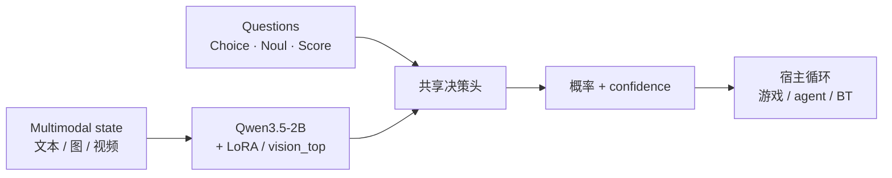
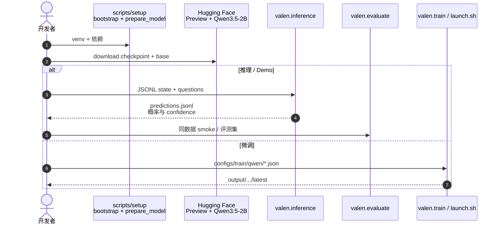

# Valen（万澜 · Multimodal System One Decision Model）

**Valen**（[GitHub](https://github.com/Liuziyu77/Valen)，[HF 组织](https://huggingface.co/Valen-Team)，[Preview 权重](https://huggingface.co/Valen-Team/Valen-Preview-0923)，[在线 Demo](https://huggingface.co/spaces/yuhangzang/Valen-Preview-0923)）将 **视觉感知** 接入 **System One** 结构化决策：受 [TypeSafe Jev](./typesafe-jev.md) 启发，对 **文本、图像、视频** 与任务指令做判断，在 **给定候选** 上直接输出 **校准概率**，而不是自回归生成答案字符串。

## 一句话定义

**多模态 state + 预声明候选 → 一次前向得到 Choice/Noul/Score 分布与 confidence，把「看图选方向/判真假/打等级」变成可门控的决策 API。**

## 英文缩写速查

| 缩写 | 英文全称 | 简要说明 |
|------|----------|----------|
| S1 | System One (Model) | 快速结构化决策层，相对 Chat LLM 的 System 2 |
| RLCD | Reinforcement Learning for Calibrated Decisions | 正确性 + 置信度误差的 GRPO 式 RL（与 Jev 同谱目标） |
| VQA | Visual Question Answering | General 100k 混合的多模态 QA 类监督 |
| LoRA | Low-Rank Adaptation | 当前 LLM 侧默认可训形态；骨干 Qwen3.5-2B 冻结另载 |
| HF | Hugging Face | 权重、数据集与 Space Demo 托管 |

## 为什么重要

- **补齐 Jev/Laya 的「看图」缺口：** [Jev](./typesafe-jev.md) 为托管 API、以文本 state 为主；[Laya](./laya.md) 为 Apache 2.0 文本决策引擎；Valen 在 **同一 decision head 协议** 上扩展 **图像/视频**，适合游戏、UI、监控帧等 **视觉离散分支**。
- **相对生成式 VLM 的延迟形态：** 官方 Sokoban 演示中 **Preview-0923** 九步累计 **~1.13 s**，对照 **Qwen3.8-27B-FP8** thinking **~198 s** 且 no-thinking 未通关——强调 **决策头评分** 而非长链 CoT 生成（数字以仓库 demo 测量为准）。
- **全栈可复现：** **Apache 2.0** 代码、`valen.train` / `inference` / `evaluate`、**General 100k** 训练集与 **5k** 评测、Sokoban **Eval-Game** 划分；Preview 与 `Valen-Sokoban-RLCD-2B` 同 checkpoint。
- **与 VLA 分工：** Valen **不输出连续 action chunk**；在 agent/机器人栈中适合 **技能路由、安全门控、基于相机的离散技能 ID**（与 [行为树 × VLA](../concepts/behavior-tree-vla-orchestration.md) 毫秒层一致）。

## 核心信息

| 项 | 内容 |
|----|------|
| **维护** | Valen Team（GitHub [Liuziyu77/Valen](https://github.com/Liuziyu77/Valen)） |
| **骨干** | Qwen3.5-0.8B / **2B**（Preview 为 2B） |
| **Preview** | `Valen-Preview-0923` — General 100k SFT 头 + Sokoban 30k **RLCD**（`vision_top`，3 epoch） |
| **输出原语** | **Choice**（1–255 候选）、**Noul**（P(true)）、**Score**（2–10 有序等级期望） |
| **许可** | 代码 **Apache-2.0**；Qwen3.5 与源数据各自许可 |
| **开源** | **已开源**（代码 + 权重 + 数据 + Space） |

## 方法与核心结构

| 模块 | 作用 |
|------|------|
| **Qwen3.5 骨干** | 多模态编码；推理时需 **HF base + Valen checkpoint** 双份权重 |
| **共享决策头** | 对 criteria 分支打分 → softmax 概率 + **confidence**（分布集中度） |
| **训练 stage** | `warmup`（仅头）→ `text` / `joint` / **`vision_top`**（+ ViT 末 4 层） |
| **SFT → RLCD** | 标签监督预训决策行为；RLCD 加 KL 与可选 Brier，优化校准 |

Choice/Noul：**一题一分支** 算全候选；Score：每等级单独 forward 再归一化（公共 state 编码一次，分支内重复 backbone 计算）。

### 流程总览

Sokoban 闭环：每步 **棋盘图像** + 方向候选 → Choice → 环境转移，直至通关或步数上限。

## 源码运行时序图

对齐 [sources/repos/valen.md](../../sources/repos/valen.md) 与官方 Quick start：

- **最短路径：** `bootstrap.sh` → 下载 Preview + `prepare_model.py` → `data/smoke/train.jsonl` 跑 `inference`。
- **正式训练：** 复制 config 改 `data`/`output` → `VALEN_GPUS=N launch.sh`；RLCD 用 `--initialize` 接 SFT checkpoint。
- **格式：** 非 `AutoModel.from_pretrained` 单仓；本地 **`checkpoint.pt` + `config.json` + `model_path`**。

## 工程实践

| 项 | 建议 |
|----|------|
| **何时用 Valen** | 需要 **视觉输入** 的离散决策、置信度门控、低延迟多步循环（游戏、UI 自动化、相机 guardrail） |
| **何时不必上** | 连续关节控制、长文本生成、开放式 chat — 用 VLA 或 Chat LLM |
| **硬件** | Linux + NVIDIA GPU；Python **3.10+**；PyTorch **2.6** + Transformers **5.4**（见 `pyproject.toml`） |
| **数据** | 自有任务按 [data-format](https://github.com/Liuziyu77/Valen/blob/main/docs/data-format.md) 写 JSONL；General 100k 作通用 SFT 起点 |
| **对照选型** | 纯文本自托管 → [Laya](./laya.md)；托管 API + 工作流 eval → [Jev](./typesafe-jev.md)；同骨干 AR 动作 → [G0.5](./paper-galaxea-g05.md) |

## 实验与评测（摘要）

**Preview-0923（Sokoban RLCD-2B）：**

| 评测 | 结果 |
|------|------|
| 500 单步动作题 | **87.60%** accuracy |
| 100 局完整游戏（≤200 步/局） | **38/100** 通关 |

100 局集合为 **35 easy + 65 medium**，且保留 2B RLCD 成功案例后再凑满 100 — **非无偏全 benchmark**；单步准确率与整局成功率 **不可混读**。

**延迟（官方 demo）：** 单步约 **122–128 ms**；四局并行总 wall time **≤1.24 s**；相对 **Qwen3.8-27B-FP8** 同关 thinking 模式 **~198 s**。

**General 族（单独 checkpoint，非 Preview 本体）：** 技术说明中 **Valen-Base-RLCD-2B** 等在 **General 5k** 上相对 Qwen3.5-2B 报告 **更高准确率 + 更低单题延迟**（<200 ms 区间）；详见仓库 `assets/figures/evaluation-results.png` 与 [technical.md](https://github.com/Liuziyu77/Valen/blob/main/docs/technical.md)。

**置信度行为：** 高斯模糊实验 — 清晰帧 optimal action **~93.7%**、confidence **~91.6%**；强模糊降至 **~19.2%**，可用于 **低置信 escalate**。

## 局限与风险

- **非生成式通用 VLM：** 不能替代自由文本 CoT；复杂推理仍可能需要 Chat 模型或分层 workflow。
- **Score 类型成本：** 每等级一次 backbone forward，高等级数时延迟线性上升。
- **Checkpoint 格式：** 必须联载 Qwen3.5-2B 指定 revision；迁移路径与标准 HF 单 repo 不同。
- **Sokoban 100 局集偏差：** 结果条件于模型表现，外推到其他关卡需谨慎。
- **具身：** 未提供机器人 action chunk；与 VLA 组合时 Valen 仅适合 **离散语义/技能层**。

## 关联页面

- [Jev（TypeSafe System One）](./typesafe-jev.md) — 闭源 API + RLCD 叙事源头
- [Laya（开源文本 System One）](./laya.md) — 非自回归文本决策对照
- [行为树 × VLA 编排](../concepts/behavior-tree-vla-orchestration.md) — 毫秒级 typed 分支层
- [LLM 机器人控制接口](../concepts/llm-robotics-control-interfaces.md) — 结构化决策在接口阶梯中的位置
- [G0.5（Qwen3.5 自回归 VLA）](./paper-galaxea-g05.md) — 同骨干、不同输出形态（token 流动作）
- [VLA 方法页](../methods/vla.md) — 连续控制主战场

## 参考来源

- [Valen 官方仓库归档](../../sources/repos/valen.md)

## 推荐继续阅读

- [GitHub README（中文）](https://github.com/Liuziyu77/Valen/blob/main/README_zh.md)
- [技术说明 technical.md](https://github.com/Liuziyu77/Valen/blob/main/docs/technical.md)
- [Hugging Face Space 演示](https://huggingface.co/spaces/yuhangzang/Valen-Preview-0923)
- [Jev 介绍博文](https://typesafe.ai/blog/introducing-system-one-models-and-jev)
