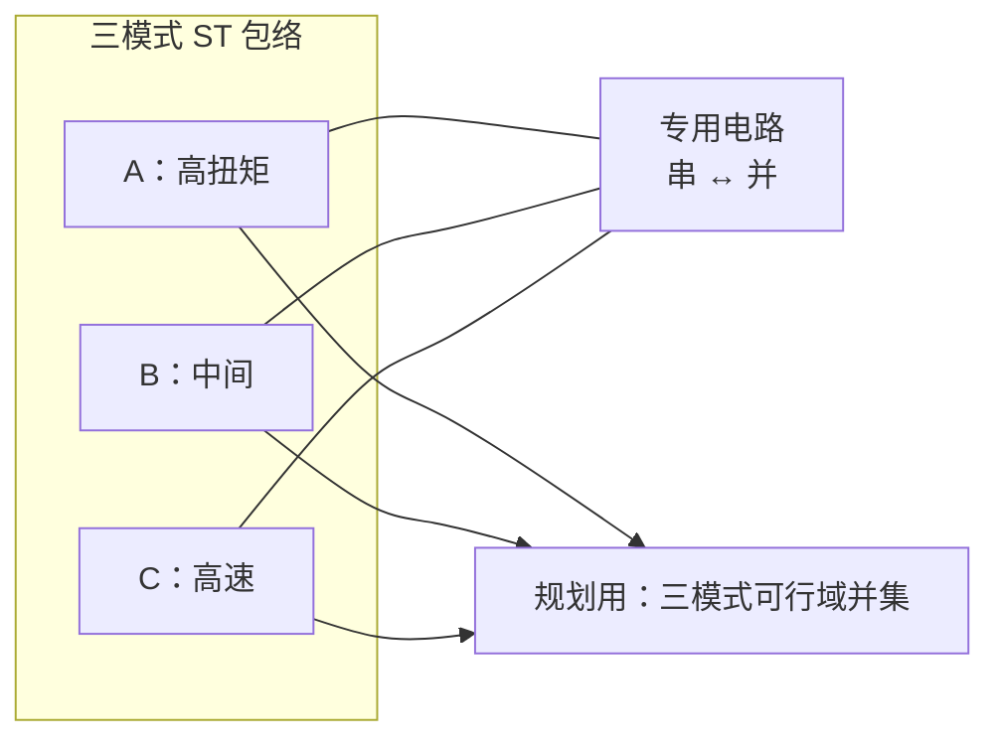

# Variable Chain Motor（可变链电机 / VC motor）

## 一句话定义

**Variable Chain Motor（VC motor，可变链电机）** 是东京大学团队提出的电动作动器：将 **四个小电机单元** 以「链式」集成，并通过 **专用电路** 在绕组 **串联与并联** 连接之间 **即时切换**，从而 **改变 speed–torque 特性**（高扭矩模式 ↔ 高速模式），并在 IROS 2025 工作中同时强调 **形状可变形** 以适应人形细长关节空间。

## 英文缩写速查

| 缩写 | 英文全称 | 简要说明 |
|------|----------|----------|
| VC motor | Variable Chain Motor | 可变链电机，本文作动器名称 |
| ST curve | Speed–Torque curve | 电机转速–输出扭矩特性曲线 |
| QDD | Quasi-Direct Drive | 准直驱；与变传动 / 变电气特性路线对照 |
| BLDC | Brushless DC Motor | 无刷直流电机，VC 单元通常为小型 BLDC |
| TO | Trajectory Optimization | 轨迹优化；IROS 2026 工作在并集约束下规划切换友好轨迹 |
| JAXON | JAXON humanoid | 东京大学 life-sized 高功率人形平台 |

## 为什么重要

- **包络 vs 体积：** 传统 **变传动**（多档减速、CVT 等）可扩大 speed–torque 包络，但对 **人形** 往往 **增重增体积**；VC 电机用 **电气重配置** 在相近尺寸下切换输出特性。
- **即时切换：** 模式由 **电路** 切换绕组拓扑，而非慢速机械换挡，适合 **秒级内** 从大力矩加速切到高速甩动（见 [IROS 2026 动态甩臂](./paper-iros26-vc-motor-dynamic-arm-swing.md)）。
- **规划层新约束：** 切换导致 admissible \((v,\tau)\) **分段变化**；并集约束轨迹优化是已验证的 **规划—执行分工** 范例。

## 核心原理

### 机电结构（IROS 2025）

- **链式四单元：** 多个小电机单元串联成链，可在 **相邻连杆间** 布置并随关节旋转变形（**shape variability**），提高空间受限下的 **力矩密度**。
- **三档电气模式（IROS 2026 实验）：** 记为模式 A/B/C — **更多串联 → 更高扭矩、较低速度**；**更多并联 → 更高速度、较低峰值扭矩**。专用电路完成切换。

### Speed–Torque 切换（直觉）

- 单模式运行时，轨迹只能落在 **一条** ST 边界内；**运行时切换** 则轨迹可依次借用 A 的加速与 C 的峰值速度。

## 工程实践

| 项 | 建议 |
|----|------|
| 硬件选型 | 若任务同时需要 **大力矩起摆** 与 **极高末端速度**，评估 VC 类 **可切换电气特性** 相对固定减速比 / 单模式 QDD 的包络 |
| 控制 | 模式切换与 **电压 / 电流** 能力耦合；IROS 2026 日志显示切高速模式后 **所需电压** 在甩臂高速段仍可控 |
| 仿真 / 规划 | 在 OCP 中用 **各模式 ST 约束的并集** 近似「可切换包络」，执行层再 **逐时刻选模式**（见论文页） |
| 平台 | 公开实验：**JAXON** 左肘；与 [PACE](./paper-pace-sim2real-legged-robots.md) 等 **固定 ST 参数 SysID** 路线互补 |

## 局限与风险

- **开源：** 截至 2026-09-25，IROS 2025/2026 相关 **无** 官方 GitHub 或 CAD/电路公开仓库（项目页核查）；复现依赖论文与后续发布。
- **离散模式与切换瞬态：** 规划用 smooth 并集约束；真机仍有 **切换动力学、热与寿命** 等未在公开页详述的风险。
- **泛化：** 目前公开结果集中在 **单肘关节甩臂**；全身多关节 VC 的布线、惯量与 WBC 协调仍待扩展。

## 关联页面

- [IROS 2026：VC 模式切换动态甩臂轨迹优化](./paper-iros26-vc-motor-dynamic-arm-swing.md)
- [轨迹优化（Trajectory Optimization）](../methods/trajectory-optimization.md)
- [作动器传动选型闭环](../queries/actuator-drive-chain-selection-loop.md)
- [人形作动器：减速比与反射惯量](../overview/humanoid-actuator-102-gear-reflected-inertia.md)

## 参考来源

- [IROS 2025 VC motor 开发](../../sources/papers/iros25_variable_chain_motor_tada.md)
- [IROS 2026 甩臂轨迹优化摘录](../../sources/papers/iros26_vc_motor_arm_swing_tada.md)
- [项目页（IROS 2026）](../../sources/sites/hit4752_iros26_vc_motor_arm_swing.md)

## 推荐继续阅读

- IEEE Xplore：[IROS 2025 VC motor 论文](https://doi.org/10.1109/iros60139.2025.11246199)
- 项目页：[Dynamic Humanoid Arm-Swing Motion](https://hit4752.github.io/projects/202609_iros26-arm-swing/)
