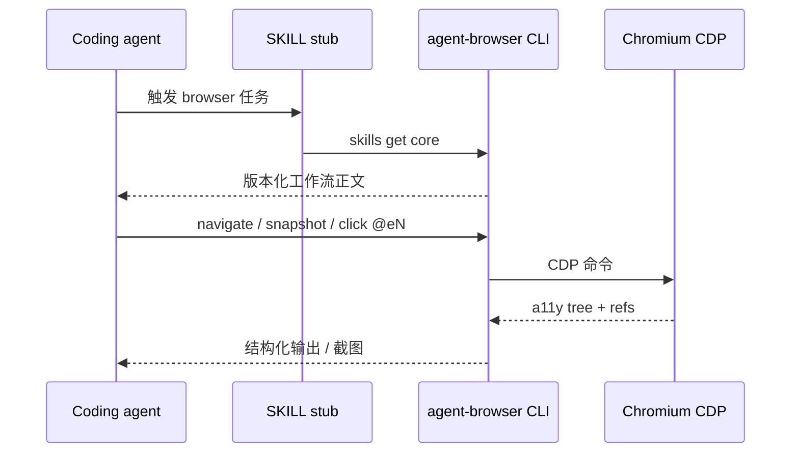

# agent-browser（Vercel Labs Skill）

**agent-browser**（[vercel-labs/agent-browser](https://github.com/vercel-labs/agent-browser)）是面向 coding agent 的 **浏览器自动化 CLI**（Apache-2.0）。skills.sh 上的 [`agent-browser` 技能](https://skills.sh/vercel-labs/agent-browser/agent-browser) 是 **发现 stub**：正文要求代理在执行命令前加载 `agent-browser skills get core`，避免 SKILL 文本与 CLI 版本漂移。

## 一句话定义

用 **原生 Rust + CDP + 无障碍快照元素 ref**，让任意 harness 以 shell 方式完成导航、表单、截图、抓取与 **dogfood/QA**，并可选 Electron 桌面应用与 Slack 专项 skill。

## 英文缩写速查

| 缩写 | 英文全称 | 简要说明 |
|------|----------|----------|
| CDP | Chrome DevTools Protocol | 驱动 Chrome/Chromium 的协议 |
| CLI | Command-Line Interface | `agent-browser` 主命令 |
| QA | Quality Assurance | `dogfood` skill 面向的探索式测试 |
| SSO | Single Sign-On | 无扩展借 profile 时，会话需自行注入或登录流 |

## 为什么重要（对本知识库读者）

- **与 BrowserSkill 分工：** [BrowserSkill（腾讯）](browserskill.md) 借 **用户已登录 Chrome/Edge**；agent-browser 偏 **Agent Window + CDP 自动化**，更适合 Cloud Agent **headless 截图**（见 [ingest 步骤 2.5](../../schema/ingest-workflow.md) 与 `docs/detail.html` 验证）。
- **与 Agent Reach 分工：** [Agent Reach](agent-reach.md) 聚合 **只读 CLI/MCP 检索**；本工具做 **交互与 DOM 级操作**。
- **技能分发：** 经 [find-skills](find-skills-skill.md) 同一 `npx skills` 生态安装；README 宣称优先于 harness 内置 browser 工具。

## 核心结构

| 层次 | 内容 |
|------|------|
| **安装** | `npm i -g agent-browser && agent-browser install`（Chrome for Testing） |
| **Skill stub** | `skills/agent-browser/SKILL.md` → `skills get core`（`--full` 含命令表） |
| **专项 skill** | electron、slack、dogfood、derive-client、vercel-sandbox、agentcore 等 |
| **运行时** | 会话、auth vault、持久化状态、录像；dashboard :4848 |

### 流程总览（代理首次使用）

## 工程实践

| 主题 | 结论 |
|------|------|
| 开源状态 | **已开源**（GitHub；skill 与 CLI 同仓） |
| Linux | `agent-browser install --with-deps` 装系统库 |
| 版本同步 | **勿只读 stub**；必须 `skills get` 拉当前版本指南 |

## 源码运行时序图

**不适用**（主产物为 Rust CLI 与 CDP 会话；无单一 `train.py` 式入口）。复现路径：安装 CLI → `skills get core` → 对目标 URL 执行 snapshot/click 流程（见仓库 README）。

## 常见误区或局限

- **误区：与 BrowserSkill  interchangeable。** 登录态与合规场景不同；内网 SSO 常仍要 BrowserSkill 或手动 cookie。
- **局限：** stub 标记 `hidden: true`；部分 harness 需显式 `@agent-browser` 或 Bash 允许列表。

## 关联页面

- [find-skills](find-skills-skill.md) — 技能发现元技能
- [BrowserSkill](browserskill.md) — 扩展借 tab + 真实 profile
- [Agent Reach](agent-reach.md) — 外网读搜脚手架
- [frontend-design（Anthropic）](anthropic-frontend-design-skill.md) — UI 改动后的视觉验证可搭配 dogfood

## 参考来源

- [agent-browser 仓库归档（本站）](../../sources/repos/vercel-labs-agent-browser.md)
- [skills.sh 页核查](../../sources/sites/skills-sh-agent-browser.md)

## 推荐继续阅读

- [agent-browser README](https://github.com/vercel-labs/agent-browser) — 安装矩阵与 `skills list`
- [skills.sh agent-browser](https://skills.sh/vercel-labs/agent-browser/agent-browser)
