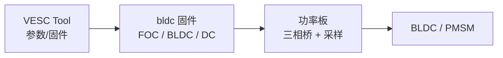

# VESC（开源大电流电机驱动）

## 一句话定义

**VESC**（[vesc-project.com](https://vesc-project.com/)）是 Benjamin Vedder 发起的开源电机控制器生态：固件仓 [vedderb/bldc](https://github.com/vedderb/bldc)（GPLv3）与硬件仓 [vedderb/bldc-hardware](https://github.com/vedderb/bldc-hardware)（CC BY-SA 4.0），覆盖 DC/BLDC/**FOC** 与多板型功率级。

## 英文缩写速查

| 缩写 | 英文全称 | 简要说明 |
|------|----------|----------|
| VESC | Vedder Electronic Speed Controller | 开源大电流无刷/FOC 电调与驱动生态 |
| FOC | Field-Oriented Control | 无刷电机的磁场定向控制 |
| BLDC | Brushless DC Motor | 无刷直流电机 |
| ESC | Electronic Speed Controller | 电子调速器（航模/滑板语境） |
| PCB | Printed Circuit Board | 印制电路板；硬件仓含 KiCad 设计 |

## 为什么重要

- 在开源执行器学习阶梯中，它是学 **大电流功率级、栅极驱动与散热** 的常用参照（相对 [SimpleFOC](./simplefoc.md) 的数安培教学板）。
- [OpenTorque](./opentorque-actuator.md) 等 DIY QDD 直接采用 VESC 做电流力矩控制。
- 与 [moteus](./moteus.md) / [Tinymovr](./tinymovr.md) 对照：后两者更贴近「关节伺服 + CAN/CAN-FD」产品叙事；VESC 出身电调，生态更广但关节实时协议需自行约束。

## 核心信息

| 项 | 内容 |
|----|------|
| 固件 | `vedderb/bldc`；`make` 列出大量板型目标（如 100_250 等） |
| 硬件 | `vedderb/bldc-hardware`；原理图/layout/3D；BOM 在 `design/` |
| 许可 | 固件 **GPLv3**；硬件 **CC BY-SA 4.0** |
| 文档/社区 | [vesc-project.com](https://vesc-project.com/)；入门帖见 Vedder 博客教程 |
| 星标（2026-07） | 固件 ~3.3k · 硬件 ~1.3k |

## 核心结构/机制

- 固件侧：多电机模式、电流/速度/位置类控制、丰富传感器与通信选项（以当前文档为准）。
- 硬件侧：从早期自研 ESC 演进到多代功率板；适合精读母线电容、分流采样与功率环路布局。

## 工程实践

| 场景 | 建议 |
|------|------|
| 学功率级 | 对照 `bldc-hardware` 原理图画：栅极驱动、电流采样、保护 |
| DIY 关节 | 见 [OpenTorque](./opentorque-actuator.md)：外转子 + 低减速 + VESC 电流力矩 |
| 人形关节终局 | 优先评估 [moteus](./moteus.md) 等 CAN-FD 关节向驱动；VESC 可作功率级教材 |
| 合规 | GPLv3 固件对闭源产品分发有传染性，量产前法务评估 |

## 局限与风险

- **最初并非专为高频机器人关节控制设计**：总线时序、多轴同步与「1 kHz 力矩指令确定性」需自行验证。
- 大电流板误操作有火灾/人身风险；上游 README 亦强调高功率电子安全。
- 板型与配置组合极多，复现时锁定固件 commit 与硬件版本。

## 关联页面

- [开源 QDD 执行器项目对比](../comparisons/open-source-qdd-actuator-projects.md)
- [OpenTorque Actuator](./opentorque-actuator.md)
- [moteus](./moteus.md)
- [Tinymovr](./tinymovr.md)
- [SimpleFOC](./simplefoc.md)
- [执行器驱动链选型闭环](../queries/actuator-drive-chain-selection-loop.md)
- [磁场定向控制（FOC）](../concepts/field-oriented-control.md)

## 参考来源

- [sources/repos/vesc_bldc.md](../../sources/repos/vesc_bldc.md)
- [开源 QDD 执行器学习策展](../../sources/personal/open_source_qdd_actuator_learning_curator.md)

## 推荐继续阅读

- 固件：<https://github.com/vedderb/bldc>
- 硬件：<https://github.com/vedderb/bldc-hardware>
- 项目站：<https://vesc-project.com/>
- 入门教程：<http://vedder.se/2015/01/vesc-open-source-esc/>
