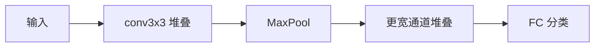

# VGGNet

## 一句话定义

**VGGNet** 证明仅用小尺寸 3×3 卷积反复堆叠即可加深网络并提升 ImageNet 精度，以结构简单换取可迁移的通用特征。

## 英文缩写速查

| 缩写 | 英文全称 | 简要说明 |
|------|----------|----------|
| VGG | Visual Geometry Group Network | 牛津 VGG 卷积分类网 |
| VGG16 | VGG 16-layer | 常用 13 conv+3 FC 配置 |
| VGG19 | VGG 19-layer | 更深变体 |
| FC | Fully Connected | 末端大全连接 |
| Transfer | Transfer Learning | 预训练权重迁移 |

## 为什么重要

- 课程 2.2.3：规整 CNN「加深」叙事；许多早期检测器默认 VGG 骨干。
- 虽已被 ResNet 取代，仍是理解感受野与参数量权衡的教学范例。

## 核心原理

多个 3×3 卷积串联近似更大核感受野但参数更省、非线性更多；通道按阶段倍增，空间分辨率经池化下降。

## 工程实践

| 项 | 建议 |
|----|------|
| 预训练 | torchvision `vgg16_bn` 可作对照基线 |
| 机器人 | 优先 ResNet/高效 CNN；VGG 算力与显存偏高 |
| 特征 | 取卷积末端作编码器时注意去掉 FC |

## 局限与风险

全连接巨大、收敛慢于残差网；深而无残差时梯度更难。现代骨干请优先 [ResNet](./paper-resnet-deep-residual-learning.md) 或 ViT。

## 关联页面

- [AlexNet](./alexnet.md)
- [ResNet](./paper-resnet-deep-residual-learning.md)
- [Vision Backbones](../concepts/vision-backbones.md)
- [Transformer CV 课程策展](../entities/transformer-cv-curriculum.md)

## 参考来源

- [Transformer 视觉应用课程大纲](../../sources/courses/transformer_cv_applications_syllabus.md)

## 推荐继续阅读

- [Simonyan & Zisserman — Very Deep Convolutional Networks (arXiv:1409.1556)](https://arxiv.org/abs/1409.1556)
