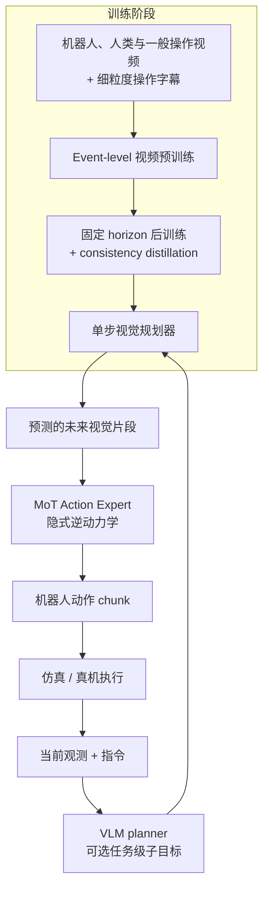
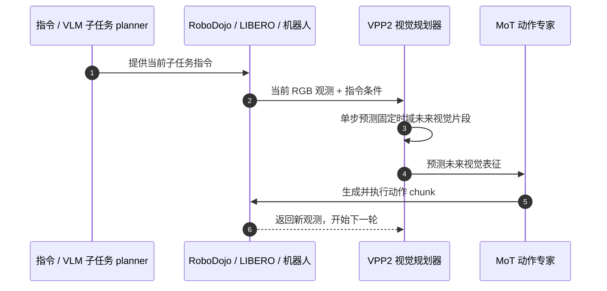

# Video Prediction Policy 2（VPP2）

**Video Prediction Policy 2（VPP2）**（论文 [arXiv:2610.10270](https://arxiv.org/abs/2610.10270)，[官方代码](https://github.com/roboterax/video-prediction-policy-2)，[项目页](https://robert-gyj.github.io/video-prediction-policy-2/)）是 Robotera、清华大学、香港科技大学（广州）、加州大学伯克利分校与上海交通大学合作提出的 World Action Model。它不只根据当前图像直接输出动作，而是先学习“指令下接下来会发生什么”，再让动作专家依据预测未来生成动作。

## 一句话定义

先把操作视频预测做得更贴近物理任务，再把预测未来蒸馏成快速视觉规划器，最后通过隐式逆动力学把未来画面转换成动作 chunk。

## 英文缩写速查

| 缩写 | 英文全称 | 简要说明 |
|---|---|---|
| VPP2 | Video Prediction Policy 2 | 以视频预测中间表征指导动作学习的机器人策略 |
| WAM | World Action Model | 将世界演化预测和动作生成耦合的策略范式 |
| MoT | Mixture of Transformers | VPP2 用于动作专家的 Transformer 混合架构 |
| IDM | Inverse Dynamics Model | 从期望的未来状态/画面反推动作 |
| VLM | Vision-Language Model | 论文所述任务级 planner 将开放指令拆为子任务 |
| ALOHA | Affordable Local Teleoperation and Humanoid | 论文真机操作评测平台之一 |

## 为什么重要

传统反应式策略试图从“当前观测 + 指令”直接映射短动作段。操作任务常有多种合理的中间轨迹，模型容易学到训练集中的短视相关性。VPP2 的做法是先让视频模型学会从指令和当前场景预测完整的下一操作事件，再把预测未来作为动作学习的条件。

它面对两个相互牵制的目标：

1. 通用视频基础模型对物理操作不够专门，开放任务下可能预测错物体运动或操作过程。
2. 直接把动作目标塞进视频模型训练，可能损害原有的视频生成泛化能力。

VPP2 因此把视频能力塑造、实时化蒸馏、动作学习分成连续阶段。这个结构和上一代 [Video Prediction Policy（VPP）](./paper-shenlan-wm-02-vpp.md) 一样利用预测视觉信息指导动作，但 VPP2 强调 event-level 轨迹监督、固定时域快速规划器和 MoT 动作专家；两者不可视为同一版本，也不应跨协议直接比较指标。

## 方法结构

### 1. Event-level 操作视频预训练

论文汇集机器人操作、人类活动/手部操作和过滤后的一般视频数据，给视频片段添加细粒度操作字幕。字幕指向操作事件及其语义，而不是只给整条 episode 一个宽泛指令。模型由此学习更一致的“操作意图 → 下一段视觉轨迹”映射。

### 2. 固定时域视觉规划器

模型继续在固定预测 horizon 上训练，并用 consistency distillation 将视频生成压缩为单步视觉规划。这样部署时不用执行完整的多步视频去噪过程，目标是以较低推理开销预测下一段未来视觉状态。

### 3. MoT 动作专家

MoT action expert 以预测未来为条件学习隐式逆动力学，将未来视觉表征映射为可执行动作段。视频预测分支承担“下一步会发生什么”，动作专家承担“要怎样运动才能到达预测目标”，二者是相关但不同的模块。

### 4. 长指令的任务级拆解

论文描述运行时可配合一个 VLM planner，把开放式语言指令变成明确的子任务指令。不要把它与 VPP2 的视觉规划器混为一谈：前者决定接下来做哪一步，后者预测该操作对应的短期未来画面，MoT 专家再生成动作。

## 流程总览

## 源码运行时序图

论文图景中的任务级 VLM planner 与 VPP2 policy server 是不同职责。仓库提供 RoboDojo / LIBERO 的训练、服务和评测入口；下图聚焦单轮策略闭环：

源码定位：`policy/VPP2/deploy.py` 与 `scripts/robodojo/server.sh` 提供 policy serving 线索；`scripts/robodojo/eval.sh` 和 `scripts/libero/eval.sh` 分别对接闭环 benchmark。仓库结构下的实际入口与配置见[代码来源归档](../../sources/repos/video-prediction-policy-2.md)。

## 论文结果

| 评测 | VPP2 结果 | 比较基准与读法 |
|---|---:|---|
| 开放场景视频指令跟随 | 比 Cosmos3-64B 高 11.0 个百分点 | 衡量生成视频是否按指令完成操作，不等同于机器人成功率 |
| 真机 ALOHA 操作 | 58.5% 平均成功率 | 10 类任务；π0.5 为 40.0%，Fast-WAM 为 20.5% |
| LIBERO-ID | 98.8% | 1,976 / 2,000 episodes |
| LIBERO-Pro | 45.0% | 论文报告最强对照为 11.0% |
| LIBERO-OOD | 63.9% | 组合泛化评测 |
| RoboDojo-Sim | 平均分 39.26；成功率 32.26% | 论文称为该表所评模型中的最佳结果 |

**ALOHA 的 zero-shot 需要准确理解：** 评测任务没有做 task-specific fine-tuning，但部署本体在训练数据中出现过；不能把它解释为对陌生机器人本体完全零样本。LIBERO 与 RoboDojo 结果包含 benchmark-specific post-training，和 ALOHA 口径不同；表中数值不可直接拼成统一排行榜。

## 工程实践与开放状态

| 项目 | 核查结果 |
|---|---|
| 代码 | [官方仓库](https://github.com/roboterax/video-prediction-policy-2)，MIT；实现覆盖训练、推理适配与 RoboDojo / LIBERO 评测 |
| 项目页 | [官方主页](https://robert-gyj.github.io/video-prediction-policy-2/)；该 URL 同时列于 arXiv v2 与 README，主页本体在本次网页读取时不可访问 |
| 环境 | README 推荐 Python 3.10；RoboDojo 文档列出的已测组合为 PyTorch 2.11.0 / torchvision 0.26.0 / CUDA 13.0 |
| 权重 | [Hugging Face](https://huggingface.co/Haodong082399/VPP2) 公开；[ModelScope](https://modelscope.cn/models/haodong123/VPP2_preview) 需具备账号访问权限 |
| 数据与基础预训练 | **部分开放**。README 仍把 robot-video pretrained backbone 及大规模 event-level video pretraining 代码/配置列在 TODO；RoboDojo 转换训练数据另待提供 |
| 许可证边界 | MIT 是代码仓库许可证；模型权重、训练数据、模拟器和第三方组件遵循各自条款 |

从零复现的主要门槛不是一条推理命令，而是大体量视频基础模型、配套编码器、数据准备和模拟器隔离。RoboDojo 文档指出发布的 Video + Action2B 成对评测权重约 36.85 GB（不含共享 Wan 编码器），部署和训练需要足够 GPU 显存与存储；文档提供 dry-run、配置审计和单独环境建议。

## 局限与风险

- **预训练资产并非全量开放：** 可用公开 checkpoint 跑指定 benchmark，不代表论文所述的大规模原始视频池、基础 robot-video 权重和完整预训练代码都可获得。
- **视频预测正确不等于控制成功：** 预测质量、逆动力学映射和闭环执行是不同误差来源，评估时应保留各自指标。
- **固定 horizon 是速度与灵活性的折中：** 它便于蒸馏为单步规划器，但仍要求规划长度、动作 chunk 与执行频率匹配任务。
- **性能数字依赖协议：** ALOHA、LIBERO、RoboDojo 的训练/测试设置不同，特别要区分任务级 zero-shot 与 benchmark-specific post-training。
- **第三方许可要单独审计：** MIT 不自动覆盖模型权重、数据集或仿真器。

## 结论

VPP2 的关键设计是把泛化问题放在“预测到什么未来”上处理，再把该未来交给动作专家转成控制，而不是单纯放大反应式动作模型。

- 研究其泛化机制时，先看 event-level 视频字幕与下一事件预测。
- 研究实时部署时，重点看固定 horizon 与 consistency distillation。
- 研究动作生成时，把 MoT 隐式逆动力学与视频预测模块分开分析。
- 复现 benchmark 时使用匹配的视频/动作 checkpoint 和官方配置，不混用任务指标。
- 判断开放程度时区分代码、checkpoint、基础预训练权重和原始数据四层资产。

## 关联页面

- [World Action Models（WAM）](../concepts/world-action-models.md) — 范式定义与相邻架构
- [Video Prediction Policy（VPP）](./paper-shenlan-wm-02-vpp.md) — 上一代预测视觉表征指导动作的级联路线
- [Fast-WAM](./paper-fast-wam.md) — 视频/动作预测的高效联合建模对照
- [WorldScape Policy 2.0](./paper-worldscape-policy-2.md) — 另一条强调长时记忆与规划的 WAM 路线
- [星动纪元 ROBOTERA](./robotera.md) — 论文作者机构之一

## 参考来源

- [论文原文与版本记录：arXiv:2610.10270](../../sources/papers/vpp2_arxiv_2610_10270.md)
- [官方项目主页归档](../../sources/sites/video-prediction-policy-2.md)
- [官方代码仓库、权重与复现入口](../../sources/repos/video-prediction-policy-2.md)

## 推荐继续阅读

- [VPP2 arXiv HTML v2](https://arxiv.org/html/2610.10270v2)
- [官方 README](https://github.com/roboterax/video-prediction-policy-2/blob/main/README.md)
- [RoboDojo 复现指南](https://github.com/roboterax/video-prediction-policy-2/blob/main/docs/robodojo.md)
- [LIBERO / OOD / PRO 指南](https://github.com/roboterax/video-prediction-policy-2/blob/main/docs/libero.md)
