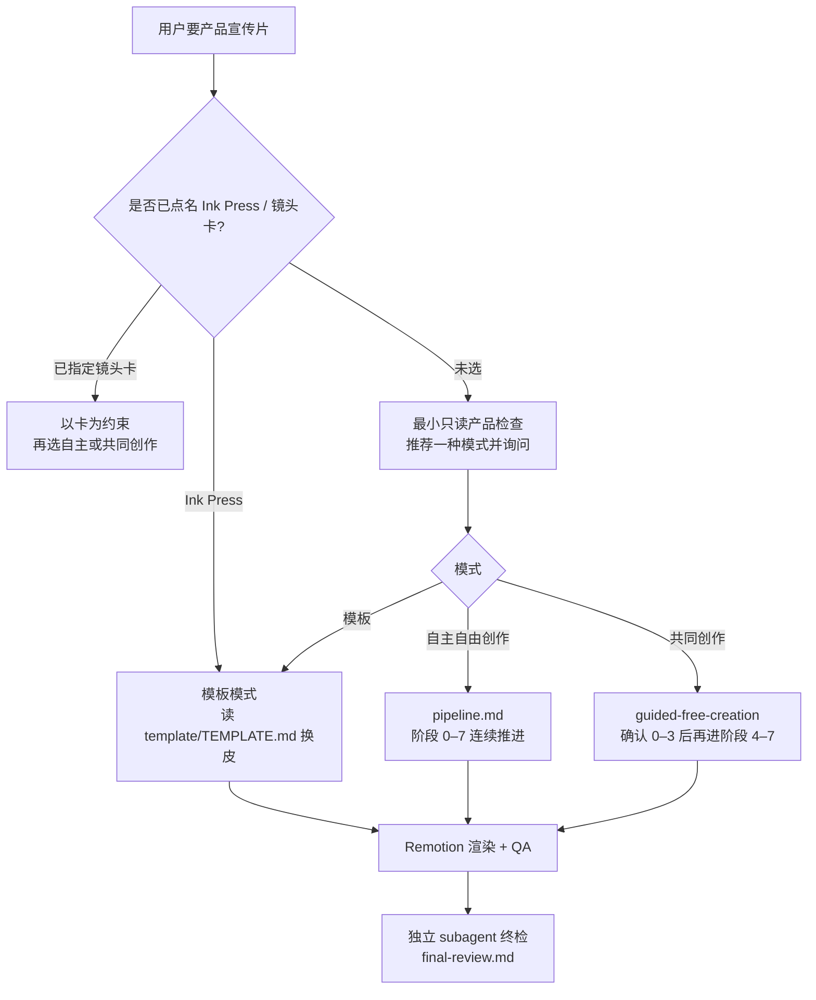

# video-shotcraft（Vincentwei1021/video-shotcraft）

**video-shotcraft** 是 [Vincentwei1021/video-shotcraft](https://github.com/Vincentwei1021/video-shotcraft)（Apache-2.0）分发的 **Agent Skill**：把 **镜头配方卡 + Remotion 参考实现 + 音频资产 + 制作方法论** 打包成可安装规约，使 Claude Code / Codex 能对 Web/桌面产品做分镜、2.5D 运镜动画与节拍对齐音效，产出电影感宣传片 / 发布片 / 功能演示。

> **地址说明：** 外链偶写作 `trendshift/video-shotcraft`（**不存在**）；那是 [Trendshift](https://trendshift.io/repositories/88911) 榜单入口。官方仓与 Gallery 见上。

## 一句话定义

用 **可安装 `SKILL.md` + 104 张镜头卡 + 已验收 Ink Press 模板**，把「产品截图 → 分镜 → Remotion 实现 → SFX/BGM 卡点 → 独立终检」固化为代理可执行的动效制片流水线，而不是让模型凭空编 UI 动画。

## 英文缩写速查

| 缩写 | 英文全称 | 简要说明 |
|------|----------|----------|
| SFX | Sound Effects | 音效层；仓内按 16 类材质/场景组织，与运镜/转场钉帧对齐 |
| BGM | Background Music | 背景音乐；强节奏片须先做拍号网格再分镜，成片常交带/不带 BGM 两版 |
| FPS | Frames Per Second | 帧率；Ink Press 模板锁定 **30fps**、1920×1080 |
| UI | User Interface | 用户界面；复刻产品页时以真实截图为纹理，禁止廉价手搓替代 |

## 为什么重要（对本知识库读者）

- **Agent Skills 生态的「成片交付」样本：** 与 [GSAP Skills](./gsap-skills.md)（DOM/Scroll 交互）、[img2threejs](./img2threejs.md)（程序化 Three.js）、[CAD Skills](./cad-skills.md)（STEP/URDF）并列，代表 **运动设计 / 产品视频** 垂直技能——把 **配方卡 + 调校过的 demo TSX + 独立 subagent 终检** 写成规约，而不是只给提示词。
- **对本站与研究 demo 的直接价值：** 机器人/仿真项目常需 **几分钟级产品或结果宣传片**；本技能提供可复用镜头语法与 Ink Press 换皮路径，降低代理「炫技动画、无呼吸、无音效句式」的概率。
- **与 LLM Wiki 维护同构：** [Karpathy LLM Wiki](../references/llm-wiki-karpathy.md) 把研究知识编译进 `wiki/`；video-shotcraft 把 **镜头语言与验收清单** 编译进 `SKILL.md` / `references/`——都是 **人类策展 + 代理执行**。
- **开源状态清晰：** 技能库与 Gallery **已开源**；渲染引擎 Remotion、音频 Mixkit 有 **独立许可**，商用前必须单独核验（见局限）。

## 核心结构

| 层次 | 内容 |
|------|------|
| **分发** | `npx skills add Vincentwei1021/video-shotcraft`；或 clone 后 symlink 到 `~/.claude/skills/` / `~/.codex/skills/` |
| **入口** | 根目录 [`SKILL.md`](https://github.com/Vincentwei1021/video-shotcraft/blob/main/SKILL.md)：模式选择、核心理念、读哪些 reference |
| **镜头库** | `references/shots/` **104** 张配方卡（用途/能量/时长/参数/已知坑）+ `demos/**` Remotion TSX |
| **Gallery** | [在线样片](https://vincentwei1021.github.io/video-shotcraft/)：**161** 样式 / **161** 预览；选型后复制卡名 |
| **模板** | **Ink Press**：36.2s · 10 镜头 · 纸墨琥珀风，换产品截图最快出片 |
| **流水线** | `pipeline.md` 阶段 0–7：产品理解 → styleframe → 镜头映射 → 分镜 → 采集 → 实现 → 声音 → **独立终检** |
| **音频** | `assets/audio/bgm/` + `sfx/<16 类>/`（约 149 SFX）；`sound-design.md` / `music-beat-sync.md` |

### 三种完整宣传片模式（互不合并）

### 计数口径（入库日锁定）

| 口径 | 数值 | 备注 |
|------|------|------|
| 官方 README / `references/shots/` | **104** 镜头卡 · **161** 样式 · **161** 样片 | **本页采用此口径** |
| 部分榜单/二手文案 | ~106 卡 · ~162 样式 | 与当前主仓不一致时以 README 为准 |

## 工程实践

| 步骤 | 做法 |
|------|------|
| 安装 | 向代理发送仓库 URL，或 `npx skills add Vincentwei1021/video-shotcraft` |
| 最快出片 | 「用 Ink Press 模板给某产品做宣传片」→ 替换截图/文案/品牌 tokens |
| 按卡创作 | 在 Gallery 选卡 → 代理读配方卡 + **准确 demo TSX**（禁止只凭卡名重写） |
| 素材 | 复刻真实页面：起本地 dev server → 无头浏览器 2× 全页纹理 + 元素抠图 + `layout.json`；敏感数据先脱敏 |
| Headless CI | `--concurrency=1`；chrome-headless-shell；必要时 `--browser-executable=` |
| 验收 | 每镜头 `npx remotion still`；交付前干净上下文 subagent 对照 `aesthetic-rules.md` / `final-review.md` |

## 局限与风险

- **误区：这是机器人/仿真视频生成器。** 输出是 **Remotion 时间线成片**（产品 UI 叙事），不是策略 rollout、MuJoCo 可视化或 [Manim](./manim.md) 公式片；与 [Character Animation vs Robotics](../concepts/character-animation-vs-robotics.md) 问题不同层。
- **误区：装了技能就等于「几分钟电影级」保证。** 质量取决于素材真实性、模式选择、Remotion/Chrome 环境和终检是否执行；营销语不能替代 `final-review`。
- **误区：仓库 Apache-2.0 = 整条链路随意商用。** **Remotion** 对公司规模有额外许可；音频见 `ATTRIBUTION.md`；模板内演示截图发布前必须换成自有产品并脱敏。
- **局限：** 主场景是 Web/桌面产品片；真机机器人运镜、多机位实拍剪辑不在库内；强依赖宿主 agent 与本机渲染算力。

## 关联页面

- [GSAP AI Skills](./gsap-skills.md) — **Web UI / Scroll** 动效 Agent Skills（交互层；本页是 **离线成片** 层）
- [img2threejs](./img2threejs.md) — **图像→程序化 Three.js** 垂直 Agent Skill
- [Skills For Real Engineers（mattpocock）](./mattpocock-skills.md) — **编码工程** Agent Skills 对照
- [SenseNova-Skills](./sensenova-skills.md) — **办公产出** Agent Skills
- [CAD Skills](./cad-skills.md) — **硬件/CAD/URDF** 垂直技能
- [Manim](./manim.md) — **离线数学示意动画**（Python）；同属「脚本化视频」，栈与镜头语法不同
- [Draw.io Scientific Illustrator](./drawio-scientific-illustrator.md) — **可见科研插图**（MCP + Skill）
- [Superpowers（obra）](./superpowers-obra.md) — 重流程交付技能库（与本库 **垂直制片** 互补）
- [Character Animation vs Robotics](../concepts/character-animation-vs-robotics.md) — 表演意图 vs 物理可控边界（弱交叉）
- [前端体验优化清单](../../docs/checklists/frontend-optimization-v1.md) — 本站 `docs/` 交互 roadmap
- [LLM Wiki（Karpathy 模式）](../references/llm-wiki-karpathy.md) — 知识编译范式对照
- [Ingest Workflow](../../schema/ingest-workflow.md) — 本仓库维护规范

## 参考来源

- [Vincentwei1021/video-shotcraft 仓库源归档（本站）](../../sources/repos/video-shotcraft.md)
- [video-shotcraft Gallery 站点归档（本站）](../../sources/sites/video-shotcraft-gallery.md)
- [Vincentwei1021/video-shotcraft（GitHub）](https://github.com/Vincentwei1021/video-shotcraft)

## 推荐继续阅读

- [Live Gallery](https://vincentwei1021.github.io/video-shotcraft/) — 搜索/筛选 161 条动态样片并复制卡名
- [Remotion 文档](https://www.remotion.dev/docs) — React 视频框架与许可说明
- [Agent Skills 规范](https://agentskills.io/) — `SKILL.md` 约定
- [skills.sh](https://skills.sh/) — 跨 harness 技能安装
