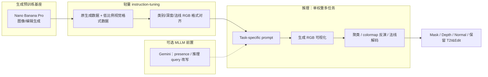

# Vision Banana

**Vision Banana**（*Image Generators are Generalist Vision Learners*，arXiv:2604.20329，[项目页](https://vision-banana.github.io/)，[DeepMind 出版物](https://deepmind.google/research/publications/240658/)）是 Google DeepMind 提出的 **统一视觉理解与生成** 模型：在图像生成基座 **Nano Banana Pro（NBP）** 上，以 **轻量 instruction-tuning** 将经典视觉任务 **重表述为 RGB 图像生成**，在 **共享权重** 下同时服务 **开放词汇分割、单目 metric depth、surface normal** 与 **text-to-image / image editing**，并在多项 benchmark 的 **zero-shot transfer** 设定下 **达到或超越任务专家**。

## 一句话定义

用 **「生成基座 + 格式对齐式 instruction-tuning」** 证明：**图像生成预训练** 已内嵌通用视觉理解表征，只需少量任务数据教会模型 **按 prompt 输出可解码的视觉格式**，即可解锁 SOTA 级多任务感知，而不必为每任务设计专用头或牺牲生成能力。

## 英文缩写速查

| 缩写 | 英文全称 | 简要说明 |
|------|----------|----------|
| NBP | Nano Banana Pro | Vision Banana 的图像生成基座模型 |
| FVM | Foundation Vision Model | 统一理解与生成的视觉基础模型方向 |
| mIoU | mean Intersection over Union | 语义分割像素重叠均值指标 |
| cIoU / gIoU | cumulative / generalized IoU | 指代表达分割常用 IoU 变体 |
| δ₁ | delta1 accuracy | 深度估计阈值准确率（pred/true < 1.25） |
| MLLM | Multimodal Large Language Model | 多模态大模型；复杂推理/presence 外包对象 |
| ZS | Zero-Shot Transfer | 未在目标基准训练集上训练的迁移评测设定 |

## 为什么重要

- **范式证据：** 首次系统论证 **图像生成训练** 可扮演 CV 中类似 **LLM pretraining** 的角色——理解能力来自生成预训练，而非事后嫁接判别头。
- **统一接口：** **同一组权重 + 不同 prompt** 覆盖 2D 分割族与 3D 几何推断，对机器人 **多任务感知栈简化**（一个模型多种 prompt）有参考价值。
- **轻量解锁：** 仅在原生成训练混合中 **极低比例** 混入视觉格式数据，**不遗忘** text-to-image / editing（GenAI-Bench 对 NBP **53.5%** win rate）。
- **机器人相关上游：** 开放词汇 **实例/指代分割**、**无内参 metric depth**、**法线** 可直接服务 **操作抓取、导航避障、Sim2Real 几何对齐** 等管线；与 [VLA](../methods/vla.md) 的视觉塔路线形成 **「生成式统一感知」** 对照（见 [视觉表征作为策略输入](../concepts/visual-representation-for-policy.md)）。

## 核心机制

### 1. 感知即生成：RGB 输出空间

| 任务 | Prompt 要点 | 解码 |
|------|-------------|------|
| 语义分割 | 类名 → 指定 RGB/hex/颜色名映射 | 每像素最近目标色 → 类标签 |
| 实例分割 | 目标类 + 背景色；「每实例不同色」 | 多阶段颜色聚类 → 实例 mask |
| 指代表达分割 | 自然语言描述目标区域与颜色 | 纯色区域提取 |
| Metric depth | rainbow 等 **可逆** colormap 指令 | colormap 反演 → 物理深度 |
| Surface normal | 生成法线图 | RGB 编码 → 3D 法向量 |

**开放词汇：** 语义/实例类别 **不在固定词表**，由 prompt 动态指定——适合机器人 **长尾物体** 与 **语言条件感知**。

### 2. Instruction-tuning 策略

- **数据混合：** vision task 数据以 **很低比例** 并入 NBP 原生成训练混合；避免全量微调导致生成先验坍塌（对比以往「加模块 + 丢弃生成数据」路线）。
- **无 benchmark 泄漏：** instruction-tuning **不含** Cityscapes / RefCOCOg / ReasonSeg 等评测训练 split。
- **MLLM 协作（可选）：** 实例 presence（SA-Co/Gold）用 **Gemini 3.1 Flash-Lite** 判正负；复杂推理分割（ReasonSeg）用 **Gemini 2.5 Pro** 将推理 query 转为描述性 reference——Vision Banana 专注 **可定量解码的视觉输出**。

## 流程总览

## 主要结果（zero-shot transfer）

| 能力 | 基准 | Vision Banana | 最佳对照（论文/项目页） |
|------|------|---------------|-------------------------|
| 语义分割 | Cityscapes val mIoU ↑ | **69.9** | SAM 3：65.2 |
| 实例分割 | SA-Co/Gold cgF₁ ↑ | **47.5** (+ Gemini 3.1 Flash-Lite) | OWLv2：24.6 |
| 指代分割 | RefCOCOg UMD cIoU ↑ | **73.8** | SAM 3 Agent：73.4 |
| 指代分割 | ReasonSeg gIoU ↑ | **79.3** (+ Gemini 2.5 Pro) | SAM 3 Agent：77.0 |
| Metric depth | 6 数据集平均 δ₁ ↑ | **0.929** | Depth Anything 3：0.918 |
| Surface normal | 3 数据集平均角误差 ↓ | **18.928°** | Lotus-2：19.642° |
| Text-to-image | GenAI-Bench win rate ↑ | **53.5%** vs NBP | — |
| Image editing | ImgEdit win rate | **47.8%** vs NBP | 与基座持平 |

## 常见误区或局限

- **误区：「任意生成模型 zero-shot 画分割图就能 SOTA。」** 早期工作常 **格式不可控**；关键是指令对齐使输出 **严格可解码** 以跑定量指标。
- **误区：「完全端到端单模型。」** SA-Co/Gold、ReasonSeg 等仍 **依赖 MLLM** 做 presence 或推理翻译；Vision Banana 是 **视觉输出专家**，非全能 VLM。
- **局限：** RGB 编码深度/法线受 **colormap 分辨率与 prompt 遵循度** 约束；实例分割依赖 **聚类后处理**，极端同色/小目标可能失败。
- **局限：** 论文未开放权重与训练代码（截至项目页）；机器人落地需评估 **延迟、批量推理与机载部署**。

## 与其他页面的关系

- [生成式视觉预训练](../concepts/generative-vision-pretraining.md) — 范式背景与三条技术谱系
- [视觉骨干](../concepts/vision-backbones.md) — 传统 CNN/ViT 判别预训练对照
- [视觉表征作为策略输入](../concepts/visual-representation-for-policy.md) — 机器人策略如何选择上游感知
- [目标检测](../methods/object-detection.md) — 2D 感知管线中的物体锚点任务
- [VLA](../methods/vla.md) — 语言条件机器人策略；Vision Banana 提供 **语言 prompt 驱动的分割/深度** 上游可能
- [ExoActor](../methods/exoactor.md) — 同生态 **Nano Banana Pro** 用于 embodiment transfer 的交叉引用

## 推荐继续阅读

- arXiv 全文：<https://arxiv.org/abs/2604.20329>
- 交互演示与 benchmark 图：<https://vision-banana.github.io/>
- Segment Anything 3（Meta）— 本文主要分割对照基线
- Depth Anything 3 — metric depth 对照专家

## 参考来源

- [Image Generators are Generalist Vision Learners（arXiv:2604.20329）](../../sources/papers/vision_banana_arxiv_2604_20329.md)
- [Vision Banana 项目页](../../sources/sites/vision-banana-project.md)
