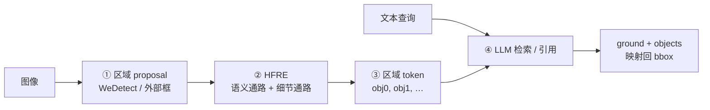
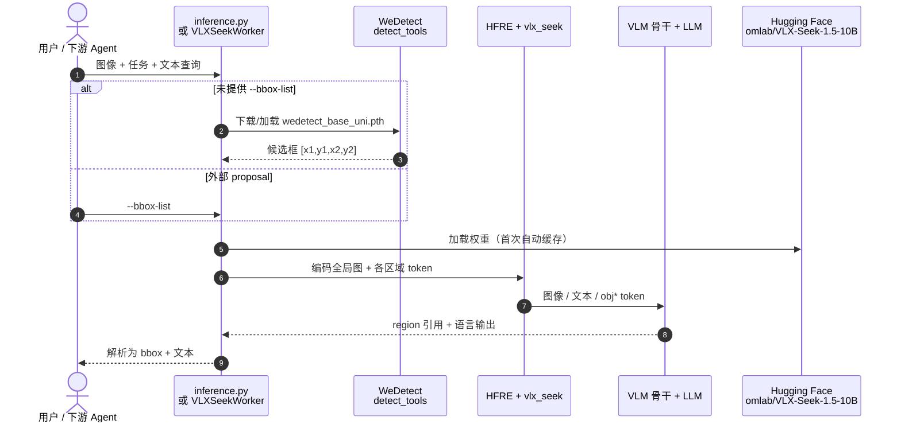

# VLX-Seek（Om AI Lab）

**VLX-Seek**（[om-ai-lab/VLX-Seek](https://github.com/om-ai-lab/VLX-Seek)，Apache-2.0）是 **联汇科技 OmAI 实验室** 发布的 **细粒度感知视觉–语言模型**，面向无人机、监控、机器人/机器狗等 **边缘具身视觉**：既要理解「是什么」，也要稳定回答「在哪、哪一实例、是否存在」。与「让 LLM 直接生成 `[x1,y1,x2,y2]` 坐标串」不同，VLX-Seek 把定位改写成 **区域检索 + 区域引用**——候选框先变成 `<obj*>` **区域 token**，语言模型再选择、比较并引用这些实体。

> **命名提示：** 本产品的 **VLX** 指联汇 **VLX 系列**（Seek 为其中定位/感知型号）。这与知识库 [五大具身模型分类](../comparisons/vlm-vln-vla-vlx-world-model-taxonomy.md) 里的 **Vision-Language-X（一体化多任务 VLX 层）** 是不同概念，选型与文献阅读时不要混为一谈。

## 一句话定义

**把候选视觉区域编码成 LLM 可寻址的 region token，用语言模型的选择与引用完成细粒度 grounding，从而比坐标生成式 VLM 更省 token、更稳解析，并显式支持「目标不存在」拒识。**

## 英文缩写速查

| 缩写 | 英文全称 | 简要说明 |
|------|----------|----------|
| VLM | Vision-Language Model | 视觉–语言多模态模型 |
| VLX-Seek | Vision-Language X Seek（产品系列） | 联汇细粒度感知 VLM 产品线 |
| HFRE | Hybrid Fine-Grained Region Encoder | 混合细粒度区域编码器（语义 + 细节双通路） |
| REC | Referring Expression Comprehension | 指代表达理解 |
| OVOD | Open-Vocabulary Object Detection | 开放词汇目标检测 |
| OPN | Object Proposal Network | 候选区域生成网络（博客内训版未开源） |

## 为什么重要

- **具身与边缘场景的「空间锚点」：** 监控告警、无人机搜小目标、机器人抓取/避障都需要 **实例级、语言条件** 的定位，而不只是全局 caption。
- **接口更贴近 LLM 强项：** 比较、选择、解释、拒识，比长数字坐标串更不易格式崩坏；多目标时输出 **短 region ID** 而非重复四维坐标，有利于降延迟。
- **开放词汇 + 推理一体：** 相对传统闭集检测器，可用自然语言描述与复杂指代；相对「检测头外挂」，区域参与 **多步视觉推理** 与对话。
- **与本库感知栈选型链对齐：** 在 [② 2D 检测/分割选型层](../queries/robot-perception-stack-selection-loop.md) 中，VLX-Seek 代表 **「开放词汇 + VLM 式 grounding」** 路线，与 YOLO/DETR/SAM 等正交组合（常仍需要 proposal 或外部框）。

## 核心信息

| 项 | 内容 |
|----|------|
| **机构** | 联汇科技 OmAI 实验室（Om AI Lab） |
| **开源** | **已开源** 推理代码 + **VLX-Seek 1.5-10B** 权重；训练栈未公开 |
| **许可** | Apache-2.0（仓库） |
| **当前发布** | 1.5 家族规划 0.6B / 3B / 10B；仓内主推 **10B** |
| **Proposal** | 默认 **WeDetect-Base-Uni**；可 `--bbox-list` 自备框；博客 **OPN 未发布** |

## 核心原理

### 流程总览

1. **区域 proposal（解耦）**：先召回候选前景框；可与 VLM 骨干替换，支持用户给定框或第三方检测器。
2. **HFRE**：几何框本身不含语义；用 **语义通路**（保留基座 VLM 对齐）+ **细节通路**（高分辨率边界/小目标）把每个候选变成 **区域级表征**，经 connector 进入 LLM 词嵌入空间。
3. **Token 推理**：全局图像 token + 文本 token + 编号区域 token 一并输入；模型输出如 `<ground>…</ground><objects><obj2><obj5>`，后处理查表还原像素框。
4. **训练（README 叙事）**：阶段一 **区域–语言对齐**（冻结大部分 VLM，训 HFRE/connector/特殊 token）；阶段二 **感知指令微调**（检测/REC/OCR/计数等），混一般 VLM 指令防遗忘，并用 **负样本 + `None` 格式** 抑制幻觉框。

### 支持任务（摘要）

开放词汇检测、指代表达理解、区域 OCR / caption / VQA、计数、基于区域证据的视觉推理；全图 VQA 可不走 proposal 路径。

## 源码运行时序图

节点对齐 [`sources/repos/vlx-seek.md`](../../sources/repos/vlx-seek.md) 与 README Quick Start。

- **最短复现：** `pip install -r requirements.txt` → `python inference.py --model-path omlab/VLX-Seek-1.5-10B --image-path demo/demo_image.jpg --task detection --text "orange; apple"`。
- **边界：** 无 GPU 可跑通逻辑但延迟高；**训练与内部 OPN 不在本仓**。

## 工程实践

| 场景 | 做法 |
|------|------|
| **机载 / 边缘** | 10B 仍重；关注 1.5 更小尺寸发布与 Linear Attention 加速叙事；proposal 与 VLM 可分机部署 |
| **已有检测器** | 用 `--bbox-list` 注入框，跳过 WeDetect，便于与 YOLO 等栈对接 |
| **拒识与安监** | 依赖 hard-negative 训练；部署时验收「目标不存在」场景，避免强出框 |
| **与 SAM / YOLO 选型** | YOLO 闭集实时；SAM 无类别掩码；VLX-Seek 偏 **语言条件实例定位 + 开放词汇**，算力与延迟需单独 profiling |
| **Om 生态** | 可与 [OmAgent](https://github.com/om-ai-lab/OmAgent) 等终端智能体框架组合（本页不展开 Agent 编排） |

## 局限与风险

- **Proposal 依赖：** 最终上限受候选召回影响；博客 **OPN 未开源**，默认 WeDetect 与论文/博客数字可能不完全一致。
- **训练不可复现：** 仅推理 + 权重；微调与数据配方需自行探索。
- **命名混淆：** 产品 **VLX-Seek** ≠ taxonomy **Vision-Language-X** 一体化层；写系统架构文档时建议显式区分。
- **10B 部署成本：** 真机「一脑多能」叙事下，仍需与专用轻量检测/分割模块做 **延迟–精度** 权衡。

## 关联页面

- [机器人视觉感知栈选型闭环知识链](../queries/robot-perception-stack-selection-loop.md)
- [五大具身模型分类（VLM/VLN/VLA/VLX/WM）](../comparisons/vlm-vln-vla-vlx-world-model-taxonomy.md)
- [视觉–语言特征融合](../concepts/vision-language-feature-fusion.md)
- [统一多模态 token](../methods/unified-multimodal-tokens.md)
- [Segment Anything（SAM）](./paper-segment-anything.md)

## 参考来源

- [vlx-seek.md（仓库归档）](../../sources/repos/vlx-seek.md)
- [vlx-seek.md（站点归档）](../../sources/sites/vlx-seek.md)

## 推荐继续阅读

- [VLX-Seek 1.5 技术博客](https://om-ai-lab.github.io/2026_07_06_vlx_seek_1_5_en.html)
- [GitHub: om-ai-lab/VLX-Seek](https://github.com/om-ai-lab/VLX-Seek)
- [Hugging Face: omlab/VLX-Seek-1.5-10B](https://huggingface.co/omlab/VLX-Seek-1.5-10B)
- [在线 Demo（OmAgent）](https://om-agent.com/#/front)
