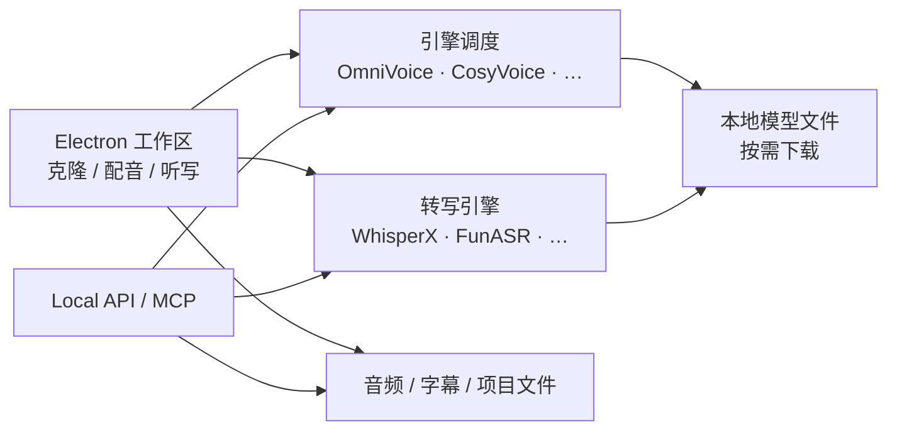
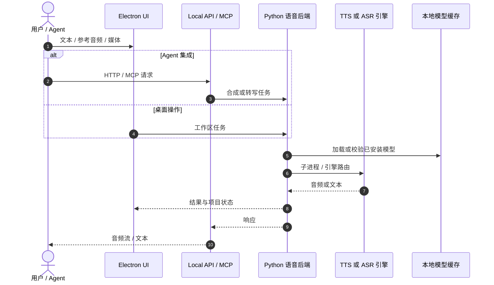

# VoiceStudio

**VoiceStudio**（[debpalash/VoiceStudio](https://github.com/debpalash/VoiceStudio)，AGPL-3.0）是面向 **全本地、多语言语音工作流** 的开源桌面应用：语音克隆、Voice Design、视频配音、听写、转写与有声书批量生产等，并宣称支持 **646 种语言**（以各引擎实际能力为准）。默认 TTS 引擎为 **k2-fsa/OmniVoice** 路线；转写默认 **WhisperX**，可在同一 UI 内切换 CosyVoice、IndexTTS、MOSS-TTS、GPT-SoVITS、sherpa-onnx 等 **TTS/ASR 插件**。除人工操作外，还提供 **Local API** 与 **MCP Server**，便于在 Claude Code、Cursor 等 Agent 里做「本机语音 I/O」而不默认上云。

与本库 **人形 HRI** 主线的关系：VoiceStudio **不是** 机器人中间件，而是 **开发/运维机上的语音能力聚合器**——可快速试验克隆音色、测首包 TTS 延迟、或把 Whisper 系转写接到 LLM；真机闭环仍须把音频 I/O 接到 [人形智能语音交互](../methods/humanoid-voice-interaction.md) 的状态机（唤醒 → ASR → LLM → 技能/VLN → TTS + **barge-in**），并经 [G1 软件栈](./unitree-g1-software-stack.md) / ROS 2 等 **动作 API** 落地。

## 一句话定义

**在单机聚合多引擎 TTS/ASR/克隆与配音工作流，并通过 Local API/MCP 暴露给 Agent 的全本地语音工作台，可作为机器人语音交互原型链路的 TTS·转写选型沙盒。**

## 英文缩写速查

| 缩写 | 英文全称 | 简要说明 |
|------|----------|----------|
| TTS | Text-to-Speech | 文本 → 语音合成 |
| ASR | Automatic Speech Recognition | 语音 → 文本 |
| MCP | Model Context Protocol | Agent 调用外部工具/服务的协议 |
| API | Application Programming Interface | 本机 HTTP 等编程接口（Local API） |
| AGPL | GNU Affero General Public License | VoiceStudio 应用许可；衍生网络服务需注意传染条款 |
| VAD | Voice Activity Detection | 端点/打断检测（听写与交互链路相关） |

## 为什么重要

- **隐私与合规：** 赛场、工厂或客户现场常 **不宜** 把原始音频送云 ASR/TTS；本地多引擎对比可在同一 UI 内完成，减少「每个模块单独装一套 Python 环境」的摩擦。
- **音色与延迟实验：** 人形交互对 **首包 TTS** 与 **可懂度** 敏感（见 [语音交互流水线](../queries/humanoid-voice-interaction-pipeline.md) 延迟表）；VoiceStudio 便于在部署前对引擎/模型做 A/B，而不绑定单一 Piper/云厂商。
- **Agent 时代接口：** MCP + Agent 安装指南（`docs/install/agent.md`）与机器人侧「LLM + 工具」架构同构——但 **工具输出必须是限幅技能**，不能直接把 TTS 文本当运动指令。
- **与 OpenLess 等对照：** [OpenLess](./openless.md) 偏 **开发者口述写作** ASR；VoiceStudio 覆盖 **TTS + 克隆 + 转写 + 配音** 全链路，更接近「语音产线工作台」。

## 核心信息

| 项 | 内容 |
|----|------|
| **维护者** | debpalash（独立开源项目） |
| **开源** | **已开源** 应用与集成代码；各 **语音模型/引擎** 独立许可，商用需逐条审阅 |
| **许可** | AGPL-3.0（应用）；模型见上游 LICENSE |
| **桌面形态** | **Electron**（唯一桌面/UI；Tauri 已在 0.5.3 后退役） |
| **默认引擎** | TTS：OmniVoice 系；ASR：WhisperX（可换 Faster-Whisper、FunASR 等） |
| **Agent** | Local API、MCP、`npx skills add debpalash/VoiceStudio` |

## 核心原理

### 流程总览

1. **桌面壳 + Python 后端：** 开发路径为 `bun install` → `bun run setup:api` → `bun run dev`；发行版通过 [voicestudio.sh/install](https://voicestudio.sh/install) 或 GitHub Releases 安装。
2. **引擎插件化：** 功能与引擎列表见上游 `docs/feature-catalog.md`；GPU 自动探测，硬件不足时仍可跑部分 CPU 引擎（延迟上升）。
3. **Local-first：** 默认数据与推理在本机；可选远程 worker；用量分析需用户同意。
4. **对外集成：** HTTP Local API 与 MCP 供自动化；与机器人栈组合时，通常由 **中间服务** 把 API 输出接到 ROS 2 topic/action 或厂商 SDK，而非 Electron UI 直接控臂。

## 源码运行时序图

节点对齐 [`sources/repos/voicestudio.md`](../../sources/repos/voicestudio.md) 与 README「Run from source」。

- **最短复现（源码）：** `git clone` → `bun install` → `bun run setup:api` → `bun run dev`；首次生成按提示下载引擎模型。
- **最短复现（用户）：** `curl -fsSL https://voicestudio.sh/install | sh` 或下载 Release 安装包。

## 工程实践

| 场景 | 做法 |
|------|------|
| **人形 TTS 选型** | 在 VoiceStudio 内对比 OmniVoice / IndexTTS / sherpa-onnx 等 **首包延迟** 与中文可懂度，再抽单一引擎嵌入 ROS 2 节点 |
| **ASR 对照** | 默认 WhisperX；嘈杂环境可试 FunASR / Faster-Whisper；多说话人场景仍可能需要 [MOSS Transcribe Diarize](./paper-moss-transcribe-diarize.md) 等专用栈 |
| **Agent 开发机** | MCP 做「朗读回复 / 转写日志」；**不要** 让 LLM 未经白名单直接触发运动 |
| **许可** | 应用 AGPL-3.0；**克隆他人声音需授权**；商用前核对各模型 LICENSE |
| **部署边界** | 真机常用 **无头服务 + 单一引擎**；Electron 适合 lab 而非机载 IPC |

## 局限与风险

- **非机器人中间件：** 不含 Nav2、运控、急停；接入人形必须自建 **barge-in 状态机** 与 **技能白名单**（见 [语音交互流水线](../queries/humanoid-voice-interaction-pipeline.md)）。
- **AGPL 与网络服务：** 若把修改版以 **网络服务** 形式提供，需遵守 Affero 条款；嵌入式闭源产品需法务评估。
- **模型碎片化：** 「646 语言」为产品能力叙事，**实际语言/质量取决于当前引擎与已下载模型**。
- **资源占用：** 多引擎并存时磁盘与 GPU 显存压力大；机载部署通常只保留 **一个** TTS + **一个** ASR。
- **云替代混淆：** 与 ElevenLabs 等 SaaS 不同，**运维责任在本机**（驱动、CUDA、模型更新）。

## 关联页面

- [人形智能语音交互](../methods/humanoid-voice-interaction.md)
- [人形语音交互流水线](../queries/humanoid-voice-interaction-pipeline.md)
- [OpenLess](./openless.md) — 开发者 ASR 口述工具对照
- [MOSS Transcribe Diarize](./paper-moss-transcribe-diarize.md) — 多说话人转写 / SATS 路线
- [Unitree G1 软件服务栈](./unitree-g1-software-stack.md) — 真机语音指令需接到的底层服务示例

## 参考来源

- [voicestudio.md（仓库归档）](../../sources/repos/voicestudio.md)
- [voicestudio.md（站点归档）](../../sources/sites/voicestudio.md)

## 推荐继续阅读

- [VoiceStudio GitHub README](https://github.com/debpalash/VoiceStudio)
- [功能与引擎目录（feature-catalog）](https://github.com/debpalash/VoiceStudio/blob/main/docs/feature-catalog.md)
- [Local API 文档（speech-platform）](https://github.com/debpalash/VoiceStudio/blob/main/docs/speech-platform.md)
- [MCP 文档](https://github.com/debpalash/VoiceStudio/blob/main/docs/mcp.md)
- [Agent 安装指南（install/agent.md）](https://github.com/debpalash/VoiceStudio/blob/main/docs/install/agent.md)
