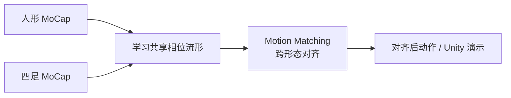

# WalkTheDog

**WalkTheDog**（*Cross-Morphology Motion Alignment via Phase Manifolds*，SIGGRAPH 2024）由 Peizhuo Li 等提出，开源包含：

- Python：<https://github.com/PeizhuoLi/walk-the-dog>
- Unity 演示：<https://github.com/PeizhuoLi/walk-the-dog-unity>
- 项目页：<https://peizhuoli.github.io/walkthedog/>

核心思想是在 **相位流形（phase manifold）** 上对齐 **人形与四足（狗）** 运动，实现 **无监督跨形态 motion matching**，可用于跨骨架重定向研究与可视化，而非直接输出机器人关节指令。

## 英文缩写速查

| 缩写 | 英文全称 | 简要说明 |
|------|----------|----------|
| MM | Motion Matching | 基于特征数据库的实时动作选择 |
| ONNX | Open Neural Network Exchange | Unity 侧相位模型推理 |
| Retargeting | Motion Retargeting | 跨骨架运动映射 |
| MoCap | Motion Capture | DeepPhase / AI4Animation 数据管线 |

## 为什么重要

- **跨形态对齐范式**：与几何 IK（GMR）或四足专用 STMR 不同，强调 **相位语义** 而非逐关节误差最小化。
- **机器人间接价值**：可为「动物→人形/四足」数据增广提供研究思路；落地机器人仍需动力学与接触约束层。

## 流程概念

## 关联页面

- [Motion Retargeting](../concepts/motion-retargeting.md)
- [PAN Motion Retargeting](./pan-motion-retargeting.md)
- [Character Animation vs Robotics](../concepts/character-animation-vs-robotics.md)

## 参考来源

- [walk-the-dog 仓库归档](../../sources/repos/walk_the_dog.md)

## 推荐继续阅读

- 项目页：<https://peizhuoli.github.io/walkthedog/index.html>
