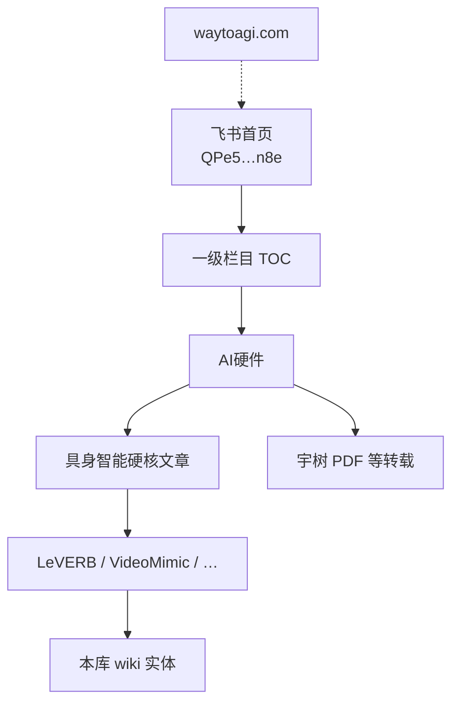

# WaytoAGI（通往 AGI 之路）

**WaytoAGI**（飞书知识库首页 <https://waytoagi.feishu.cn/wiki/QPe5w5g7UisbEkkow8XcDmOpn8e>，官网 <https://www.waytoagi.com>）是面向大众 AI 学习的**开源飞书知识库 + 共学社区**：以 Prompt / Agent / AIGC 应用教程为主体，同时在 **「AI硬件」** 栏目沉淀具身智能与机器人相关策展。本页只把它当作**中文社区导航锚点**，不替代本库对论文与开源栈的结构化编译。

## 一句话定义

**中文开源 AI 学习社区的飞书总入口；机器人研究者优先看侧栏「AI硬件」，用标题索引跳回本库已有实体，而不是把整库当运控教材。**

## 英文缩写速查

| 缩写 | 英文全称 | 简要说明 |
|------|----------|----------|
| AGI | Artificial General Intelligence | 社区名「通往 AGI 之路」中的目标语境 |
| VLA | Vision-Language-Action | AI硬件硬核文章中多次出现的多模态策略范式 |
| BFM | Behavior Foundation Model | 与 LeVERB 等层次化全身控制相关的运控基座语境 |
| PDF | Portable Document Format | 栏目内宇树简介等附件形态（社区转载） |
| TOC | Table of Contents | 飞书侧栏一级目录树（抓取日约 40 个栏目节点） |

## 为什么重要

1. **中文社区的稳定入口**：公开访问、持续更新活动与共学直播；适合追踪「具身 / AI 硬件」中文策展何时出现新标题。
2. **与本库互补而非重复**：WaytoAGI 强在**大众可读的转载与活动组织**；本库强在**方法机制、开源核查与交叉引用**。同一篇 LeVERB / EgoVLA，应以本库实体为准。
3. **硬件栏目可当「雷达」**：`AI硬件` 子树把综述、厂商资料、VLA/人形论文标题聚在一处，便于发现待 ingest 线索，而不是直接当 SOTA 排名。

## 核心结构

| 层级 | 入口 | 对本库的用法 |
|------|------|----------------|
| **门户** | 飞书首页 / 官网 | 愿景、投稿、共学、活动 |
| **雷达** | [AI硬件](https://waytoagi.feishu.cn/wiki/Hz2Hwi4xkitQUikJUYZcDPyFnze) | 扫标题 → 映射已有实体或列入待 ingest |
| **深读** | 本库 `wiki/entities/*` | 机制、局限、开源状态以本库为准 |

### AI硬件 → 本库映射（抓取日标题级）

| WaytoAGI 标题线索 | 本库节点 |
|-------------------|----------|
| LeVERB | [paper-bfm-36-leverb](./paper-bfm-36-leverb.md) |
| VideoMimic | [videomimic](./videomimic.md) |
| EgoVLA | [paper-loco-manip-161-161-egovla](./paper-loco-manip-161-161-egovla.md) |
| H-RDT | [paper-notebook-h-rdt…](./paper-notebook-h-rdt-human-manipulation-enhanced-bimanual-robot.md) |
| SpatialVLA | [VLA 开源复现地图](../overview/vla-open-source-repro-landscape-2025.md) |
| 宇树科技 PDF | [Unitree](./unitree.md)（**官方渠道优先**；飞书 PDF 为社区转载） |

## 工程实践

| 场景 | 建议 |
|------|------|
| **发现中文策展新题** | 打开 AI硬件 / 硬核文章子树，记录标题与飞书 URL，再决定是否 ingest |
| **核对开源与复现** | 不要停在飞书转载页；回本库实体的 `sources/repos` / 项目页核查 |
| **宇树硬件信息** | 以 [unitree.com](https://www.unitree.com/) / [GitHub unitreerobotics](https://github.com/unitreerobotics) 为准 |
| **对比真机数据社区** | 需要可下载轨迹时看 [OpenLET](./openlet.md)，不要与 WaytoAGI 文档库混淆 |

## 局限与风险

- **误区：把 WaytoAGI 当成机器人系统教材。** 主干是 Prompt/AIGC/Agent；运控、Sim2Real、MPC 等仍应以本库与论文源为准。
- **误区：飞书 PDF = 官方发布。** 宇树简介/商业计划书等为社区转载，版本与授权未保证。
- **局限：** 首页人形公司名单等段落可能过时（评论区已指出）；子页正文未在本次 ingest 逐篇深读。
- **抓取边界：** 飞书 SPA 下无登录 curl/Jina 只能得壳层；完整 TOC 依赖浏览器会话内公开 API（见 raw 归档说明）。

## 关联页面

- [OpenLET](./openlet.md) — 另一类「社区」，但是**真机数据集枢纽**，与文档策展库互补
- [Lumina 具身智能社区](./lumina-embodied.md) — **专耕具身**的官网门户（Talks / Guide / Call）；与本页「大众 AI + AI硬件雷达」互补
- [Unitree](./unitree.md) — AI硬件栏目中的厂商锚点（以官方渠道为准）
- [VLA 开源复现地图（2025）](../overview/vla-open-source-repro-landscape-2025.md) — SpatialVLA 等复现入口
- [VLA](../methods/vla.md) / [Loco-Manipulation](../tasks/loco-manipulation.md)
- [LeVERB](./paper-bfm-36-leverb.md) · [VideoMimic](./videomimic.md) · [EgoVLA](./paper-loco-manip-161-161-egovla.md) · [H-RDT](./paper-notebook-h-rdt-human-manipulation-enhanced-bimanual-robot.md)

## 参考来源

- [waytoagi-feishu-wiki.md](../../sources/sites/waytoagi-feishu-wiki.md) — 门户归档与开源/访问状态
- [feishu_waytoagi_wiki_home_2026-07-26.md](../../sources/raw/feishu_waytoagi_wiki_home_2026-07-26.md) — 一级目录与 AI硬件子树抓取

## 推荐继续阅读

- 飞书知识库首页：<https://waytoagi.feishu.cn/wiki/QPe5w5g7UisbEkkow8XcDmOpn8e>
- AI硬件栏目：<https://waytoagi.feishu.cn/wiki/Hz2Hwi4xkitQUikJUYZcDPyFnze>
- 官网：<https://www.waytoagi.com>
