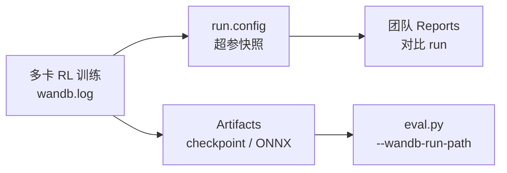

# Weights & Biases（W&B）

**Weights & Biases**（[wandb.ai](https://wandb.ai/site/)）是面向 AI 研发团队的 **实验追踪与协作平台**。在机器人学习工程里，它最常承担「**多 GPU / 多 run 对比、共享 checkpoint、记录 rollout 视频**」角色，而不是替代本地物理仿真或真机 log 分析。

## 一句话定义

用一行 `wandb.init` 把超参、标量曲线、模型权重与媒体文件同步到可检索的云端（或企业私有部署）项目，让团队能在浏览器里对比实验、复现 run 并从 **Artifacts** 拉取 ONNX / checkpoint。

## 英文缩写速查

| 缩写 | 英文全称 | 简要说明 |
|------|----------|----------|
| W&B | Weights & Biases | 本页所述实验追踪与 AI 开发平台 |
| RL | Reinforcement Learning | 人形/足式策略训练的主要使用场景 |
| SDK | Software Development Kit | `wandb` Python 包与框架 logger 集成 |
| HF | Hugging Face | Transformers `Trainer` 可通过 `report_to="wandb"` 对接 |
| ONNX | Open Neural Network Exchange | 常见导出格式，Holosoma 等可自动上传为 Artifact |
| API | Application Programming Interface | REST/GraphQL 与 CLI 访问 run 与制品 |
| SaaS | Software as a Service | 默认多租户云端托管模式 |
| GPU | Graphics Processing Unit | 分布式训练 run 的算力与日志聚合单元 |

## 为什么重要

- **协作成本**：单机 TensorBoard 适合个人 debug；当实验室多台机器并行 sweep 时，W&B 的 **run 表格、超参并行坐标、Reports** 能避免「谁的 `logs/` 在哪台服务器」的混乱。
- **制品链路**：Holosoma、axellwppr motion_tracking、SMP G1 等流程支持 **`--wandb-run-path` 评估 / 从云端拉 checkpoint**，把训练与 sim2real 导出串成可追溯流水线。
- **与本库栈对齐**：mjlab、Holosoma、gr00t_visual_sim2real、leggedrobotics RWM-Lite 等均文档化 W&B 集成；MimicKit 与 rsl_rl 系框架常提供 `logger_type="wandb"` 开关。

## 核心结构 / 机制

### 训练追踪（Models 模块）

典型最小流程：

```python
import wandb

run = wandb.init(project="humanoid-amp", config={"lr": 3e-4, "num_envs": 4096})
for step, metrics in enumerate(training_loop):
    run.log(metrics, step=step)
run.log_artifact("policy.onnx", type="model")
```

| 概念 | 作用 |
|------|------|
| **Project / Run** | 实验命名空间；每次训练启动一个 run |
| **config** | 超参与环境 YAML 快照，便于 diff |
| **log** | 标量、图像、视频、直方图 |
| **watch** | 自动记录梯度与参数（PyTorch） |
| **Artifacts** | 版本化模型、数据集、ONNX；支持 lineage |

### 框架集成（机器人常见）

| 框架 | 集成方式 |
|------|----------|
| PyTorch 原生 | `wandb.init` + `run.log` |
| Lightning | `WandbLogger(project=...)` |
| Hugging Face | `TrainingArguments(report_to="wandb")` |
| 本库 RL 仓 | 环境/训练脚本 `logger:wandb` 或 `logger_type="wandb"`（如 Holosoma、MimicKit） |

### 平台其它模块（选型时知晓即可）

官网还宣传 **Weave**（Agent/LLM 链路追踪）、**Registry**、托管 Training/Inference 与企业合规部署；机器人 **locomotion / manipulation RL** 主线仍以 **Models 实验追踪 + Artifacts** 为主。

### 流程总览（训练 → 共享 → 部署）



## 常见误区或局限

- **不是真机调试 GUI**：W&B 记录的是 **训练/离线评估** 指标；真机 obs/action 时序对比仍用 [PlotJuggler](./plotjuggler.md) 或 rerun（见 [调试 Playbook](../queries/robot-policy-debug-playbook.md)）。
- **需要账号与网络（默认 SaaS）**：离线集群可用 **本地 TensorBoard](./tensorboard.md) 或企业 **customer-managed** 部署；不要把「必须联网」当作所有环境的唯一方案。
- **与 TensorBoard 二选一？** 多数框架可 **同时写 TB event 与 wandb**；详见 [W&B vs TensorBoard](../comparisons/wandb-vs-tensorboard.md)。
- **日志成本**：高频 scalar + 大视频会占存储配额；rollout 视频宜设 `video_interval`。

## 与其他页面的关系

- [TensorBoard](./tensorboard.md) — 本地离线标量/loss 仪表盘；AMP_mjlab 以 TB tag 为收敛判据
- [W&B vs TensorBoard](../comparisons/wandb-vs-tensorboard.md) — 训练期监控选型
- [mjlab](./mjlab.md)、[Holosoma](./holosoma.md) — 内置 W&B 的 RL 框架
- [AMP_mjlab](./amp-mjlab.md) — 以 TensorBoard 为主，可与 W&B 对照
- [强化学习](../methods/reinforcement-learning.md) — 实验对比是学习范式工程化的一部分
- [RL 策略真机调试 Playbook](../queries/robot-policy-debug-playbook.md) — 训练监控 vs 部署 log 工具分工

## 推荐继续阅读

- [W&B 官方产品站](https://wandb.ai/site/)
- [W&B PyTorch 快速入门](https://docs.wandb.ai/quickstart)
- [Holosoma README — Wandb 视频与 checkpoint](https://github.com/amazon-science/holosoma)

## 参考来源

- [sources/sites/weights-and-biases.md](../../sources/sites/weights-and-biases.md)
- [Weights & Biases 官网](https://wandb.ai/site/)
