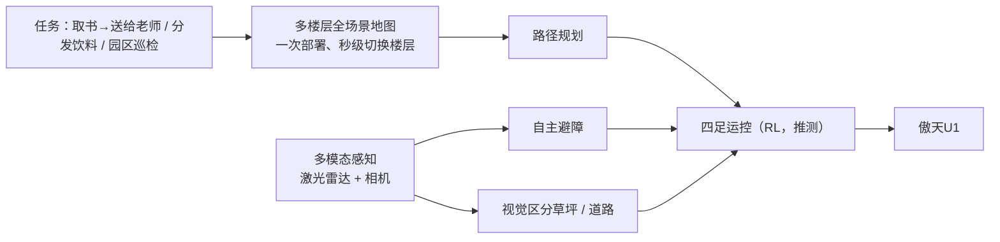

# 傲天U1（西湖机器人四足）

## 一句话定义

**傲天U1** 是 [西湖机器人](./westlake-robotics.md) 的四足机器狗产品（官网口号「智形合一 进化无界」），面向校园 / 园区的多楼层导航递送、巡检与社区养老服务；是公司在人形 [TITAN O1](./westlake-titan-o1.md) 之前已落地的本体线。

## 英文缩写速查

| 缩写 | 英文全称 | 简要说明 |
|------|----------|----------|
| LiDAR | Light Detection and Ranging | 激光雷达；2025-10 报道称傲天U1 搭载高精度激光雷达 |
| SLAM | Simultaneous Localization and Mapping | 同步定位与建图；官网「多楼层 / 全场景地图导航」的基础（招聘页有 SLAM 岗） |
| RL | Reinforcement Learning | 强化学习；公司足式运控主路线（招聘「深度强化学习」岗用 Isaac Lab） |
| MiLAB | Machine Intelligence Lab | 西湖大学机器智能实验室；四足是其早期主线 |

## 为什么重要

- **公司最早的商业本体线：** 量子位 2023-12 曝光时公司主要围绕四足（后空翻、爬楼梯视频），人形在研；四足是把 RL 运控与「大小脑」叙事先落到可交付产品上的载体。
- **社区养老是少见的落地场景：** 报道称它在杭州西湖区古荡、翠苑街道上下 6 楼送饭送药、陪聊——比常见的巡检 / 展示更贴近日常服务。
- **官网 meta 描述的业务重心：** 「推进四足/双足机器人在养老与巡检等场景应用」。

## 规格（官网图片内文字，自报）

| 项 | 数值 |
|----|------|
| 尺寸 | 695 × 313 × 457.5 mm |
| 重量 | 15.7 kg（2025-10 杭州网报道「约 14 千克」，可能为不同配置或早期版本，推测） |
| 标准负载 | 7 kg |
| 极限负载 | 10 kg |
| 续航 | 3–6 h |
| 传感器 | 官网未列；报道：高精度激光雷达 + 摄像头；产品图可见头部前视多目相机 / 补光与背部顶置传感器 |
| 未公开 | 价格、关节扭矩、速度、算力平台、防护等级 |

## 核心原理（官网演示可见的能力）

官网三段任务视频（西湖大学校园）：① 从自习区取书送到学术环 2 楼的老师（多楼层地图导航）；② 餐厅前分发饮料（多模态融合自主避障）；③ 园区巡检（基于视觉区分草坪和道路）。图中运控为 RL 是依据公司技术路线与招聘页的推测，官网未写傲天U1 的控制算法，也未说明是否接入 GAE 或 LM-VLM。

## 时间线

| 日期 | 事件 | 来源 |
|------|------|------|
| 2023-12-23 | 量子位曝光公司四足（未写型号）：前进、后空翻、翻滚、爬楼梯；面向科研、电力、商场、机场 | 量子位 |
| 2025-03-14 | 古荡街道金秋家园养老社区一只名叫「**小西**」的四足机器狗驮药箱提醒老人服药（报道未写厂商） | 每日商报 / 杭州网 |
| 2025-10-14 | 云栖小镇「全球机器人乐园」：报道点名西湖机器人 **傲天U1**；已在古荡、翠苑街道做养老助手，可上下 6 楼、送饭送药、陪聊 | 杭州网 |
| 2026-07 | 深蓝盘点把「四足 "小西"」列为 MiLAB 足式平台 | [深蓝 50 所实验室盘点](../../sources/blogs/wechat_shenlan_china_embodied_labs_50_2026.md) |

**发布日期：** 官网与检索到的报道都没有给出傲天U1 的正式发布日；本库能确认的最早点名报道是 **2025-10-14**。

**「小西」与傲天U1：** 两者都出现在古荡街道养老场景，深蓝盘点又把「小西」列为王东林团队的四足平台；**推测**「小西」是该四足在社区的昵称或早期型号，但没有来源直接说明二者为同一产品。

## 工程实践

| 场景 | 建议 |
|------|------|
| 楼宇递送 / 养老 | 关注多楼层地图切换与电梯 / 楼梯策略；报道称可走楼梯上下 6 楼，需实测负载下的续航（官网 3–6 h 区间较宽） |
| 园区巡检 | 视觉地形分类（草坪 / 道路）可用于合规路线约束；需评估夜间与雨天表现 |
| 选型对比 | 与其他 15 kg 级消费 / 行业四足对比时，补齐速度、关节扭矩、防护等级、SDK 开放程度——官网均未给出 |

## 局限与风险

- **公开信息薄：** 官网页面无文字，参数来自图片；没有发布会、技术文档或 SDK 说明。
- **参数口径不一：** 官网 15.7 kg 与报道约 14 kg 不一致。
- **演示环境单一：** 三段视频均在西湖大学校园内，未见公开的跨场景评测。
- **与公司「大小脑」模型的关系不明：** 官网未说明傲天U1 是否运行 GAE / LM-VLM。

## 关联页面

- [西湖机器人（公司页）](./westlake-robotics.md)
- [TITAN O1 人形机器人](./westlake-titan-o1.md)
- [运动（Locomotion）](../tasks/locomotion.md)
- [楼梯与障碍感知运动](../tasks/stair-obstacle-perceptive-locomotion.md)
- [视觉-语言导航](../tasks/vision-language-navigation.md)

## 参考来源

- [西湖机器人官网模块核查（傲天U1 页参数与任务视频）](../../sources/sites/wlrobo-com.md)
- [产品与报道归档（2025-03 小西、2025-10 傲天U1）](../../sources/blogs/westlake_robotics_press.md)
- [深蓝具身：50 所国内具身智能实验室盘点](../../sources/blogs/wechat_shenlan_china_embodied_labs_50_2026.md)
- 杭州网《"全球机器人乐园"空降杭州在云栖小镇》（2025-10-14）<https://hznews.hangzhou.com.cn/jingji/content/2025-10/14/content_9101545.htm>

## 推荐继续阅读

- [傲天U1 官网页](https://www.wlrobo.com/module3)
- [量子位 2023-12-23：西湖大学系具身智能曝光](https://www.qbitai.com/2023/12/108900.html) — 公司早期四足演示
