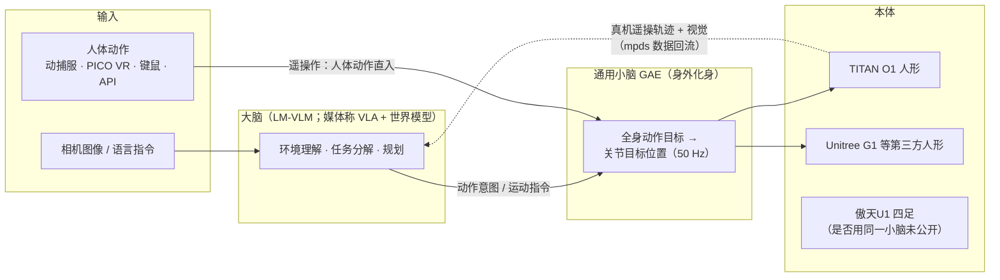

# 西湖机器人（Westlake Robotics）

## 一句话定义

**西湖机器人**（西湖机器人科技（杭州）有限公司，官网 wlrobo.com）是西湖大学王东林团队（机器智能实验室 MiLAB）的产业化公司，自称「机器人大脑公司」：用 **「大脑」多模态运动操作模型 LM-VLM + 「通用小脑」全身动作模型 GAE** 的双预训练架构驱动机器人；同时自研四足 **傲天U1** 与人形 **TITAN O1** 本体，并把 GAE 作为遥操作 / 动作控制软件单独授权给其他人形（首批适配 Unitree）。

## 英文缩写速查

| 缩写 | 英文全称 | 简要说明 |
|------|----------|----------|
| GAE | General Action Expert | 公司的「通用小脑」/「身外化身」全身动作模型；软件名「GAE 身外化身系统 / GAE Emanation」 |
| LM-VLM | （官网未展开） | 官网「大脑」模块名：「多模态运动操作模型」；结构与参数未公开 |
| VLA | Vision-Language-Action | 视觉-语言-动作模型；官网自称走「第三代 VLA+RL 技术路线」 |
| RL | Reinforcement Learning | 强化学习；运控与 GAE 训练的主手段（GAE 论文用 PPO） |
| WR1 | （媒体未展开） | 2026-09 融资稿中的「全身运动操作一体通用具身基础大模型」，在研 |
| MiLAB | Machine Intelligence Lab | 西湖大学机器智能实验室，王东林任主任；公司的技术母体 |
| DoF | Degrees of Freedom | 自由度；TITAN O1 标「总自由度（关节电机）29~69」 |
| TRT | TensorRT | NVIDIA 推理引擎；GAE 机器人端安装包按 CUDA / TensorRT 版本分发 |

## 为什么重要

- **「小脑」单独商品化的样本：** 多数国产人形公司卖整机；西湖机器人把全身动作模型 GAE 做成可下载的 Windows 客户端 + 机器人端软件（首批 Unitree 机型），按加密狗授权，媒体称 GAE 订单已达「数千万元」（公司口径）。这是「运动先验 / 行为基础模型」从论文走向产品的少见案例，对照 [行为基础模型](../concepts/behavior-foundation-model.md)。
- **高校实验室 → 公司的典型链路：** 王东林 2017 年在西湖大学建 MiLAB，公司是官网所说「西湖大学人工智能和机器人领域第一个自主优质成果产业转化落地项目」；[深蓝具身 50 所实验室盘点](../../sources/blogs/wechat_shenlan_china_embodied_labs_50_2026.md) 把它列为「技术孵化层」代表（见 [国内具身实验室图谱](../overview/china-embodied-ai-labs-landscape-2026.md)）。
- **融资节奏是 2026 年具身赛道的观测点：** 2026-02 → 2026-09 七个月内五轮（Pre-A → A1），媒体称累计超 5 亿元。
- **有可核对的技术锚点：** GAE 有 arXiv 论文（2609.34233）与官方下载页，可把公司宣传与论文实验对照阅读，见 [GAE 论文页](./paper-gae-general-action-expert.md)。

## 公司概况

| 项 | 内容 | 来源 |
|----|------|------|
| 名称 | 西湖机器人科技（杭州）有限公司；英文 Westlake Robotics；HF 组织 `westlakerobotics`（全称 Westlake Robotics Technology (Hangzhou) Co., Ltd.） | 官网页脚；Hugging Face |
| 成立 | **工商登记 2021-06-08**（法定代表人 魏震宇，注册地杭州西湖区）；**实际运营 2023-12 / 2024-01** | 36 氪项目库、量子位 2023-12-23；投资界 2025-01-09（「业务始于 2023 年 12 月」）、硬氪 2026-08-12 / 36 氪日本版（「2024 年 1 月」）；官网 2025-06-06 大事记「一年半的快速发展」 |
| 总部 | 浙江杭州（西湖区） | 36 氪项目库；各报道 |
| 母体实验室 | 西湖大学机器智能实验室（MiLAB），主任 王东林 | 量子位；36 氪项目库 |
| 官网未写 | 成立日期、CEO、融资、论文 / 代码链接 | [官网核查](../../sources/sites/wlrobo-com.md) |

> **成立日期为什么有两个：** 2021-06 是 MiLAB 早期落地登记的法人主体；量子位 2023-12-23 引企查查称该月「完成注册资本增加和股东变更」，随后以现团队运营（推测为同一主体重组启用）。引用时写明口径：工商登记 2021-06-08，或业务起点 2023-12 / 2024-01。西湖大学官网创业企业页本次 403，未能交叉核对。

### 创始团队

| 人物 | 角色 | 背景 | 来源 |
|------|------|------|------|
| **王东林** | 创始人（官网）；董事长（硬氪） | 西湖大学终身教授、人工智能系副主任、MiLAB 主任；国家科技创新 2030 重大项目首席科学家；RobotGPT 项目牵头人；西安交大本硕、卡尔加里大学博士，2017 年加入西湖大学 | 官网；硬氪 2026-08-12；量子位 2023-12-23 |
| **张岳** | 联合创始人、首席科学家 | 西湖大学终身教授、工学院副院长、ACL Fellow 2025；NLP 方向；清华本科、牛津硕博、剑桥博士后 | 官网；投资界 2025-01-09 |
| **杜海涛**（释空） | 联合创始人、CEO | 前阿里 AI Lab 总经理、天猫精灵核心创始人 | 投资界 2025-01-09；瑞财经 2026-09-11（**官网未列**，2026-08 硬氪 / 凤凰网稿也未提 CEO） |
| **魏震宇** | 法定代表人、联合创始人 / COO | MiLAB 助理研究员 | 量子位 2023-12-23；36 氪项目库 |

### 融资时间线（媒体报道 / 数据库，非公司原文）

| 公布日期 | 轮次 | 金额 | 投资方 | 来源 |
|----------|------|------|--------|------|
| 2025-01 前 | 天使 | 未披露 | 天使湾创投 | 投资界 2025-01-09 |
| 2025-01-09 | 天使+ | 近亿元 | 晶科 CVC 金能基金、犇驰资本 领投；广州诚信创投；天使湾加注 | 投资界 |
| 2026-02 | Pre-A | 亿级 | 赛富投资基金、龙芯创投、莫干山基金、海尔赛富 | **仅** 36 氪项目库 |
| 2026-05-06 | Pre-A+ | 未披露 | 小苗朗程 领投；兴证资本、贝鱼资本 | 界面新闻 |
| 2026-07-10 | Pre-A++ | 超亿元 | 河南投资集团汇融基金 独家 | 投资界；锦天城 2026-07-20 |
| 2026-08-12 | A | 过亿元（瑞财经） | 海愿基金 领投 | 硬氪；瑞财经 2026-08-13 |
| 2026-09-11 | A1 | 数亿元 | 海愿资本、翠微基金、银杏谷资本、西湖科创投、中山创投 等 | 瑞财经；潮新闻 2026-09-16 |

> **「5 亿元 A 轮」是误读：** 硬氪 2026-08-12「半年完成 4 轮共 5 亿元」指 Pre-A → A 的**累计**；36 氪日本版（2026-09-17）把累计额写在「シリーズA」名下。潮新闻 2026-09-16 称含 A1「半年 5 轮、累计超 5 亿元」。估值从未披露。完整链接见 [新闻归档](../../sources/blogs/westlake_robotics_press.md)。

## 产品线

| 产品 | 类型 | 一句话 | 首次公开 | 开放程度 | 本库详情 |
|------|------|--------|----------|----------|----------|
| **LM-VLM** | 「大脑」模型 | 多模态运动操作模型；官网演示叠毛衣（「衣角通通塞进去」） | 未写日期 | 未开放（无论文 / 权重） | 本页 |
| **GAE**（身外化身系统 / GAE Emanation） | 「通用小脑」全身动作模型 + 遥操作平台 | 人体动作 → 人形全身关节目标；单机 / 远程 / 群控遥操，动作库，数据采集 | 2025-09-29 系统发布（官网大事记）；论文 2026-09-28 | 闭源二进制，V1.2.0，USB 加密狗授权 | [GAE 论文页](./paper-gae-general-action-expert.md) |
| **WR1** | 全身运动操作一体基础模型 | 2026-09 融资稿称「全力攻坚」，资金重点投向 | 未发布 | — | 本页（推测即官网首页「全身运动操作一体 通用具身基础大模型」的型号名） |
| **TITAN O1**（泰坦 o1 / 西湖 o1） | 人形本体 | 1340 mm、34 kg、29~69 DoF；集成 GAE | **2026-03-23** | 商用产品 | [TITAN O1](./westlake-titan-o1.md) |
| **傲天U1** | 四足本体 | 15.7 kg、负载 7 / 10 kg、续航 3–6 h；校园导航 / 递送 / 巡检；养老场景 | 最早见于 2025-10-14 报道 | 商用产品 | [傲天U1](./westlake-aotian-u1.md) |
| 「小西」 | 四足（昵称） | 2025-03 古荡街道养老社区送药机器狗；深蓝盘点列为 MiLAB 足式平台 | 2025-03-14 报道 | — | 本页「时间线」（与傲天U1 的关系为推测） |

## 时间线

| 日期 | 事件 | 来源 |
|------|------|------|
| 2017 | 王东林在西湖大学建 MiLAB | 硬氪 |
| 2021-06-08 | 公司工商登记 | 36 氪项目库 |
| 2023-12 | 增资与股东变更；实际业务起步 | 量子位、投资界 |
| 2023-12-23 | 量子位曝光：四足（后空翻、爬楼）视频、双足在研、RobotBert 运动算法 | 量子位 |
| 2024 | 「一个大模型」跨四足与双足（自报） | 投资界 |
| 2025-01-09 | 天使+ 近亿元 | 投资界 |
| 2025-03-10 | 「发布国际上第一个人形机器人全身运动大模型」（自报） | 官网大事记 |
| 2025-03-14 | 「小西」机器狗在古荡金秋家园养老社区送药提醒（报道未写厂商） | 杭州网 |
| 2025-06-06 | 浙江省专精特新中小企业 | 官网大事记 |
| 2025-08-11 | 「2025 中国最具成长潜力机器人公司 TOP30」 | 官网大事记 |
| 2025-09-29 | **GAE 身外化身系统发布** | 官网大事记 |
| 2025-10-14 | 傲天U1 亮相云栖小镇机器人乐园；古荡 / 翠苑街道养老助手 | 杭州网 |
| 2025-12-15 / 12-19 | 张岳入选 ACL Fellow；获高新技术企业 | 官网大事记 |
| 2026-01-26 | 王东林团队与港科大（广州）李昊昂团队合作论文获 AAAI 2026 最佳论文（自报，论文名未独立核实） | 官网大事记 |
| 2026 春节 | 安徽卫视春晚 10 台机器人表演「五禽戏」（GAE 驱动，自报） | AIBase |
| 2026-02 | Pre-A | 36 氪项目库 |
| **2026-03-23** | **TITAN O1（泰坦 o1）发布** | AIBase；新华社 / CGTN、TechNode 2026-03-24 |
| 2026-05-06 | Pre-A+ | 界面新闻 |
| 2026-07 | Pre-A++（07-10）；西湖 o1 参展 WAIC 2026、在商超上岗 | 投资界；硬氪 |
| 2026-08 | A 轮（08-12）；GAE 平台手册显示「Modified August 24」，含 V1.2.0 安装说明（年份未显示，推测 2026） | 硬氪；飞书手册 |
| 2026-09-11 | A1 轮，资金投向 WR1 | 瑞财经 |
| 2026-09-28 | GAE 论文 arXiv:2609.34233（G1 + O1 真机） | [GAE 论文页](./paper-gae-general-action-expert.md) |

## 核心原理：「大脑 + 小脑」双预训练架构

官网自报「全球唯一通用大小脑双 pretrain 架构」；硬氪 / 凤凰网转述：前端「通用大脑」= VLA + 世界模型（WM），负责环境理解、任务分解与全局规划；后端「通用小脑」= GAE，负责实时全身运动与平衡；两侧数据双向回流。

1. **小脑 = 可部署的全身动作先验。** 按 [GAE 论文](./paper-gae-general-action-expert.md)：万小时级人类动作统一为 SMPL，先训特权「生成器」把参考变成物理可行轨迹，再训只用本体观测 + 人体动作目标的「执行器」，并以端到端延迟为条件做预判；部署时人体动作直接进执行器，无需在线重定向。
2. **两种上游共用同一小脑。** 遥操作时上游是人（动捕 / VR）；自主时上游是大脑模型输出的动作意图。这让遥操作既是产品功能（演艺、带电作业、远程巡检），也是给大脑采集示范数据的手段（GAE 平台内置数据采集，导出 mpds 格式）。
3. **跨本体靠微调。** 公司宣传「一脑多形」；论文显示 O1 需形态专用微调，不是零样本。
4. **大脑侧公开信息最少。** LM-VLM / WR1 未见论文、参数或评测；「第三代 VLA+RL」「双 pretrain」是定位用语，不是可核对的技术描述。

## 开源与开放状态（2026-10-10）

| 项目 | 形式 | 开放程度 | 依据 |
|------|------|----------|------|
| GAE 身外化身系统 V1.2.0 | Windows 客户端 + 机器人端包（Unitree；Ubuntu 20.04/CUDA 11/TRT 8、22.04/CUDA 12/TRT 10 或 TRT 8）+ 检测脚本 | **闭源二进制**，官网可下载，需 **USB 加密狗** 授权；灵巧手映射为「专业版」 | [官网核查](../../sources/sites/wlrobo-com.md) |
| GAE 产品手册 | 飞书知识库（中 / 英） | 公开可读 | 同上 |
| GAE 论文 | arXiv:2609.34233 + 项目页 | 论文公开；**无代码 / 权重 / 数据** | [GAE 项目页核查](../../sources/sites/gae-general-action-expert.md) |
| LM-VLM / WR1 | — | 未开放 | 官网 |
| Hugging Face `westlakerobotics` | 组织页 | 0 模型 / 0 数据集 / 0 Space（1 篇关联论文） | HF API |
| GitHub | — | 官网未链接任何组织或仓库；本环境 GitHub 搜索 API 不可用，**未能排除**存在 | — |

**结论：** 目前没有可运行的开源代码或权重；可直接使用的是 GAE 的商用二进制（Unitree 机型）与手册。

## 与西湖大学 MiLAB 的关系

- 公司是 MiLAB 的落地项目（36 氪项目库、量子位、潮新闻一致），但 **实验室论文 ≠ 公司产品**。例如深蓝盘点把「全身运动 RL 与控制 RL2AC」列为 MiLAB 代表成果、把「四足小西、人形 Titan o1」列为足式平台——前者是实验室学术工作，本库未找到公司把 RL2AC 作为产品的表述。
- 王东林以西湖大学身份参与的大量合作论文（如与港科大（广州）李昊昂团队的 VLA 方向工作，本库有 [CapVector](./paper-capvector-capability-vectors-vla.md) 等）作者单位是西湖大学而非公司；只有 GAE 论文明确署名「西湖机器人（Westlake Robotics）」。
- 官网大事记把 AAAI 2026 最佳论文记作「西湖机器人创始人王东林团队」的成果——这是把 PI 的学术成果计入公司宣传，引用时应写作西湖大学 / 港科大（广州）合作论文。

## 工程实践

| 场景 | 建议 |
|------|------|
| 想给 Unitree 人形做全身遥操 / 动作演绎 | 可评估 GAE 商用版：查官网下载页的 CUDA / TensorRT 组合是否匹配机载算力，确认加密狗授权方式；先在客户端「动作引擎控制模式」（键鼠）验证，再上动捕 / PICO |
| 研究复现 GAE 方法 | 只能依据论文；无官方代码，参照 [GAE 论文页](./paper-gae-general-action-expert.md) 的「工程实践」，基线可用 [SONIC](../methods/sonic-motion-tracking.md) |
| 需要开源遥操栈 | 同为西湖相关的 [Teleopit](./paper-teleopit.md) 已开源；或 [遥操作任务页](../tasks/teleoperation.md) 中其他方案 |
| 写行业 / 融资综述 | 成立日期写明「工商 2021-06-08 / 运营 2023-12」；「5 亿元」写作半年累计；CEO 以投资界 / 瑞财经为准并注明官网未列 |
| 采购本体 | TITAN O1 / 傲天U1 参数全部来自官网图片（自报），无价格；需要样机实测关节温升、续航与 GAE 延迟 |

## 局限与风险

- **自报信息占比高：** 「全球首个 / 唯一」「领先国际同行至少 6 个月」「数千万订单」「近亿元在手订单」「人体全身关节轨迹最大数据库」均无第三方核验。
- **大脑侧无技术披露：** LM-VLM、WR1 没有论文、benchmark 或参数；架构图中的大脑部分只能依据宣传语。
- **命名混乱：** 人形本体同时被叫 TITAN O1、泰坦 o1、西湖 o1、Westlake O1；大模型有 LM-VLM、WR1、「全身运动大模型」等多个名称，口径未统一。
- **团队信息不一致：** 官网只列王东林、张岳；CEO 杜海涛、COO 魏震宇只见于媒体与工商数据库；2026-08 融资稿未提 CEO。
- **授权与锁定：** GAE 依赖加密狗与特定 CUDA / TensorRT 版本，机器人端首批只列 Unitree；跨厂商「一脑多形」目前仍以公司演示为主。
- **「小西」归属未证实：** 报道未写厂商，与傲天U1 的关系为推测。

## 关联页面

- [TITAN O1 人形机器人](./westlake-titan-o1.md)
- [傲天U1 四足机器人](./westlake-aotian-u1.md)
- [GAE：General Action Expert（论文）](./paper-gae-general-action-expert.md)
- [Teleopit](./paper-teleopit.md) — 同属西湖相关的开源遥操系统
- [Unitree G1](./unitree-g1.md) — GAE 论文真机与商用版首批适配平台
- [遥操作](../tasks/teleoperation.md) · [运动重定向](../concepts/motion-retargeting.md) · [SONIC 运动跟踪](../methods/sonic-motion-tracking.md)
- [VLA](../methods/vla.md) · [行为基础模型](../concepts/behavior-foundation-model.md)
- [国内具身智能实验室图谱 2026](../overview/china-embodied-ai-labs-landscape-2026.md)

## 参考来源

- [西湖机器人官网模块核查（2026-10-10）](../../sources/sites/wlrobo-com.md)
- [成立 / 团队 / 融资 / 产品报道归档](../../sources/blogs/westlake_robotics_press.md)
- [深蓝具身：50 所国内具身智能实验室盘点（MiLAB → 西湖机器人）](../../sources/blogs/wechat_shenlan_china_embodied_labs_50_2026.md)
- [GAE 论文归档](../../sources/papers/gae_general_action_expert_arxiv_2609_34233.md) · [GAE 项目页核查](../../sources/sites/gae-general-action-expert.md)
- 投资界《西湖机器人完成近亿元天使+轮融资》（2025-01-09）<https://news.pedaily.cn/202501/545292.shtml>
- 硬氪《西湖大学教授创业做具身通用大脑，半年完成4轮共5亿元融资》（2026-08-12）<https://eu.36kr.com/zh/p/3924908647577732>；36 氪日本版（2026-09-17）<https://36kr.jp/500985/>
- 瑞财经 A1 轮（2026-09-11）<https://m.rccaijing.com/news-7504064783554639305.html>
- 36 氪创投项目库 <https://pitchhub.36kr.com/project/1817515762730889>

## 推荐继续阅读

- [西湖机器人官网](https://www.wlrobo.com/) — 关于我们大事记与 GAE 下载页
- [GAE 论文 arXiv:2609.34233](https://arxiv.org/abs/2609.34233) — 公司唯一署名的技术论文
- [GAE 操控平台产品使用手册（飞书）](https://r1dggpjfiub.feishu.cn/wiki/I0VgwLfEbiPmBYkfUjXc5nxZnEg) — 控制模式、动作库、数据采集与授权
- [量子位 2023-12-23 曝光报道](https://www.qbitai.com/2023/12/108900.html) — 公司早期四足 / 双足与 RobotBert
