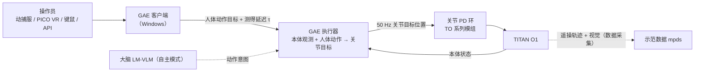

# TITAN O1（西湖机器人人形）

## 一句话定义

**TITAN O1** 是 [西湖机器人](./westlake-robotics.md) 2026-03-23 发布的首款全栈自研人形机器人（媒体亦称 **泰坦 o1**、**西湖 o1**，GAE 论文称 **Westlake O1**），官网定位「具身智能 全新载体」，出厂集成公司的全身动作模型 **GAE（身外化身）**，主打操作员穿动捕服即可让机器人实时同步全身动作。

## 英文缩写速查

| 缩写 | 英文全称 | 简要说明 |
|------|----------|----------|
| GAE | General Action Expert | 西湖机器人的「通用小脑」全身动作模型；TITAN O1 的默认运动控制 |
| DoF | Degrees of Freedom | 官网「总自由度（关节电机）29~69」，随配置（推测含灵巧手）变化 |
| TO-xxxx | （官网型号） | 自研关节模组型号，数字对应外径与规格；图片 alt 另写作 WR-80-140 |
| SMPL | Skinned Multi-Person Linear Model | GAE 统一人体动作的表示；O1 适配时以机器人比例代理骨架拟合 |
| VR | Virtual Reality | GAE 平台支持 PICO VR 第一人称遥操 |
| WAIC | World Artificial Intelligence Conference | 世界人工智能大会；2026-07 西湖 o1 参展（硬氪） |

## 为什么重要

- **「模型公司自造本体」的样本：** 西湖机器人自称机器人大脑公司，却在 2026 年推出自研人形，用于把 GAE 小脑与 LM-VLM 大脑在自家硬件上闭环（投资界 2026-07-10：「从底层算法到预训练模型再到硬件本体」）。
- **遥操作即产品：** 发布会核心演示不是自主任务，而是人→机全身实时映射与一对多群控，面向演艺、零售、教育、消防、矿山、高空检修等（自报场景）。
- **与 GAE 论文互证：** 论文 arXiv:2609.34233 在 O1 上做了真机迁移，可用来判断「一脑多形」的实际代价（需微调）。

## 发布与报道

| 日期 | 事件 | 来源 |
|------|------|------|
| **2026-03-23** | 正式发布泰坦 o1（杭州） | AIBase 2026-03-24（写明 3 月 23 日） |
| 2026-03-24 | 新华社 / CGTN：操作员穿动捕服挥手、转身、踢球，机器人「毫秒级」同步；王东林：「这些动作都是对操作员即兴动作的实时响应」；一人可操控多台 | CGTN（Xinhua） |
| 2026-03-24 | TechNode（据西湖大学稿）：已作为产品推出而非实验室原型，支持更广定制；场景教育、零售、演艺、公共安全、消防、矿山 | TechNode |
| 2026-07 | 西湖 o1 在商超上岗；参展 WAIC 2026 | 硬氪 2026-08-12 |
| 2026-09-28 | GAE 论文：G1 主实验 + O1 形态专用微调后迁移 | [GAE 论文页](./paper-gae-general-action-expert.md) |

AIBase 还报道 2026 年安徽卫视春晚 10 台机器人「五禽戏」与「一人可远程操控成百上千台」——发布在 TITAN O1 之前，报道未说明春晚所用机型，不能算 O1 的演示。

## 规格（官网图片内文字，自报）

| 项 | 数值 |
|----|------|
| 高 × 宽 × 厚（站立） | 1340 × 377 × 203 mm |
| 重量 | 34 kg |
| 总自由度（关节电机） | 29 ~ 69 |
| 膝关节最大扭矩 | 165 N·m |
| 单臂末端最大负载 | 3 kg |
| 结构特征 | 「MagTap 一触即连」背部快接模块（用途未写明）；头部为面罩式传感器窗口 |
| 未公开 | 价格、续航、算力平台、传感器型号、步速 |

### 自研关节模组（官网「超能关节 全栈自研 强劲动力」）

| 型号 | 尺寸 | 峰值转速 | 峰值转矩 | 质量 | 可能部位（推测） |
|------|------|----------|----------|------|------------------|
| TO-80140 | Φ80 × 64.5 mm | 160 rpm | 165 N·m | 1100 g | 膝 / 髋（与膝关节 165 N·m 对应） |
| TO-8088 | Φ80 × 61.5 mm | 186 rpm | 104 N·m | 1030 g | 髋 / 腰 |
| TO-5825 | Φ58 × 57 mm | 289 rpm | 31.12 N·m | 460 g | 肩 / 肘 |
| TO-4505 | Φ45 × 42.5 mm | 211 rpm | 6.3 N·m | 230 g | 腕 / 头 |

> 对照：[Unitree G1](./unitree-g1.md) 是 GAE 论文的另一真机平台（主实验）；两者的尺寸、关节扭矩与质量对比请以各自官方规格表为准（本库未归档 G1 规格表）。

## 核心原理：GAE 在 O1 上做什么

1. **输入是人体动作而非机器人轨迹：** GAE 执行器直接接收人体动作目标与本体观测，输出关节目标给低层 PD；部署无需在线重定向（[GAE 论文](./paper-gae-general-action-expert.md)）。
2. **延迟条件预判：** 执行器以端到端延迟 τ 为条件预判动作，这是「低时延的同频共振」宣传语的技术对应；论文 Hard 集预判 100 ms 时成功率 92.1%，误差略增。
3. **O1 需微调：** 论文中 G1 为主实验平台，O1 的迁移为「形态专用微调后」，不是零样本——「一脑多形」意味着同一预训练底座 + 每个本体一次适配。
4. **群控与远程：** GAE 平台支持单机遥操、远程遥操（媒体报道跨 1300 km）和群控部署；一人控多台时所有机器人执行同一动作流。
5. **自主模式：** 官网把 LM-VLM 作为大脑；O1 上自主任务（如「拿水」视频）由哪一模型驱动、是否遥操，页面未说明。

## 工程实践

| 场景 | 建议 |
|------|------|
| 评估遥操延迟 | 在同一绝对时间轴记录操作员动捕与机器人关节，分别测 0 预判和按实测延迟预判两档 |
| 群控演出 | 先确认网络抖动分布；GAE 预判只能估计动作趋势，不能消除丢包与突变 |
| 复现 / 对比 | 无官方代码；方法对照见 [GAE 论文页](./paper-gae-general-action-expert.md)，全身跟踪基线可用 [SONIC](../methods/sonic-motion-tracking.md) |
| 采购前 | 索取续航、算力、关节温升与价格；官网参数均为图片标注，无测试条件 |

## 局限与风险

- **规格全部自报：** 来自官网图片标注，无测试工况说明；「29~69」自由度区间未说明各配置构成。
- **演示以遥操为主：** 公开演示是人类实时驱动，不能直接推断自主操作能力。
- **无外感知闭环证据：** GAE 论文控制器不含 RGB / LiDAR 环境感知；复杂地形与避障需另外的上层模块。
- **命名不统一：** TITAN O1 / 泰坦 o1 / 西湖 o1 / Westlake O1 指同一本体（据发布时间与图片推断），检索时需全部覆盖。
- **价格与量产规模未披露。**

## 关联页面

- [西湖机器人（公司页）](./westlake-robotics.md)
- [GAE：General Action Expert（论文）](./paper-gae-general-action-expert.md)
- [傲天U1 四足机器人](./westlake-aotian-u1.md)
- [Unitree G1](./unitree-g1.md)
- [执行器驱动链选型闭环](../queries/actuator-drive-chain-selection-loop.md) — 读 TO 系列关节模组参数时的选型框架
- [遥操作](../tasks/teleoperation.md) · [人形运动](../tasks/humanoid-locomotion.md) · [运动重定向](../concepts/motion-retargeting.md)

## 参考来源

- [西湖机器人官网模块核查（TITAN O1 页参数与关节模组）](../../sources/sites/wlrobo-com.md)
- [发布与融资报道归档](../../sources/blogs/westlake_robotics_press.md)
- [GAE 论文归档](../../sources/papers/gae_general_action_expert_arxiv_2609_34233.md) · [GAE 项目页核查](../../sources/sites/gae-general-action-expert.md)
- CGTN / 新华社（2026-03-24）<https://news.cgtn.com/news/2026-03-24/Chinese-company-unveils-humanoid-robot-powered-by-GAE-model-1LLWTAAAv1C/p.html>
- TechNode（2026-03-24）<https://technode.com/2026/03/24/westlake-robotics-launches-titan-o1-humanoid-with-real-time-motion-imitation/>
- AIBase（2026-03-24）<https://news.aibase.com/zh/news/26491>

## 推荐继续阅读

- [TITAN O1 官网页](https://www.wlrobo.com/module2)
- [GAE 项目页（含 O1 迁移视频）](https://wangyf0928.github.io/gae-wlrobotics/)
