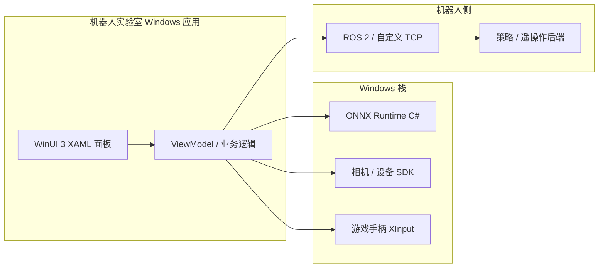
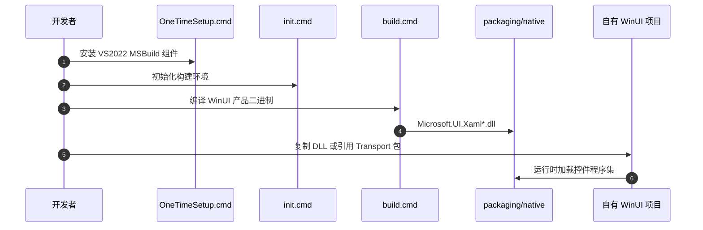

# WinUI

**WinUI**（[microsoft/microsoft-ui-xaml](https://github.com/microsoft/microsoft-ui-xaml)，文档 [Microsoft Learn](https://learn.microsoft.com/windows/apps/winui/winui3/)，稳定锚点 **WinAppSDK 2.4.0 / winui3/release/2.4.0**）是 **MIT** 开源的 **Windows 现代 UI 框架**：Fluent Design 控件集、主题与 XAML 基础设施，当前代 **WinUI 3** 随 **Windows App SDK** 发布，面向 **C# / C++** 桌面应用（x86、x64、ARM）。

## 一句话定义

在 Windows 10 1809+ 上用 **声明式 XAML + 原生控件** 构建高性能桌面界面；应用开发消费 **NuGet 预编译包**，本仓供源码构建、调试与长期 OSS 演进。

## 英文缩写速查

| 缩写 | 英文全称 | 简要说明 |
|------|----------|----------|
| WinUI | Windows UI | 本页框架：Fluent 控件与 XAML UI 层 |
| WASDK | Windows App SDK | WinUI 3 随其 NuGet 分发，统一现代 Windows API |
| UWP | Universal Windows Platform | WinUI 2 宿主；WinUI 3 面向桌面 Win32 打包应用 |
| XAML | eXtensible Application Markup Language | 声明式 UI 标记，与代码后置分文件 |
| Fluent | Fluent Design System | 微软设计体系：亚克力、动画、无障碍模式 |
| HMI | Human-Machine Interface | 机器人实验室操作员控制台/监控面板 |
| MIT | Massachusetts Institute of Technology License | 本仓开源许可 |

## 核心信息

| 字段 | 内容 |
|------|------|
| 机构 | 微软（Microsoft） |
| 类型 | Windows 桌面 UI 框架（控件 + XAML） |
| 版本锚点 | WinAppSDK **2.4.0**（2026-08-13，`winui3/release/2.4.0`） |
| 代码 | <https://github.com/microsoft/microsoft-ui-xaml>（分支 `winui3/main`） |
| 许可 | MIT |
| 开源结论 | **已开源**（可本地构建）；**外部代码 PR 暂不接受**（OSS 流程推进中） |

## 为什么对机器人栈重要

1. **Windows 工控机 HMI 的官方现代路径：** 许多实验室在 **Windows x64 工控机** 上跑策略推理（常配 [ONNX Runtime](./onnxruntime.md) C#）、相机 SDK 与手柄输入；WinUI 3 提供 **多窗格布局、实时图表、MediaPlayerElement 视频预览** 等原生控件，适合遥操作状态面板与数据采集前台——与 [Teleoperation](../tasks/teleoperation.md) 中「操作员能否看懂界面」的问题直接相关（参见 [非专家遥操作 GUI 论文笔记](./paper-notebook-intuitive-gui-for-non-expert-teleoperation-of-hu.md)）。
2. **与 Linux 输入栈分工：** Linux 侧 USB Xbox 手柄多经 [xpad](./xpad.md) 暴露 evdev；Windows 侧手柄走 XInput / `Windows.Gaming.Input`。WinUI 负责 **任务模式、参数、急停与可视化**，不替代底层 IO 框架（如 [RIO](./robot-io-rio.md)）。
3. **不是机器人中间件：** 勿把 WinUI 当作 ROS 桥、实时控制环或 XR 遥操作运行时；跨平台 XR 采数见 [XRoboToolkit](./paper-xrobotoolkit.md) 等专用栈。

## 核心原理

| 层 | 职责 |
|----|------|
| **应用** | C# / C++ WinUI 3 项目（打包或未打包桌面） |
| **WinUI 3 控件** | `Microsoft.UI.Xaml.Controls`：NavigationView、ListView、Chart 等 Fluent 控件 |
| **XAML 框架** | `dxaml/`：布局、资源、动画、输入路由 |
| **Windows App SDK** | 现代 API 与 WinUI 运行时 NuGet；与 Win32 互操作 |
| **系统** | Windows 10 1809+；部分系统 shell 体验亦基于 WinUI |

日常开发通过 Visual Studio 模板 + **Windows App SDK NuGet** 引用预编译 DLL；仅当需要调试框架本体或跟踪 OSS 进展时才 clone 本仓并按 `GettingStarted.md` 构建。

### 流程总览

### 源码运行时序图

主仓 **已开源**（MIT），可按 `init.cmd` → `build.cmd` 构建。下列时序对齐 `GettingStarted.md` 与 `Microsoft.UI.Xaml-Product.sln` 的本地构建路径（应用开发者通常跳过，直接用 NuGet）。

## 工程实践

| 场景 | 建议 |
|------|------|
| **新建 HMI** | Visual Studio「WinUI 3」模板 + Windows App SDK NuGet；先跑 [WinUI 3 Gallery](https://aka.ms/winui-gallery) 对照控件 |
| **机载推理同进程** | C# 侧引用 [ONNX Runtime](./onnxruntime.md)；UI 线程与推理线程分离，避免阻塞 50–1000 Hz 控制回调 |
| **视频预览** | `MediaPlayerElement` / `SwapChainPanel` + 相机 SDK；注意 GPU 与解码线程与 UI 调度 |
| **手柄遥操作** | 读 `Gamepad` / `RawGameController`；急停与模式切换放在 WinUI 可见控件，勿仅依赖隐藏热键 |
| **仅需稳定运行时** | **不要** fork 本仓——钉 WinAppSDK NuGet 版本（如 2.4.0）即可 |
| **贡献上游** | 截至入库日 README 标明 **尚未接受外部代码 PR**；issue / discussion 可走官方流程 |

## 局限与风险

- **平台绑定 Windows：** 无跨 macOS/Linux 桌面；与 [xpad](./xpad.md) 等 Linux 栈并列选型，而非替代。
- **OSS 贡献未完全开放：** 可构建源码，外部 patch 合并仍受限；跟踪 [Discussion #10700](https://github.com/microsoft/microsoft-ui-xaml/discussions/10700)。
- **实时性：** UI 框架不保证硬实时；毫秒级控制环应在 **C++ 本地服务或 ROS 节点** 内闭环，WinUI 只做监控与慢速指令。
- **WinUI 2 vs 3：** 旧 UWP 项目可能仍钉 WinUI 2（`winui2/main`）；新桌面 HMI 应默认 **WinUI 3 + Windows App SDK**。

## 与其他页面的关系

- [Teleoperation](../tasks/teleoperation.md) — 操作员界面与输入设备分层
- [ONNX Runtime](./onnxruntime.md) — 同栈 Windows 策略推理
- [paper-notebook-intuitive-gui-for-non-expert-teleoperation-of-hu](./paper-notebook-intuitive-gui-for-non-expert-teleoperation-of-hu.md) — 遥操作 GUI 设计原则参考
- [robot-io-rio](./robot-io-rio.md) — 跨形态 IO；WinUI 可作其 Windows 侧可视化壳
- [xpad](./xpad.md) — Linux 手柄驱动，与 Windows XInput 路径对照

## 推荐继续阅读

- [Build your first WinUI app](https://learn.microsoft.com/windows/apps/tutorials/winui-notes/) — 官方入门教程
- [WinUI 3 Gallery](https://aka.ms/winui-gallery) — 交互式控件样例
- [Windows App SDK](https://learn.microsoft.com/windows/apps/windows-app-sdk/) — WinUI 3 所在 SDK 全貌

## 参考来源

- [WinUI 源码归档（microsoft-ui-xaml）](../../sources/repos/microsoft-ui-xaml.md)
