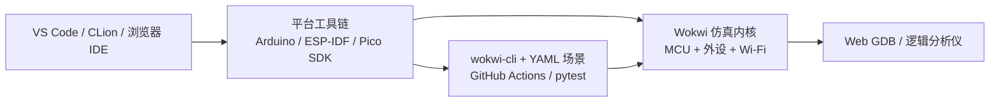

# Wokwi

**Wokwi**（[wokwi.com](https://wokwi.com/)）是面向 **MCU + 外围电路** 的 **在线电子仿真平台**：在浏览器里组装 Arduino、ESP32、STM32、Raspberry Pi Pico 与传感器/显示器/总线外设，运行真实工具链编译出的固件，并可选接入 Wi-Fi、GDB 与自动化测试。**它不是** MuJoCo / Isaac 类的机器人物理仿真器，而是机器人栈中 **嵌入式 bring-up、IoT 遥测原型与教学** 的轻量工具。

## 英文缩写速查

| 缩写 | 英文全称 | 简要说明 |
|------|----------|----------|
| MCU | Microcontroller Unit | 微控制器，执行固件闭环的片上处理器 |
| GDB | GNU Debugger | GNU 调试器，断点与变量检查 |
| I2C | Inter-Integrated Circuit | 两线串行总线，IMU/磁编等外设常用 |
| SPI | Serial Peripheral Interface | 四线串行外设总线 |
| UART | Universal Asynchronous Receiver-Transmitter | 异步串口，日志与 Bootloader 常用 |
| MQTT | Message Queuing Telemetry Transport | 轻量发布/订阅消息协议，IoT 遥测常用 |
| CI | Continuous Integration | 持续集成，自动化构建与测试流水线 |
| ESP-IDF | Espressif IoT Development Framework | 乐鑫官方 ESP32 开发框架 |

## 为什么重要

- **焊板前的协议冒烟**：I2C 地址冲突、UART 波特率、SPI 片选时序等问题可在仿真里先暴露，降低机器人底软集成返工。
- **与开源电机/人形生态对齐**：[SimpleFOC](./simplefoc.md) 支持的 Arduino / ESP32 / STM32 栈、[InMoov](./inmoov-humanoid.md) 的 Arduino 控制链、创客级舵机/传感器课程，都可在无硬件时复现核心外设交互。
- **ESP32 IoT 路径官方背书**：[ESP-IDF 文档](https://docs.espressif.com/projects/esp-idf/en/latest/esp32/third-party-tools/wokwi.html) 将 Wokwi 列为第三方仿真工具，并说明 VS Code、CLion、`wokwi-cli` 与 `pytest-embedded-wokwi` 工作流。
- **补「物理仿真管不了」的一层**：腿足 RL 的 [仿真器选型](../queries/simulator-selection-guide.md) 讨论的是刚体与接触；Wokwi 覆盖 **固件线程、外设寄存器语义与网络栈**——与 [处理器在环 Sim2Real](../concepts/processor-in-the-loop-sim2real.md) 目标相邻，但 fidelity 与搭建成本远低于全栈 PiL。

## 核心结构/机制

### 仿真对象分层

| 层 | Wokwi 覆盖 | 机器人语境 |
|----|------------|------------|
| **MCU 核** | AVR、Xtensa/RISC-V ESP32、ARM STM32、RP2040 | 关节板、遥测节点、接收机协处理器 |
| **片上外设 + 总线** | GPIO、PWM、ADC、I2C/SPI/UART 仿真 | IMU、磁编、舵机驱动、MSP/CRSF 等串口生态 |
| **板级元件库** | 传感器、OLED、LED 矩阵、SD 卡、逻辑分析仪探针 | 原型验证与教学演示 |
| **网络** | Wi-Fi 仿真（MQTT/HTTP/NTP） | 状态上报、远程调参、云端日志 |
| **刚体/接触** | **不覆盖** | 需 MuJoCo / Isaac / PyBullet 等物理引擎 |

### 开发与自动化链路

- **浏览器即用**：分享链接即可复现电路与固件，适合课程与 issue 复现。
- **本地 IDE**：VS Code 插件与 CLion 集成，保持与生产仓库相同的目录结构。
- **CI 回归**：`wokwi-cli` 跑场景、截图对比；ESP-IDF 侧可用 `pytest-embedded-wokwi` 接入官方测试框架。

### 与 Betaflight / PX4 的边界

[Betaflight](./betaflight.md) 等飞控固件面向 **STM32 飞控板真机烧录**；Wokwi 可仿真部分 STM32 与外设教学场景，但 **不能** 作为 FPV 飞控 SITL 或 PX4 动力学替代品。空中栈仿真仍见 [多旋翼栈总览](../overview/multirotor-simulation-planning-control-stack.md)。

## 常见误区或局限

- **误区：Wokwi = 机器人仿真器** — 无浮基动力学、接触力或关节 RL 环境；locomotion 训练应选 [MuJoCo](./mujoco.md) / [Isaac Lab](./isaac-lab.md) 等。
- **误区：Wi-Fi 仿真等于真机射频环境** — 协议栈可跑通，但延迟、丢包与天线遮挡与实物仍有差距。
- **局限：实时硬约束** — 不适合验证 EtherCAT DC、kHz 级全关节 CAN 同步等 **硬实时总线** 细节；该层见 [电机底软通信总览](../overview/motor-drive-firmware-bus-protocols.md)。
- **局限：商业授权** — 个人免费；团队 CI、高级调试与 Classroom 需付费计划。

## 参考来源

- [Wokwi 官网归档](../../sources/sites/wokwi-com.md)
- [Wokwi Docs](https://docs.wokwi.com/)
- [ESP-IDF：Wokwi 第三方工具](https://docs.espressif.com/projects/esp-idf/en/latest/esp32/third-party-tools/wokwi.html)

## 关联页面

- [电机驱动器底软通信协议总览](../overview/motor-drive-firmware-bus-protocols.md)
- [SimpleFOC](./simplefoc.md)
- [Betaflight](./betaflight.md)
- [InMoov](./inmoov-humanoid.md)
- [UART 串行通信](../concepts/uart-serial-communication.md)
- [处理器在环 Sim2Real](../concepts/processor-in-the-loop-sim2real.md)

## 推荐继续阅读

- [Wokwi — Supported Hardware](https://docs.wokwi.com/getting-started/supported-hardware)
- [GDB Debugging on Wokwi](https://docs.wokwi.com/gdb-debugging)
- [Wokwi for VS Code](https://docs.wokwi.com/vscode)
