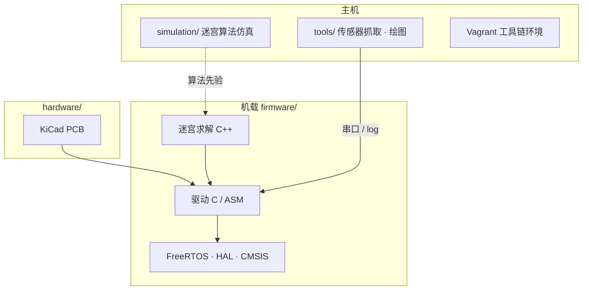

# WolfieMouse

## 一句话定义

**WolfieMouse**（[kbumsik/WolfieMouse](https://github.com/kbumsik/WolfieMouse)）是覆盖 **迷宫算法、STM32 底层驱动、KiCad PCB、传感器数据采集** 的竞赛级开源 Micromouse 工程，曾获 **2018 IEEE Region 1 Special Mention** 与 **2019 第 3 名**。

## 英文缩写速查

| 缩写 | 英文全称 | 简要说明 |
|------|----------|----------|
| STM32 | STMicroelectronics 32-bit MCU | 本项目机载主控族（F4 HAL / CMSIS） |
| HAL | Hardware Abstraction Layer | STM32 外设抽象层 |
| PCB | Printed Circuit Board | KiCad 原理图与版图 |
| OpenOCD | Open On-Chip Debugger | 烧录与调试 |
| FreeRTOS | Free Real-Time Operating System | 固件第三方库之一 |
| IEEE | Institute of Electrical and Electronics Engineers | Region 1 赛区主办方语境 |

## 为什么重要

- **竞赛全栈可对照**：相对 [UKMARSBOT](./ukmarsbot.md) 的入门模块化，WolfieMouse 展示「算法 + 实时驱动 + 自研板 + log 工具」一体仓库如何组织。
- **工具链完整**：Arm GCC + Makefile + OpenOCD，并提供 Vagrant，降低「只有 Windows 创客 IDE」的路径依赖。
- **硬件可读**：KiCad 工程与原理图/封装概览图在文档中，适合作为 [KiCad](./kicad.md) 在移动机器人上的案例。

## 核心结构/机制

| 目录 | 职责 |
|------|------|
| `firmware/` | 机载算法与驱动 |
| `simulation/` | 桌面迷宫测试（终端：M 鼠 / D 目标 / S 起点） |
| `hardware/` | KiCad 设计 |
| `tools/` | Python 传感器捕获与 Vagrant 辅助 |
| `doc/` | What-is-Micromouse、Get-started |

硬件基本布局灵感来自 Green Ye 的 [Project Futura](http://micromouseusa.com/?page_id=1342)。

## 工程实践

| 项 | 建议 |
|----|------|
| **阅读顺序** | `doc/What-is-Micromouse.md` → `doc/Get-started.md` → `simulation/` 再上真机 |
| **构建** | GNU Arm Embedded Toolchain + Make；调试用 OpenOCD |
| **无本地工具链时** | 使用仓内 Vagrant |
| **算法调试** | 先在 `simulation/` 验证搜索，再绑传感器噪声 |
| **开源状态（2026-07-27）** | **已开源**：固件/仿真有许可说明；PCB 公开；仓推送偏历史（约 2021）但仍具教材价值 |

## 局限与风险

- **维护节奏**：近年提交少，外设库版本与现行 STM32Cube 可能有代差，复现需自行对齐工具链。
- **许可拼盘**：`firmware/lib` 遵循各上游条款；再分发前读清 `firmware` / `simulation` 声明。
- **非入门第一站**：若尚未摸过差速与墙传感，优先 [UKMARSBOT](./ukmarsbot.md)。

## 关联页面

- [Micromouse](../concepts/micromouse.md)
- [UKMARSBOT](./ukmarsbot.md)
- [KiCad](./kicad.md)
- [A*](../methods/a-star.md)
- [PID Control](../methods/pid-control.md)

## 参考来源

- [sources/repos/wolfiemouse.md](../../sources/repos/wolfiemouse.md)
- [sources/sites/micromouseonline-com.md](../../sources/sites/micromouseonline-com.md)
- [kbumsik/WolfieMouse](https://github.com/kbumsik/WolfieMouse)

## 推荐继续阅读

- [WolfieMouse Get-started](https://github.com/kbumsik/WolfieMouse/blob/master/doc/Get-started.md)
- [Micromouse Online](https://micromouseonline.com/)
- [Algernon 远程调试演示](https://www.youtube.com/watch?v=nz4QlaSIkbY) — 另一条 ESP32 竞赛向调试路径
