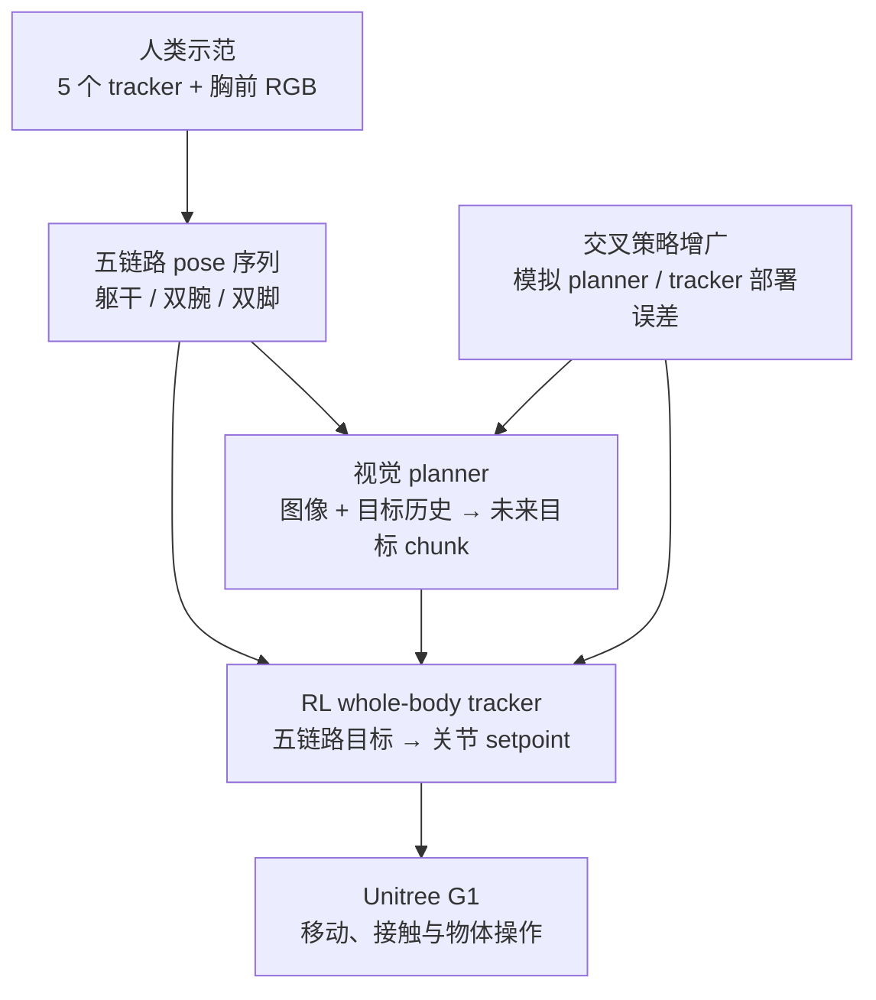

# Workhorse：从人类数据学习稳健全身移动操作

**Workhorse**（*Learning Robust Whole-Body Humanoid Loco-Manipulation from Human Data*，[arXiv:2610.09117](https://arxiv.org/abs/2610.09117)，[项目页](https://hybridrobotics.github.io/workhorse/)）的关键选择是让人体动作成为机器人学习的接口，而不是先把人体动作 retarget 成机器人关节轨迹。相同的人类五链路示范分别训练视觉 planner 和 RL whole-body tracker，再用相互模拟部署误差的数据增强缩小二者之间的能力差距。

## 一句话理解

**人体示范直接定义躯干、双腕、双脚目标；视觉策略规划这些目标，强化学习全身跟踪器把目标转成 G1 关节控制。**

## 英文缩写速查

| 缩写 | 英文全称 | 简要说明 |
|---|---|---|
| Loco-Manip | Loco-Manipulation | 行走和物体交互耦合的全身任务 |
| RGB | Red-Green-Blue | 视觉 planner 使用的 egocentric 图像 |
| RL | Reinforcement Learning | 训练跟踪五链路动作目标的全身控制策略 |
| WBC | Whole-Body Control | 由整身协调跟踪 link targets 的控制问题 |
| Hz | Hertz | planner 约 5 Hz replanning；底层 tracker 按近期目标 chunk 控制 |

## 数据与方法

### 人类数据采集

一名示范者佩戴 **5 个 tracker**（胸部、双手、双脚）并使用胸前相机记录动作。捕捉频率约 **60 Hz**；作者报告采集箱子分拣数据约 2.2 小时、行李箱任务约 1.2 小时、接物任务约 13 分钟。人体动作以五个刚体链路姿态表达：torso、left wrist、right wrist、left foot、right foot。机器人不需要动作捕捉式关节重定向；通过固定 per-link offset 把人体目标放到机器人可跟踪的几何关系上。

### 两策略结构

- **Visual planner：** 以机器人 egocentric 图像及过去约 1 秒五链路历史为条件，预测未来 **1.16 秒**的五链路目标；flow-matching planner 以约 **5 Hz** replanning。
- **Whole-body tracker：** 跟踪规划器输出的五链路 chunk，按时间戳读取下一段约 **0.2 秒**的目标并输出关节目标；planner 与 tracker 异步工作，已过期目标会跳过。
- **不做关节 retargeting：** 两个策略在同一人体姿态记录上分别训练，不先合成机器人关节轨迹标签。人体 link 的参考位置由固定 per-link offset 适配机器人。
- **跨策略误差增强：** tracker 训练期间随机加入最多约 10 cm 水平和 10° yaw 的漂移，模拟规划目标误差；planner 训练则扰动历史并将人从图像分割 / inpaint 后渲染机器人，以适应估计与 tracker 可实现范围不一致。

## 实验与结果

| 评测 | 论文报告 | 口径 |
|---|---:|---|
| G1 真机箱子分拣 | 自主完成 | 机器人用手放置箱子，并用脚把箱子踢入底层架 |
| G1 真机接物 | 自主接住抛掷箱子 | 真实机器人演示 |
| G1 行李箱交互 | 推动 14 kg 行李箱、将其翻倒并攀上 0.39 m 行李箱 | 真实机器人演示 |
| 模拟演示室分拣 | 77% success | 仿真 episode 成功率 |
| 模拟 + 扰动 | 64% success | 施加 40 N·s 推扰 |
| H2 模拟分拣 | 83% success | 同一示范重新训练；无推扰 |

## 代码与复现边界

官网称 code 尚未发布，且未找到可核验的官方 GitHub 仓库。论文的定量成功率来自模拟复刻演示室；真机条目是任务演示，不与仿真成功率混为一谈。论文指出流程需 tracker 数据采集、同步、图像处理与人体 link frame 设定。

## 与相关工作的区别

- 与 [MotionWAM](./paper-motionwam-humanoid-loco-manipulation-wam.md) 相比，Workhorse 的 planner 显式从 egocentric 图像规划未来 link targets，底层再由 RL tracker 执行；不能只因使用 flow matching 就把它等同于世界–动作模型。
- 相较机器人遥操作示范，Workhorse 将采集入口前移到人体 tracker 数据，但依然需要时间同步与机器人几何偏移设定。

## 关联页面

- [Loco-Manipulation](../tasks/loco-manipulation.md) — 人形移动操作任务入口。
- [Teleoperation](../tasks/teleoperation.md) — 对照机器人遥操作数据采集路线。
- [Unitree G1](./unitree-g1.md) — G1 真机实验平台。
- [MotionWAM](./paper-motionwam-humanoid-loco-manipulation-wam.md) — 可比的人类 / 视觉驱动移动操作路线。

## 参考来源

- [论文归档](../../sources/papers/workhorse_arxiv_2610_09117.md)
- [项目页归档](../../sources/sites/workhorse.md)
