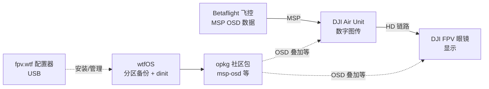

# wtfOS

**wtfOS**（[fpv-wtf/wtfos](https://github.com/fpv-wtf/wtfos)）是在 [margerine](https://github.com/fpv-wtf/margerine) root 之上、面向 **DJI 数字 FPV 眼镜与 Air Unit** 的 **社区固件改造框架**；通过 [fpv.wtf](https://fpv.wtf/) 配置器管理 root、安装与 **opkg 社区包**。与 [Betaflight](./betaflight.md)（飞控姿态环）和 [PX4](./px4-autopilot.md)（自主导航）处于 **不同层级**——负责 **HD 图传与 OSD 显示端**，不负责电机混控或 Offboard 任务。

## 英文缩写速查

| 缩写 | 英文全称 | 简要说明 |
|------|----------|----------|
| FPV | First Person View | 第一人称视角图传飞行 |
| OSD | On-Screen Display | 叠加在图传画面上的飞行数据（电量、高度等） |
| MSP | Multiwii Serial Protocol | Betaflight 与地面站/外设通信协议；msp-osd 包可将其 OSD 送入 DJI 图传 |
| ADB | Android Debug Bridge | root 后访问设备 Shell 与调试的 Android 调试桥 |
| OPKG | Open PacKaGe management | 嵌入式 Linux 常用轻量包管理器（wtfOS 官方源 pigeon） |
| HD | High Definition | 数字高清图传（相对模拟 5.8 GHz 模拟链路） |

## 为什么重要

- **数字 FPV 生态的「可拥有端」**：在 DJI 封闭固件上获得 **可扩展包管理与服务编排**，社区可发布 MSP OSD、音频、显示补丁等而不必逆向整包固件。
- **与手飞 FPV 飞控衔接**：代表包 [msp-osd](https://github.com/bri3d/msp-osd) 把 [Betaflight](./betaflight.md) 的 **MSP OSD** 叠加进 DJI 数字画面，补齐「飞控—图传」链路中 **显示层** 的选型知识。
- **防砖与可回退**：`wtfos-system` 在启动时用 **系统分区副本** 覆盖挂载，绑定向键开机可跳过修改回到可 ADB 状态；卸载流程可恢复纯 root 或移除 ADB（V1 设备）。
- 在多旋翼栈中区分 **飞控（Betaflight/PX4）** 与 **图传/眼镜（wtfOS）**，避免把图传改造当成飞控替代方案（见 [多旋翼栈总览](../overview/multirotor-simulation-planning-control-stack.md)）。

## 核心结构/机制

| 组件 | 说明 |
|------|------|
| **Root（margerine）** | 在受支持固件版本上获取特权；Goggles V2 等需特定 **V01.00.0606/0608**，否则先用 [butter](https://github.com/fpv-wtf/butter) 降级 |
| **wtfos-system** | 早期启动挂载 **系统分区备份**，降低改坏原厂分区风险 |
| **opkg + pigeon 源** | 社区 IPK 包；安装于 `/opt/`（链到 `/blackbox/wtfos/opt/`） |
| **dinit** | 带依赖的启动服务管理；包可注册 `/opt/etc/dinit.d/` unit |
| **wtfos-modloader** | 钩子式修改厂商服务行为 |
| **Configurator（fpv.wtf）** | Web UI：连接设备、包管理、Startup、CLI、OSD DVR 叠加 |

**支持设备（主线）**：Goggles V1/V2、Air Unit、Air Unit Lite（Caddx Vista / Runcam Link）。**O4、Goggles 2/Integra/3 暂无主线支持**；O3 部分能力见社区包 o3-multipage-osd。

## 常见误区或局限

- **误区：装了 wtfOS 就能改飞控 PID 或接 ROS** — wtfOS 运行在 **图传/眼镜 Android 侧**；姿态环仍在 [Betaflight](./betaflight.md)，自主任务仍在 [PX4](./px4-autopilot.md) + MAVSDK。
- **误区：所有 DJI 眼镜都支持** — **Goggles 2/3、Integra、O4 Air Unit** 不在主线计划内；购机前须查 [兼容表](https://github.com/fpv-wtf/wtfos#compatability)。
- **误区：DIY 菜单显示的固件版本可信** — Goggles V2 须在 **DJI FPV 模式** 下核对真实版本，否则可能误刷。
- **局限：法律与保修** — root 与改固件可能违反厂商条款并失去保修；研究/工程文档应单独评估合规与试飞安全。
- **局限：原生开发** — 社区二进制通常 target **android-23 / armeabi-v7a**，与桌面机器人栈工具链不同。

## 参考来源

- [sources/repos/wtfos.md](../../sources/repos/wtfos.md)
- [sources/sites/fpv-wtf.md](../../sources/sites/fpv-wtf.md)
- [fpv-wtf/wtfos](https://github.com/fpv-wtf/wtfos)
- [fpv.wtf 配置器](https://fpv.wtf/)

## 关联页面

- [多旋翼仿真—规划—飞控栈总览](../overview/multirotor-simulation-planning-control-stack.md)
- [Betaflight](./betaflight.md) — FPV 飞控与 MSP OSD 数据源
- [PX4 Autopilot](./px4-autopilot.md) — 自主飞控对照（非图传层）

## 推荐继续阅读

- [wtfOS Wiki](https://github.com/fpv-wtf/wtfos/wiki) — 安装排错与开发索引
- [Mad's Tech wtfOS 入门视频](https://www.youtube.com/watch?v=hNOA0kUjKhY) — 配置器全流程
- [D3VL：开发 wtfOS 包](https://d3vl.com/blog/developing-wtfos-packages/) — IPK 打包与发布
- [msp-osd](https://github.com/bri3d/msp-osd) — Betaflight MSP → DJI OSD 代表实现
