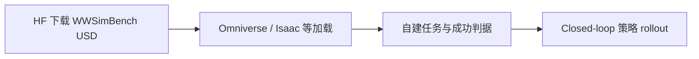

# WWSimBench（WuWen 仿真基准资产 · HF v0.1）

**WWSimBench**（[Hugging Face · Wuwen-AI/WWSimBench](https://huggingface.co/datasets/Wuwen-AI/WWSimBench)，README 称 **WuWen benchmark / WWBench**）是 **无问芯穹（Infinigence AI）** 公开的 **仿真评测用 3D 资产包**：以 **USD** 为主，覆盖 **线缆类插拔物体、铰链家电/办公设备** 与 **office / home / factory** 三套场景。README 描述完整 WWBench 含 **3K+ 刚体、60+ 铰链、软体与多类机器人任务**；当前 HF **Version 0.1** 以 **cable + hinged 子集 + 三场景** 落地（入库日约 **4.87 GB**），适合作为 **Omniverse / Isaac** 管线下 **sim-ready 环境层** 的外部资产源，而非自带任务 JSON 的 turnkey benchmark 仓。

## 一句话定义

**无问 WWBench 的公开仿真资产切片：用 USD 物体与场景支撑操纵—铰链—线缆—移动操作类 closed-loop 评测，需自建模拟器加载与任务协议。**

## 英文缩写速查

| 缩写 | 英文全称 | 简要说明 |
|------|----------|----------|
| WWBench | WuWen Benchmark | README 中的总基准/资产族名称 |
| USD | Universal Scene Description | 资产与场景的主要交换格式 |
| HF | Hugging Face | 数据集托管与下载入口 |
| Sim | Simulation | 仿真中加载资产做策略训练或评测 |
| VLA | Vision-Language-Action | 可在生成场景上评测的视觉-语言-动作策略 |

## 为什么重要

- **补齐「有资产、缺统一 runner」的长尾：** 与 [ESI-Bench](./esi-bench.md)（OmniGibson + JSON + API 运行器）或 [RoboDojo](./robodojo.md)（Isaac 统一栈）不同，WWSimBench **先开放 USD 内容**；团队若已有 [仿真评测基础设施](../concepts/simulation-evaluation-infrastructure.md)，可把其当作 **real-to-sim 资产库** 扩任务组合。
- **任务形态覆盖工业 relevant 长尾：** **线缆/医疗线束、铰链柜门、长程移动操作** 在通用 tabletop benchmark 中较少成体系出现；与 [EmbodiedGen V2](./paper-embodiedgen-v2-sim-ready-world-engine.md) 强调的 **sim-ready 环境层** 同一产业叙事（无问官网亦披露与地平线 EmbodiedGen **仿真评测** 合作）。
- **版本边界需显式：** README 的 **3K+ 刚体** 与 v0.1 目录 **不一致** — 选型时应以 **HF 树 + 版本号** 为准，避免按愿景规模规划算力与存储。

## 核心信息

| 字段 | 内容 |
|------|------|
| **机构** | 无问芯穹（Infinigence AI / Wuwen-AI） |
| **数据** | [Wuwen-AI/WWSimBench](https://huggingface.co/datasets/Wuwen-AI/WWSimBench) |
| **版本** | **0.1**（2026-09-27 左右更新于 HF） |
| **格式** | USD 物体 + 场景；部分含纹理子 USD |
| **v0.1 规模（快照）** | `cable_assets` **20** 件；`hinged_assets` 四类合计 **~100** 铰链类文件夹；`scenes/` **office · home · factory** |
| **代码** | **无** 官方 GitHub 评测仓（截至入库日） |
| **平台页** | [wuwen-ai.com](https://www.wuwen-ai.com/)（产品与评测体系说明） |

## 流程总览（资产 → 评测）

## 工程实践

| 项 | 说明 |
|----|------|
| **开源状态** | 数据集 **已发布**；评测协议与 leader board **未** 随仓开源 |
| **复现路径** | `huggingface-cli download Wuwen-AI/WWSimBench` → 挂载 `objects/`、`scenes/` → 定义 episode 初始位姿与成功条件 |
| **与 EmbodiedGenData** | 同属 **sim-ready 环境资产**；EmbodiedGen 偏 **生成管线 + URDF/MJCF 索引**，WWSimBench 偏 **WWBench 命名场景与线缆/铰链专项** |
| **源码运行时序图** | **不适用** — 无官方可运行训练/评测代码仓 |

## 常见误区或局限

- **误区：** 下载即得 **排行榜 + 固定 3081 题** 式 benchmark；当前仅有 **资产 + 简短 README**。
- **误区：** README **3K+ 刚体** 已全部在 v0.1 中；实际上 v0.1 以 **cable/hinged + 三场景** 为主，完整 WWBench 可能 **分阶段发布**。
- **局限：** **无** MIT/Apache 等许可证在 README 中明确列出（使用前请查阅 HF 仓最新 `LICENSE` 或联系发布方）。
- **局限：** USD 资产 **物理参数、关节限位、抓取 affordance** 需在模拟器内二次校验，不能假设「导入即 RL ready」。

## 与其他页面的关系

- [仿真评测基础设施](../concepts/simulation-evaluation-infrastructure.md) — 资产在 **闭环评测层** 的角色
- [EmbodiedGen V2](./paper-embodiedgen-v2-sim-ready-world-engine.md) — 同源产业 **生成式 sim-ready 环境** 对照
- [具身评测基准选型闭环](../queries/embodied-eval-benchmark-selection-loop.md) — 与 ESI / RoboBench 等 **分层选型**
- [Manipulation 任务](../tasks/manipulation.md) — 桌面与线缆类任务语境

## 推荐继续阅读

- [WWSimBench 数据集（Hugging Face）](https://huggingface.co/datasets/Wuwen-AI/WWSimBench)
- [无问芯穹官网 · Evaluation Standards](https://www.wuwen-ai.com/)
- [EmbodiedGenData（HorizonRobotics）](https://huggingface.co/datasets/HorizonRobotics/EmbodiedGenData) — 大规模 sim-ready 资产库对照

## 参考来源

- [WWSimBench 数据集归档](../../sources/datasets/wwsimbench.md)
- [无问芯穹平台页归档](../../sources/sites/wuwen-ai-platform.md)

## 关联页面

- [仿真评测基础设施](../concepts/simulation-evaluation-infrastructure.md)
- [EmbodiedGen V2](./paper-embodiedgen-v2-sim-ready-world-engine.md)
- [ESI-Bench](./esi-bench.md)
