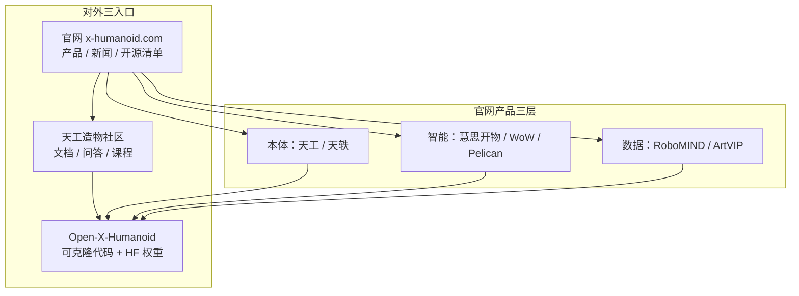

# X-Humanoid（北京人形机器人创新中心）

## 一句话定义

**X-Humanoid**（北京人形机器人创新中心 / Beijing Innovation Center of Humanoid Robotics）是面向人形机器人 **核心技术、产品与应用生态** 的创新中心：对外以 [x-humanoid.com](https://x-humanoid.com/) 做产品叙事，以 [天工造物开源社区](https://opensource.x-humanoid-cloud.com/) 做文档/问答/课程，以 GitHub **[Open-X-Humanoid](https://github.com/Open-X-Humanoid)** 发布可克隆代码与模型训练栈。

## 英文缩写速查

| 缩写 | 英文全称 | 简要说明 |
|------|----------|----------|
| VLA | Vision-Language-Action | 视觉-语言-动作策略；HEX / XR-1 主线 |
| VLM | Vision-Language Model | 视觉-语言模型；Pelican-VL 具身脑 |
| URDF | Unified Robot Description Format | 天工 Lite/Pro 仿真与规划描述 |
| SDK | Software Development Kit | 电机/IMU/力觉/相机等真机接口 |
| RL | Reinforcement Learning | TienKung-Lab 运控训练主范式 |
| AMP | Adversarial Motion Priors | Lab 中与周期步态奖励并用的风格先验 |
| Sim2Real | Simulation to Real | IsaacLab→MuJoCo→Deploy_Tienkung 落地链 |
| DoF | Degrees of Freedom | Lite≈20 / Pro 文档称最多≈42 |
| ROS | Robot Operating System | 天工底层软件与 3.0 SDK 示例基座 |
| HF | Hugging Face | 模型与 RoboMIND 等数据集托管 |

## 为什么重要

- **国内「中心制」开源人形样板**：硬件（URDF/STEP/手册）、运控（Isaac Lab）、数据（RoboMIND）、上层模型（Pelican / XR-1 / HEX）在同一品牌下分发，便于对照 [OpenLoong](./openloong.md)（公版机 + MPC/WBC）与商业闭源整机。
- **研究与工程可复现入口集中**：组织页约 **23** 个公开仓；明星仓 [TienKung-Lab](https://github.com/Open-X-Humanoid/TienKung-Lab)（IsaacLab + AMP locomotion）与 [HEX](https://github.com/Open-X-Humanoid/HEX)（全身 VLA）已有可运行训练/微调路径。
- **与本库已有论文页同源**：Heracles、Pelican-Unified、HEX（161#038）等机构署名均可回溯到本中心；本页作 **机构/生态 hub**，避免每个论文页重复维护入口表。

## 核心原理：三入口与产品三层

| 入口 | 适合做什么 | 主 URL |
|------|------------|--------|
| **官网** | 读产品定位、下载开源页列出的 URDF/图纸/手册入口 | [x-humanoid.com](https://x-humanoid.com/)、[opensource.html](https://x-humanoid.com/opensource.html) |
| **天工造物社区** | 查 Lite/Pro SDK 文档、课程、官方公告帖与开发者问答 | [opensource.x-humanoid-cloud.com](https://opensource.x-humanoid-cloud.com/) |
| **GitHub 组织** | clone 训练/部署代码；跟踪 stars 与 release | [github.com/Open-X-Humanoid](https://github.com/Open-X-Humanoid) |

官网首页把能力写成三条产品线：**通用机器人平台**（具身天工 / 天轶）、**通用具身智能平台**（「一脑多能 / 一脑多机」）、**通用数据服务平台**（采集–迭代–验证飞轮）。社区首页再把可开源资产收成生态索引：本体、RoboMIND、训练工具链、TienKung-Lab、ArtVIP、WoW、Pelican-VL、XR-1、BICMap。

## 开源仓库矩阵（工程向）

### 本体与底层

| 资产 | 入口 | 备注 |
|------|------|------|
| Lite/Pro 手册与 SDK PDF | [TienKung_Docs](https://github.com/Open-X-Humanoid/TienKung_Docs) + [文档中心](https://opensource.x-humanoid-cloud.com/plugin.php?id=zhanmishu_doc:index) | 社区文档称 Lite≈**20 DoF**、Pro 最多≈**42 DoF** |
| URDF / ROS | [TienKung_URDF](https://github.com/Open-X-Humanoid/TienKung_URDF)、[TienKung_ROS](https://github.com/Open-X-Humanoid/TienKung_ROS) | 官网开源页亦列 STEP 图纸与 SDK ZIP |
| 天工 3.0 示例 SDK | [xhumanoid_sdk](https://github.com/Open-X-Humanoid/xhumanoid_sdk) | **ROS 2 Jazzy**；需机载 `xos` 工作空间 |
| 真机部署 | [Deploy_Tienkung](https://github.com/Open-X-Humanoid/Deploy_Tienkung) | 由 TienKung-Lab README 链出 |

细节见独立实体页：[天工 Lite / Pro（开源人形）](./tienkung-humanoid-open-source.md)。

### 运控与 Sim2Real

| 资产 | 入口 | 备注 |
|------|------|------|
| IsaacLab 运控 | [TienKung-Lab](https://github.com/Open-X-Humanoid/TienKung-Lab) | Isaac Sim **4.5** / Lab **2.1**；AMP + 周期步态；Sim2Sim→MuJoCo；半程马拉松叙事 |
| MuJoCo / VLA 评测 | [xSIM_MUJOCO](https://github.com/Open-X-Humanoid/xSIM_MUJOCO)、[x-humanoid-vla-simulation-benchmark](https://github.com/Open-X-Humanoid/x-humanoid-vla-simulation-benchmark) | 并行仿真与评测 |

### 数据与训练工具链

| 资产 | 入口 | 备注 |
|------|------|------|
| RoboMIND | [项目页](https://x-humanoid-robomind.github.io/)、[HF 数据集](https://huggingface.co/datasets/x-humanoid-robomind/RoboMIND) | ≈**107k** 轨迹 / **479** 任务 / **96** 物体类 |
| LeRobot 适配 | [x-humanoid-training-toolchain](https://github.com/Open-X-Humanoid/x-humanoid-training-toolchain) | HDF5→LeRobot v2.1；天工操作训练 |
| ArtVIP | [x-humanoid-artvip.github.io](https://x-humanoid-artvip.github.io/) | 铰接物品数字资产（社区索引） |

### 具身模型

| 资产 | 入口 | 备注 |
|------|------|------|
| HEX | [Open-X-Humanoid/HEX](https://github.com/Open-X-Humanoid/HEX) | 全身 VLA；跨本体 body-part 对齐；索引页 [HEX（161#038）](./paper-loco-manip-161-038-hex.md) |
| XR-1（北京人形） | [Open-X-Humanoid/XR-1](https://github.com/Open-X-Humanoid/XR-1) | 统一视觉–运动表征 VLA；**勿与**小米 [Xiaomi-Robotics-1](./xiaomi-robotics-1.md) 混淆 |
| Pelican-VL | [pelican-vl](https://github.com/Open-X-Humanoid/pelican-vl) | 7B–72B 具身脑；统一 UEI 方法见 [Pelican-Unified](../methods/pelican-unified-1.md) |
| Robo-ValueRL | [Robo-ValueRL](https://github.com/Open-X-Humanoid/Robo-ValueRL) | 价值引导 offline→online；天工双臂真机 |
| WoW 世界模型 | [wow-world-model.github.io](https://wow-world-model.github.io/) | 社区生态索引；官网 Intelligent 产品线 |

模型权重多挂 [`huggingface.co/X-Humanoid`](https://huggingface.co/X-Humanoid)。

### 可视化

| 资产 | 入口 | 备注 |
|------|------|------|
| BICMap | [BICMap](https://github.com/Open-X-Humanoid/BICMap)、[文档](https://bicmap.x-humanoid-cloud.com/) | WebGL SLAM/点云/导航可视化；npm `@x-humanoid-cloud/bic-map` |

## 工程实践

1. **先定入口再下钻**：要规格与手册 → 社区文档中心 / `TienKung_Docs`；要训练代码 → `Open-X-Humanoid`；要品牌叙事 → 官网。不要只收藏微信转载网盘。
2. **运控最小路径**：按 TienKung-Lab README 安装 Isaac Lab → `pip install -e .` → `train.py --task=walk`；Sim2Sim 与真机见同仓 TODO / [Deploy_Tienkung](https://github.com/Open-X-Humanoid/Deploy_Tienkung)。
3. **操作 / VLA 最小路径**：RoboMIND + [x-humanoid-training-toolchain](https://github.com/Open-X-Humanoid/x-humanoid-training-toolchain) 转 LeRobot；或直接跟 HEX / XR-1 仓的预训练与微调说明。
4. **天工 3.0 机载开发**：`xhumanoid_sdk` 要求 Ubuntu 24.04 + ROS 2 Jazzy + 机载 `source ~/xos/setup.bash`，与 Lite/Pro 旧 ROS1 栈勿混用。
5. **跟踪渠道**：社区「精选博文」与问答分区（运动控制 / 数据集 / 本体）比仅盯 GitHub stars 更能捕捉文档勘误与课程更新。

## 局限与风险

- **多入口版本漂移**：官网产品名（天工 2.0 / 3.0）、Lite/Pro 文档 DoF、GitHub 仓名与历史 `x-humanoid-robomind` org 并存；选型时以**目标仓 README + 文档中心当前版**为准。
- **社区站反爬**：裸 HTTP 客户端可能只拿到反爬脚本；自动化抓取需可读代理或人工浏览器。
- **算力与硬件门槛**：TienKung-Lab / HEX / Robo-ValueRL 依赖高端 GPU 与（真机路径下）天工本体；「开源」不等于「低成本可复现」。
- **部分上层仍演进中**：如 XR-1 README 仍列「真机部署样例」TODO；Heracles 等论文页曾标代码 Coming Soon——以各项目页当日状态为准。
- **命名碰撞**：北京人形 **XR-1** ≠ 小米 **XR-1（Xiaomi-Robotics-1）**。

## 关联页面

- [天工 Lite / Pro（开源人形）](./tienkung-humanoid-open-source.md)
- [开源人形硬件方案对比](./open-source-humanoid-hardware.md)
- [OpenLoong（青龙·公版机）](./openloong.md)
- [人形机器人](./humanoid-robot.md)
- [Pelican-Unified 1.0](../methods/pelican-unified-1.md)
- [HEX（161#038）](./paper-loco-manip-161-038-hex.md)
- [Heracles](./paper-heracles-humanoid-diffusion.md)
- [机器人开源宝库（微信策展第01期）](../overview/robot-open-source-wechat-issue01-curator.md)
- [Sim2Real](../concepts/sim2real.md)
- [VLA](../methods/vla.md)

## 参考来源

- [sources/sites/x-humanoid.md](../../sources/sites/x-humanoid.md) — 官网与开源页
- [sources/sites/x-humanoid-opensource-cloud.md](../../sources/sites/x-humanoid-opensource-cloud.md) — 天工造物社区
- [sources/repos/open-x-humanoid.md](../../sources/repos/open-x-humanoid.md) — GitHub 组织矩阵
- [wechat_jixie_robot_open_source_treasury_issue01_10_robots.md](../../sources/blogs/wechat_jixie_robot_open_source_treasury_issue01_10_robots.md) — 微信策展入口

## 推荐继续阅读

- [Open-X-Humanoid 组织页](https://github.com/Open-X-Humanoid) — 按 stars / 更新时间扫仓
- [TienKung-Lab README](https://github.com/Open-X-Humanoid/TienKung-Lab) — IsaacLab 运控与部署链
- [天工造物文档中心](https://opensource.x-humanoid-cloud.com/plugin.php?id=zhanmishu_doc:index) — Lite/Pro SDK 与手册
