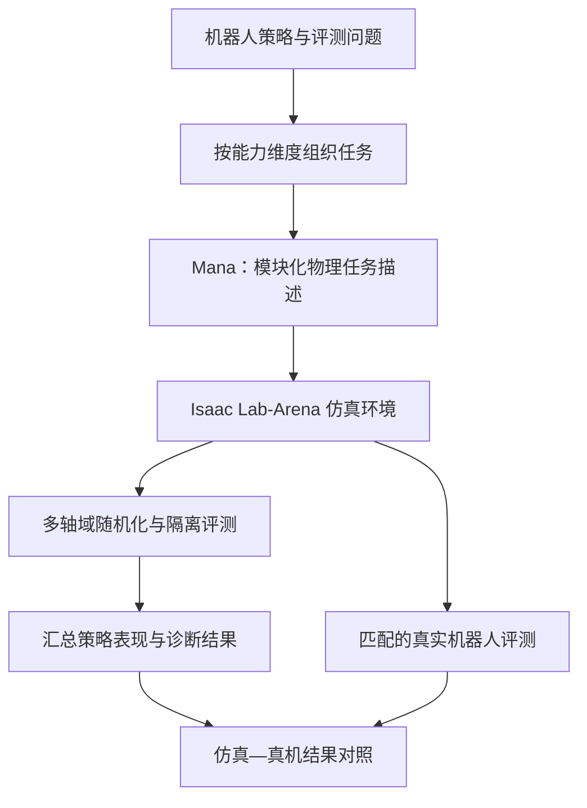
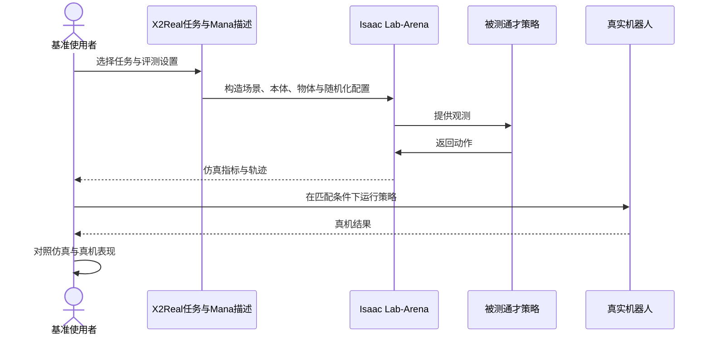

# X2Real 项目：通才机器人操作策略仿真基准

**X2Real** 是 X Square Robot（自变量机器人）提出的通才机器人操作策略评测项目。它希望让仿真中的策略比较更接近真实机器人表现，并通过可扩展任务和清晰的数据划分降低评测偏差。项目关联论文见 [X2Real 论文详情](./paper-x2real.md)。

## 项目定位

X2Real 是**评测基准与仿真生态**，不是一个可直接部署到机器人上的策略模型。论文将其建立在 NVIDIA Isaac Lab-Arena 上，围绕三项目标组织：

| 目标 | 项目关注点 | 阅读时应核对 |
|---|---|---|
| 保真度 | 校准仿真视觉与物理属性，使仿真评估更贴近真机 | 标定对象、机器人、任务范围和相关系数口径 |
| 多样性 | 10 个能力维度、44 个层级化长程操作任务 | 任务层次、能力覆盖及任务难度定义 |
| 公平性 | 多轴域随机化、严格分离训练与评测流程 | 测试任务、资产、随机种子是否与训练隔离 |

## 基准组成与流程

论文摘要称，任务覆盖基础操作以及视觉定位、语言理解、双臂控制等能力；Mana 物理领域专用语言用于模块化描述任务，并支持迭代分析。论文还报告近 300 小时的标注仿真轨迹。该轨迹集与 [公开静态资产集](../../sources/datasets/x2real-assets.md) 是不同资源。

### 一次评测的角色与信息流

> 图示是依据论文摘要整理的概念流程，不代表项目仓库中已经核实的具体 API、控制频率或部署命令。

## 论文报告的结果应如何理解

论文摘要报告仿真与真机评测结果的 **0.84 线性相关**。这是相关系数，不是“84% 成功率”。它描述论文实验中策略评测结果的关联程度，不应外推为任意任务、机器人、策略都能达到同样的 sim-to-real 预测效果。评测范围和实验口径以论文全文为准。

## 可获取资源与复现边界

- **项目页：** [x2robot.com/en/pages/x2real](https://x2robot.com/en/pages/x2real)
- **论文：** [arXiv:2609.27449](https://arxiv.org/abs/2609.27449)，提交日期 2026-09-23。
- **仿真静态资产：** [Hugging Face：x-square-robot/x2real-assets](https://huggingface.co/datasets/x-square-robot/x2real-assets)。页面列有 74,423 个文件、107 个分片、约 44.2 GB，覆盖 5 个板 / 设置和 73 个 ID case。完整资源解压还需额外磁盘空间。
- **代码状态：** Hugging Face 数据集卡列出了 GitHub 仓库 X-Square-Robot/x2real，但本次 GitHub API 查询返回 404；不能据此声称基准代码已经可访问。数据集卡中的许可字段也标为 TODO。
- **静态资产≠轨迹数据：** HF 仓库 README 明确表示它只包含静态仿真资产，不包含 LeRobot episodes、观测、动作、视频或轨迹；论文所述近 300 小时轨迹不应与该资产包混为一谈。

项目页本次未能被抓取工具读取，故链接作为官方入口保留；详细技术描述以上述 arXiv 摘要和公开资产卡片可核实的信息为界。

## 与论文节点的分工

- [X2Real 论文详情](./paper-x2real.md)：题录、论文主张、实验相关性以及结论边界。
- **本项目详情：** 基准的工程定位、组成模块、资源入口、使用路径与复现状态。

## 关联页面

- [Isaac Lab-Arena](./isaac-lab-arena.md) — 论文摘要所述仿真基座
- [Sim2Real](../concepts/sim2real.md) — 仿真评测与真机表现的关系
- [机器人操作](../tasks/manipulation.md) — 任务领域

## 参考来源

- [X2Real 项目页来源归档](../../sources/sites/x2real-project.md)
- [X2Real Simulation Assets 数据集归档](../../sources/datasets/x2real-assets.md)
- [X2Real 论文来源归档](../../sources/papers/x2real_arxiv_2609_27449.md)
