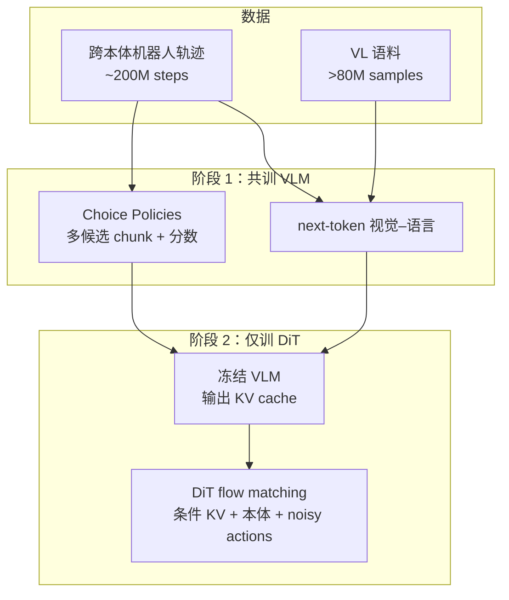
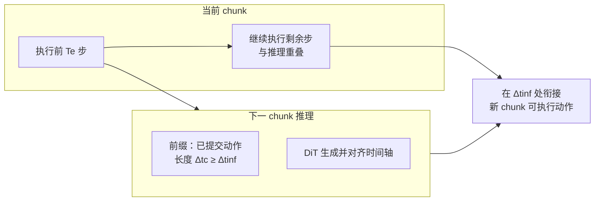

# Xiaomi-Robotics-0

**Xiaomi-Robotics-0** 将 **预训练 VLM（Qwen3-VL-4B-Instruct）** 与 **扩散式 Transformer 动作头（DiT）** 组合成端到端 **VLA**：图像 + 自然语言 + **本体状态** 条件化，输出 **固定长度动作 chunk**。项目强调的不只是仿真榜单，而是 **大模型推理延迟** 下仍能 **边算边动** 的工程化 **异步 chunk 执行** 与配套后训练技巧。

## 一句话定义

用 **冻结 VLM 的 KV 特征** 驱动 **flow-matching DiT** 生成连续动作块，并通过 **前缀条件 + 专门注意力与损失设计** 缓解异步 rollout 时的 **时序捷径** 与 **chunk 边界抖动**。

## 为什么重要

- **把「VLA 延迟」写进训练目标**：同步执行时机器人需等推理结束，异步执行则引入 **跨 chunk 一致性** 与 **模型抄近路模仿前缀** 等新问题；该工作把相关对策与部署对齐（时间戳、Δtc、Te 等）写清楚，便于和通用 I/O 栈（如 [RIO（Robot I/O）](./robot-io-rio.md)）对照阅读。
- **开源权重 + 推理代码 + 后训练管线**：降低复现「从论文到可跑推理」的摩擦；官网亦宣传完整后训练链路（如耳塞入盒等案例）。
- **数据叙事可对照行业路线**：**~200M** 机器人步 + **>80M** VL 样本、房内 **数百小时** 遥操作与公开数据集混用，代表 **「防 VLM 遗忘 + 机器人-centric 视觉」** 的典型配方。

## 核心结构

| 模块 | 作用 |
|------|------|
| **VLM 骨干** | Qwen3-VL-4B：处理多相机图像与指令；阶段 1 扩展可学习 action / score token，阶段 2 仅输出 **KV cache** 条件 DiT（论文述输入不再含阶段 1 的动作预测 token）。 |
| **动作头** | 16 层 DiT，**flow matching** 生成 **T** 步动作；**sink token** 稳定注意力；**Beta** 采样 flow 时间步以侧重高噪声段。 |
| **阶段 1 监督** | **Choice Policies**：多候选 chunk + 打分，**L1** 选优 **winner-take-all**；与 VL **next-token** 任务 **1:6** 混训。 |
| **阶段 2 监督** | 冻结 VLM，全量机器人轨迹上 **flow-matching**；VLM 后 16 层 KV 注入 DiT（论文细节以 PDF 为准）。 |
| **后训练** | 任务数据上继续训练；**异步**设定下引入 **干净动作前缀**、**Λ 形 mask**、**前缀随机 mask**、**按在线 L1 误差重加权** 等。 |
| **部署** | **5** 步 flow 积分；多相机与本体 **重采样到 30Hz** 对齐；异步时保证 **Δtc ≥ Δtinf**，新 chunk 从 **Δtinf** 时刻对齐执行。 |

## 流程总览（预训练）

## 流程总览（异步 rollout）

## 常见误区或局限

- **误区：仿真 SOTA 自动等于真机即插即用。** 论文在真机部分聚焦特定双臂任务与自有数据分布；迁移到新硬件仍需标定、同步与安全层。
- **误区：异步只是工程开关。** 若训练仍按「停–等–再推理」分布，部署开异步会 **分布偏移**；该工作明确 **后训练阶段** 与 **前缀 / 掩码 / 损失** 针对异步设定。
- **局限：** 延迟数字（如 **80ms @ 4090**）与 **5** 步积分均为 **报告配置**；换 GPU、TensorRT、量化或更短 chunk 时需自行复测。

## 关联页面

- [VLA（Vision-Language-Action）](../methods/vla.md) — 方法总览与同类开源路线对照
- [Action Chunking](../methods/action-chunking.md) — chunk 边界、缓冲与异步消费的经典问题语境
- [Diffusion Policy](../methods/diffusion-policy.md) — 连续动作扩散 / flow 与机器人控制结合
- [Teleoperation（遥操作）](../tasks/teleoperation.md) — 房内大规模示教采集的工程参照
- [Manipulation（操作）](../tasks/manipulation.md) — 桌面与 deformable 物体操作任务语境
- [RIO（Robot I/O）](./robot-io-rio.md) — 跨形态实时 I/O 与异步策略节点的另一种抽象

## 参考来源

- [Xiaomi-Robotics-0 仓库与论文归档](../../sources/repos/xiaomi-robotics-0.md)
- Cai et al., *Xiaomi-Robotics-0: An Open-Sourced Vision-Language-Action Model with Real-Time Execution*, [arXiv:2602.12684](https://arxiv.org/abs/2602.12684)
- [Robotics @ Xiaomi 项目说明](https://robotics.xiaomi.com/xiaomi-robotics-0.html)
- [XiaomiRobotics/Xiaomi-Robotics-0（GitHub）](https://github.com/XiaomiRobotics/Xiaomi-Robotics-0)

## 推荐继续阅读

- Black et al., *π₀: A Vision-Language-Action Flow Model for General Robot Control* — flow-matching VLA 相近动作建模脉络
- Kim et al., *OpenVLA: An Open-Source Vision-Language-Action Model* — 跨基准评测与开源生态对照
- [Physical Intelligence openpi](https://github.com/Physical-Intelligence/openpi) — π 系后训练与部署常用参考栈（与小米 README 自洽比对）
