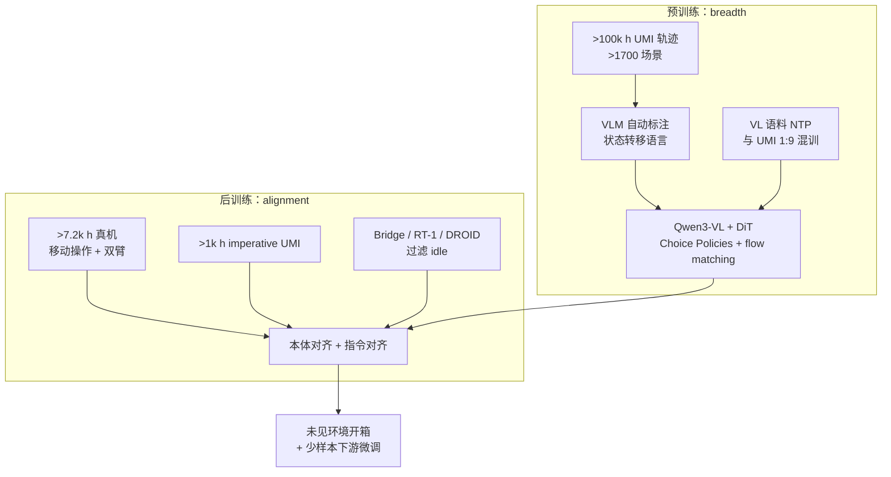

# Xiaomi-Robotics-1

**Xiaomi-Robotics-1**（官网代号 **XR-1**）是小米机器人实验室 2026 年 7 月发布的 **大规模具身基座 VLA**：用 **embodiment-free UMI 预训练** 打破机器人真机遥操作的数据瓶颈，再用 modest 的 **跨本体后训练** 把「状态转移描述 → 动作」的能力对齐到 **真实机器人本体与自然语言指令**。论文/项目页的核心主张是：机器人策略也能像 LLM/VLM 一样，在 **数据、参数量与算力** 上呈现 **尚未饱和的 scaling law**，且预训练阶段的收益 **直接迁移** 到后训练开箱表现。

## 一句话定义

**在 10 万小时 UMI 真实操作轨迹上预训练 Qwen3-VL + DiT flow-matching VLA，用 VLM 自动标注的状态转移语言作条件，再经跨本体后训练对齐 imperative 指令与真机 embodiment，使未见环境开箱成功率与少样本新任务适配随预训练规模可预测提升。**

## 英文缩写速查

| 缩写 | 英文全称 | 简要说明 |
|------|----------|----------|
| VLA | Vision-Language-Action | 视觉-语言-动作统一策略模型 |
| UMI | Universal Manipulation Interface | 手持夹爪 + 腕部相机的无机器人示范采集范式 |
| VLM | Vision-Language Model | 视觉-语言多模态模型，本工作用于骨干与自动标注 |
| DiT | Diffusion Transformer | 以 Transformer 为骨干的扩散/流匹配动作生成头 |
| MoT | Mixture-of-Transformers | VLM 与 DiT 耦合、共享训练目标的架构族 |
| SOTA | State of the Art | 当前最优水平 |

## 为什么重要

- **把机器人数据瓶颈改写成「可 scale 的 UMI 预训练」：** 真机 teleop 慢、贵、任务分布窄；**>100k h** 跨 **>1,700** 场景的 UMI 轨迹 + **两周级 VLM 自动标注**，给出一条与 LLM 预训练同构的 **「先 breadth、后 alignment」** 路线。
- **Scaling 证据链完整：** 预训练验证 **MSE** 随 **UMI 子集 12.5%→100%** 与 **2B→10B** 单调改善；后训练在 **未见环境/物体** 上，更强预训练 checkpoint → **更高开箱成功率**（无 action 预训练 **26%** vs **100% 20k h 预训练 75%** 量级）。
- **与 [Xiaomi-Robotics-0](./xiaomi-robotics-0.md) 形成谱系对照：** 同为 **Qwen3-VL + DiT + Choice Policies**；**XR-0** 主打 **~4.7B 异步 chunk 实时部署**，**XR-1** 主打 **100k h UMI scaling 与移动操作基座**；少样本微调实验中 XR-1 亦对照 **XR-0** 与 **π₀.₅**。
- **与 [Xiaomi-Robotics-U0](./xiaomi-robotics-u0.md) 互补：** **38B 合成 WM** 可增广视觉分布，**XR-1** 负责 **大规模真实接触轨迹上的 action prior**——同实验室「合成 + 真实 scaling」双轨。

## 核心结构

| 模块 | 作用 |
|------|------|
| **VLM 骨干** | **Qwen3-VL** 编码观测与语言；**Choice Policies** 在 VLM 内预测 **K 个候选 action chunk + 分数**，winner-take-all **L1** 选优，加速 DiT 学习。 |
| **DiT 动作头** | 层数对齐 VLM、hidden 更小；条件于 **本体状态 + VLM KV（仅语言/视觉 token，排除 action token）**，**flow matching** 生成 chunk；推理 **5 步 Euler**（Δτ=0.2）。 |
| **预训练数据** | **>100k h** UMI；**Qwen3.5-27B** 对固定长度片段标注 **夹爪/物体状态转移** 自然语言。 |
| **后训练数据** | **~10k h**：**>7,200 h** 移动操作/双臂真机 + **>1k h** imperative 标注 UMI + 过滤 **Bridge V2 / RT-1 / DROID**。 |
| **规模变体** | **2.6B / 5.1B / 10.5B**（VLM **2.1B / 4.4B / 8.8B** + DiT **470M / 604M / 1.5B**）。 |
| **预训练损失** | \(L_{\text{Flow}} + L_{\text{Regression}} + 0.1 L_{\text{NTP}}\)；VL : UMI 采样 **1:9**。 |

## 流程总览（预训练 → 后训练）

## 关键结果（项目页 / 技术报告）

| 维度 | 要点 |
|------|------|
| **预训练 scaling** | **~20k h** UMI 子集上，数据 **12.5%→100%**、模型 **2B→10B**，验证 action **MSE** 单调下降；**50%+** 数据时过拟合风险明显降低。 |
| **后训练开箱** | 四任务（鞋柜/书包/桌面/沙发）；**10B + 100% 20k h 预训练** 总成功率约 **79%**；**2B→10B** 后训练成功率 **61%→79%**。 |
| **少样本微调** | 四灵巧任务（phone packing、printer refilling、laundry loading、box packing）；**<10 h/任务** 平均成功率 **75%** vs **π₀.₅ 40%**；**<40 h/任务** **85%** vs **53%**。 |
| **仿真基准** | RoboCasa **74.5%**、RoboCasa365 **57.4%**、VLABench **59.1%**、RoboDojo **13.93**（官网 leaderboard 表，2026-07-15）。 |
| **长程真机** | 项目页展示 **>10 min** 房间级 **行李箱打包** 未剪辑视频。 |

## 常见误区或局限

- **误区：100k h 等于「全是真机 teleop」。** 预训练主体是 **UMI 无机器人轨迹**；**>7.2k h** 真机集中在 **后训练 alignment**，二者语言条件形式不同（**状态转移 vs imperative**）。
- **误区：仿真 SOTA 自动等于任意硬件即插即用。** 开箱评测强调 **未见环境/物体实例**；新 embodiment 仍需后训练或微调与安全层。
- **局限：** 截至 ingest 时 **代码与权重尚未发布**（项目页声明将陆续开源）；技术报告 arXiv 编号待公开；与 **XR-0** 的 **异步 RTC 后训练** 细节以各自文档为准。

## 关联页面

- [VLA（Vision-Language-Action）](../methods/vla.md) — 方法总览与 scaling 路线对照
- [Teleoperation（遥操作）](../tasks/teleoperation.md) — UMI 无机器人采集与真机示教的后训练衔接
- [Manipulation（操作）](../tasks/manipulation.md) — 桌面/移动操作与少样本灵巧任务语境
- [Loco-Manipulation（移动操作）](../tasks/loco-manipulation.md) — 移动操作基座与房间级长程任务
- [Diffusion Policy](../methods/diffusion-policy.md) — flow matching / DiT 连续动作生成
- [Xiaomi-Robotics-0](./xiaomi-robotics-0.md) — 同族开源 VLA，侧重 **实时异步 chunk 部署**
- [Xiaomi-Robotics-U0](./xiaomi-robotics-u0.md) — 同实验室 **38B 具身合成 WM**

## 参考来源

- [Xiaomi-Robotics-1 项目页与技术报告归档](../../sources/sites/xiaomi-robotics-1.md)
- Xiaomi Robotics, *Xiaomi-Robotics-1: Scaling Vision-Language-Action Models with over 100K Hours of Real-World Data*, [arXiv preprint（项目页 BibTeX）](https://robotics.xiaomi.com/xiaomi-robotics-1.html)
- [技术报告 PDF](https://robotics.xiaomi.com/robot-static-resource/xiaomi-robotics-1/xiaomi-robotics-1.pdf)
- [Robotics @ Xiaomi — XR-1 说明页](https://robotics.xiaomi.com/xiaomi-robotics-1.html)

## 推荐继续阅读

- Black et al., *π₀.₅: a Vision-Language-Action Model with Open-World Generalization* — XR-1 少样本与仿真对照基线
- Chi et al., *Universal Manipulation Interface: In-The-Wild Robot Teaching Without In-The-Wild Robots* — UMI 采集范式原文
- [Physical Intelligence openpi](https://github.com/Physical-Intelligence/openpi) — π 系微调协议与开源权重生态
