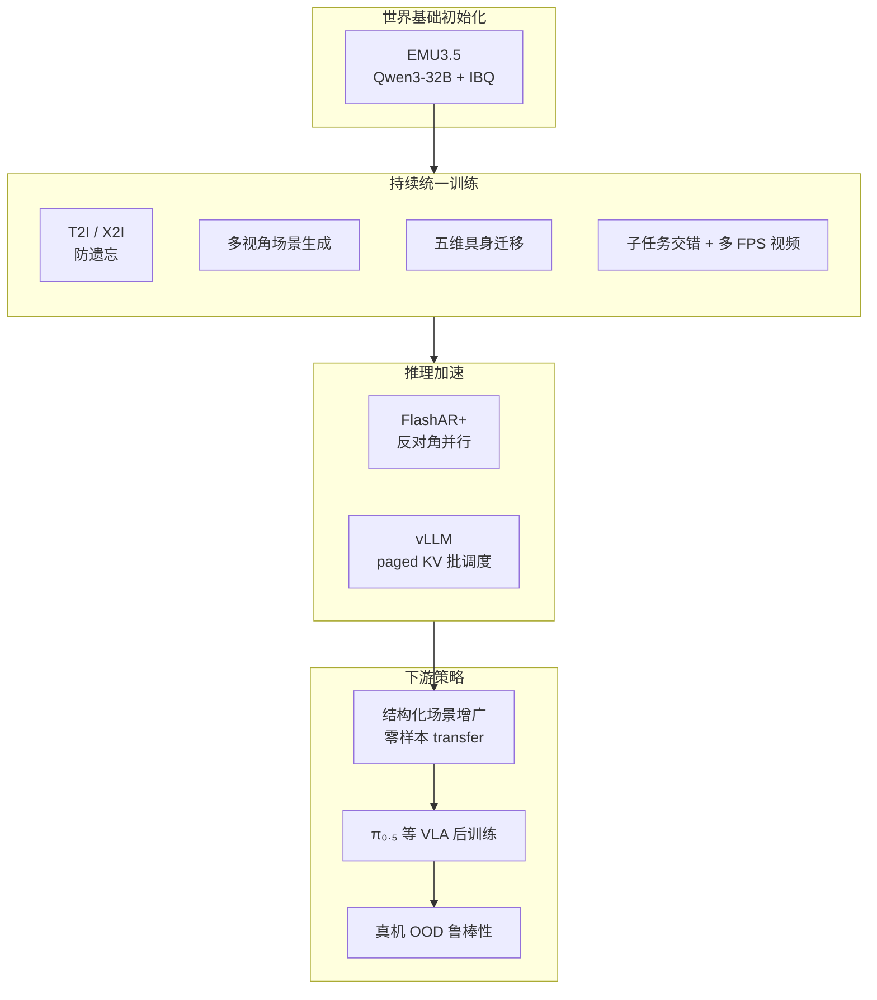

# Xiaomi-Robotics-U0

**Xiaomi-Robotics-U0**（[arXiv:2607.11643](https://arxiv.org/abs/2607.11643)，[官网](https://robotics.xiaomi.com/xiaomi-robotics-u0.html)，[GitHub](https://github.com/XiaomiRobotics/Xiaomi-Robotics-U0)）是小米机器人实验室发布的 **38B 统一具身合成世界基础模型**：不把 foundation 图像生成「专门化成」窄域机器人生成器，而是在 **同一自回归 next-token 目标** 下 **继续共训** 通用 **T2I / X2I** 与 **多视角具身场景、结构化迁移、操纵视频**，把 **世界基础模型的语义与可控性** 迁移到机器人-centric 观测合成，并作为 **可扩展下游策略数据引擎**。

## 一句话定义

**一个 38B 离散 token 自回归模型：把 foundation 文生图/编辑与多视角具身场景、五维可控迁移、多 FPS 视频 rollout 压进同一 NTP 训练，再用 FlashAR+ 把工程延迟拉到可部署，用合成场景增广真机 VLA 的 OOD 鲁棒性。**

## 英文缩写速查

| 缩写 | 英文全称 | 简要说明 |
|------|----------|----------|
| WM | World Model | 预测环境动态或合成观测的模型 |
| T2I | Text-to-Image | 文本条件单图生成 |
| X2I | Anything-to-Image | 多参考图 + 文本的编辑/生成 |
| AR | Autoregressive | 自回归逐 token 解码 |
| VLA | Vision-Language-Action | 视觉-语言-动作策略模型 |
| FPS | Frames Per Second | 视频帧率；U0 训练 1/3/5 FPS 多档 |

## 为什么重要

- **「只后训机器人轨迹」会吃掉 foundation 泛化：** 论文明确对比：窄域持续微调削弱互联网视觉先验。U0 用 **T2I/X2I 与具身任务共训** 缓解灾难性遗忘，使模型既能 **WorldArena 级视频生成**，又保留 **通用编辑** 能力。
- **多视角一致性是具身生成的硬门槛：** 相对 **GPT-Image-2** 单视角高分但 **跨视角几何冲突**，U0 强调 **统一 3D 布局** 下的多相机 RGB/深度一致——这是把生成结果喂给 **策略 / 仿真** 的前提。
- **结构化迁移 = 可组合数据增广：** 将场景解耦为 **workspace / background / foreground irrelevant / target objects / lighting** 五维，可 **指数级组合** 新场景而不动机器人位姿与交互状态；真机实验证明 **π₀.₅** 在换桌布/光照干扰下 **完成度 +26.3 pts**。
- **与 [Xiaomi-Robotics-0](./xiaomi-robotics-0.md) 形成「WM + VLA」闭环：** 同实验室 **4.7B 实时 VLA** 负责控制，**38B WM** 负责 **想象与合成训练数据**——对齐行业「大模型分工」趋势。
- **与 [Xiaomi-Robotics-1](./xiaomi-robotics-1.md) 并列：** **XR-1** 用 **>100k h 真实 UMI** 建 **action prior scaling**，**U0** 用 **38B 合成 WM** 扩 **视觉 OOD**——同生态「真实轨迹 breadth + 合成增广」双轨。

## 核心结构

| 模块 | 作用 |
|------|------|
| **骨干初始化** | 开源 **EMU3.5**（**Qwen3-32B** decoder + 大规模图文交错预训练）。 |
| **图像 tokenization** | **IBQ** tokenizer，**16×16** 空间压缩；扩展词表统一文本/图像/控制 token。 |
| **单步生成** | **T2I**、**X2I**（1–3 参考图）、**Embodied Scene Generation**（本体 + 描述 → 多视角初始帧）、**Embodied Transfer**（多视角深度 + 编辑描述 → 多视角 RGB）。 |
| **序列生成** | **子任务–子目标图文交错**；**1 / 3 / 5 FPS** 操纵视频（稀疏规划 vs 稠密接触）。 |
| **数据规模** | 单步 **9.5M 样本（56.4B tokens）**；序列 **2.6M clip（49.6B tokens）**；六域异构 + **Qwen3-VL-235B** 统一标注。 |
| **FlashAR+** | 目标图像区 **反对角并行解码**；前缀条件保持 **step-causal**；**H/V 门控融合** + 蒸馏；叠 **vLLM** 批调度。 |
| **下游用法** | **零样本 structured transfer** 扩展示教视觉覆盖；与 **π₀.₅** 等 VLA **后训练增广**（论文报告干扰组 **36.9%→63.2%**）。 |

### 能力四象限（官网 / 论文）

| 能力 | 输入 → 输出 | 要点 |
|------|-------------|------|
| **I 多视角场景生成** | 语言 + 机器人本体 → 多视角初始观测 | 人类评测整体优于 GPT-Image-2（Easy **62%** / Hard **68.5%** win rate，项目页） |
| **II 可控具身迁移** | 原场景多视角 + 五维编辑 → 迁移后多视角 | 五维独立重组；Easy **82%** / Hard **79.3%** win rate |
| **III 具身视频** | 初始帧 + 语言 (+ 动作 mask) → 未来帧序列 | **WorldArena #1**（EWMScore_P **73.64**）；可接场景生成做 **Language→Scene→Video** 闭环 |
| **IV 通用 T2I & X2I** | 文本 / 指令编辑 | 保留 foundation 视觉合成与编辑，防窄域退化 |

## 流程总览（训练 → 合成 → 策略增广）

## 常见误区或局限

- **误区：WorldArena 第一等于真机策略即插即用。** U0 真机实验是 **视觉域增广 + 固定 π₀.₅ 后训练**；新任务、新本体、新动作空间仍需自有示教与标定。
- **误区：38B AR 已实时。** **FlashAR+** 大幅降延迟，但 **全序列视频 rollout** 仍远重于物理引擎；适合 **离线/近线数据合成**，而非 1kHz 控制回路。
- **误区：与 τ₀-WM 同类。** [τ₀-WM](./tau0-world-model.md) 是 **5B Joint WAM（视频扩散 + action chunk + 测试时 revise）**；U0 是 **更大规模的统一生成基础模型**，**不内置策略头**，侧重 **观测合成与数据引擎**。
- **局限：** GitHub 仓在 ingest 时仍为 **早期公开**（权重/推理细节以官方更新为准）；**GPT-Image-2** 等基线随版本迭代，数字需回查论文版本。

## 关联页面

- [Generative World Models（生成式世界模型）](../methods/generative-world-models.md) — 像素/token 视频 WM 方法谱系与 U0 定位
- [Xiaomi-Robotics-0](./xiaomi-robotics-0.md) — 同实验室开源 **VLA**；异步 chunk 部署与 U0 数据增广互补
- [Video-as-Simulation](../concepts/video-as-simulation.md) — 生成视频作仿真/增广的动机与风险
- [Manipulation（操作）](../tasks/manipulation.md) — 耳塞入盒 / 折毛巾 / 装箱等真机评测任务语境
- [τ₀-World Model（τ0-WM）](./tau0-world-model.md) — Joint 视频–动作 WM 对照（策略一体 vs 生成基础）
- [EWMBench](./ewmbench.md) — 具身视频 WM 评测框架；WorldArena 同生态榜单

## 参考来源

- [Xiaomi-Robotics-U0 仓库与论文归档](../../sources/repos/xiaomi-robotics-u0.md)
- [arXiv:2607.11643 论文摘录](../../sources/papers/xiaomi_robotics_u0_arxiv_2607_11643.md)
- Li et al., *Xiaomi-Robotics-U0: Unified Embodied Synthesis with World Foundation Model*, [arXiv:2607.11643](https://arxiv.org/abs/2607.11643)
- [Robotics @ Xiaomi 项目说明](https://robotics.xiaomi.com/xiaomi-robotics-u0.html)
- [XiaomiRobotics/Xiaomi-Robotics-U0（GitHub）](https://github.com/XiaomiRobotics/Xiaomi-Robotics-U0)

## 推荐继续阅读

- Cai et al., *Xiaomi-Robotics-0: An Open-Sourced Vision-Language-Action Model with Real-Time Execution* — 同生态 **VLA** 与异步部署（[arXiv:2602.12684](https://arxiv.org/abs/2602.12684)）
- Cui et al., *EMU3.5* — U0 初始化骨干与图文交错生成范式
- Zhou et al., *FlashAR* — 反对角并行 AR 图像解码加速思路（FlashAR+ 前身）
