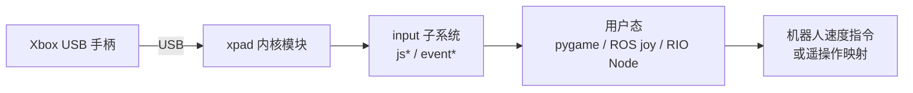

# xpad（Linux Xbox 手柄驱动）

**xpad**（[paroj/xpad](https://github.com/paroj/xpad)）维护主线 Linux 内核中的 **Xbox 游戏手柄 USB 驱动**，并在上游基础上合并更多设备兼容性与补丁。对机器人研究与工程而言，它是 Linux 工作站上 **USB 有线 Xbox / Xbox 360 / Xbox One 手柄** 进入用户态（pygame、ROS `joy`、自研遥操作 Node）之前的 **内核输入层**。

## 一句话定义

用 **单文件内核模块 + DKMS** 把 Xbox 系 USB 手柄映射为 Linux `input` 子系统的 **joystick / event 设备**，供上层遥操作与仿真手柄接口稳定读取轴与按键。

## 英文缩写速查

| 缩写 | 英文全称 | 简要说明 |
|------|----------|----------|
| USB | Universal Serial Bus | 本驱动主场景：有线连接 Xbox 手柄 |
| HID | Human Interface Device | 蓝牙配对后的 Xbox 手柄走通用 HID，不经 xpad |
| DKMS | Dynamic Kernel Module Support | 在内核升级后自动重编译外置内核模块 |
| ROS | Robot Operating System | 常见通过 `sensor_msgs/Joy` 等订阅手柄输入 |
| evdev | Event Device | Linux `/dev/input/event*` 标准输入事件接口 |
| FF | Force Feedback | 力反馈；xpad 对 360 类手柄可通过 `fftest` 验证 |

## 为什么重要

- **Linux 机器人栈的「默认手柄层」**：大量 locomotion 演示、MuJoCo 速度指令与低成本遥操作在 Ubuntu 工作站上仍依赖 **游戏手柄**；USB 有线路径几乎总是 **xpad**（或发行版自带的主线版本）。
- **比用户态 hack 更稳**：相对仅用户态解析 USB 报文，内核驱动直接接入 **input 子系统**，与 pygame / SDL / ROS `joy_node` 生态对齐。
- **社区补丁领先主线**：第三方 Xbox 360 兼容垫初始化、Guitar Hero Live 等特殊设备在 paroj 分支往往 **早于** 某发行版内核落地，适合研究机快速验证。

## 核心结构 / 机制

### 连接路径对照

| 连接方式 | 驱动 | 机器人栈注意点 |
|----------|------|----------------|
| USB 有线 | **xpad**（本页） | `jstest` / evdev / pygame 读取 `/dev/input/js*` 或 `event*` |
| 蓝牙 | 内核 **HID** | 如 [Open Duck Mini Runtime](./open-duck-mini-runtime.md) 的 Xbox One 蓝牙配对 |
| Xbox One 无线适配器 | 用户态 [xow](https://github.com/medusalix/xow) | 需额外 daemon，非 xpad 范畴 |

### 安装后暴露的接口

每个手柄通常对应：

1. **`/dev/input/jsN`** — 经典 joystick API
2. **`/sys/class/leds/xpadN/brightness`** — 手柄环形 LED 模式
3. **`/dev/input/event*`** — 通用 input 事件与力反馈

### 数据流（USB 手柄 → 机器人命令）

## 常见误区或局限

- **蓝牙 ≠ xpad**：配对成功后不要在内核里找 `xpad` 模块是否加载来判断蓝牙手柄——应查 **HID** 与 `bluetoothctl`。
- **与主线内核重复**：多数桌面发行版已内置 `xpad`；仅在 **设备不识别**、需 **新设备 ID** 或 **GHL 等特殊补丁** 时才需要 paroj DKMS 版。
- **力反馈与「模拟按键」仍不完善**：驱动头文件 TODO 仍列有 rumble、analog button 等待办；部署前应在目标手柄上实测。
- **非 Xbox 手柄不在范围**：罗技、北通等需各自驱动或通用 HID；工程上常配合 **标定脚本**（参见 [WalkerE3 手柄仿真](./jackhan-mujoco-walke3-simulation.md)）。

## 关联页面

- [Teleoperation（遥操作）](../tasks/teleoperation.md) — 手柄作为低成本遥操作与速度指令入口
- [Open Duck Mini Runtime](./open-duck-mini-runtime.md) — 真机 Xbox 输入（蓝牙路径对照）
- [RIO（Robot I/O）](./robot-io-rio.md) — 跨形态框架中的手柄类 Node
- [Mujoco WalkerE3 手柄仿真](./jackhan-mujoco-walke3-simulation.md) — Pygame 手柄标定与速度指令示例

## 参考来源

- [xpad 仓库归档](../../sources/repos/xpad.md)
- [paroj/xpad（GitHub）](https://github.com/paroj/xpad)
- Linux 内核 `drivers/input/joystick/xpad.c`（上游同源）

## 推荐继续阅读

- [medusalix/xow](https://github.com/medusalix/xow) — Xbox One **无线适配器** 用户态方案（与 USB xpad 互补）
- [Linux input 子系统文档](https://docs.kernel.org/input/input.html) — evdev 与 joystick API 背景
- [Query：操作演示数据采集指南](../queries/demo-data-collection-guide.md) — 含 VR 手柄等其它输入设备选型
