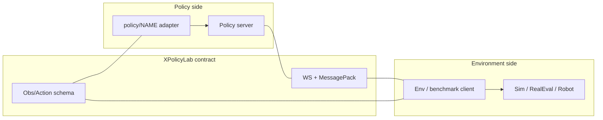
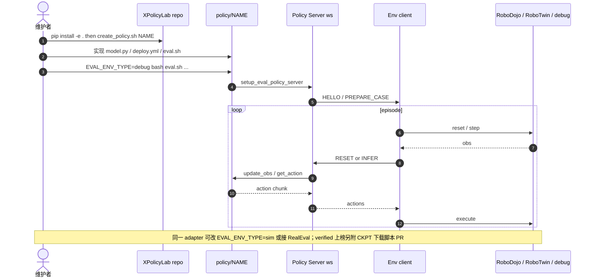

# XPolicyLab（统一策略训推与评测适配层）

**XPolicyLab**（*A Unified Standard and Open Ecosystem for Robot Policy Evaluation and Deployment*，[arXiv:2608.09892](https://arxiv.org/abs/2608.09892)；[项目页](https://xpolicylab.github.io/)；[代码](https://github.com/XPolicyLab/XPolicyLab)，Apache-2.0）由 **香港大学（HKU）MMLab** 与 **清华大学（Tsinghua）** 主导社区维护。它是策略代码与评测环境之间的 **共享层**：每个模型把依赖、checkpoint、训练配方留在 `policy/<POLICY>/`，框架负责 **serving、观测/动作契约、与基准 eval 接线**。它是 [RoboDojo](./robodojo.md) 的官方策略集成口，也服务于 RoboTwin 等榜单。

## 一句话定义

把「接 N 个策略到 M 个评测环境」从 \(O(NM)\) 降到 \(O(N{+}M)\)——策略侧只写一个 adapter，环境侧只写一个 client；适配一次即可走本地 debug / 仿真 / 真机云评测 / 开源上榜。

## 英文缩写速查

| 缩写 | 英文全称 | 简要说明 |
|------|----------|----------|
| VLA | Vision-Language-Action | 仓内大量适配对象（π、GR00T、InternVLA、Xiaomi 等） |
| WAM | World-Action Model | 仓内世界–动作模型适配族 |
| WS | WebSocket | 默认 policy-server 协议（`protocol: ws`） |
| CKPT | Checkpoint | 评测与 verified 公布必须对齐的权重快照 |
| RealEval | RoboDojo Real-World Evaluation | 真机云评测侧环境客户端 |
| HDF5 | Hierarchical Data Format 5 | RoboDojo 等导出数据的一种格式 |
| SFT | Supervised Fine-Tuning | 适配 README 常见训练入口语义 |
| PR | Pull Request | 社区模型接入与官方上榜的提交形态 |

## 为什么重要

- **评测可比性的系统瓶颈在接线，不在再写一个任务脚本：** 相机命名、通道序、夹爪缩放等 silent 分歧会毁掉跨策略比较。XPolicyLab 把契约标准化。
- **基准不必各自维护模型 serving 栈：** RoboTwin / RoboDojo 等定义「评什么」；本仓定义「策略怎么被统一调用」。
- **对接 RoboDojo 公正性门槛：** verified 上榜要求在分数公开前经本仓释放 **训推代码 + evaluated checkpoint + 配置与推理说明**——本仓既是工程基建，也是 **社区监督入口**。
- **降低「集成税」：** `scripts/create_policy.sh`、`demo_policy` 参考实现，以及 Cursor skills（`xpolicylab-model-integration` 等）缩短新模型接入路径；论文受控研究称代表策略 **>5 h → ~2 h**，agent skills 再降至约 **30 min**。

## 核心信息

| 字段 | 内容 |
|------|------|
| 机构 | 香港大学（HKU）MMLab；清华大学（Tsinghua）；XPolicyLab Community |
| 发表 | arXiv preprint（2026-08） |
| arXiv | [2608.09892](https://arxiv.org/abs/2608.09892) |
| 项目页 | <https://xpolicylab.github.io/> |
| 代码 | [XPolicyLab/XPolicyLab](https://github.com/XPolicyLab/XPolicyLab)（Apache-2.0） |
| 规模（论文日） | **42** 策略适配（2026-08-08 Table I） |
| 对接榜 | RoboTwin；RoboDojo-sim；RoboDojo-real |

## 核心原理

### 边界划分

```text
Policy environment                         Evaluation / benchmark environment
------------------                         ----------------------------------
policy/<POLICY>/model.py     <---ws--->    env client / simulator / robot
policy server                              environment client
deploy.yml runtime config                  benchmark task and observation API
```

### 输入 / 输出

| 侧 | 内容 |
|------|------|
| 观测 schema | \(\mathbf{o}_t=\{\mathbf{v}_t,\mathbf{q}_t,\mathbf{p}_t,\ell,\mathbf{m}_t\}\)；图像解码在 serving 层统一 |
| 动作 | 关节 / EE；embodiment 维在配置而非硬编码进 adapter |
| 策略 API | `__init__` → `update_obs` → `get_action`（可 batch）→ `reset` |
| 部署拓扑 | policy server 与 env client 进程隔离；可本机或远端 GPU |

### 流程总览



### 关键机制

1. **语义边界 vs 执行边界：** schema 管表示；WS 管进程与拓扑，互不绑架对方 conda。
2. **异构留在策略侧：** 网络结构、解码器、horizon、训练框架均不由标准规定。
3. **有状态与 chunk：** `reset` 清 episode 状态；执行多少步 chunk 由知道控制频率的 env 侧决定。
4. **可靠性进契约：** 请求 ID 缓存防重试双推理；server instance ID 变化即中止 trial。
5. **符合性分层：** 静态检查 → offline closed-loop debug client → 再接仿真/真机。

### 适配目录骨架

```text
policy/<POLICY>/
├── README.md
├── install.sh
├── process_data.sh      # optional
├── train.sh             # optional；暂不可开源训练时可先 eval-only 并告知维护者时间线
├── eval.sh
├── setup_eval_policy_server.sh
├── setup_eval_env_client.sh
├── deploy.yml
├── deploy.py
└── model.py             # Model: __init__ / update_obs / get_action / reset (+ batch)
```

### 已集成策略（核查日口径）

截至论文/项目页 **2026-08-08**，官方口径为 **42** 个策略适配（Table I / 项目站列表），覆盖 π₀ / π₀.₅、GR00T-N1.7、InternVLA-A1(_5)、StarVLA、Xiaomi-Robotics-0/1、GO-1、OpenVLA-OFT、RDT-1B、SmolVLA、MolmoAct2、GigaWorld-Policy、DreamZero、Mem-0 等。更早 RoboDojo 摘要写 **30**、社区公告写 **40+**——**引用「多少模型」时以仓内当日 `policy/` 目录为准并注明核查日**。

## 源码运行时序图

官方仓可运行路径对齐 `scripts/create_policy.sh`、`policy/*/eval.sh` 与 `client_server/`：



关键复现：先 `EVAL_ENV_TYPE=debug` 验契约，再接仿真；官方榜以云管线为准。

## 工程实践

| 步骤 | 做法 |
|------|------|
| 1. 学参考实现 | 读 `policy/demo_policy` 的 `model.py` / `deploy.py` / `deploy.yml` / `eval.sh` |
| 2. 建骨架 | `bash scripts/create_policy.sh <POLICY_NAME>` |
| 3. 无仿真验契约 | `EVAL_ENV_TYPE=debug` 跑 `eval.sh` |
| 4. 仿真 / 远程 | `EVAL_ENV_TYPE=sim` 或拆分 server 与 env client |
| 5. 数据 | `scripts/RoboDojo/download_robodojo_data.sh`（demo / hdf5 / lerobot / real） |
| 6. Agent 加速 | 仓内 Cursor/Claude skills 做 scaffold / audit |
| 7. 上榜 | 按 CONTRIBUTING 开 PR；描述中附 HF/ModelScope checkpoint 下载脚本 |

与 [RoboDojo](./robodojo.md) 联调时：`eval.sh` 拉起 server 后回调 RoboDojo `scripts/eval_policy.sh`。

## 实验与评测

| 设定 | 结果要点 |
|------|----------|
| 覆盖 | **42** 策略（VLA / WAM / 扩散 / 记忆 / IL） |
| 复杂度局部性 | 模型侧代码量差一个数量级；环境侧闭环仍贴近固定参考几行 |
| 集成代价（受控） | 代表策略 **>5 h → ~2 h**；agent skills **~30 min** |
| 复用 | 同一 adapter → RoboTwin + RoboDojo-sim + RoboDojo-real |

## 结论

**跨策略公平评测与部署的第一刀，应砍在「统一契约 + 依赖隔离 serving」，而不是再为每个基准写一套模型胶水。**

1. **选型时先问「是否只需写一个 adapter」** — 若仍要为每个环境改预处理，就还没吃到 O(N+M)。
2. **数字引用写核查日** — 论文 42、早期公告 40+/30 都可能过时，以仓内 `policy/` 为准。
3. **debug client 是最低成本门禁** — 未过契约勿上仿真/真机。
4. **verified ≠ 本地分** — 与 [RoboDojo](./robodojo.md) 联读时遵守开源产物与 hidden-layout。
5. **Agent skills 是工程杠杆** — 适合作为社区接入的默认路径，而非可选项。
6. **勿与摘录榜混淆** — [VLA SOTA Leaderboard](./vla-sota-leaderboard.md) 不重跑；本工作服务可复现接线。

## 局限与风险

- **适配质量不齐：** 目录存在 ≠ 该模型在 RoboDojo 全任务可跑通；以各 `policy/*/README.md` 与官方榜为准。
- **训练开源可延期、评测不可糊弄：** 规则允许先 eval-only 接入，但 **verified 公布**仍要可复现的 evaluated artifact。
- **依赖地狱未消失：** 各 policy 自带环境；统一的是契约而非单一 conda。
- **标准演进成本：** schema/协议变更需全生态跟进。
- **勿与摘录榜混淆：** 本仓服务 **重跑/官方评测接线**；[VLA SOTA Leaderboard](./vla-sota-leaderboard.md) 是论文分数导航。

## 与其他工作对比

| 路线 | 标准化对象 | 是否规定模型结构 | 开源/复现 |
|------|------------|------------------|-----------|
| LeRobot / 训练基建 | 数据集与训练循环 | 常绑定示例策略 | 开源 |
| 单模型官方 deploy | 该模型的推理栈 | 是 | 随模型 |
| RoboDojo / RoboTwin | 任务、协议、环境 | 否（评「什么」） | 开源基准 |
| **XPolicyLab（本文）** | **策略↔环境契约 + serving** | **否（留在 adapter）** | **已开源** |
| VLA SOTA Leaderboard | 论文摘录分数导航 | N/A | 不重跑 |

## 关联页面

- [RoboDojo](./robodojo.md) — 统一 sim-and-real 基准与公益上榜规则
- [VLA](../methods/vla.md) — 方法总览与仓内大量适配对象
- [仿真评测基础设施](../concepts/simulation-evaluation-infrastructure.md) — 闭环评测方法论
- [具身评测选型闭环](../queries/embodied-eval-benchmark-selection-loop.md) — 策略成功率层工程入口
- [VLA SOTA Leaderboard](./vla-sota-leaderboard.md) — 摘录榜对照
- [Xiaomi-Robotics-1](./xiaomi-robotics-1.md) — 已出现在适配目录与 RoboDojo 分数叙事中的案例
- [starVLA](../methods/star-vla.md) — 仓内适配之一
- [Inspect Robots](./inspect-robots.md) — `inspect-robots-xpolicylab` 插件；`--policy xpolicylab` 真机/Isaac 评测

## 参考来源

- [仓库归档 XPolicyLab](../../sources/repos/xpolicylab.md)
- [项目页归档](../../sources/sites/xpolicylab-github-io.md)
- [论文归档（arXiv:2608.09892）](../../sources/papers/xpolicylab_arxiv_2608_09892.md)
- [RoboDojo 官网归档](../../sources/sites/robodojo-benchmark.md)
- [RoboDojo 仓库归档](../../sources/repos/robodojo.md)
- [开放长期公益评测公告](../../sources/blogs/robodojo_open_longterm_eval_2026-07.md)

## 推荐继续阅读

- [XPolicyLab README](https://github.com/XPolicyLab/XPolicyLab) — 框架总览与 Common Workflow
- [项目页](https://xpolicylab.github.io/) — 42 策略与贡献指南
- [RoboDojo 文档 · XPolicyLab](https://robodojo-benchmark.com/doc/usage/xpolicylab/) — 与基准联调说明
- [RoboDojo Protocol](https://robodojo-benchmark.com/leaderboard/protocol) — verified 开源产物要求全文
