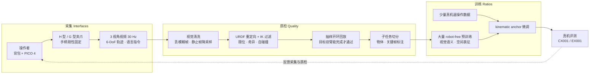

# XRZero-G0（VR 夹爪无本体采数系统）

**XRZero-G0**（*XRZero-G0: Pushing the Frontier of Dexterous Robotic Manipulation with Interfaces, Quality and Ratios*，[arXiv:2604.13001](https://arxiv.org/abs/2604.13001)，2026-04-14，[项目页](https://x2robot.com/x2go)，[GitHub](https://github.com/X-Square-Robot/XRZero-G0)，[HF 数据集](https://huggingface.co/datasets/x-square-robot/XRZero-G0-3K)）由 **自变量机器人（X Square Robot）** 发布，官网技术博客时间线在 2026-06-10 收录该条目。它是一套软硬协同的 **无本体（robot-free）** 双臂示教采集与策略学习系统：人背着计算背包、戴 VR 头显、双手各持一把自研夹爪采数，经自动质检与真机回放筛选后，再和少量真机数据混合训练 VLA。

| 字段 | 内容 |
|------|------|
| **机构** | 自变量机器人（X Square Robot） |
| **类型** | 可穿戴 VR 采数套件 + 质检流水线 + 数据配比研究（技术报告） |
| **硬件** | PICO 4 头显（inside-out 6-DoF）· H 型按压夹爪 / G 型手指驱动夹爪 · 背包边缘计算单元 · 头部 + 双腕 3 视角 |
| **主张** | 有效率 **85%**；采集提速最高 **2.33×**；**10:1** 配比追平纯真机；成本约 **1/20**；G0-Dataset **>2,000 h / 3,000 任务** |
| **开源（截至 2026-10-09）** | **部分开源**：HF 数据子集公开（20 任务 / 3,697 episode）；GitHub 仅 README；无权重、无硬件资料 |

## 一句话定义

**把 UMI 式手持夹爪示教换成「VR 头显跟踪 + 双夹爪 + 背包」，在采集后加一道 IK 校验与真机开环回放质检，再用「大量无本体数据预训练 + 少量真机数据锚定」的配比把无本体数据变成可部署的双臂策略。**

## 英文缩写速查

| 缩写 | 英文全称 | 简要说明 |
|------|----------|----------|
| XRZero-G0 | — | 本系统名；官网商品线 QUANXTA Zero-G0 被推测为其产品化版本 |
| UMI | Universal Manipulation Interface | 手持夹爪无本体示教范式；本文的直接对照与改进对象 |
| VR | Virtual Reality | 这里用 PICO 4 头显的 inside-out 跟踪替代 UMI 的视觉 SLAM 定位 |
| 6-DoF | Six Degrees of Freedom | 手柄 / 夹爪的三维位置 + 三维姿态轨迹 |
| IK | Inverse Kinematics | 把人手末端轨迹映射到目标双臂关节空间，并据此剔除不可达片段 |
| URDF | Unified Robot Description Format | 目标本体模型；重定向与 IK 校验的输入 |
| VLA | Vision-Language-Action | 下游策略范式；实验用 Wall-OSS、π₀、π₀.₅ |
| WAM | World Action Model | 论文称数据也可供世界-动作模型使用，未做实验 |
| RQ | Research Question | 论文按 RQ1–RQ4 组织实验 |

## 为什么重要

- **它回答的是「无本体数据怎么用」，不只是「怎么采」：** 多数 UMI 系工作停在采集接口和单任务演示，XRZero-G0 把 **配比** 当一等问题：500 条真机基线、1:1 增量、10:1 替代三组对照，给出「少量真机锚定」的经验律。这是采数团队决定预算分配时可直接引用的对照坐标。
- **质检闭环是工程上最可复用的部分：** 模糊帧剔除 → URDF + IK 可达性过滤 → 抽样在目标双臂上开环回放 → 子任务标注。前两步不依赖本文硬件，任何手持夹爪数据管线都能照搬。
- **定位方案换了路线：** UMI 依赖腕相机视觉 SLAM，在弱纹理或动态场景容易漂；本文改用消费级 VR 头显的 inside-out 跟踪，自报 **≤4 mm**（论文对照表中 UMI 10 mm、FastUMI 8 mm）。开源的 [HandUMI](./handumi.md) 也走「头显 + 手柄」定位，可作同思路对照。代价是绑定头显生态，并多了背包重量。
- **同机构不要串台：** 本文是 **平行夹爪 + 末端位姿** 数据，并且仍用少量真机数据锚定；2026-09 的 [TwinDEX](./twindex.md) 则是三指外骨骼 + 同构机械手、宣称零真机数据。二者是两条不同的硬件路线。
- **标题里的 dexterous 要打折读：** 末端只是两种夹爪，HF 数据的动作是「双手末端位姿 + 夹爪开合」14 维，没有多指关节或触觉。

## 核心原理

### 闭环流程

### 三个模块

| 模块 | 关键做法 | 论文给出的依据 |
|------|----------|----------------|
| **Interfaces** | PICO 4 inside-out 6-DoF 跟踪；头显 RGB 俯视主视角 + 双腕相机；H 型按压夹爪抓大物、G 型手指驱动夹爪做精细操作；两夹爪间距按目标双臂基线标定；背包单元做时空对齐后上传服务器 | 对比 UMI 系 Table 1（定位精度、视角数）；RQ1 计时 |
| **Quality** | 视觉清洗 → IK 校验 → 每类任务抽样开环物理回放 → 语义标注 | 有效率「up to 85%」（分母定义未给） |
| **Ratios** | 预训练阶段用 robot-free 数据学视觉语义与 affordance；微调阶段加入少量真机数据对齐电机延迟、摩擦、关节限位等本体先验 | RQ3 纯 robot-free 扩量、RQ4 1:1 / 10:1 对照 |

输出数据是 **与模型无关** 的「多视角图像 + 语言 + IK 校验过的 6-DoF 轨迹」。公开 HF 子集的 `action` / `observation.state` 为左右手各 `pos_xyz + rot_xyz + gripper` 共 14 维，不含关节角。

## 实验与评测

平台：双臂 **CX001**（多关节、偏灵巧）与 **EX001**（大负载、大工作空间）；策略：Wall-OSS、π₀、π₀.₅。

| 问题 | 设置 | 报告结果 |
|------|------|----------|
| **RQ1 采集效率** | 对比主从遥操作与标准 VR 遥操作的平均单条用时 | 对主从：简单 35→15 s（**2.33×**）、中等 75→40 s（**1.88×**）、困难 120→70 s（**1.71×**）；G0-Dataset 峰值 **93.2 episode/h** |
| **RQ2 回放保真** | IK 映射到 CX001 / EX001 末端后回放 | 定性：可 1:1 空间回放；正文无定量误差表 |
| **RQ3 纯 robot-free 扩量** | 抓葡萄 / 茄子 / 香蕉，300→500 条；双臂插花扩到 2,000 条 | 成功率随数据量线性上升；Wall-OSS 茄子、香蕉 500 条 **75.0%**；插花 H=0.4 m **70%**，未见高度 H=0.45 m **60%** |
| **RQ4 配比律** | 基线 500 条真机；1:1 = 500 真机 + 500 robot-free；10:1 = 500 robot-free + 50 真机；5 个任务 | 1:1 插花 Wall-OSS **50%→75%**；10:1 叠毛巾 **87.5%**、抓香蕉 **75.0%**，均与 500 条真机基线持平 |

**成本口径：** robot-free 数据成本约为真机遥操作的 **1/20**，依据是设备维护、平台开发、人力约束的综合估计，没有分项明细。「10:1 用 1/20 成本追平」是把这个系数乘到 RQ4 上得出的结论。

## 工程实践

| 维度 | 可读法 |
|------|--------|
| **选型** | 要 **平行夹爪双臂 + 大规模场景多样性**：XRZero-G0 / [HandUMI](./handumi.md) / FastUMI 一类；要 **多指灵巧且与特定手 1:1**：看 [TwinDEX](./twindex.md)、[mimic U1](./mimic-wearable-u1.md)；要 **力觉**：[UMI-FT](./paper-umi-ft.md) |
| **可照搬的质检** | 按目标 URDF 做 IK 可达性 / 奇异 / 自碰撞过滤，再按任务类别抽样上真机开环回放——不依赖本文硬件 |
| **配比起点** | 若已有少量真机数据，可先试 robot-free : 真机 ≈ 10:1 作为基线配置，再按任务调；论文只验证了 5 个桌面任务与 500 条量级，**不是普适定律** |
| **用 HF 数据** | LeRobot v3.0 格式、20 个任务子目录；`meta` 写 30 fps 而视频流标 20 fps，加载前先核对时间戳；无 dataset card、未声明许可证，商用前需向官方确认 |
| **跟踪方案** | 头显 inside-out 跟踪避开视觉 SLAM 漂移，但要求操作者全程佩戴头显；两夹爪间距需按目标机器人标定 |
| **源码运行时序图** | **不适用**（截至 2026-10-09 GitHub 仅 README 与配图，无采集、质检或训练代码） |

### 开源状态（2026-10-09 核查）

| 入口 | 状态 |
|------|------|
| 代码 | **未发布**：仓库只有 README、`imgs/`；README 挂 MIT 徽章，但没有 LICENSE 文件 |
| 权重 | **未发布**：项目页、README、论文均未列 |
| 数据 | **部分公开**：`x-square-robot/XRZero-G0-3K` 公开、未设 gate；20 任务 / 3,697 episode / 约 136 万帧，远小于论文的 2,000 h |
| 硬件 | **闭源**：无 CAD / BOM / 固件；官网「无本体数采」页的 QUANXTA Zero-G0（「UMI-VR 版」：夹爪 + VR 头显 + 背包）**推测** 为其商品化版本 |

## 与其他工作对比

| 对比轴 | XRZero-G0 | [UMI](./paper-rcl-ref-e064f89fc62c8df5da9f-universal-manipulation-interface-in-the-wild-rob.md) | [HandUMI](./handumi.md) | [TwinDEX](./twindex.md) |
|--------|-----------|-----|---------|---------|
| **末端** | H / G 两种平行夹爪 | 手持平行夹爪 | 平行夹爪 | 三指外骨骼 ↔ 同构三指手 |
| **定位** | VR 头显 inside-out | 腕相机视觉 SLAM | 同样用头显世界系 + 手柄，避开相机 SLAM | 外骨骼关节 + 腕位姿 |
| **视角** | 头部 + 双腕 3 路 | 腕相机 | 腕部鱼眼相机 | 多视角 RGB + 指尖触觉 |
| **真机数据** | 需要少量锚定（10:1） | 原文主打零微调跨平台 | 回放 / 重定向到多台臂 | 宣称零真机数据 |
| **开源** | 仅数据子集 | 已开源 | 开源 | 未开源 |

相对 [ActiveUMI](./paper-notebook-activeumi-robotic-manipulation-with-active-perce.md)：两者都用 VR 头显记录头部视角，ActiveUMI 侧重主动感知，XRZero-G0 侧重质检闭环与配比律。相对 [Pico 4 Ultra 采集平台](./pico-4-ultra-egocentric-capture.md)：同属 PICO 头显生态，但那里是第一人称人体 / 手部数据，这里是夹爪末端轨迹。

## 结论

**XRZero-G0 真正可用的是两样东西：一条「IK 校验 + 真机抽样回放」的质检流水线，和一组「少量真机锚定大量无本体数据」的配比对照；硬件本身是 UMI 换 VR 定位的工程改良。**

1. **配比律是经验坐标，不是定律** — 10:1 追平只在 5 个桌面任务、500 条量级、Wall-OSS 上报告，换任务与本体要重测。
2. **「zero-shot 跨本体」要细读** — Fig. 8 的跨本体 rollout 用的是 1:1 混合（含真机数据）训练的策略，不是纯无本体数据。
3. **85% 有效率与 ≤4 mm 都是自报** — 分母与测量方法未公开，作为接口选型的参考上限。
4. **1/20 成本是综合估计** — 没有分项，用于预算时要按自己的人力与设备成本重算。
5. **公开数据只是样本** — HF 子集约 3.7K episode，复现 2,000 h 规模的结论不现实；代码和权重都没有。

## 局限与风险

- **部分开源（2026-10-09）：** 只有 HF 数据子集；无采集软件、质检流水线、训练代码与权重，论文数字无法用官方代码复现。详见 [源归档](../../sources/sites/x2robot-xrzero-g0.md)。
- **数字不可独立审计：** 85%、≤4 mm、2.33×、1/20 均无公开原始数据或误差条；RQ2 回放只有定性描述。
- **末端能力有限：** 平行夹爪 + 14 维末端位姿，无多指、无触觉；标题中的 dexterous 不应外推到灵巧手。
- **口径不一：** 摘要与项目页称「zero-shot cross-embodiment」，图注显示策略含真机数据训练；HF 元数据 30 fps 与视频 20 fps 不一致。
- **人体工学：** 论文自述背包计算单元偏重，限制超长时采集。
- **任务边界：** 实验为静态桌面双臂；全身移动操作列为未来工作。
- **商品对应关系未经官方确认：** QUANXTA Zero-G0 与 XRZero-G0 的关系是根据形态与页面命名推测的。

## 关联页面

- [TwinDEX](./twindex.md) — 同机构 2026-09 的三指外骨骼 + 同构手路线，宣称零真机数据；与本页是不同系统
- [灵巧操作数据采集指南](../queries/dexterous-data-collection-guide.md) — 视觉遥操作 / 手套 / 外骨骼 / 手持夹爪怎么选
- [具身数据采集五路线](../queries/embodied-data-collection-five-routes-landscape.md) — UMI 类手持采集在全景中的位置
- [具身数据采集四层分类](../concepts/embodied-data-collection-four-layers-taxonomy.md) — 无本体数据与真机数据的层级关系
- [Teleoperation](../tasks/teleoperation.md) — RQ1 的主从 / VR 遥操作对照基线
- [HandUMI](./handumi.md) — 开源、可重定向到多台双臂的无机器人示教对照
- [UMI-FT](./paper-umi-ft.md) — 指端六维力手持采集，补本文缺的力觉
- [ActiveUMI](./paper-notebook-activeumi-robotic-manipulation-with-active-perce.md) — 同样用 VR 头显的主动感知 UMI
- [Pico 4 Ultra 采集平台](./pico-4-ultra-egocentric-capture.md) — 同一头显生态的第一人称采集
- [π₀](./paper-pi0.md) / [π₀.₅](./paper-pi05-open-world-vla.md) — 本文 RQ3/RQ4 的基线策略
- [WALL-X](./cn-os-wall-x.md) — 同机构开源 VLA 仓库，发布了本文实验所用的 Wall-OSS
- [Imitation Learning](../methods/imitation-learning.md) — robot-free 示范的消费端
- [Motion Retargeting](../concepts/motion-retargeting.md) — 本文 URDF + IK 重定向所在的方法层

## 参考来源

- [XRZero-G0 项目页 / 论文 / 开源核查归档](../../sources/sites/x2robot-xrzero-g0.md) — 2026-10-09 核查代码、权重、数据、硬件四项，含 HF 数据结构与产品页对应
- Wang et al., *XRZero-G0: Pushing the Frontier of Dexterous Robotic Manipulation with Interfaces, Quality and Ratios*, arXiv:2604.13001 — <https://arxiv.org/abs/2604.13001>

## 推荐继续阅读

- 项目页 — <https://x2robot.com/x2go>
- 论文 HTML — <https://arxiv.org/html/2604.13001v2>
- GitHub — <https://github.com/X-Square-Robot/XRZero-G0>
- HF 数据集 — <https://huggingface.co/datasets/x-square-robot/XRZero-G0-3K>
- QUANXTA Zero 无本体数采产品页 — <https://x2robot.com/pages/quanxtazero>
- UMI 原论文 — <https://arxiv.org/abs/2402.10329>
