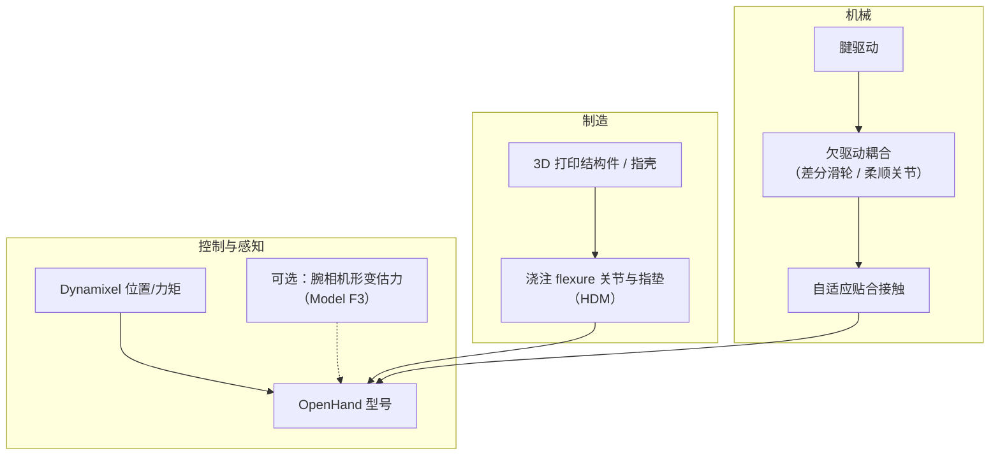
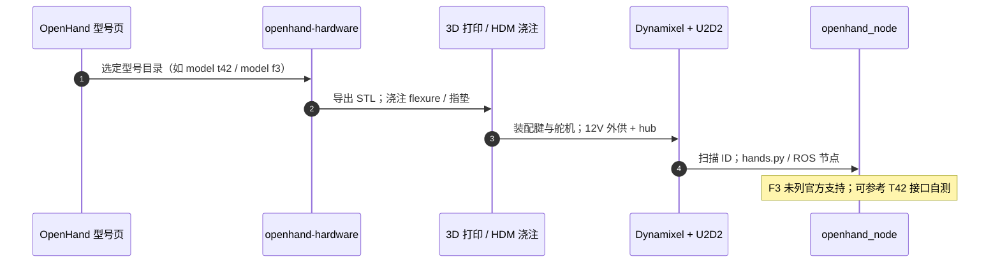

# Yale OpenHand（耶鲁开源欠驱动手）

## 一句话定义

**Yale OpenHand** 是耶鲁大学 Grab Lab（Aaron M. Dollar 组）维护的 **开源、可快速原型的腱驱动欠驱动机器人手系列**：以 3D 打印 + 柔顺关节浇注降低改型成本，让末端机械与抓取算法可共进化；最新型号 **Model F3** 针对 **腕相机观测夹爪形变估力**，在无力/力矩传感器条件下做力相关接触任务。

## 英文缩写速查

| 缩写 | 英文全称 | 简要说明 |
|------|----------|----------|
| HDM | Hybrid Deposition Manufacturing | 3D 打印 + 树脂浇注的多材料一体式制造工艺 |
| SDM | Shape Deposition Manufacturing | Model T 前身 SDM Hand 所用的沉积制造路线 |
| FT | Force/Torque sensor | 六维力/力矩传感器；F3 路线试图用视觉形变估力替代 |
| DoF | Degrees of Freedom | 自由度；OpenHand 多数型号用少量执行器驱动多关节欠驱动指 |
| STL | Stereolithography file | 3D 打印网格格式；仓库各型号提供 `.stl` 目录 |
| ROS | Robot Operating System | `openhand_node` 提供 ROS 节点集成路径 |

## 为什么重要

- **软件–硬件共进化入口**：商用灵巧手昂贵且难改；OpenHand 把「换指长 / 换耦合 / 换指垫」变成可分叉 CAD，避免只能用策略补偿封闭末端。
- **欠驱动自适应抓取范式**：腱 + 差分/柔顺关节让手指贴合物体，减少对精细触觉与复杂反馈的依赖——与 [Deimel 柔顺欠驱动手](./paper-deimel-compliant-underactuated-robotic-hand.md) 同属「接触即控制」谱系，但 OpenHand 更偏 **打印件 + Dynamixel 腱驱** 工程路径。
- **教学与对照基准**：Model T / T42 / O 在抓取与手内操作文献中常见；相对 [Allegro](./allegro-hand.md)（高 DoF 全驱动）与 [EN02-OP](./en02-op.md)（三指全驱动低成本），OpenHand 代表 **低执行器数 + 机械自适应** 选型支。
- **Model F3 新切口**：把夹爪做成「可观测形变的力探针」，服务擦拭、插销、书法等 **接触丰富** 任务，连接 [接触丰富操作](../concepts/contact-rich-manipulation.md) 与视觉力估计，而非再堆六维腕力传感器。

## 核心原理

### 设计骨架

### 型号速览

| 型号 | 构型要点 | 典型用途 |
|------|----------|----------|
| **Model T** | 四指、单执行器差分耦合 | 自适应强力抓取；弱手内操作 |
| **Model T42** | 双指双执行器 | 精密捏取 + 部分手内原语 |
| **Model O** | 三指 + 外展/内收；四执行器 | 类商用三指自适应夹爪拓扑 |
| **Model Q** | 精密指对 + 可旋转强力指对 | finger-gaiting / 手内换握 |
| **Model M2** | 单欠驱动指 + 可换拇指 | 多模态最小夹爪实验 |
| **Model VF** | T42 + 可变摩擦指垫 | 平面手内平移/旋转 |
| **Stewart / Sphinx** | 并联机构 | 6-DoF / 球面手内操作 |
| **Model F3** | T42 flexure–flexure 改编 | **视觉形变估力** + 免 FT 力控任务 |

参数化 CAD：连杆长度、传动比、壳厚等可在 SolidWorks 中改并传播到相关零件（见仓库 CAD Guide）。

### Model F3（Forces-for-Free）专节

| 维度 | 公开信息 |
|------|----------|
| 血统 | Model T42 的 **flexure–flexure** 变体 |
| 几何 | 改连杆长度/角度，避免指尖接触奇异 |
| 传动 | 优化腱路由与电机位姿，**降低腱摩擦** 以利形变→力映射 |
| 传感思路 | **腕部相机** 观测夹爪变形 → 接触力估计（配套论文页内标注审稿中） |
| 执行器 | **2× Dynamixel XM-430-W350-R** |
| 质量 / 保持力 | **400 g** / **10 N** |
| 基座 | 高 55–80 mm；直径 90–200 mm |
| 宣称任务 | 力控擦拭、peg-insertion、书法（**无需 FT**） |
| CAD | [`model f3 (forces-for-free hand)`](https://github.com/grablab/openhand-hardware/tree/master/model%20f3%20(forces-for-free%20hand)) + Assembly Guide 1.0（2024-12-15） |

## 工程实践

### 开源状态（项目页核查）

| 资产 | 状态 |
|------|------|
| CAD / STL / SolidWorks | **已开源** — [`grablab/openhand-hardware`](https://github.com/grablab/openhand-hardware) |
| 装配与型号页文档 | **已开源** — [OpenHand 站](https://www.eng.yale.edu/grablab/openhand/) |
| 控制（O / T / T42） | **已开源** — [`openhand_node`](https://github.com/grablab/openhand_node)（MIT） |
| 仿真 | **已开源** — [`openhand_simulation`](https://github.com/grablab/openhand_simulation) |
| F3 视觉力估论文与代码 | **审稿中 / 未随硬件仓发布**（截至 2026-07-26） |
| 许可（硬件） | **CC BY-NC 3.0** — **禁止商业使用**；学术需按 LICENSE 引用 |

### 复刻最小路径

1. 在项目页选定型号 → 打开对应 `openhand-hardware` 文件夹打印 + 按 Build/PDF 装配。
2. 柔顺关节按 HDM / Smooth-On 流程浇注（勿当纯刚性 pivot 手）。
3. 用 U2D2 **串口** + **独立 12 V 供电**；`lib_robotis_mod.py --scan` 找舵机 ID。
4. Model O / T / T42：直接用 `openhand_node`；**F3 需自行按 T42 改编验证行程与映射**。
5. 腕耦合：项目页 Couplings 区提供多臂法兰机械接口。

### 与相近硬件对照

| 平台 | 驱动哲学 | 成本/许可 | 适合 |
|------|----------|-----------|------|
| **OpenHand** | 欠驱动腱 + 打印/浇注 | 材料低；**CC BY-NC** | 抓取研究、教学、改型实验；F3→视觉估力 |
| [EN02-OP](./en02-op.md) | 三指 **7 DoF 全驱动** Dynamixel | DIY ~$200；**GPL-3.0** | 低成本臂端全驱动抓取 |
| [Allegro Hand](./allegro-hand.md) | 四指 **16 DoF** | 商用高价 | 灵巧操作 / RL 标准平台 |
| [RUKA-v2](./ruka-v2-hand.md) | 腱驱仿人高 DoF | 材料 ~$1.5k；开源全栈 | 遥操作 + IL |
| [Deimel / RBO](./paper-deimel-compliant-underactuated-robotic-hand.md) | 气动软体欠驱动 | 实验室原型 | 本质安全、极高顺应 |

## 局限与风险

- **非商用许可**：硬件 CC BY-NC 3.0；产品化或售卖需另获授权，与 GPL/MIT 硬件仓不可混谈。
- **控制栈老化**：`openhand_node` 文档偏 ROS Kinetic / Py2+Py3；新机需自行验证 Protocol 2 与依赖。
- **F3 力估不可「开箱复现」**：硬件 CAD 已放，但视觉力估计论文仍审稿中，**不要假设**有公开训练代码或标定管线。
- **欠驱动 ≠ 灵巧手替代**：单执行器 Model T 等不擅长精细手内重定向；高 DoF 任务应看 Allegro / RUKA / MIDAS 等。
- **站点深链可能过时**：F3 页曾指向旧 GitHub 子目录名；以仓库实际 `model f3 (forces-for-free hand)` 为准。

## 关联页面

- [Manipulation](../tasks/manipulation.md) — 操作任务与末端选型语境
- [抓取专题汇总](../overview/topic-grasp.md) — 感知–规划–执行与硬件入口
- [接触丰富操作](../concepts/contact-rich-manipulation.md) — F3 免 FT 力控任务所属问题族
- [EN02-OP](./en02-op.md) — 低成本开源三指全驱动对照
- [Allegro Hand](./allegro-hand.md) / [RUKA-v2 Hand](./ruka-v2-hand.md) — 高 DoF 灵巧手对照
- [Deimel 柔顺欠驱动手](./paper-deimel-compliant-underactuated-robotic-hand.md) — 欠驱动 + 顺应性理论谱系

## 参考来源

- [Yale OpenHand 项目页归档](../../sources/sites/yale-grablab-openhand.md)
- [Model F3 型号页归档](../../sources/sites/yale-openhand-model-f3.md)
- [openhand-hardware 仓库归档](../../sources/repos/openhand-hardware.md)
- [openhand_node 仓库归档](../../sources/repos/openhand_node.md)

## 推荐继续阅读

- [OpenHand 项目主页](https://www.eng.yale.edu/grablab/openhand/) — 型号选型与装配入口
- [Model F3 型号页](https://www.eng.yale.edu/grablab/openhand/model_f3.html) — 规格与 Build
- [openhand-hardware](https://github.com/grablab/openhand-hardware) — CAD / STL
- Ma et al., *Yale OpenHand Project…*, IEEE RAM 2017 — 项目设计哲学综述
- Ma et al., *A Modular, Open-Source 3D Printed Underactuated Hand*, ICRA 2013 — 早期模块化欠驱动手
