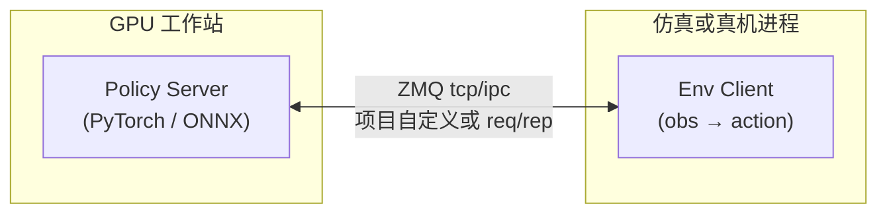

# ZeroMQ

**ZeroMQ**（[zeromq/libzmq](https://github.com/zeromq/libzmq)，站 [zeromq.org](https://zeromq.org/get-started/)）是 **brokerless** 的消息库：应用通过 **socket 类型 + 绑定/连接拓扑** 组成 pub/sub、request–reply、pipeline 等模式，而不是先部署独立的 message broker。线协议 **ZMTP** 与 socket 语义由 [ZeroMQ RFCs](https://rfc.zeromq.org/) 维护；入门与架构模式以 [ØMQ Guide](https://zguide.zeromq.org/) 为一手教程。

## 一句话定义

用 **轻量 socket API** 在进程/机器之间交换 **离散消息**（含 multipart），**无需中心 Broker**；适合 **策略 GPU 进程 ↔ 仿真/真机控制进程** 等拆分部署，**不适合** 替代 1 kHz 关节伺服总线或 ROS 2 全栈发现/QoS。

## 英文缩写速查

| 缩写 | 英文全称 | 简要说明 |
|------|----------|----------|
| ZMQ | ZeroMQ | 本项目常用简称 |
| ZMTP | ZeroMQ Message Transport Protocol | TCP 等连接上的成帧与安全握手线协议 |
| REQ/REP | Request / Reply | 严格 lockstep 的请求–响应 socket 对 |
| PUB/SUB | Publish / Subscribe | 主题过滤的广播（慢 joiner 会丢订阅前消息） |
| IPC | Inter-Process Communication | 同机 Unix domain / 抽象命名空间等 |
| CURVE | CurveZMQ | 基于 Curve25519 的 ZMTP 安全机制 |
| MPL | Mozilla Public License | libzmq 默认许可证（2.0） |

## 为什么重要

- **机器人学习栈已大量采用「Policy Server + Client」**：如 [NVIDIA GR00T](../entities/isaac-gr00t.md) / [E2E G1 工作流](./nvidia-gr00t-e2e-g1-workflow.md) 的 Arena client 经 **ZeroMQ** 调远端策略；[RLDX-1](./rldx-1.md) 提供 `run_rldx_server.py` ZMQ 服务路径。
- **与 MQTT / gRPC 分工不同**：MQTT 强依赖 **Broker** 与 Topic QoS；gRPC 强依赖 **IDL + HTTP/2**；ZeroMQ 强依赖 **socket 模式与拓扑**，载荷常为 **numpy/torch 序列化 blob** 或项目自定义帧——见 [ZeroMQ 消息模式](../concepts/zeromq-messaging.md)。
- **调试链**： [PlotJuggler](./plotjuggler.md) 可订阅 ZMQ 流，与 rosbag 时序对齐分析互补。
- **一手资料齐全**：官网、Guide、RFC、libzmq 源码均可公开获取，便于审计延迟与安全边界。

## 核心原理

| 层级 | 内容 |
|------|------|
| API | `zmq_socket` 类型（PUB/SUB/REQ/REP/PUSH/PULL/DEALER/ROUTER/PAIR…） |
| 拓扑 | bind/connect 组成星型、扇出、中间层等；**无** 内置持久化队列服务 |
| 传输 | tcp、ipc、inproc、multicast、websocket 等（随绑定与构建选项） |
| 消息 | 单帧或多 part；ROUTER 带 routing identity envelope |
| 线协议 | [ZMTP 3.0](../../sources/sites/zmq-rfc-zmtp-3.md)：定界帧、版本协商、PLAIN/CURVE |
| 绑定 | PyZMQ、JeroMQ、NetMQ 等；C 栈可选 [czmq](../../sources/repos/czmq.md) |

### 机器人侧典型拓扑（远程策略）

### 与仓内中间件对照（选型）

| 需求 | 更常选 |
|------|--------|
| 云 IoT 遥测、百万连接 | [MQTT](../concepts/mqtt-protocol.md) + Broker |
| 强类型 RPC、边云 API | [gRPC](./grpc.md) |
| 同 lab 低延迟 LCM 类型 | [LCM](../concepts/lcm-basics.md) |
| 已集成 GR00T/RLDX 等 **官方 ZMQ server** | **ZeroMQ**（跟上游协议） |
| 全栈机器人图、QoS、工具链 | [ROS 2](../concepts/ros2-basics.md) / DDS |

## 工程实践

| 项 | 建议 |
|----|------|
| 模式 | 先对照 [Guide](https://zguide.zeromq.org/) 选 socket；REQ/REP 注意 **lockstep**，高并发用 DEALER/ROUTER |
| 首包 | SUB 慢 joiner：订阅后短暂 sleep 或先用 snapshot 通道 |
| 序列化 | 与 ROS 消息 **不互通**；需显式 schema（JSON、Protobuf、pickle、自定义 struct） |
| 安全 | 跨机生产环境优先 **CURVE** 或 VPN；明文 tcp 仅内网调试 |
| 延迟 | 适合 **10–100 Hz 级** 策略与感知桥；**不要** 与 EtherCAT/CAN 伺服环混为一谈 |
| 依赖 | Linux：`libzmq3-dev` + `pip install pyzmq`（Python 栈最常见） |

## 局限与风险

- **无 Broker 不等于无运维**：拓扑、重连、背压、版本兼容需应用自行处理。
- **非 ROS/DDS 原生**：不能指望 `ros2 topic` 直接 echo ZMQ 载荷。
- **持久化与事务**：不是 Kafka/RabbitMQ；断线期间的 message 丢失需业务层设计。
- **多实现互通**：以 ZMTP RFC 与 libzmq 版本为准；混用 ancient 2.x 与 3.x 需测 greeting 协商。

## 与其他页面的关系

- 模式与误区详解：[ZeroMQ 消息模式](../concepts/zeromq-messaging.md)
- 通信知识链入口：[硬件通信与协议 hub](../overview/hub-communication.md)
- 已用 ZMQ 的实体：[isaac-gr00t](./isaac-gr00t.md)、[rldx-1](./rldx-1.md)、[DexHoldem 部署](./paper-dexholdem.md)、[XR Teleoperate](./xr-teleoperate.md)

## 推荐继续阅读

- [ZeroMQ Get started](https://zeromq.org/get-started/)
- [ØMQ Guide](https://zguide.zeromq.org/)
- [ZMTP 3.0 RFC](https://rfc.zeromq.org/spec:23/)

## 参考来源

- [ZeroMQ 官方网站（一手）](../../sources/sites/zeromq-org-primary-refs.md)
- [ØMQ Guide（一手教程）](../../sources/sites/zguide-zeromq.md)
- [ZMTP 3.0 规范](../../sources/sites/zmq-rfc-zmtp-3.md)
- [libzmq 仓库](../../sources/repos/libzmq.md)
- [czmq 仓库](../../sources/repos/czmq.md)
