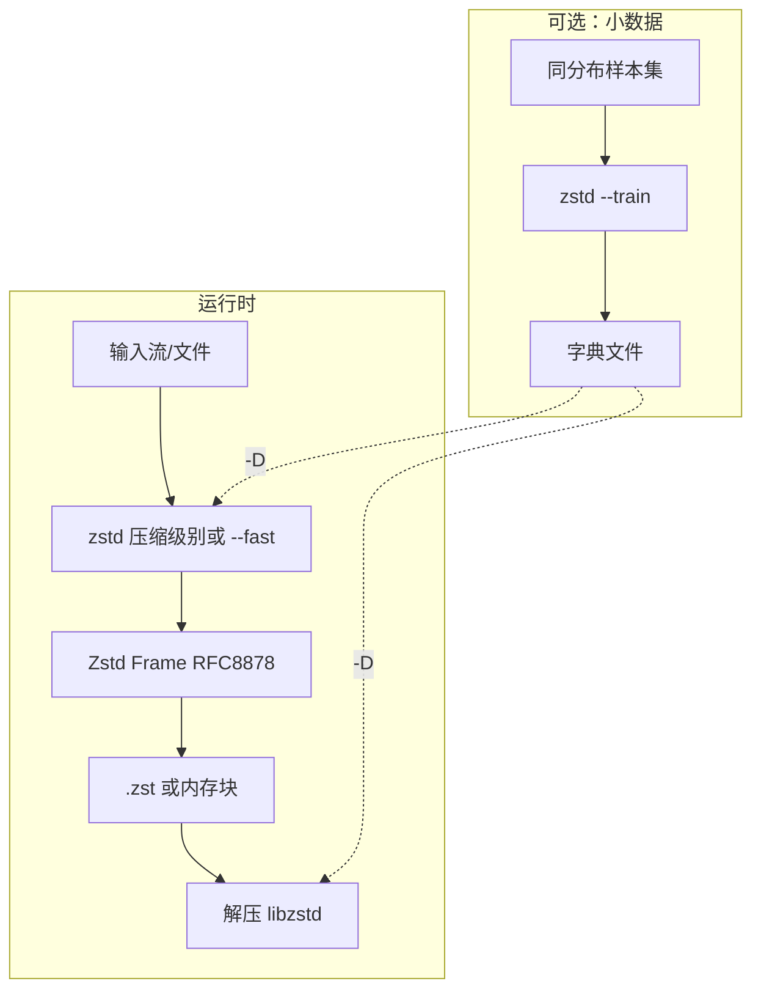

# Zstandard（zstd）

## 一句话定义

**Zstandard**（**zstd**）是面向 **实时压缩** 的 **无损** 算法与格式（参考实现 [facebook/zstd](https://github.com/facebook/zstd)，**BSD OR GPLv2**），在 **zlib 量级压缩比** 上通常 **更快**，并通过 **连续压缩级别**（含 **`--fast`** 负档）与 **字典训练** 覆盖从 **极低延迟** 到 **高压缩比** 的带宽；格式由 **[RFC 8878](https://datatracker.ietf.org/doc/html/rfc8878)** 描述（IETF Informational）。

## 英文缩写速查

| 缩写 | 英文全称 | 简要说明 |
|------|----------|----------|
| zstd | Zstandard | CLI/库短名与文件后缀 `.zst` |
| RFC | Request for Comments | IETF 文档系列；8878 为 zstd 格式 |
| FSE | Finite State Entropy | 熵编码组件（Huff0/FSE 库） |
| MIME | Multipurpose Internet Mail Extensions | `application/zstd` 媒体类型 |
| OTA | Over-The-Air | 模型/日志包压缩传输常外层 zstd |
| xxHash | Extremely fast Hash algorithm | RFC 8878 可选帧校验 |

## 为什么重要

- **数据集与日志归档**（LeRobot、HDF5 外层、S3 对象）在 **带宽与存储成本** 上常选 zstd：**比 gzip 快、比 LZ4 省空间** 的默认 `-1` 甜点。
- **小记录流**（JSON 行、ROS 小 message 批量、遥测 key-value）：**`zstd --train`** 字典可显著抬升前几 KB 压缩比（README Small Data 节）。
- **格式有 RFC + 多实现**：边云 API、对象存储 **Content-Encoding: zstd** 时有 **规范锚点**（见 [RFC 8878 归档](../../sources/sites/rfc-8878-zstandard.md)）。

## 核心原理

| 机制 | 说明 |
|------|------|
| **LZ + 熵编码** | Huff0/FSE 提供高速熵阶段 |
| **压缩级别** | 默认 `-1`～`-19` 等；**`--fast=N`** 负档偏速度 |
| **解压速度** | 各档解压 **大致稳定**（LZ 族共性） |
| **Frame / Block** | 帧独立；块间有解码依赖，可流式（RFC §3） |
| **Skippable frame** | 用户自定义元数据 |
| **Dictionary** | 离线训练 → 压缩/解压 `-D` |
| **CLI 互操作** | 可读写 `.zst`、`.gz`、`.xz`、`.lz4` |

### RFC 8878 要点（一手）

- **Informational** 规范：Frame 魔术数、块头、可选 **xxHash-64**；**不保证随机访问**。
- 合规压缩器产出符合规范的流；解压器至少支持一种参数集，不支持须 **明确报错**（§3）。

## 工程实践

### 开源状态（2026-09-24）

- **已开源**：[facebook/zstd](https://github.com/facebook/zstd)；**Meta 及大型云** 大规模生产使用（README Status）；**oss-fuzz** 持续测安全。
- **License**：库 **BSD OR GPLv2**；闭源产品链接时核对 GPL 选项。

### 快速落地

1. **CLI**：`zstd file` → `file.zst`；`zstd -d file.zst`；`zstd -1` … `-19` 或 `--fast=1`…
2. **字典**：`zstd --train samples/* -o dict`；`zstd -D dict file`
3. **库**：`make` / cmake 生成 `libzstd`；各语言 binding 见 [官方主页](https://facebook.github.io/zstd/#other-languages)
4. **HTTP/存储**：`Content-Encoding: zstd`、`application/zstd`（RFC 8878 注册）
5. **机器人分工**：**实时共享内存/环内** 优先 [LZ4](./lz4.md)；**数据集发布、OTA 包、冷归档** 优先 zstd；**结构化 RPC** 仍用 [Protobuf](./protocol-buffers.md) + 可选 zstd 外层

## 局限与风险

- **解压比 LZ4 慢**：极端低延迟路径（如每帧解压进运控）需实测；README 基准下 zstd -1 解压 **~1550 MB/s** vs LZ4 **~3850 MB/s**（同表）。
- **字典过拟合**：字典仅对 **训练分布** 有效；换任务/消息 schema 需重训或回退无字典。
- **RFC 非 Standards Track**：名称易误解为 IETF 强制标准；合规文档应写 **Informational RFC 8878**。
- **双许可**：GPLv2 选项可能影响静态链接策略。

## 关联页面

- [LZ4](./lz4.md)
- [LZ4 vs Zstandard](../comparisons/lz4-vs-zstandard.md)
- [Protocol Buffers](./protocol-buffers.md)
- [消息队列可靠性](../concepts/message-queue-reliability.md)
- [系统工程知识链](../overview/hub-systems-engineering.md)

## 参考来源

- [sources/repos/zstd.md](../../sources/repos/zstd.md)
- [sources/sites/rfc-8878-zstandard.md](../../sources/sites/rfc-8878-zstandard.md)

## 推荐继续阅读

- [RFC 8878 — Zstandard Compression](https://datatracker.ietf.org/doc/html/rfc8878)
- [zstd README（GitHub）](https://github.com/facebook/zstd/blob/dev/README.md)
