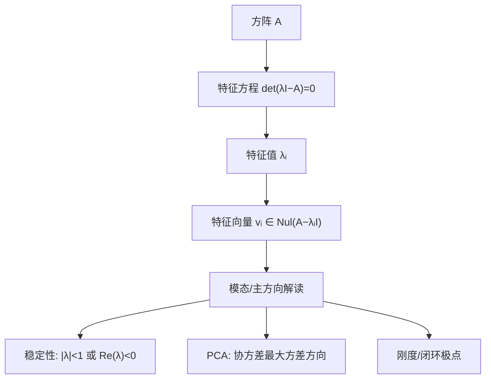

# 特征值与特征向量（Eigenvalues & Eigenvectors）

**特征值（eigenvalue）** \(\lambda\) 与 **特征向量（eigenvector）** \(v\) 描述线性算子 \(A\) 在特定方向上的**固有伸缩**：\(Av=\lambda v\)，\(v\neq 0\)。在机器人里，这是读 **线性化稳定性**、**惯量主轴**、**协方差主方向**、**PCA 诊断** 与 **Hessian 条件数** 的共同语言。

## 一句话定义

> 若矩阵 \(A\) 把向量 \(v\) 只拉长或压短、不改变方向，则 \(v\) 是 \(A\) 的特征向量，伸缩倍率 \(\lambda\) 是特征值；\(n\times n\) 矩阵至多有 \(n\) 个特征值（计重数）。

## 英文缩写速查

| 缩写 | 英文全称 | 简要说明 |
|------|----------|----------|
| EV | Eigenvalue / Eigenvector | 特征值 / 特征向量 |
| PCA | Principal Component Analysis | 协方差矩阵特征向量即主成分方向 |
| SVD | Singular Value Decomposition | 与 \(A^\top A\) 特征值平方根相关 |
| ODE | Ordinary Differential Equation | \(\dot x=Ax\) 解由 \(A\) 的特征值指数决定 |
| SPD | Symmetric Positive Definite | 对称正定矩阵特征值全为正 |

## 为什么重要

- **控制稳定性：** 离散 \(x_{k+1}=Ax_k\) 稳定 \(\Leftrightarrow\) 所有 \(|\lambda_i|<1\)；连续 \(\dot x=Ax\) 稳定 \(\Leftrightarrow\) 所有 \(\mathrm{Re}(\lambda_i)<0\)（见 [LQR](./lqr.md)）。
- **物理主轴：** 惯量张量、协方差矩阵为对称阵 → **实特征值 + 正交特征向量** = 主惯量轴 / 数据主方向。
- **数值与优化：** Hessian 特征值符号决定牛顿步是否下降；特征值裁剪是 [Newton 法](../methods/newtons-method.md) / LM 修正的常见手段。
- **诊断工具：** PCA 对失败轨迹聚类（[eigenfailures](../entities/paper-importance-sampling-pca-av-failures.md)）、刚度–阻尼闭环极点分析。

## 核心原理

### 定义（方阵 $A\in\mathbb{R}^{n\times n}$）

核心方程：

$$Av = \lambda v, \quad v \neq 0$$

| 对象 | 条件 |
|------|------|
| 特征向量 $v$ | 非零向量，满足 $Av=\lambda v$ |
| 特征值 $\lambda$ | 使上式有非零解的标量（可为复数） |
| $\lambda$-特征空间 $E_\lambda$ | $E_\lambda=\mathrm{Nul}(A-\lambda I)$ |

**术语：** 德语 *eigen* ≈「自身/固有」；Cauchy 1840 称 \(\det(\lambda I-A)=0\) 为 **équation caractéristique**（特征方程）。详见 [历史归档](../../sources/papers/cauchy_1829_1840_eigenvalue_history.md)。

### 等价刻画

| 命题 | 含义 |
|------|------|
| \(\lambda\) 是特征值 | \(A-\lambda I\) **不可逆** |
| 几何 | \(Av\) 与 \(v\) **共线**（过原点同一直线） |
| 算子（Axler） | 存在**一维不变子空间** \(\mathrm{span}(v)\) |

### 特征多项式

$$p_A(\lambda)=\det(\lambda I-A)=\det(A-\lambda I)$$

其中 $p_A(\lambda)$ 为特征多项式，$I$ 为与 $A$ 同维单位矩阵。根即特征值（**代数重数** = 多项式根重数）；**几何重数** = $\dim E_\lambda$，恒有 几何重数 $\le$ 代数重数。

### 关键定理（选）

| 定理 | 陈述 |
|------|------|
| 不同特征值的特征向量 | 线性无关 |
| 对称实矩阵 | 特征值全为实；不同特征值对应特征向量正交 |
| 对角化 | \(A=PDP^{-1}\) 当且仅当 \(A\) 有 \(n\) 个线性无关特征向量 |
| 谱半径 | \(\rho(A)=\max|\lambda_i|\) 决定离散线性系统长期行为 |

### 流程总览（从矩阵到模态）

## 工程实践

| 场景 | 怎么用谱 |
|------|----------|
| 线性化平衡点 | 求 \(A=\partial f/\partial x\) 的特征值 → 判局部稳定/振荡/鞍点 |
| 惯量 / 协方差 | 对称阵特征分解 → 主轴与主惯量/方差 |
| 闭环极点配置 | 状态反馈改 \(A-BK\) 的特征值位置 |
| 数值 IK / 最小二乘 | \(A^\top A\) 条件数 \(\kappa=\sqrt{\lambda_{\max}/\lambda_{\min}}\) 过大 → 病态 |
| Newton / LM | Hessian 负特征值 → 需信赖域或特征值修正 |
| 失败模式挖掘 | 对轨迹噪声矩阵 PCA → 主成分 = eigenfailure 模式 |

连续线性系统 $\dot x = Ax$ 的解沿特征方向以 $e^{\lambda t}$ 伸缩；离散系统 $x_{k+1}=Ax_k$ 以 $\lambda^k$ 伸缩。稳定判据：

$$\text{连续稳定} \Leftrightarrow \mathrm{Re}(\lambda_i)<0 \;\forall i; \qquad \text{离散稳定} \Leftrightarrow |\lambda_i|<1 \;\forall i$$

**Python 入口：** `numpy.linalg.eig`（一般方阵）、`eigh`（对称/Hermitian，更稳）。

## 局限与风险

- **仅方阵：** 一般矩形 \(A\in\mathbb{R}^{m\times n}\) 无特征值；用 SVD \(A=U\Sigma V^\top\)。
- **复特征值：** 实矩阵可有复共轭对 → 平面旋转模态（如 2D 旋转矩阵无实特征值）。
- **非对角化：** 亏损矩阵（几何重数 < 代数重数）→ 需 Jordan 形；数值上敏感。
- **大矩阵：** 显式求 \(\det(\lambda I-A)\) 不可行；用迭代法（Arnoldi、Lanczos）或只求少数极值。
- **非线性系统：** 特征值只描述**局部**线性化；全局行为还需相平面/李雅普诺夫等工具。

## 历史与命名（简）

| 年份 | 里程碑 |
|------|--------|
| 1829 | Cauchy 证明对称矩阵实特征值（行星长期摄动） |
| 1839–40 | Cauchy 命名 *équation caractéristique*，线性 ODE 组 → 特征值问题 |
| 现代 | 德语 **Eigen-** + 英语 value/vector 成为标准术语 |

一手论文与术语演变见 [cauchy_1829_1840_eigenvalue_history.md](../../sources/papers/cauchy_1829_1840_eigenvalue_history.md)；MAA 综述 [Math Origins: Eigenvectors and Eigenvalues](https://old.maa.org/press/periodicals/convergence/math-origins-eigenvectors-and-eigenvalues)。

## 关联页面

- [线性代数学习策展（L0）](../entities/linear-algebra-curriculum.md)
- [LQR / iLQR](./lqr.md) — Riccati 与闭环极点
- [Kalman Filter](./kalman-filter.md) — 估计协方差谱
- [Newton 法](../methods/newtons-method.md) — Hessian 特征值修正
- [Importance Sampling + PCA（eigenfailures）](../entities/paper-importance-sampling-pca-av-failures.md)
- [阻尼系统（一阶 τ / 二阶 ζ, ωₙ）](./damped-systems.md) — 闭环极点与阶跃响应形状

## 参考来源

- [GT ILA §5.1 归档](../../sources/courses/gatech_ila_sec5_1_eigenvalues_eigenvectors.md) — Margalit & Rabinoff 定义与 eigenspace
- [Axler LADR4e Ch 5 归档](../../sources/courses/axler_ladr4_ch5_eigenvalues_invariant_subspaces.md) — 不变子空间 → 特征值
- [Strang ILA5 Ch 6 + 18.06 Lec 21 归档](../../sources/courses/strang_mit_18_06_ila5_eigenvalues.md)
- [Cauchy 1829/1840 历史归档](../../sources/papers/cauchy_1829_1840_eigenvalue_history.md)

## 推荐继续阅读（外部）

- [Interactive Linear Algebra §5.1](https://textbooks.math.gatech.edu/ila/eigenvectors.html)
- [Axler LADR4e PDF Ch 5](https://linear.axler.net/LADR4e.pdf)
- [MIT 18.06 Lecture 21: Eigenvalues and eigenvectors](https://ocw.mit.edu/courses/18-06-linear-algebra-spring-2010/resources/lecture-21-eigenvalues-and-eigenvectors/)
- [Strang ILA 5th ed. 教材站](https://math.mit.edu/~gs/linearalgebra/ila5/index.html)
