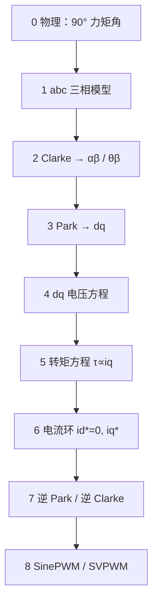

# 磁场定向控制（FOC）逐步推导

本页把 [FOC 概念页](../concepts/field-oriented-control.md) 中的直觉 **写成可复现的推导链**：为何需要坐标变换 → 如何在 dq 帧得到 \(\tau \propto i_q\) → 控制律如何回到三相 PWM。

## 一句话定义

FOC 的本质是：在 **与转子磁链同步旋转** 的 \(dq\) 坐标系里，把交流电机的时变电流变成 **近似直流量** 来调节，并令 \(i_d \approx 0\)、\(i_q\) 承载全部力矩电流，从而在任意转子位置维持 **90° 力矩角**。

## 英文缩写速查

| 缩写 | 英文全称 | 简要说明 |
|------|----------|----------|
| FOC | Field-Oriented Control | 磁场定向控制 |
| PMSM | Permanent Magnet Synchronous Motor | 永磁同步电机，表贴式时 \(L_d \approx L_q\) |
| BLDC | Brushless DC Motor | 无刷直流电机，FOC 常按 PMSM 建模 |
| BEMF | Back Electromotive Force | 反电势，高速时限制电压利用率 |
| PWM | Pulse-Width Modulation | 脉宽调制，逆变器输出手段 |
| SVPWM | Space Vector PWM | 空间矢量调制，直流母线利用率更高 |
| MTPA | Maximum Torque Per Ampere | 单位电流最大转矩，\(L_d \neq L_q\) 时 \(i_d \neq 0\) |
| PI | Proportional–Integral | 比例–积分控制器，dq 电流环常用 |

## 为什么重要

- **概念页**回答「FOC 是什么」；本页回答「公式从哪来、控制律怎么接」。
- 腿足关节驱动器调试（\(K_t\)、\(L_d, L_q\)、极对数、电角度零位）都建立在本推导链上；与 [TI 曲线](../concepts/motor-torque-current-curve.md)、[电机设计流程](../overview/motor-design-workflow.md) 第 7 步直接对应。
- 开源实现（[SimpleFOC](../entities/simplefoc.md)）与工业伺服栈的符号约定可能略有差异（\(\alpha\beta\) vs \(\theta\beta\)），但矩阵结构一致。

---

## 推导总览



---

## 步骤 0：从洛伦兹力到 90° 条件

载流导体在磁场 \(\vec{B}\) 中受力（洛伦兹力）：

$$
\vec{F} = \int (\vec{I} \times \vec{B})\, dL
$$

对有效长度 \(L\) 的导体，力的大小为 \(F = BIL\sin\theta\)，其中 $F$ 为洛伦兹力大小，$I$ 为导体电流幅值，\(\theta\) 为电流方向与磁场的夹角。**最大力**在 \(\theta = 90°\) 时取得：\(F_{\max} = BIL\)。

对半径 \(r\) 的电机，电磁转矩：

$$
\tau = r F = K_t I \quad (\theta = 90°)
$$

**直流电机**用换向器机械维持 90°；**永磁交流电机**转子磁场随 \(\theta_{me}\) 旋转，定子电流若仍为三相正弦，则 \(\theta\) 随时间变化，平均力矩下降、纹波增大。**FOC 的任务**：用电子换相，使定子电流矢量始终落在转子磁链 **正交（q 轴）** 方向。

---

## 步骤 1：三相静止坐标系（abc）

平衡三相绕组电流满足：

\[
i_a + i_b + i_c = 0
\]

定子磁势可视为三个相隔 **120°（电角度）** 的基波分量叠加；在静止参考系中，\(i_a, i_b, i_c\) 为 **工频交流**（电气角速度 \(\omega_e = p\,\omega_m\)，\(p\) 为极对数）。

**问题**：在 abc 帧直接做 PI 电流控制，需跟踪三个相互耦合的正弦量，实现复杂。

---

## 步骤 2：Clarke 变换（abc → 两相正交静止）

将三相对称系统投影到 **两相正交静止轴** \(\alpha\beta\)（部分文献与 SimpleFOC 记为 \(\theta\beta\)，与 \(\alpha\) 轴对齐）。

**幅值不变（功率不变）** 形式：

\[
\begin{bmatrix} i_\alpha \\ i_\beta \end{bmatrix}
=
\frac{2}{3}
\begin{bmatrix}
1 & -\frac{1}{2} & -\frac{1}{2} \\
0 & \frac{\sqrt{3}}{2} & -\frac{\sqrt{3}}{2}
\end{bmatrix}
\begin{bmatrix} i_a \\ i_b \\ i_c \end{bmatrix}
\]

在 \(i_a + i_b + i_c = 0\) 下常化简为（与 [SimpleFOC 文档](https://docs.simplefoc.com/foc_theory) 一致）：

\[
\begin{aligned}
i_\alpha &= i_a \\
i_\beta &= \frac{1}{\sqrt{3}}(i_b - i_c) = \frac{2i_b + i_a}{\sqrt{3}}
\end{aligned}
\]

**几何意义**：将 120° 间隔的三相空间矢量合成为平面上的单一矢量 \((i_\alpha, i_\beta)\)，幅值不变、仍为交流。

**两相步进电机**：物理上已是正交两相，可 **跳过 Clarke**，直接在 \(\alpha\beta\) 上做 Park。

---

## 步骤 3：Park 变换（αβ → dq 旋转）

定义 **电角度** \(\theta_{el}\)（转子 d 轴与定子 \(\alpha\) 轴夹角）。将静止 \(\alpha\beta\) 矢量旋转到 **与转子同步旋转** 的 \(dq\) 帧：

\[
\begin{bmatrix} i_d \\ i_q \end{bmatrix}
=
\begin{bmatrix}
\cos\theta_{el} & \sin\theta_{el} \\
-\sin\theta_{el} & \cos\theta_{el}
\end{bmatrix}
\begin{bmatrix} i_\alpha \\ i_\beta \end{bmatrix}
\]

展开：

\[
\begin{aligned}
i_d &= i_\alpha \cos\theta_{el} + i_\beta \sin\theta_{el} \\
i_q &= -i_\alpha \sin\theta_{el} + i_\beta \cos\theta_{el}
\end{aligned}
\]

**关键性质**：当 \(\theta_{el}\) 由编码器/观测器正确提供且与转子同步时，\(i_d, i_q\) 在稳态下为 **直流量**（DC），便于 PI 调节——这是 FOC 相对六步换相的核心优势。

**轴的定义**：

| 轴 | 方向 | 物理角色 |
|----|------|----------|
| **d 轴** | 与转子永磁磁链对齐 | 励磁分量；表贴式永磁常取 \(i_d^\* = 0\) |
| **q 轴** | 超前 d 轴 90°（电角度） | 力矩分量；\(i_q\) 产生主要电磁转矩 |

---

## 步骤 4：PMSM 在 dq 帧的电压方程

同步旋转坐标系下，定子电压方程（矢量化写法）为：

\[
\begin{aligned}
u_d &= R_s i_d + L_d \frac{di_d}{dt} - \omega_e L_q i_q \\
u_q &= R_s i_q + L_q \frac{di_q}{dt} + \omega_e (L_d i_d + \psi_f)
\end{aligned}
\]

| 符号 | 含义 |
|------|------|
| \(R_s\) | 定子相电阻 |
| \(L_d, L_q\) | d/q 轴电感 |
| \(\psi_f\) | 永磁磁链幅值（转子永磁体贡献） |
| \(\omega_e\) | 电角速度 |

**交叉耦合项** \(-\omega_e L_q i_q\) 与 \(+\omega_e L_d i_d\)：转速升高时出现，高速弱磁区需在 d 轴注入负 \(i_d\) 以削弱磁链（超出本页表贴式入门范围，见 MTPA/弱磁专题）。

**反电势** 主要体现在 \(u_q\) 中的 \(\omega_e \psi_f\) 项：高速时需更高母线电压才能维持电流环。

---

## 步骤 5：电磁转矩方程 → \(\tau \propto i_q\)

表面贴装式 PMSM（\(L_d \approx L_q\)）的电磁转矩：

$$
\tau_e = \frac{3}{2} p \, \psi_f \, i_q
$$

更一般形式（内置式 IPM，\(L_d \neq L_q\)）：

$$
\tau_e = \frac{3}{2} p \left[ \psi_f i_q + (L_d - L_q)\, i_d i_q \right]
$$

定义 **力矩常数**（与 [TI 曲线](../concepts/motor-torque-current-curve.md) 一致）：

\[
K_t = \frac{3}{2} p \psi_f \quad (\text{表贴式})
\]

则 \(\tau_e = K_t i_q\)。

**控制含义**：

- 表贴式：**令 \(i_d^\* = 0\)**，全部电流用于产生力矩 → \(i_q^\* = \tau^\*/K_t\)。
- IPM：\(i_d^\* \neq 0\) 时可沿 MTPA 轨迹分配 \((i_d, i_q)\) 以最小化电流幅值。

---

## 步骤 6：电流环（dq PI）

在 dq 帧对直流量做 PI 是最自然的结构。设采样周期 \(T_s\)，离散 PI 可写为：

\[
\begin{aligned}
e_d &= i_d^\* - i_d, \quad e_q = i_q^\* - i_q \\
u_d &= K_{p,d} e_d + K_{i,d} \int e_d\, dt \\
u_q &= K_{p,q} e_q + K_{i,q} \int e_q\, dt
\end{aligned}
\]

**表贴式力矩模式**（最常见入门假设）：

\[
i_d^\* = 0, \quad i_q^\* = \frac{\tau^\*}{K_t}
\]

上层运动环（位置/速度/力矩）只改 \(\tau^\*\) 或 \(i_q^\*\)；FOC 电流环以 **\(f_{FOC} \gg f_{motion}\)** 运行（SimpleFOC 典型 >1 kHz；腿足工业驱动目标见 [Actuator 102 热学与力矩控制](../overview/humanoid-actuator-102-thermal-and-control.md)）。

**电压限幅**：\(|u_d + j u_q| \leq V_{\max}\)（圆限幅或母线电压六边形限幅），饱和时 \(i_q\) 跟踪变差 → 高速力矩下降。

---

## 步骤 7：逆 Park 与逆 Clarke

控制律在 dq 得到 \(u_d, u_q\)，需变回三相相电压 \(u_a, u_b, u_c\) 才能驱动逆变器。

**逆 Park**（dq → αβ）：

\[
\begin{bmatrix} u_\alpha \\ u_\beta \end{bmatrix}
=
\begin{bmatrix}
\cos\theta_{el} & -\sin\theta_{el} \\
\sin\theta_{el} & \cos\theta_{el}
\end{bmatrix}
\begin{bmatrix} u_d \\ u_q \end{bmatrix}
\]

**逆 Clarke**（αβ → abc）：

\[
\begin{bmatrix} u_a \\ u_b \\ u_c \end{bmatrix}
=
\begin{bmatrix}
1 & 0 \\
-\frac{1}{2} & \frac{\sqrt{3}}{2} \\
-\frac{1}{2} & -\frac{\sqrt{3}}{2}
\end{bmatrix}
\begin{bmatrix} u_\alpha \\ u_\beta \end{bmatrix}
\]

即：

\[
\begin{aligned}
u_a &= u_\alpha \\
u_b &= -\tfrac{1}{2} u_\alpha + \tfrac{\sqrt{3}}{2} u_\beta \\
u_c &= -\tfrac{1}{2} u_\alpha - \tfrac{\sqrt{3}}{2} u_\beta
\end{aligned}
\]

---

## 步骤 8：PWM 调制

\(u_a, u_b, u_c\) 作为期望相电压，经逆变器生成：

| 方式 | 特点 |
|------|------|
| **SinePWM** | 实现简单；直流母线利用率约 86.6% |
| **SVPWM** | 在六边形电压极限内优化开关；利用率更高，工业伺服常见 |

开关频率 \(f_{sw}\) 需远高于电流环带宽；电流采样通常对齐 PWM 中点以避免开关噪声（见 SimpleFOC 电流采样文档）。

---

## 完整单周期算法（伪代码）

```
输入: θ_el, i_a,i_b,i_c, i_d*, i_q*
1. Clarke:  (i_α, i_β) ← abc_to_αβ(i_a, i_b, i_c)
2. Park:    (i_d, i_q) ← αβ_to_dq(i_α, i_β, θ_el)
3. PI:      (u_d, u_q) ← pi_idq(i_d* - i_d, i_q* - i_q)
4. 限幅:    (u_d, u_q) ← saturate_voltage(u_d, u_q, V_max)
5. 逆 Park: (u_α, u_β) ← dq_to_αβ(u_d, u_q, θ_el)
6. 逆 Clarke:(u_a,u_b,u_c)← αβ_to_abc(u_α, u_β)
7. PWM:     duty_a,b,c ← voltage_to_pwm(u_a, u_b, u_c, V_bus)
```

与 SimpleFOC API 对应：`loopFOC()` 执行步骤 1–7；`move()` 在上层生成 \(i_q^\*\) 或电压目标。

---

## 开环与对齐（实现前置）

| 步骤 | 目的 |
|------|------|
| **极对数 \(p\)** | 机械角 → 电角度：\(\theta_{el} = p \cdot \theta_{me}\) |
| **传感器对齐** | 确定 \(\theta_{el}=0\) 时 d 轴与编码器读数关系 |
| **相序** | abc 与驱动器 UVW 一致，否则转矩反向或振动 |
| **电流零点** | 消除 ADC 偏置，否则 \(i_d\) 漂移 |

无位置反馈时只能 **开环积分 \(\theta_{el}\)**（\( \theta_{el} \mathrel{+}= \omega_e T_s\)），负载变化时易失步；机器人关节应使用闭环。

---

## 常见误区

| 误区 | 说明 |
|------|------|
| 只记矩阵不记 90° 条件 | Park 角错误 1° 在高 \(i_q\) 下即有明显力矩损失 |
| 忽视 \(\omega_e\) 耦合项 | 高速电流环需前馈 \( \omega_e L i \) 与 \(\omega_e \psi_f\) |
| \(K_t\) 与极对数混用 | \(K_t\) 已含 \(p\)；勿再把机械角当电角 |
| 电压模式当力矩模式 | 低速近似成立；高速 BEMF 使 \(\tau \not\propto u_q\) |

---

## 关联页面

- [磁场定向控制（FOC）概念页](../concepts/field-oriented-control.md) — 工程语境、双环架构、开环对比
- [电机转矩-电流曲线（TI 曲线）](../concepts/motor-torque-current-curve.md)
- [电机设计流程](../overview/motor-design-workflow.md)
- [SimpleFOC](../entities/simplefoc.md)
- [控制环路延迟建模](./control-loop-latency-modeling.md)

## 参考来源

- [simplefoc_documentation.md](../../sources/sites/simplefoc_documentation.md)
- [simplefoc_arduino_foc.md](../../sources/repos/simplefoc_arduino_foc.md)
- [SimpleFOC — Coordinate Transformations in FOC](https://docs.simplefoc.com/foc_theory)
- [SimpleFOC — Torque/FOC Control](https://docs.simplefoc.com/torque_control)

## 推荐继续阅读

- [SimpleFOC — PWM Modulation Strategies](https://docs.simplefoc.com/modulation)
- [电机驱动器底软通信协议总览](../overview/motor-drive-firmware-bus-protocols.md)
