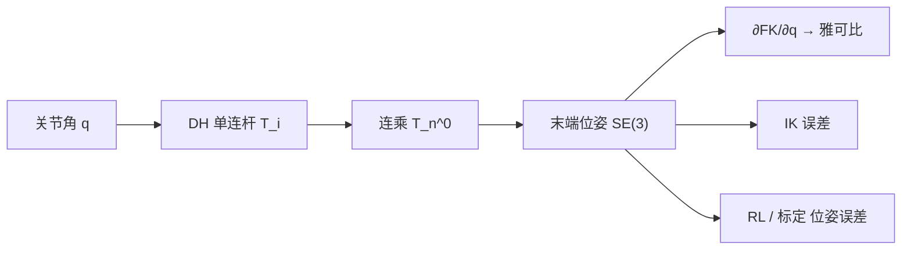

# 正向运动学（Forward Kinematics）

**一句话：** 给定全部关节角（或位移），通过连杆齐次变换连乘，算出末端在基座系下的唯一位姿 $T\in\mathrm{SE}(3)$——没有搜索、没有多解、没有迭代。

## 英文缩写速查

| 缩写 | 英文全称 | 简要说明 |
|------|----------|----------|
| FK | Forward Kinematics | 关节空间 → 末端位姿的确定映射 |
| DH | Denavit–Hartenberg | 用 4 参数描述相邻关节轴几何的约定 |
| SE(3) | Special Euclidean Group in 3D | 末端位姿所在的刚体变换群 |
| URDF | Unified Robot Description Format | 仿真/真机共用的连杆几何 XML；FK 的工程载体 |
| PoE | Product of Exponentials | 螺旋/指数积 FK；与 DH 并列的另一套建模语言 |

## 为什么重要

上层模块几乎都假设「给定 $q$ 能算出末端在哪」：

- [IK](./inverse-kinematics.md) 的每一步都要先跑 FK 看误差；
- [雅可比](./robot-jacobian.md) 是 FK 对 $q$ 的局部导数；
- 仿真 URDF / [Pinocchio](../entities/pinocchio.md) 树就是这条链的可执行版；
- RL 奖励里的末端误差、Sim2Real 运动学一致性，比的都是同一套 FK。

「确定」不等于「简单」：要把物理连杆变成可连乘的矩阵，必须先约定坐标系。

## 核心原理

### 位姿活在 SE(3)

末端状态 = 位置 $p\in\mathbb{R}^3$ + 姿态 $R\in\mathrm{SO}(3)$。旋转不满足交换律，也不能对两个 $R$ 做欧式平均。工程上用齐次矩阵把旋转和平移焊在一起（见 [齐次坐标](./homogeneous-coordinates-transform.md)）：

$$
T = \begin{bmatrix} R & t \\ 0 & 1 \end{bmatrix},\qquad
T_C^A = T_B^A\,T_C^B
$$

多连杆因此变成矩阵连乘。

### DH 四参数

任意两条空间直线（关节轴）的相对几何，用公垂线只需 **4 个数**：

| 参数 | 几何 | 谁是变量 |
|------|------|----------|
| $\theta$ | 绕 $z$ 的转角 | 转动关节 |
| $d$ | 沿 $z$ 的偏距 | 移动关节 |
| $a$ | 公垂线长度（连杆长） | 常量 |
| $\alpha$ | 绕 $x$ 的扭角 | 常量 |

一般刚体变换有 6 自由度；DH 少 2 个，是因为 **$z$ 轴被钉在物理关节轴上**。

坐标系分配：$z_i$ 沿第 $i$ 关节轴；$x_i$ 沿 $z_i$ 与 $z_{i+1}$ 的公垂线（相交则取叉积）；$y_i$ 右手系。

**标准 DH vs Craig 改进 DH**：坐标系固联在连杆的哪一端不同，变换矩阵也不同。没有对错，**同一项目不可混用**。专栏推导用标准 DH。

### 单连杆四步 → 连乘

绕 $z$ 转 $\theta$ → 沿 $z$ 移 $d$ → 沿 $x$ 移 $a$ → 绕 $x$ 转 $\alpha$。展开后的 $T_i^{i-1}$ 再

$$
T_n^0(q) = T_1^0(q_1)\cdots T_n^{n-1}(q_n).
$$

平面 3R（$\alpha=d=0$）还原成投影求和：$x=\sum \ell_i\cos(\theta_{1..i})$，朝向 $\sum\theta_i$——3D 臂只是同一套连乘、参数表更满。

## 工程实践

| 场景 | 做法 | 验收 |
|------|------|------|
| 工业臂标定 | 名义 DH + 激光跟踪点，LM 拟合 $d,a,\alpha$ | 典型 ~1 mm → ~0.05 mm |
| 人形 1 kHz 全身 FK | 按父索引拓扑一次算完树，分支可并行 | 30 DoF 量级 ~0.1 ms（向量化） |
| Sim2Real 一致性 | 同 $q$ 序列对比仿真 FK 与真机 FK | 位置 <1 mm、姿态 <0.5° 为常见门槛 |

手写 DH 只适合教学与标定；部署侧用 [Pinocchio](../entities/pinocchio.md) / URDF 树，再用 PoE 公式（[Modern Robotics](../entities/modern-robotics-book.md) Ch 4）交叉验证零位。

数值微分也能出雅可比，但奇异附近条件数差；工程默认几何雅可比（见 [robot-jacobian](./robot-jacobian.md)）。

## 局限与风险

1. **混用两种 DH** — 看起来「参数表都填了」，末端会系统性偏掉。
2. **把 URDF 当真机** — 出厂名义几何 ≠ 热变形/装配后的真 DH；精密装配必须标定。
3. **零点偏移** — Sim2Real 里最常见的 FK 不一致来源，不是算法而是约定。
4. **FK 帮不了 IK 多解** — 正映射唯一，不保证反函数存在或唯一。

## 关联页面

- [齐次坐标与齐次变换](./homogeneous-coordinates-transform.md) — $4\times4$ 连乘的代数底座
- [逆运动学](./inverse-kinematics.md) — 反函数：多解、奇异、DLS
- [雅可比矩阵](./robot-jacobian.md) — FK 的速度/力接口
- [李群 / SE(3)](./lie-group-rigid-body-motions.md) — 姿态合法表示
- [Pinocchio](../entities/pinocchio.md) — 部署侧 FK/雅可比引擎
- [《具身智能基础》专栏](../overview/shenlan-embodied-ai-fundamentals-series.md) — 本篇为专栏 08

## 参考来源

- [深蓝具身智能：正向运动学](../../sources/blogs/wechat_shenlan_forward_kinematics.md)
- [抓取落盘](../../sources/raw/wechat_shenlan_forward_kinematics_2026-07-17.md)
- [Modern Robotics 教材摘录](../../sources/papers/modern_robotics_textbook.md)

## 推荐继续阅读

- Lynch & Park, *Modern Robotics* Ch 4（PoE FK）— [教材页](../entities/modern-robotics-book.md)
- 运动控制路线 [L1.2 正逆运动学](../../roadmap/motion-control.md)
