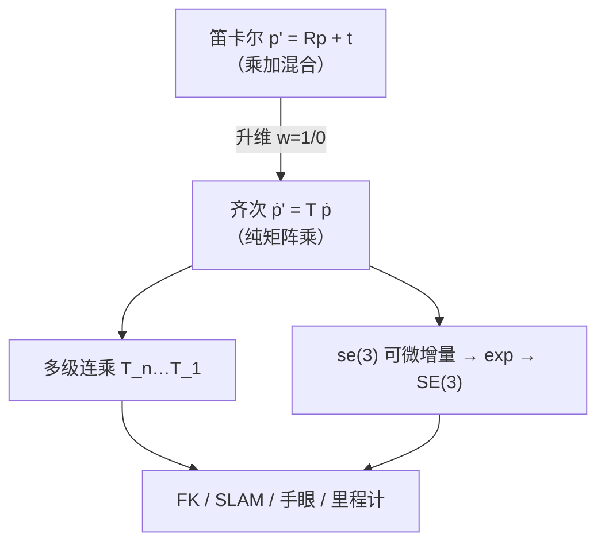

# 齐次坐标与齐次变换（SE(3) 工程底座）

**一句话：** 三维刚体运动在笛卡尔坐标下是 **「先乘 $R$ 再加 $t$」** 的混合运算；齐次坐标通过 **最后一维 $w$** 把点与方向区分开，并把运动写成 **$4\times4$ 矩阵乘法**，使多级变换可连乘、可进 SLAM/控制/深度学习优化栈。

## 英文缩写速查

| 缩写 | 英文全称 | 简要说明 |
|------|----------|----------|
| SE(3) | Special Euclidean Group in 3D | 三维刚体位姿群；齐次 $4\times4$ 变换矩阵为其标准工程表示 |
| SO(3) | Special Orthogonal Group in 3D | 三维旋转群；齐次矩阵左上角 $3\times3$ 块 |
| FK | Forward Kinematics | 由关节角逐级连乘齐次变换求末端位姿 |
| SLAM | Simultaneous Localization and Mapping | 位姿图/滤波中帧间 SE(3) 连乘与优化 |

## 为什么笛卡尔不够

笛卡尔下刚体变换：

$$
p' = R p + t, \quad R \in \mathrm{SO}(3),\; t \in \mathbb{R}^3
$$

| 痛点 | 工程后果 |
|------|----------|
| **运算不统一** | 旋转用矩阵乘、平移用向量加，无法写成单一线性算子 |
| **多级变换难叠加** | 机械臂 $N$ 关节、SLAM 每帧位姿须分步算，误差与耗时累积 |
| **与可微优化不友好** | 「乘 + 加」混合不利于把整条变换链纳入端到端反传（需再映到 se(3)） |

**分工（专栏语境）：** 笛卡尔 = 原始描述；**齐次变换 = 工程转换器**；[李群/李代数](./lie-group-rigid-body-motions.md) = 理论优化器；四元数 = SO(3) 轻量存储。

## 齐次坐标约定

| 物理量 | 齐次向量 | $w$ | 变换行为 |
|--------|----------|-----|----------|
| **空间点** | $(x,y,z,1)^\top$ | $1$ | 旋转 + 平移 |
| **自由方向** | $(x,y,z,0)^\top$ | $0$ | 仅旋转 |

比例等价：$(x,y,z,w) \sim (\lambda x,\lambda y,\lambda z,\lambda w)$；$w\neq 0$ 时还原 $(x/w,\,y/w,\,z/w)$。

## 齐次变换矩阵

$$
T = \begin{bmatrix} R & t \\ 0 & 1 \end{bmatrix} \in \mathrm{SE}(3), \qquad \tilde p' = T\,\tilde p
$$

展开与 $p'=Rp+t$ **完全等价**。特例：

- **纯旋转：** $T_R = \begin{bmatrix} R & 0 \\ 0 & 1 \end{bmatrix}$
- **纯平移：** $T_t = \begin{bmatrix} I & t \\ 0 & 1 \end{bmatrix}$

**连续运动：**

$$
T_{\mathrm{total}} = T_n \cdots T_2 T_1
$$

与 [三维坐标变换](./3d-coordinate-transforms-vision-robotics.md) 中外参 $[R|t]$、手眼 $X$ 为同一对象的不同应用场景。

## 流程总览

## 五大工程特性

1. **运算统一** — 旋转与平移均为矩阵乘法
2. **可叠加** — 长链变换一次连乘
3. **点/向区分** — $w$ 编码平移是否参与
4. **刚体合法** — $R$ 保持正交，无仿射拉伸
5. **与李群兼容** — SE(3) 上优化常经 [se(3)/Exp-Log](./lie-group-rigid-body-motions.md) 在切空间做无约束步进

## 典型落地

| 场景 | 用法 |
|------|------|
| **机械臂 FK** | 每关节 $T_i(R_i,t_i)$，$T_{\mathrm{ee}} = T_n\cdots T_1$，点 $\tilde p_{\mathrm{base}}$ 一次映射到末端 |
| **视觉 / SLAM** | 外参 $T_{\mathrm{cam}\leftarrow\mathrm{world}}$；点云/路标跨系变换 |
| **手眼标定** | $AX=XB$ 中 $A,B,X$ 均为 SE(3)（见 [3d-coordinate-transforms](./3d-coordinate-transforms-vision-robotics.md)） |
| **自动驾驶 / 里程计** | $T_t \leftarrow T_\Delta T_{t-1}$ 迭代车身位姿 |
| **策略 / VLA 几何头** | 在 se(3) 上输出增量，$\exp$ 回 $T$ 再执行（与 [se3-representation](./se3-representation.md) 表示选型互补） |

## 常见误区

1. **「齐次 = 李群，可以互换名词」** — 齐次坐标是 **坐标/矩阵写法**；SE(3) 是 **群结构**；优化仍常经 se(3)。
2. **方向向量也写 $w=1$** — 会导致错误平移；速度、力矩方向应 $w=0$。
3. **连乘顺序随意** — $T_a T_b$ 与 $T_b T_a$ 一般不等；须固定「左乘 = 固定系 / 右乘 = 动系」约定并与 DH/FK 一致。
4. **把教学版 se(3) 线性加法当严格 Exp** — 小增量可用；大角度须 Rodrigues / SE(3) 指数映射。

## 关联页面

- [《具身智能基础》专栏地图](../overview/shenlan-embodied-ai-fundamentals-series.md)
- [李群、李代数与刚体旋转](./lie-group-rigid-body-motions.md)
- [三维坐标变换（视觉–机器人）](./3d-coordinate-transforms-vision-robotics.md)
- [SE(3) Representation](./se3-representation.md)
- [Modern Robotics](../entities/modern-robotics-book.md)

## 参考来源

- [深蓝具身智能：齐次坐标与齐次变换（微信公众号归档）](../../sources/blogs/wechat_shenlan_homogeneous_coordinates_transform.md)
- [抓取落盘摘要](../../sources/raw/wechat_shenlan_homogeneous_coords_2026-06-18.md)
- Lynch & Park, *Modern Robotics* Ch 2–3 — [modern_robotics_textbook.md](../../sources/papers/modern_robotics_textbook.md)

## 推荐继续阅读

- [深蓝具身智能《具身智能基础》专栏专辑](https://mp.weixin.qq.com/mp/appmsgalbum?__biz=MzkwMDcyNDUzMQ==&action=getalbum&album_id=4525948187102363653)
- Craig, *Introduction to Robotics* — DH 参数与相邻连杆齐次变换连乘
