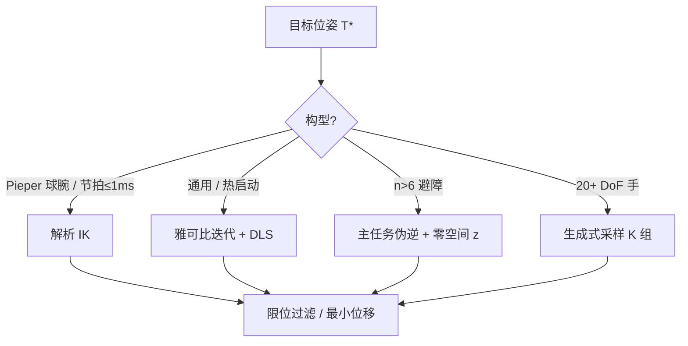

# 逆运动学（Inverse Kinematics）

**一句话：** 已知末端目标位姿 $T^\star$，反求关节角 $q$，使 [FK](./forward-kinematics.md) 输出等于 $T^\star$——这是多值、不连续、在奇异点会失效的反函数题。

## 英文缩写速查

| 缩写 | 英文全称 | 简要说明 |
|------|----------|----------|
| IK | Inverse Kinematics | 目标位姿 → 关节角 |
| DLS | Damped Least Squares | 奇异附近给 $JJ^\top$ 加阻尼的稳定伪逆 |
| SVD | Singular Value Decomposition | 读 $J$ 的最小奇异值，判断接近奇异 |
| DoF | Degrees of Freedom | $n>6$ 时零空间可做次级任务 |
| WBC | Whole-Body Control | 多任务 IK/ID 的全身版 |

## 为什么重要

抓取、焊接、拧螺丝、全身手脚约束，人给的都是任务空间目标，电机却只认关节角。IK 是感知–规划–执行之间的接口：解的速度、多样性和鲁棒性直接卡住上层规划。

## 核心原理

目标：找 $q\in\mathcal{Q}$（限位内）使 $f(q)=T^\star$。难点：

| 现象 | 含义 |
|------|------|
| 无解 | 目标在工作空间外 |
| 有限多解 | 6DOF 球腕最多 16 组（前/后 × 肘上/肘下 × 腕翻转） |
| 无穷多解 | 冗余 $n>6$ |
| 数值崩溃 | $\mathrm{rank}(J)$ 下降，关节速度爆炸 |

误差不要对两个 $T$ 做欧式减：位置用 $p^\star-p$，姿态用 $R^\star R^\top$ 再映到轴角（SE(3) 不是平坦空间）。

### 1. 解析解（能闭式就别迭代）

满足 **Pieper 条件**（后三轴共点）时可拆：腕心位置解 $\theta_{1,2,3}$ → 由 $R_{36}$ 解姿态关节 → 滤限位 → 选相对当前 $q$ 位移最小的一组。微秒级，换构型要重推（IKFAST 一类代码生成）。

### 2. 数值解：雅可比是武器

$$
v = J(q)\,\dot q
$$

每步：FK 得当前 $T$ → 6D 误差 $e$ → $\Delta q = J^+ e$ 或 DLS → 限幅/限位。热启动（用上一拍 $q$）比随机初值重要得多。

**DLS**：最小奇异值小时

$$
\Delta q = J^\top (JJ^\top + \lambda^2 I)^{-1} e
$$

其中 $I$ 为与任务空间同维的单位矩阵（零空间投影 $I-J^+J$ 里则是与关节维数同阶的单位阵）。远离奇异令 $\lambda=0$，靠近则平滑加大，避免伪逆爆炸。

### 3. 奇异与操纵度

$\det(JJ^\top)=0$ 时末端至少有一个方向瞬时不可控。Yoshikawa 操纵度 $w=\prod\sigma_i$；规划阶段可把 $w$ 当代价，让轨迹绕开奇异。工业常见坑：球腕 4 轴与 6 轴接近同轴还走直线。

### 4. 冗余零空间

$$
\dot q = J^+ \dot x + (I-J^+J)z
$$

第一项完成主任务，第二项不改末端，可最大化操纵度、关节居中、或沿障碍距离梯度避障。7 轴力矩阻抗、投影器选型与开源入口见 [零空间控制](../concepts/null-space-control.md)。

### 5. 学习型候选池

高维灵巧手（20+ DoF）数值 IK 收敛慢。IKFlow 一类条件流模型：给定 $T^\star$ 并行采样 $K$ 组 $q$，用 FK 误差过滤后再择优——适合「批量候选 + 约束筛选」的分层规划，而不是替换工业闭式解。

## 工程实践

| 场景 | 选型 | 关键 |
|------|------|------|
| 传送带分拣 ≤1 ms | 闭式 + 多解查表 | 余弦定理 $|D|>1$ 即工作空间外 |
| 7 轴沿缝焊接避障 | 零空间次级任务 | $z \propto \nabla_q d_{\mathrm{obs}}$ |
| 灵巧手精细装配 | 学习型多候选 | 接触不确定下单解不够鲁棒 |
| 人形浮基全身 | 任务空间 QP / [Pink](../entities/pink-ik.md) / [Mink](../entities/mink-ik.md) | 见 [TSID](../concepts/tsid.md)，不要只跑单臂牛顿法 |

开源入口：[ssik](../entities/ssik.md)（解析 6R/7R）、[Pink](../entities/pink-ik.md)（Pinocchio 任务 IK）、[Mink](../entities/mink-ik.md)（MuJoCo QP IK）。RL 何时介入见 [五类方案对比](../comparisons/rl-inverse-kinematics-five-approaches.md)。

## 局限与风险

1. **把 IK 当全局规划** — 数值 IK 是局部修正，过奇异、穿障碍要外层处理。
2. **忽略热启动** — 轨迹中途从零初值重解，会跳到另一套肘部解。
3. **纯伪逆过奇异** — 必须 DLS 或操纵度回避。
4. **学习型不解约束** — 采样后仍要用 FK + 碰撞检查过滤。

## 关联页面

- [正向运动学](./forward-kinematics.md) — 每步误差从这里来
- [雅可比矩阵](./robot-jacobian.md) — $J$、$J^+$、零空间
- [零空间控制](../concepts/null-space-control.md) — 7 轴投影、静力学/动力学一致与开源实现
- [RL 求解 IK 的五类方案](../comparisons/rl-inverse-kinematics-five-approaches.md)
- [TSID](../concepts/tsid.md) — 任务空间逆动力学，IK 的力/加速度升级
- [《具身智能基础》专栏](../overview/shenlan-embodied-ai-fundamentals-series.md) — 本篇为专栏 09

## 参考来源

- [深蓝具身智能：逆运动学五个关键点](../../sources/blogs/wechat_shenlan_inverse_kinematics.md)
- [抓取落盘](../../sources/raw/wechat_shenlan_inverse_kinematics_2026-07-23.md)
- [Modern Robotics 教材摘录](../../sources/papers/modern_robotics_textbook.md)（Ch 6）
- [零空间控制论文簇](../../sources/papers/null_space_control.md)

## 推荐继续阅读

- Lynch & Park, *Modern Robotics* Ch 6
- 运动控制路线 [L1.2](../../roadmap/motion-control.md)
