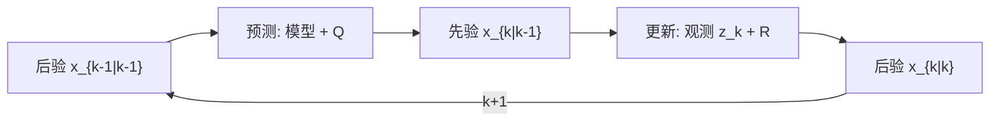

# Kalman Filter (KF)

**线性卡尔曼滤波（Kalman Filter, KF）**：在 **线性动力学 + 线性观测 + 高斯噪声** 假设下，给出状态后验均值与协方差的 **递推最小方差（贝叶斯意义下最优）** 估计。

## 一句话定义

> KF 把「带噪预测 + 带噪观测」合成一步：先按模型外推，再用观测残差按 Kalman 增益修正——整条链路在 Kalman (1960) 的线性高斯世界里是闭式、最优的。

## 英文缩写速查

| 缩写 | 英文全称 | 简要说明 |
|------|----------|----------|
| IMU | Inertial Measurement Unit | 惯性测量单元，提供加速度与角速度 |
| LQR | Linear Quadratic Regulator | 线性系统二次型代价下的最优反馈控制器 |
| VIO | Visual-Inertial Odometry | 视觉-惯性里程计，融合相机与 IMU 估计位姿 |
| iLQR | iterative Linear Quadratic Regulator | 对非线性系统迭代线性化求解的轨迹优化方法 |

## 为什么重要

- 机器人 **IMU 积分 + 编码器 / GPS / 视觉** 等融合，在局部线性化良好时常退化为 KF 或其子块。
- **EKF、UKF、ESKF、InEKF** 都以 KF 递推为模板；理解 KF 是读 [EKF](./ekf.md) 与 [优化式估计](../comparisons/kalman-filter-vs-optimization-based-estimation.md) 的前提。
- 与 **LQR** 共享 Riccati 结构，构成经典 **LQG（估计 + 控制）** 对偶（见 [LQR](./lqr.md)、[MIT 课程归档](../../sources/courses/mit_underactuated_kalman_lqr.md)）。

## 问题设定

离散线性系统：

$$x_{k+1} = A x_k + B u_k + w_k, \quad w_k \sim \mathcal{N}(0, Q)$$

$$z_k = C x_k + v_k, \quad v_k \sim \mathcal{N}(0, R)$$

- $x_k$：状态；$u_k$：已知控制输入
- $A$：状态转移矩阵；$B$：控制输入矩阵，将 $u_k$ 映射到状态增量
- $C$：观测矩阵，将状态投影到测量空间
- $z_k$：观测；$Q$：过程噪声 $w_k$ 的协方差；$R$：观测噪声 $v_k$ 的协方差
- $P_k$：估计协方差；$K_k$：Kalman 增益；$I$：与状态同维的单位矩阵
- 已知初始 $x_0 \sim \mathcal{N}(\hat{x}_0, P_0)$

## 递推公式（标准形式）

**预测（时间更新）：**

$$\hat{x}_{k|k-1} = A \hat{x}_{k-1|k-1} + B u_k$$

$$P_{k|k-1} = A P_{k-1|k-1} A^\top + Q$$

**更新（测量更新）：**

$$K_k = P_{k|k-1} C^\top (C P_{k|k-1} C^\top + R)^{-1}$$

$$\hat{x}_{k|k} = \hat{x}_{k|k-1} + K_k (z_k - C \hat{x}_{k|k-1})$$

$$P_{k|k} = (I - K_k C) P_{k|k-1}$$

**Kalman 增益** $K_k$ 在「模型预测不确定度」与「传感器噪声」之间做最优权衡：$R$ 大则更不信观测，$Q$ 大则更不信模型。

## 流程总览

## 与 EKF 的分工

| 维度 | KF | [EKF](./ekf.md) |
|------|----|-----------------|
| 动力学 / 观测 | 线性 $A,B,C$ | 非线性 $f,h$，每步雅可比线性化 |
| 最优性 | 线性高斯下严格最优 | 一般仅局部近似 |
| 机器人典型场景 | 局部 ENU、简化子状态 | IMU 姿态、足端运动学、VIO 初始化 |

非线性系统应优先判断是否可用 **误差状态 KF（ESKF）** 或 **InEKF**，再决定是否裸用 EKF（见 [State Estimation](../concepts/state-estimation.md)）。

## 常见误区

- **把 EKF 当 KF**：在非线性系统上仍称「卡尔曼最优」，忽略线性化误差与一致性。
- **$Q,R$ 只调一次**：接触切换、打滑、振动工况下应 **时变或自适应** $R$（见 [field-robotics-troubleshooting](../queries/field-robotics-troubleshooting.md)）。
- **协方差数值**：直接 $(I-KC)P$ 可能非对称；工程实现常用 **Joseph 形式**（Simon 2006）。

## 关联页面

- [Extended Kalman Filter (EKF)](./ekf.md) — 非线性扩展
- [State Estimation](../concepts/state-estimation.md) — 机器人状态估计全景
- [Kalman vs. Optimization-based Estimation](../comparisons/kalman-filter-vs-optimization-based-estimation.md) — 滤波 vs 滑窗优化选型
- [LQR / iLQR](./lqr.md) — LQG 对偶与 Riccati 结构
- [Sensor Fusion](../concepts/sensor-fusion.md) — 多传感器融合实践
- [PythonRobotics](../entities/python-robotics.md) — EKF 定位可运行示例与动画

## 参考来源

- [kalman_filter_ekf_primary_refs.md](../../sources/papers/kalman_filter_ekf_primary_refs.md) — Kalman (1960)、Kalman–Bucy (1961)、Gelb / Maybeck / Simon 等一手索引
- [welch_bishop_kalman_filter.md](../../sources/courses/welch_bishop_kalman_filter.md) — KF 入门教程 PDF
- [mit_underactuated_kalman_lqr.md](../../sources/courses/mit_underactuated_kalman_lqr.md) — MIT 估计与 LQG 课程模块
- [python_robotics.md](../../sources/repos/python_robotics.md) — EKF / 粒子滤波定位教学代码

## 推荐继续阅读

- Kalman (1960), *A New Approach to Linear Filtering and Prediction Problems* — [PDF](https://www.cs.unc.edu/~welch/media/pdf/kalman1960.pdf)
- Simon (2006), *Optimal State Estimation* — KF / EKF / UKF 现代教材
- [EKF](./ekf.md) — 机器人非线性估计主入口

## 一句话记忆

> KF = 线性高斯下的 predict–update；一切 EKF/ESKF/InEKF 都是在这条递推上改模型或改线性化方式。
