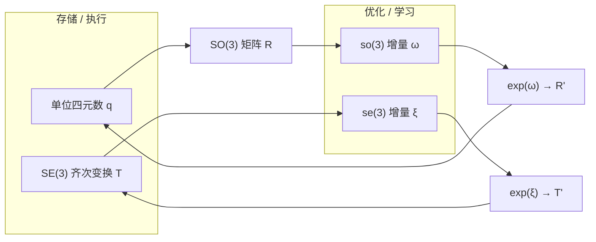

# 李群、李代数与刚体旋转（SO(3) / SE(3)）

**一句话：** 三维刚体运动生活在 **李群** SO(3)（旋转）与 SE(3)（旋转+平移）上；**李代数** so(3)/se(3) 是群在单位元处的切空间，把非线性姿态变化变成可求导的向量；**单位四元数** 则是 SO(3) 在工程里最常用的紧凑存储，三者通过指数/对数映射协同，而不是互相替代。

## 为什么具身智能必须直面流形

在传统 SLAM、轨迹优化与运动控制中，旋转多在优化器内部处理：欧拉角、旋转矩阵，或对四元数做「小扰动」。当 **神经网络直接输出动作** 或在大范围姿态上反传梯度时，在 $\mathbb{R}^3$ / $\mathbb{R}^4$ 里无约束回归旋转，容易出现：

- 欧拉角 **万向锁**（中间轴 ±90° 时丢自由度）；
- 旋转矩阵 **失去正交性**（9 维参数表示 3 自由度）；
- 四元数 **模长漂移**（单位约束与 $q \equiv -q$ 双倍覆盖）。

因此需要：**在群上表示合法状态，在代数上优化增量，再映回群执行**。

## 李群：合法运动集合

| 群 | 元素 | 约束 / 结构 | 典型用途 |
|----|------|-------------|----------|
| **SO(3)** | $R \in \mathbb{R}^{3\times3}$ | $R^\top R = I,\ \det R = 1$ | 关节/相机/末端朝向 |
| **SE(3)** | $T = \begin{bmatrix} R & t \\ 0 & 1 \end{bmatrix}$ | $R \in \mathrm{SO}(3)$ | 末端位姿、车体状态、相机外参 |

SE(3) 是 **6 维流形**（3 平移 + 3 旋转）；运动复合对应矩阵乘法，保证刚体运动链的可组合性。

### 核心公式（定义）

SO(3) 约束（$R$ 为旋转矩阵）：

$$
R^\top R = I,\quad \det R = 1
$$

SE(3) 齐次变换（$t \in \mathbb{R}^3$ 为平移）：

$$
T = \begin{bmatrix} R & t \\ 0 & 1 \end{bmatrix} \in \mathrm{SE}(3)
$$

Rodrigues 指数映射（$\omega \in \mathbb{R}^3$ 为 so(3) 旋转向量，$\theta = \|\omega\|$）：

$$
\exp([\omega]_\times) = I + \frac{\sin\theta}{\theta}[\omega]_\times + \frac{1-\cos\theta}{\theta^2}[\omega]_\times^2
$$

## 李代数：切空间上的线性增量

| 代数 | 向量 | 与群的关系 |
|------|------|------------|
| **so(3)** | $\omega \in \mathbb{R}^3$ | $\exp([\omega]_\times) \in \mathrm{SO}(3)$（Rodrigues） |
| **se(3)** | $\xi = (\omega, v) \in \mathbb{R}^6$ | $\exp(\xi^\wedge) \in \mathrm{SE}(3)$（含平移的指数映射） |

- **对数映射** $\log$：从 $R$ 或 $T$ 回到增量，用于误差定义与优化变量。
- **直觉：** 李群像弯曲曲面，李代数像该点处的切平面——在切空间做梯度下降，再通过 $\exp$ 回到物理合法姿态。

## 四元数：存储 vs 优化

| 工具 | 维度 | 优势 | 局限 |
|------|------|------|------|
| **单位四元数** | 4 | 紧凑、无万向锁、SLERP 平滑 | $\|q\|=1$ 约束；$q \sim -q$；不宜直接 unconstrained 反传 |
| **旋转矩阵** | 9 | 变换复合简单 | 冗余 + 需正交化 |
| **so(3) 向量** | 3 | 线性、无约束，适合优化 | 表 **增量**，非长期全局姿态 |

**工程分工（高频链路）：**

1. 用 **四元数**（或 $T \in \mathrm{SE}(3)$）存储当前姿态；
2. 优化时：$q \to R \xrightarrow{\log} \omega$，在 $\omega$（或 $\xi$）上更新；
3. $\omega \xrightarrow{\exp} R \to q$，保证结果仍在 SO(3) 上。

与 [SE(3) 位姿表示](./se3-representation.md) 中 Zhou 等人的 **6D 连续旋转参数化** 互补：前者改善网络在 $\mathbb{R}^n$ 上回归 $SO(3)$ 的平滑性；李代数负责流形增量、twist 语义与约束优化。

## 流程总览

## 在机器人栈中的落点

| 模块 | 李群角色 | 李代数角色 |
|------|----------|------------|
| **SLAM / 位姿图** | 节点位姿 $\in \mathrm{SE}(3)$ | 相对位姿误差、增量在 se(3) |
| **轨迹优化** | 轨迹为 SE(3) 序列 | 采样/迭代在 so(3) 或 se(3) 切空间 |
| **全身控制 (WBC)** | 末端位姿约束 | 任务空间 twist $\in \mathrm{se}(3)$，雅可比映射关节速度 |
| **MPC** | 状态含姿态 | 在 se(3) 切空间线性化 → QP |
| **VLA / 策略微调** | 动作含姿态分量 | 在 se(3) 上定义 **合法几何增量**，避免非物理旋转跳变 |

[Modern Robotics 教材](../entities/modern-robotics-book.md) 以 twist/wrench 与 PoE 贯穿上述语言；[InEKF](../formalizations/ekf.md) 等估计方法则利用李群结构改善误差传播（见 [Sensor Fusion](../concepts/sensor-fusion.md)）。

## 常见误区

1. **「有四元数就不需要李代数」** — 四元数是存储格式；大规模优化仍要在 so(3)/se(3) 上定义增量与雅可比。
2. **「李群 = 深度学习新发明」** — 经典力学与控制早已使用；变化是 **梯度进入网络** 后不能只在后处理里修补。
3. **「欧拉角够用」** — 小范围演示可行；大范围姿态变化与自动微分下万向锁与不连续会暴露。
4. **「6D 旋转表示取代李代数」** — 6D 改善 **回归连续性**；se(3) 仍负责 **约束优化与 twist 语义**（二者可并存）。

## 关联页面

- [《具身智能基础》专栏地图](../overview/shenlan-embodied-ai-fundamentals-series.md) — 本页为专栏 **01/03**（姿态与刚体运动）
- [三维坐标变换（视觉–机器人）](./3d-coordinate-transforms-vision-robotics.md) — 专栏 **02/03**（外参中的 $R,t$ 与手眼）
- [黎曼流形与切空间](./riemannian-manifold-tangent-space.md) — 专栏 **03/03**（SO(3)/SE(3) 的统一几何框架）
- [SE(3) Representation](./se3-representation.md) — 欧拉/四元数/矩阵/6D 对比与 DL 损失
- [Modern Robotics (Lynch-Park)](../entities/modern-robotics-book.md) — Ch 3 系统推导
- [Whole-Body Control](../concepts/whole-body-control.md) — 任务空间 se(3) 速度
- [Model Predictive Control](../methods/model-predictive-control.md) — 切空间线性化
- [Trajectory Optimization](../methods/trajectory-optimization.md) — 姿态轨迹参数化
- [Floating Base Dynamics](../concepts/floating-base-dynamics.md) — 浮基 nq/nv 与四元数状态
- [Pinocchio 快速上手 Query](../queries/pinocchio-quick-start.md) — 基座四元数在 q 向量中的布局

## 参考来源

- [深蓝具身智能：李群、李代数、四元数（微信公众号归档）](../../sources/blogs/wechat_shenlan_lie_group_lie_algebra_quaternion.md)
- Lynch, K. M., & Park, F. C. (2017). *Modern Robotics*. Ch 3 *Rigid-Body Motions* — [sources/papers/modern_robotics_textbook.md](../../sources/papers/modern_robotics_textbook.md)
- [SE(3) Representation（本站形式化）](./se3-representation.md)

## 推荐继续阅读

- [Modern Robotics 配套站点](http://modernrobotics.org/) — 教材与 Coursera 专项
- Zhou et al. (2019). *On the continuity of rotation representations in neural networks* (CVPR) — 6D 连续旋转表示（见 [se3-representation](./se3-representation.md)）
