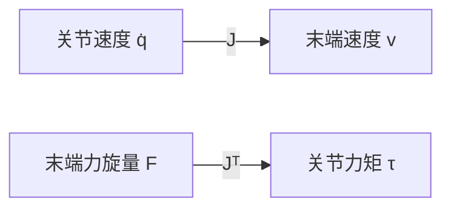

# 机器人雅可比矩阵（Jacobian）

**一句话：** [FK](./forward-kinematics.md) 告诉你末端「在哪」；雅可比告诉你当前构型下「怎么变」——同一张 $J$ 既做速度映射 $v=J\dot q$，又做力映射 $\tau=J^\top F$。

## 英文缩写速查

| 缩写 | 英文全称 | 简要说明 |
|------|----------|----------|
| FK | Forward Kinematics | 位置层映射；雅可比是它对 $q$ 的导数 |
| IK | Inverse Kinematics | 用 $J^+$ / DLS 把任务误差变成 $\Delta q$ |
| WBC | Whole-Body Control | 多任务速度/力约束经 $J$ 投影到关节 |
| MPC | Model Predictive Control | 用 $J$ 做工作点局部线性化 |
| SVD | Singular Value Decomposition | 读奇异值：接近 0 即接近奇异 |

## 为什么重要

人在**任务空间**规划（沿曲面法向恒力、切向 50 mm/s）；电机只认**关节空间**。翻译这道鸿沟只有两个物理问题：速度怎么映射、力怎么映射。雅可比同时回答两者，所以它不是某个算法的中间公式，而是 IK / [WBC](../concepts/whole-body-control.md) / [MPC](../methods/model-predictive-control.md) / 接触控制的共同接口。

## 核心原理

### 局部速度翻译器

$$
v = J(q)\,\dot q
$$

$v\in\mathbb{R}^6$ 为末端旋量（3 线速度 + 3 角速度），$J\in\mathbb{R}^{6\times n}$。关键词是**局部**：机器人一动，$J$ 就要重算。控制器不是一次解全局，而是每小步用当前 $J$ 做就近翻译。

### 几何列：每个关节的运动指纹

第 $i$ 列 = 其余关节锁定、第 $i$ 关节单位速度时，末端得到的速度贡献。

转动关节：

$$
J_i = \begin{bmatrix} \omega_i \times (p_e - p_i) \\ \omega_i \end{bmatrix}
$$

移动关节只贡献沿轴向的线速度。末端速度是各列线性叠加——调试时先看「现在是哪一列在主导这个方向」。

### 力对偶

虚功原理给出

$$
\tau = J^\top F
$$

速度走 $J$，力走 $J^\top$，方向相反、同一座桥。阻抗、导纳、力位混合、打磨恒力，本质都是在任务空间写 $F$ 或 $v$，再经 $J$ 分到关节。

### 一条线串起四种算法

| 方法 | 调用方式 |
|------|----------|
| 数值 [IK](./inverse-kinematics.md) | $\Delta q = J^+ e$；冗余加 $(I-J^+J)z$ |
| [WBC](../concepts/whole-body-control.md) / [TSID](../concepts/tsid.md) | 每个任务一条 $J_{\mathrm{task}}$，堆进 QP |
| [MPC](../methods/model-predictive-control.md) | 非线性模型在工作点用 $J$ 线性化 |
| RL | 提供「哪个关节对末端最敏感」的局部结构；策略仍作用在有几何的身体上 |

[视觉伺服](../methods/visual-servoing.md) 的图像雅可比、[灵巧手](../concepts/dexterous-kinematics.md) 的抓取雅可比，是同一「局部线性映射」在别的任务空间上的版本。

## 工程实践

- **实现：** 优先几何雅可比（Pinocchio `computeFrameJacobian`），不要用数值差分过奇异。
- **坐标系：** space Jacobian vs body Jacobian 必须和任务定义一致（世界系跟踪用前者，工具系力控常用后者）。见运动控制路线 [L1.3](../../roadmap/motion-control.md)。
- **奇异监控：** 盯最小奇异值；球腕 4/6 轴近同轴是工业高频事故。
- **冗余：** 主任务用 $J^+$，避障/关节居中只许进零空间，避免把末端顶歪。力矩层投影与 7 轴阻抗见 [零空间控制](../concepts/null-space-control.md)。

## 局限与风险

1. **把 $J$ 当全局地图** — 它只是当前构型的比例尺，大步跳跃会线性化失败。
2. **奇异附近力控** — 同样的 $F$ 会映出异常 $\tau$，必须阻尼或改任务。
3. **遗忘 $J^\top$** — 只记得速度 IK 的人，一做接触就会把力控写成另一套互不相干的公式。
4. **任务维数与 $n$ 不匹配** — 欠驱动不要硬求 $J^{-1}$；过冗余要显式设计 $z$。

## 关联页面

- [正向运动学](./forward-kinematics.md) — $J=\partial\mathrm{FK}/\partial q$
- [逆运动学](./inverse-kinematics.md) — 伪逆 / DLS / 零空间
- [零空间控制](../concepts/null-space-control.md) — $\ker J$ 上的次级任务与一致性选型
- [Whole-Body Control](../concepts/whole-body-control.md)
- [TSID](../concepts/tsid.md)
- [《具身智能基础》专栏](../overview/shenlan-embodied-ai-fundamentals-series.md) — 本篇为专栏 10

## 参考来源

- [深蓝具身智能：雅可比统一两条主线](../../sources/blogs/wechat_shenlan_robot_jacobian.md)
- [抓取落盘](../../sources/raw/wechat_shenlan_robot_jacobian_2026-08-07.md)
- [Modern Robotics 教材摘录](../../sources/papers/modern_robotics_textbook.md)（Ch 5）

## 推荐继续阅读

- Lynch & Park, *Modern Robotics* Ch 5（空间/物体雅可比、可操作度椭球）
- 运动控制路线 [L1.3 雅可比与速度运动学](../../roadmap/motion-control.md)
