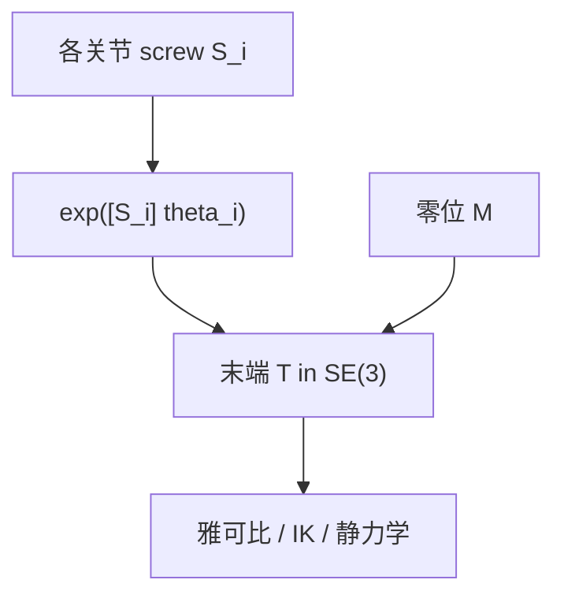

# 运动旋量、力旋量与 PoE 正运动学

**一句话：** 刚体瞬时速度打包成 twist $\mathcal{V}=[\omega;v]$，外力打包成 wrench $\mathcal{F}=[f;\tau]$；每个关节的 screw 轴经矩阵指数 $\exp([\mathcal{S}_i]\theta_i)$ 生成位姿增量，连乘即 PoE 正运动学。

## 英文缩写速查

| 缩写 | 英文全称 | 简要说明 |
|------|----------|----------|
| PoE | Product of Exponentials | 指数积正运动学 |
| SE(3) | Special Euclidean Group in 3D | 刚体位姿群 |
| se(3) | Lie Algebra of SE(3) | twist 所在李代数 |
| Ad | Adjoint Map | twist/wrench 在不同坐标系间的 6×6 变换 |
| FK | Forward Kinematics | 关节角 → 末端位姿 |

## 为什么重要

- **与 DH 并列的 FK 语言**：screw 来自几何，便于人形/闭链与 *Modern Robotics* 全书符号统一。
- **速度/力统一接口**：雅可比、静力学、WBC 常在 twist/wrench 空间写 $\dot x = J\dot q$、$\tau = J^\top \mathcal{F}$。
- **优化与估计**：se(3) 上 $\exp/\log$ 与 [李群页](./lie-group-rigid-body-motions.md) 的 SO(3) 故事同构，便于位姿图与轨迹优化。

## 核心机制

### Twist：刚体速度场

时变 $T(t)\in SE(3)$ 导出

$$
[\mathcal{V}_s] = \dot T T^{-1}, \qquad [\mathcal{V}_b] = T^{-1}\dot T
$$

其中 $[\mathcal{V}]$ 为 twist 的 $4\times4$ 矩阵表示；$\mathcal{V}_s$ 为 **空间** twist，$\mathcal{V}_b$ 为 **物体** twist。

刚体上一点速度 $v = \omega \times p + v_0$；twist 是选参考系后对该速度场的 6 维坐标。空间/物体 twist 通过 $\mathcal{V}_s = \mathrm{Ad}_T \mathcal{V}_b$ 互转。

### Screw 轴与关节轴

关节几何轴 $\hat\omega$ 与 **当前运动的螺旋轴** $\mathcal{S}=(\hat\omega, h)$ 不必相同：一般 screw 含沿轴平移分量 $v = h\hat\omega + q\times\hat\omega$。PoE 中 $\mathcal{S}_i$ 在 **零位形** 下表达。

### 指数坐标与 PoE FK

- 指数坐标：$\mathcal{S}\theta \in \mathbb{R}^6$，$T = \exp([\mathcal{S}]\theta)$。
空间 PoE（$M$ 为零位末端位姿）：

$$
T = e^{[\mathcal{S}_1]\theta_1} \cdots e^{[\mathcal{S}_n]\theta_n} M
$$
- 体坐标 PoE：指数乘在右侧；与 DH 连乘等价当 screw 列写正确。

### Wrench 对偶

wrench $\mathcal{F}=[f;\tau]$ 与 twist 对偶，虚功 $\mathcal{F}^\top \mathcal{V}$。坐标变换用 $\mathcal{F}_b = \mathrm{Ad}_T^\top \mathcal{F}_s$。六维力传感器读数为 spatial wrench（见 [接触力旋量锥](./contact-wrench-cone.md) 的操作侧背景）。

## 流程总览

## 常见误区

- 把 **关节轴** 直接当作 **screw 轴**，忽略平移项与零位形参考。
- twist 变换用 $R$ 而不是 **6×6 Adjoint**。
- wrench 变换忘记 **转置**（与 twist 的 Ad 不同）。

## 关联页面

- [正运动学（DH 视角）](./forward-kinematics.md)
- [齐次变换](./homogeneous-coordinates-transform.md)
- [Modern Robotics 微信精读](../overview/modern-robotics-wechat-principles-series.md)

## 参考来源

- [运动旋量 / 力旋量 / PoE 公众号系列](../../sources/blogs/wechat_goodman_spatial_twist_why.md) 等 6 篇（见系列父节点）
- [Modern Robotics 教材](../../sources/papers/modern_robotics_textbook.md)

## 推荐继续阅读

- [Pinocchio](../entities/pinocchio.md) — 部署侧 FK/动力学
- [Modern Robotics Ch 3–4 PDF](https://hades.mech.northwestern.edu/images/7/7f/MR.pdf)
