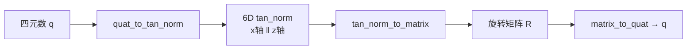

# tan_norm 旋转观测表示

**一句话：** **tan_norm** 把单位四元数 $q$ 编成 6 维向量 $[\,R(q)\mathbf{t}_0 \;\|\; R(q)\mathbf{n}_0\,]$，其中参考切向 $\mathbf{t}_0=[1,0,0]^\top$、法向 $\mathbf{n}_0=[0,0,1]^\top$；解码时用 x/z 轴重建 y 轴得到旋转矩阵。它是 [MimicKit](../entities/mimickit.md) / [ProtoMotions](../entities/protomotions.md) 里 **DeepMimic 类策略观测** 的默认旋转块，而不是论文 PDF 里的术语。

## 英文缩写速查

| 缩写 | 英文全称 | 简要说明 |
|------|----------|----------|
| SO(3) | Special Orthogonal Group in 3D | 三维旋转群 |
| RL | Reinforcement Learning | 通过与环境交互最大化长期回报来学习策略的范式 |
| DoF | Degrees of Freedom | 独立运动维数 |
| MoCap | Motion Capture | 动作捕捉与参考动作数据来源 |
| SMP | Score-Matching Motion Prior | MimicKit 中可复用的 score-matching 运动先验 |

## 为什么运动模仿栈要用 tan_norm

[DeepMimic](../methods/deepmimic.md) 原版 SIGGRAPH 2018 实现里，策略观测与奖励多在 **四元数** 上计算。MimicKit 统一栈把 **根节点与关节旋转观测** 改为 tan_norm，主要动机是：

1. **消除四元数双覆盖**：$q$ 与 $-q$ 表示同一旋转，直接拼进 MLP 观测会引入符号歧义；tan_norm 由 $R(q)$ 唯一确定（在常规姿态范围内）。
2. **连续 6 维欧氏块**：与 [Zhou et al. CVPR 2019](https://arxiv.org/abs/1812.07035) 的 6D 连续表示同族，适合神经网络回归（详见 [SE(3) 表示](./se3-representation.md)）。
3. **维度习惯**：每个 3-DoF 球形关节占 **6 维** 观测块，与 char_obs / tar_obs 拼接规则简单（G1 上 28 关节 → 168 维 joint_rot_obs）。

动作数据本身仍常用 **3D 指数映射** 存 `.pkl`；tan_norm 是 **观测编码层**，不是 motion clip 磁盘格式。

## 核心原理

### 编码

给定四元数 $q$（MimicKit 为 $(x,y,z,w)$ 顺序）：

$$
\text{tan\_norm}(q) = \big[\, R(q)\,[1,0,0]^\top \;\|\; R(q)\,[0,0,1]^\top \,\big] \in \mathbb{R}^6
$$

前 3 维可读作旋转后的 **体 x 轴**，后 3 维为 **体 z 轴**。

### 解码

从 6 维恢复 $R=[\mathbf{x}\ \mathbf{y}\ \mathbf{z}]$：

$$
\mathbf{y} = \frac{\mathbf{z} \times \mathbf{x}}{\|\mathbf{z} \times \mathbf{x}\|}, \quad
\mathbf{x},\mathbf{z}\ \text{先 normalize}
$$

再 $q = \mathrm{matrix\_to\_quat}(R)$。ProtoMotions 在 `tan_norm_to_quat` 中显式 normalize + 重正交；MimicKit `tan_norm_to_matrix` 假设输入已接近合法。

### 与 Zhou 6D 的区别

| | **Zhou 6D** | **tan_norm** |
|---|-------------|--------------|
| 语义 | 网络输出的矩阵 **前两列**（任意方向） | 固定参考轴经 $R(q)$ 旋转后的 **x 与 z** |
| 正交化 | Gram–Schmidt 重建第三列 | $ \mathbf{y}=\mathbf{z}\times\mathbf{x}$ |
| 典型场景 | 姿态估计、VLA 末端 6D | MimicKit char_obs / tar_obs、SMP 先验特征 |

二者都追求 **SO(3) 上的连续欧氏参数化**，但 tan_norm 与 **heading / 体轴** 语义绑定更紧，便于运动模仿里「根朝向 + 关节朝向」分块。

## 工程实践

### MimicKit 调用链

| 位置 | 作用 |
|------|------|
| `mimickit/util/torch_util.py` | `quat_to_tan_norm` / `tan_norm_to_quat` |
| `mimickit/envs/char_env.py` | `compute_char_obs`：root + 各 joint |
| `mimickit/envs/deepmimic_env.py` | `compute_tar_obs`：未来参考帧同样用 tan_norm |
| `tools/diffusion_model/motion_prior_dataset.py` | SMP 采样窗口 `tan_norm_to_quat` 还原 motion |

**global_obs 开关**：`True` 时在世界系编码根/关节四元数；`False` 时根旋转先去掉 heading 再编码，速度与关键点位置也转到 heading 局部系。

### 维度速查（Unitree G1 DeepMimic 示例）

| 块 | 内容 | 维度 |
|----|------|------|
| `root_rot_obs` | 根 tan_norm | 6 |
| `joint_rot_obs` | 28 关节 × tan_norm | 168 |
| `tar_obs`（×3 步） | 每步含 root_rot + joint_rot tan_norm | 3×(6+168+…) |

组内配置估算总观测约 780 维（见 `resources/train/MimicKit/MimicKit 05 DeepMimic.md`）。

### 调试要点

- **不要用四元数维度假设**：每个 3-DoF 球形关节观测是 **6** 而非 4。
- **逆变换需正交化**：从网络 raw 输出 decode 时，应对 x/z normalize 并检查 $\|\mathbf{x}\times\mathbf{z}\|$ 是否接近 1。
- **与 exp map 存储分离**：`.pkl` motion 仍是 exp map；只在 `obs` 与部分生成模型特征里出现 tan_norm。

## 局限与风险

- **非标准术语**：文献与 Pose 估计社区常说「6D rotation」指 Zhou 前两列；读 MimicKit 代码时必须认 **tan_norm** 这一命名。
- **无单位长度约束**：6 维输出不在 $S^5$ 上；极端错误预测 decode 时可能数值不稳定。
- **参考轴固定**：$\mathbf{t}_0,\mathbf{n}_0$ 取世界 x/z；与角色 URDF 关节轴约定不一致时，不要手工改参考轴而不改全栈。
- **原版 DeepMimic 论文不复现观测格式**：复现 2018 论文需对照旧栈；现代 MimicKit 路径默认 tan_norm。

## 关联页面

- [旋转表示方法对比](../comparisons/so3-rotation-representations.md) — 与欧拉 / 四元数 / Zhou 6D 的选型对照
- [SE(3) 位姿表示](./se3-representation.md) — 欧拉 / 四元数 / Zhou 6D 总览
- [李群、李代数与刚体旋转](./lie-group-rigid-body-motions.md) — SO(3) 流形与四元数双覆盖
- [MimicKit](../entities/mimickit.md) — 统一实现与训练入口
- [ProtoMotions](../entities/protomotions.md) — 同名 API 的大规模并行栈
- [DeepMimic](../methods/deepmimic.md) — 任务奖励与参考动作对齐
- [SMP](../methods/smp.md) — 扩散先验特征与 tan_norm 互转

## 参考来源

- [MimicKit tan_norm 源码摘录](../../sources/repos/mimickit_tan_norm.md)
- [Zhou et al. CVPR 2019 连续旋转表示](../../sources/papers/zhou_2019_cvpr_continuity_rotation_representations.md)
- [MimicKit 仓库说明](../../sources/repos/mimickit.md)

## 推荐继续阅读

- [MimicKit Starter Guide (arXiv:2510.13794)](https://arxiv.org/abs/2510.13794) — 框架总览与观测设计背景
- [ProtoMotions rotations API](https://nvlabs.github.io/ProtoMotions/_modules/protomotions/utils/rotations.html) — `quat_to_tan_norm` 在线文档
